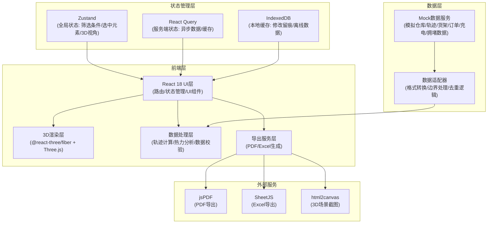
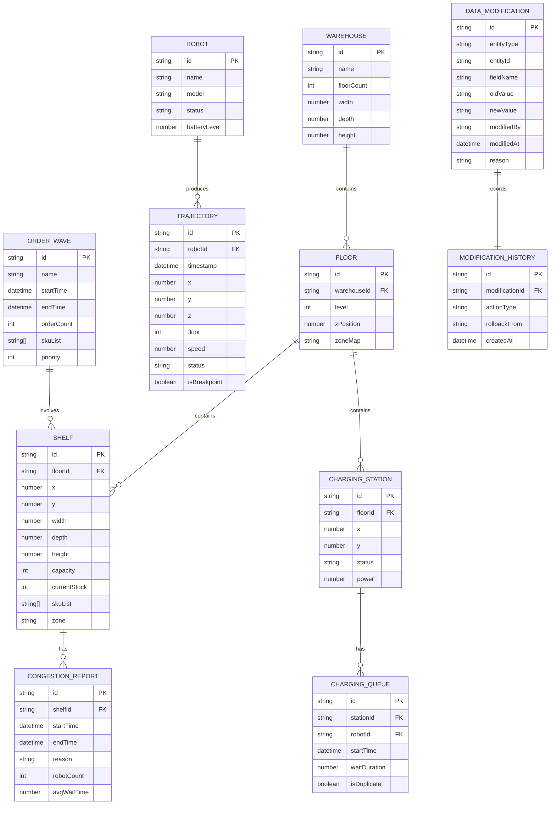

## 1. 架构设计



---

## 2. 技术描述

### 2.1 核心技术栈

- **前端框架**: React 18.2.0 + TypeScript 5.3
- **构建工具**: Vite 5.0
- **样式方案**: Tailwind CSS 3.4 + CSS Variables
- **3D渲染**: 
  - Three.js 0.160
  - @react-three/fiber 8.15
  - @react-three/drei 9.92
  - @react-three/postprocessing 2.15
- **状态管理**:
  - Zustand 4.4 (全局UI状态)
  - React Query 5.17 (服务端状态/缓存)
- **数据可视化**:
  - @ant-design/charts 1.4 (2D图表辅助)
- **导出服务**:
  - jspdf 2.5 (PDF生成)
  - xlsx 0.18 (Excel导出)
  - html2canvas 1.4 (场景截图)
- **工具库**:
  - lodash-es 4.17 (数据处理)
  - dayjs 1.11 (时间处理)
  - uuid 9.0 (唯一标识)

### 2.2 项目初始化

- 使用 `npm create vite@latest` 初始化 React + TypeScript 项目
- 手动安装所有依赖，确保版本号精确匹配
- 配置 Vite 别名、代理、构建优化

### 2.3 后端与数据

- **后端**: 无后端服务，使用 Mock 数据模拟
- **数据存储**: IndexedDB 存储修改留痕记录和离线缓存
- **Mock数据**: 使用 MSW (Mock Service Worker) 或本地 JSON 文件模拟 API 响应

---

## 3. 路由定义

| 路由路径 | 页面组件 | 页面用途 |
|----------|----------|----------|
| `/` | `Workspace3D` | 3D工作台主页面 - 核心3D场景与控制面板 |
| `/export` | `ReportExport` | 报告导出页面 - 配置与预览导出内容 |
| `/data` | `DataManagement` | 数据管理页面 - 输入源状态、缺失清单、修改历史 |
| `*` | `NotFound` | 404页面 - 路由未匹配时的降级页面 |

---

## 4. 数据模型定义

### 4.1 核心数据类型



### 4.2 TypeScript 类型定义

```typescript
// 坐标与空间类型
interface Position3D {
  x: number;
  y: number;
  z: number;
}

interface BoundingBox {
  minX: number;
  maxX: number;
  minY: number;
  maxY: number;
  minZ: number;
  maxZ: number;
}

// 仓库模型类型
interface Warehouse {
  id: string;
  name: string;
  floorCount: number;
  width: number;
  depth: number;
  height: number;
  floors: Floor[];
}

interface Floor {
  id: string;
  warehouseId: string;
  level: number;
  zPosition: number;
  shelves: Shelf[];
  chargingStations: ChargingStation[];
  zones: Zone[];
}

interface Zone {
  id: string;
  name: string;
  floorId: string;
  bounds: BoundingBox;
  type: 'storage' | 'picking' | 'charging' | 'aisle';
}

interface Shelf {
  id: string;
  floorId: string;
  position: Position3D;
  dimensions: { width: number; depth: number; height: number };
  capacity: number;
  currentStock: number;
  skuList: string[];
  zone: string;
  congestionLevel?: number;
  isMissingData?: boolean;
}

// 机器人与轨迹类型
interface Robot {
  id: string;
  name: string;
  model: string;
  status: 'idle' | 'working' | 'charging' | 'error';
  batteryLevel: number;
  currentPosition?: Position3D;
  currentFloor?: number;
}

interface TrajectoryPoint {
  id: string;
  robotId: string;
  timestamp: number;
  position: Position3D;
  floor: number;
  speed: number;
  status: 'moving' | 'waiting' | 'picking' | 'charging';
  isBreakpoint: boolean;
  floorConfidence: number;
}

interface PathSegment {
  id: string;
  robotId: string;
  startPoint: TrajectoryPoint;
  endPoint: TrajectoryPoint;
  density: number;
  avgSpeed: number;
  isBroken: boolean;
}

// 订单与充电类型
interface OrderWave {
  id: string;
  name: string;
  startTime: number;
  endTime: number;
  orderCount: number;
  skuList: string[];
  priority: number;
  isDataComplete: boolean;
}

interface ChargingStation {
  id: string;
  floorId: string;
  position: Position3D;
  status: 'available' | 'occupied' | 'offline';
  power: number;
  currentRobotId?: string;
  queue: ChargingQueueItem[];
}

interface ChargingQueueItem {
  id: string;
  stationId: string;
  robotId: string;
  startTime: number;
  waitDuration: number;
  isDuplicate: boolean;
  deduplicatedFrom?: string;
}

interface CongestionReport {
  id: string;
  shelfId: string;
  startTime: number;
  endTime: number;
  reason: string;
  robotCount: number;
  avgWaitTime: number;
  isManuallyModified: boolean;
}

// 修改留痕类型
interface DataModification {
  id: string;
  entityType: 'shelf' | 'trajectory' | 'congestion' | 'charging';
  entityId: string;
  fieldName: string;
  oldValue: string;
  newValue: string;
  modifiedBy: string;
  modifiedAt: number;
  reason: string;
  isRollback: boolean;
  rollbackFrom?: string;
}

// 筛选与视图状态
interface FilterState {
  timeRange: { start: number; end: number };
  selectedWaveId: string | null;
  selectedRobotIds: string[];
  selectedFloor: number | null;
  selectedZone: string | null;
  showPaths: boolean;
  showHeatmap: boolean;
  showQueue: boolean;
  densityThreshold: number;
}

interface ViewState {
  cameraPosition: Position3D;
  cameraTarget: Position3D;
  selectedElementId: string | null;
  selectedElementType: 'shelf' | 'robot' | 'station' | 'path' | null;
  isPlayingTimeline: boolean;
  timelinePlaybackSpeed: number;
}

// 数据质量类型
interface DataQualityIssue {
  id: string;
  type: 'missing_field' | 'trajectory_break' | 'floor_confusion' | 'duplicate_queue';
  severity: 'error' | 'warning' | 'info';
  entityType: string;
  entityId: string;
  fieldName?: string;
  description: string;
  canFix: boolean;
}

interface DataSourceStatus {
  type: 'warehouse' | 'trajectory' | 'shelf' | 'order' | 'charging' | 'congestion';
  name: string;
  isConnected: boolean;
  lastSyncTime: number;
  recordCount: number;
  qualityScore: number;
  issues: DataQualityIssue[];
}
```

---

## 5. 核心模块与数据处理

### 5.1 路径密度计算模块

**位置**: `src/utils/pathDensity.ts`

**核心算法**:
1. 将仓库地面划分为 0.5m × 0.5m 的网格单元
2. 遍历所有轨迹线段，计算每个线段穿过的网格单元
3. 对每个网格单元累加通过次数和机器人数量
4. 使用高斯模糊对密度矩阵进行平滑处理
5. 将密度值映射到颜色渐变（青→橙→红）

**边界处理**:
- 跳过标记为断点的轨迹段
- 按楼层分别计算，避免楼层混淆
- 密度计算排除充电等待区域的重复计数

### 5.2 拥堵热力分析模块

**位置**: `src/utils/heatmap.ts`

**核心算法**:
1. 以货架为中心，半径3米范围内统计机器人停留时间
2. 计算单位时间内的机器人数量密度
3. 叠加订单波次的SKU热度权重
4. 生成三维热力体素数据，用于3D体积渲染

**异常处理**:
- 数据不足时显示灰色占位，不进行推测计算
- 标记出数据缺失的区域，便于用户识别

### 5.3 数据校验与去重模块

**位置**: `src/utils/dataValidator.ts`

**核心功能**:
1. **轨迹断点检测**: 相邻点时间差>30秒标记为断点
2. **楼层混淆校正**: Z轴误差±0.5米内自动归层，超出标记异常
3. **充电排队去重**: 同一机器人在同一充电位的连续等待合并为一条记录
4. **一致性校验**: 修改数据时校验关联字段的逻辑一致性

### 5.4 修改留痕模块

**位置**: `src/store/modificationStore.ts`

**核心机制**:
1. 使用 Proxy 包装数据对象，拦截所有修改操作
2. 修改前自动快照旧值，生成唯一修改ID
3. 强制要求填写修改理由（≥10字符）
4. 将修改记录持久化到 IndexedDB
5. 支持按时间、修改人、字段筛选历史记录
6. 回滚操作生成新的修改记录，保留完整审计轨迹

---

## 6. 3D场景实现方案

### 6.1 场景层级结构

```
<Canvas>
  {/* 环境设置 */}
  <color attach="background" args={[#0F172A]} />
  <fog attach="fog" args={[#0F172A, 30, 80]} />
  
  {/* 光照系统 */}
  <ambientLight intensity={0.3} />
  <directionalLight position={[20, 30, 20]} intensity={1.2} castShadow />
  <pointLight position={[0, 10, 0]} intensity={0.5} color="#3B82F6" />
  
  {/* 仓库主体 */}
  <group name="warehouse">
    {floors.map(floor => (
      <FloorComponent key={floor.id} floor={floor} />
    ))}
  </group>
  
  {/* 路径云图 */}
  <group name="paths">
    {pathSegments.map(segment => (
      <PathTube key={segment.id} segment={segment} density={segment.density} />
    ))}
  </group>
  
  {/* 热力图 */}
  <HeatmapVolume data={heatmapData} visible={showHeatmap} />
  
  {/* 机器人 */}
  {robots.map(robot => (
    <RobotModel key={robot.id} robot={robot} position={robot.currentPosition} />
  ))}
  
  {/* 充电区排队 */}
  {chargingStations.map(station => (
    <ChargingQueueVisual key={station.id} station={station} />
  ))}
  
  {/* 后处理 */}
  <EffectComposer>
    <Bloom luminanceThreshold={0.2} luminanceSmoothing={0.9} height={300} />
    <FXAA />
  </EffectComposer>
</Canvas>
```

### 6.2 性能优化策略

1. **几何体复用**: 使用 InstancedMesh 渲染大量货架和机器人
2. **LOD分级**: 远距离物体简化几何细节
3. **视锥剔除**: 只渲染相机视野内的物体
4. **按需更新**: 仅在筛选条件变化时重新计算路径密度
5. **Web Worker**: 轨迹计算和密度分析在 Worker 线程执行
6. **内存管理**: 及时释放不用的几何体和材质

---

## 7. 项目目录结构

```
/
├── public/
│   └── favicon.ico
├── src/
│   ├── assets/              # 静态资源
│   │   ├── fonts/           # JetBrains Mono, Inter
│   │   └── textures/        # 3D纹理贴图
│   ├── components/          # UI组件
│   │   ├── layout/          # 布局组件
│   │   ├── controls/        # 筛选控制组件
│   │   ├── panels/          # 信息面板组件
│   │   └── common/          # 通用组件
│   ├── three/               # 3D相关组件
│   │   ├── Warehouse3D.tsx  # 仓库主体
│   │   ├── PathTube.tsx     # 路径管线
│   │   ├── RobotModel.tsx   # 机器人模型
│   │   ├── Shelf3D.tsx      # 货架3D组件
│   │   ├── HeatmapVolume.tsx# 热力体积
│   │   └── effects/         # 后处理效果
│   ├── hooks/               # 自定义Hooks
│   │   ├── use3DControls.ts # 3D控制Hook
│   │   ├── useTimeline.ts   # 时间轴Hook
│   │   └── useExport.ts     # 导出Hook
│   ├── store/               # 状态管理
│   │   ├── filterStore.ts   # 筛选状态
│   │   ├── viewStore.ts     # 视图状态
│   │   ├── dataStore.ts     # 数据状态
│   │   └── modificationStore.ts # 修改留痕
│   ├── utils/               # 工具函数
│   │   ├── pathDensity.ts   # 路径密度计算
│   │   ├── heatmap.ts       # 热力分析
│   │   ├── dataValidator.ts # 数据校验
│   │   └── exporters/       # 导出工具
│   ├── mock/                # Mock数据
│   │   ├── warehouse.ts     # 仓库模型数据
│   │   ├── trajectories.ts  # 轨迹数据
│   │   ├── shelves.ts       # 货架数据
│   │   └── ...              # 其他Mock数据
│   ├── pages/               # 页面组件
│   │   ├── Workspace3D.tsx  # 3D工作台
│   │   ├── ReportExport.tsx # 报告导出
│   │   └── DataManagement.tsx # 数据管理
│   ├── types/               # TypeScript类型
│   │   └── index.ts         # 核心类型定义
│   ├── App.tsx              # 应用入口
│   ├── main.tsx             # React入口
│   └── index.css            # 全局样式
├── .trae/
│   └── documents/           # 项目文档
├── package.json
├── tsconfig.json
├── vite.config.ts
└── tailwind.config.js
```
