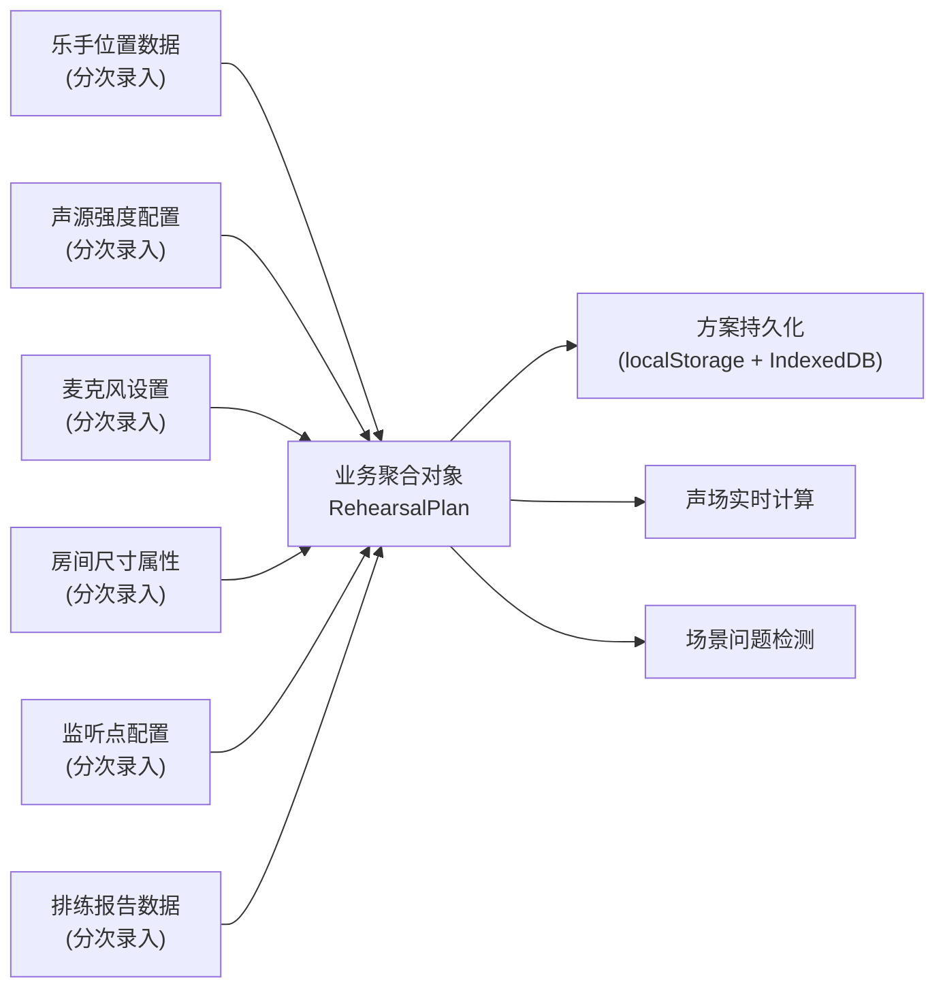
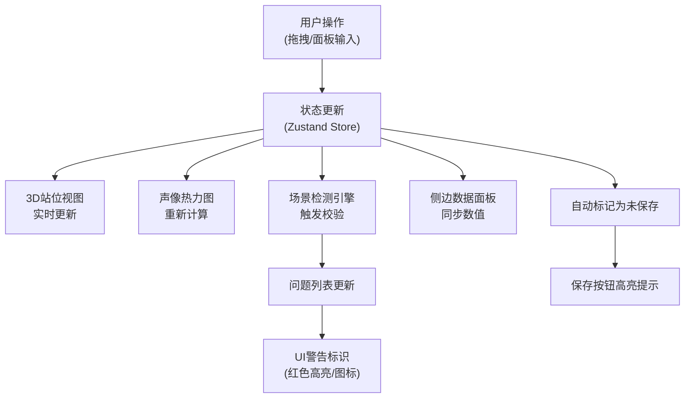

## 1. 产品概述
乐队排练室3D声像可视化与站位规划系统，为专业音乐团队提供沉浸式声场分析工具，解决排练空间声学规划、乐器站位优化、声像覆盖平衡等核心问题。
- 目标用户：乐队指导、音乐制作人、音响工程师、专业排练室管理者
- 核心价值：通过3D可视化和声场计算，将抽象的声学概念具象化，提升排练效率和演出质量
- 目标场景：乐队排练站位规划、评审会方案演示、声场问题排查、排练记录归档

## 2. 核心功能

### 2.1 功能模块
1. **3D声场主视图**：排练室3D场景渲染、乐手站位可视化、声像热力图叠加
2. **侧边数据面板**：乐手参数编辑、声源配置、麦克风设置、房间属性调整
3. **场景检测引擎**：声源重叠检测、监听点缺失警告、音量比例失衡分析
4. **方案管理中心**：方案保存/加载、版本历史、数据持久化（本地+云端）
5. **排练报告模块**：数据统计、问题分析、导出PDF/PNG报告

### 2.2 页面详情
| 页面名称 | 模块名称 | 功能描述 |
|---------|---------|---------|
| 主应用页 | 3D场景视图 | Three.js渲染排练室空间，支持拖拽旋转、缩放、平移；点击乐手/麦克风/监听点显示详情 |
| 主应用页 | 声像热力图 | 基于声源强度和距离算法计算声场覆盖，用颜色渐变可视化声压级分布 |
| 主应用页 | 拖拽编辑 | 支持拖拽乐手、麦克风、监听点调整位置，实时更新声场计算 |
| 主应用页 | 侧边数据面板 | 分Tab展示：乐手配置、麦克风配置、房间设置、监听点、检测结果 |
| 主应用页 | 顶部工具栏 | 方案操作（新建/保存/加载/导出）、视图切换、热力图开关、截图 |
| 主应用页 | 场景检测浮窗 | 实时显示检测到的问题：声源重叠警告、监听点缺失、音量比例错误，点击定位问题 |
| 报告弹窗 | 排练报告 | 汇总站位图、声场数据、问题清单、优化建议，支持导出PDF和PNG截图 |

## 3. 核心流程

### 3.1 用户操作主流程
用户打开应用 → 加载默认方案或历史方案 → 在3D视图中拖拽调整乐手站位 → 侧边面板配置声源强度、麦克风参数 → 实时查看声像热力图 → 查看场景检测警告 → 保存方案 → 导出排练报告

### 3.2 业务对象聚合流程

### 3.3 模块校验联动流程

## 4. 用户界面设计

### 4.1 设计风格
- **主题方向**：专业音频工程风格，深色科技感，霓虹色彩点缀
- **主色调**：深空蓝灰背景 `#0a0e17`，面板蓝黑 `#121a29`
- **强调色**：音频霓虹青 `#00f0ff`，警告橙 `#ff6b35`，错误红 `#ff3366`，成功绿 `#00ff88`
- **字体**：
  - 标题/数字：`Orbitron` - 科技感等宽字体，适合数据展示
  - 正文：`Space Grotesk` - 现代无衬线，兼顾专业感与可读性
- **按钮风格**：扁平+发光边框，hover时有霓虹辉光动画
- **布局**：左侧固定侧边面板 + 中央3D主视图 + 顶部工具栏 + 右下角检测浮窗
- **视觉细节**：
  - 玻璃拟态面板（backdrop-filter）
  - 扫描线纹理叠加
  - 数据流动画边框
  - 3D物体选中时的脉冲发光效果
  - 声场热力图使用蓝→青→绿→黄→红渐变

### 4.2 页面设计概览
| 页面名称 | 模块名称 | UI Elements |
|---------|---------|-------------|
| 主应用页 | 顶部工具栏 | 渐变背景、发光按钮、方案名称输入框、操作图标组（保存/加载/导出/截图/热力图开关） |
| 主应用页 | 侧边数据面板 | 玻璃拟态左侧抽屉、Tab切换（乐手/麦克风/房间/监听点/检测）、表单控件带数据校验、实时数值显示 |
| 主应用页 | 3D主视图 | 全屏Canvas、深色排练室空间、乐手用不同颜色几何体标识、地面网格带声像热力图叠加、第一人称/正交视角切换 |
| 主应用页 | 场景检测浮窗 | 右下角固定、问题卡片带严重程度色标、展开显示详情、点击定位到3D场景对应位置 |
| 报告弹窗 | 排练报告 | 模态窗、居中布局、数据卡片网格、站位缩略图、问题清单、优化建议、导出按钮组 |

### 4.3 重点场景交互设计

#### 4.3.1 声源重叠场景
- 当两个乐手距离小于阈值（默认0.5米）时，3D视图中两物体闪烁红色边框
- 侧边面板对应乐卡片显示红色警告标识
- 检测浮窗列出「声源重叠」问题，显示重叠乐手名称和距离
- 点击问题项自动将3D视角聚焦到重叠区域

#### 4.3.2 监听点缺失场景
- 当监听点数量为0，或监听点不在主要声场覆盖范围内（声压级<60dB）时
- 3D视图中监听点（若存在）显示黄色警告色
- 检测浮窗显示「监听点缺失/位置不佳」警告，附优化建议
- 侧边面板监听点Tab高亮闪烁提示

#### 4.3.3 音量比例错误场景
- 实时计算各声源在监听点处的音量比例
- 当某乐器音量占比过高（>60%）或过低（<10%）时触发警告
- 侧边面板显示可视化音量比例条（条形图），异常项标红
- 提供一键平衡建议按钮

### 4.4 响应式设计
- **桌面端**（主场景）：左侧固定面板宽320px，中央3D视图自适应
- **平板端**：侧边面板改为可折叠抽屉，默认收起
- **触控优化**：3D场景支持双指缩放、单指旋转，拖拽对象长按触发
- 评审会演示模式：按F11进入全屏，自动隐藏侧边面板，突出3D视图

### 4.5 3D场景设计指南
- **环境**：专业排练室空间，墙面深色吸声材质，地面为木质地板纹理，顶部有桁架结构
- **光照**：三光源系统 - 环境光（低强度）+ 主方向光（模拟室内顶灯）+ 点光源（乐手位置聚光）
- **相机**：默认透视相机，视角60°，初始位置在房间斜上方45°俯视角
- **交互**：OrbitControls支持阻尼惯性，选中物体后相机自动调整角度使其居中
- **后处理**：Bloom效果（发光物体）、轻微色差、暗角，增强科技感
- **性能**：几何体使用低多边形，热力图使用ShaderMaterial实现GPU加速计算
