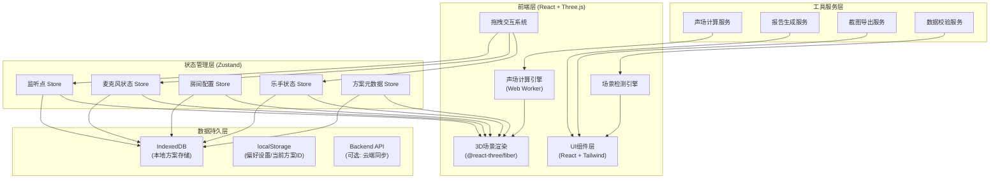
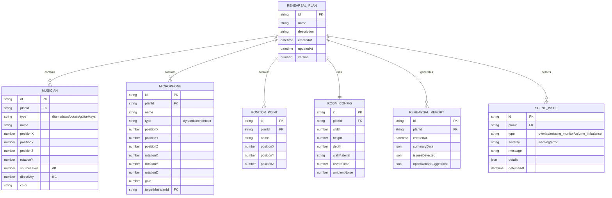

## 1. 架构设计



## 2. 技术栈描述

### 2.1 核心技术选型
- **前端框架**：React@18.2 + TypeScript@5.0
- **构建工具**：Vite@5.0
- **样式方案**：TailwindCSS@3.4 + 自定义CSS变量
- **3D渲染**：
  - three@0.160
  - @react-three/fiber@8.15
  - @react-three/drei@9.92
  - @react-three/postprocessing@2.15
- **状态管理**：Zustand@4.4
- **数据持久化**：
  - IndexedDB (idb@7.1)
  - localStorage (原生API)
- **后端服务**：Express@4.18 (可选，用于云端同步)
- **工具库**：
  - html2canvas@1.4 (截图)
  - jspdf@2.5 (PDF导出)
  - lodash-es@4.17 (工具函数)

### 2.2 初始化方式
```bash
# 使用 Vite 初始化 React + TypeScript 项目
npm create vite@latest band-rehearsal-acoustics -- --template react-ts
cd band-rehearsal-acoustics
npm install three @react-three/fiber @react-three/drei @react-three/postprocessing zustand idb html2canvas jspdf lodash-es
npm install -D tailwindcss postcss autoprefixer @types/three @types/lodash-es
npx tailwindcss init -p
```

## 3. 路由定义

| 路由 | 页面组件 | 功能描述 |
|------|---------|---------|
| `/` | `MainApp` | 主应用页面，包含3D场景、侧边面板、工具栏 |
| `/plans/:id` | `MainApp` | 加载指定方案的主应用页面 |
| `/report/:id` | `ReportViewer` | 独立报告查看页面（可打印） |

## 4. 数据模型

### 4.1 核心业务对象 ER 图



### 4.2 TypeScript 类型定义

```typescript
// 核心类型定义
export type InstrumentType = 'drums' | 'bass' | 'vocals' | 'guitar' | 'keys';
export type MicType = 'dynamic' | 'condenser';
export type IssueType = 'source_overlap' | 'missing_monitor' | 'volume_imbalance';
export type IssueSeverity = 'warning' | 'error';

export interface Vector3 {
  x: number;
  y: number;
  z: number;
}

export interface Musician {
  id: string;
  planId: string;
  type: InstrumentType;
  name: string;
  position: Vector3;
  rotation: number; // Y轴旋转角度
  sourceLevel: number; // dB
  directivity: number; // 0-1 指向性系数
  color: string;
}

export interface Microphone {
  id: string;
  planId: string;
  name: string;
  type: MicType;
  position: Vector3;
  rotation: Vector3;
  gain: number;
  targetMusicianId?: string;
}

export interface MonitorPoint {
  id: string;
  planId: string;
  name: string;
  position: Vector3;
}

export interface RoomConfig {
  id: string;
  planId: string;
  width: number;
  height: number;
  depth: number;
  wallMaterial: string;
  reverbTime: number;
  ambientNoise: number;
}

export interface SoundPressureSample {
  position: Vector3;
  level: number; // dB
  frequencyBand: 'low' | 'mid' | 'high';
}

export interface SceneIssue {
  id: string;
  planId: string;
  type: IssueType;
  severity: IssueSeverity;
  message: string;
  details: Record<string, any>;
  detectedAt: Date;
  relatedObjectIds: string[];
}

export interface RehearsalReport {
  id: string;
  planId: string;
  createdAt: Date;
  summary: {
    totalMusicians: number;
    totalMicrophones: number;
    totalMonitorPoints: number;
    averageSoundPressure: number;
    volumeBalanceScore: number; // 0-100
  };
  issues: SceneIssue[];
  suggestions: string[];
  heatmapData: SoundPressureSample[];
}

export interface RehearsalPlan {
  id: string;
  name: string;
  description: string;
  createdAt: Date;
  updatedAt: Date;
  version: number;
  musicians: Musician[];
  microphones: Microphone[];
  monitorPoints: MonitorPoint[];
  roomConfig: RoomConfig;
  reports: RehearsalReport[];
}
```

### 4.3 IndexedDB 存储结构

```javascript
// 数据库名: band_rehearsal_db
// 版本: 1

// Object Stores:
// 1. plans - 存储方案元数据
//    - keyPath: id
//    - 索引: name, createdAt, updatedAt
//
// 2. musicians - 存储乐手数据
//    - keyPath: id
//    - 索引: planId, type
//
// 3. microphones - 存储麦克风数据
//    - keyPath: id
//    - 索引: planId
//
// 4. monitorPoints - 存储监听点数据
//    - keyPath: id
//    - 索引: planId
//
// 5. roomConfigs - 存储房间配置
//    - keyPath: id
//    - 索引: planId (unique)
//
// 6. reports - 存储排练报告
//    - keyPath: id
//    - 索引: planId, createdAt
```

## 5. 核心算法说明

### 5.1 声场计算算法

```typescript
// 声压级计算 (基于反平方定律 + 指向性)
function calculateSoundPressure(
  sourcePos: Vector3,
  listenerPos: Vector3,
  sourceLevel: number,
  directivity: number,
  sourceRotation: number
): number {
  const distance = Math.sqrt(
    Math.pow(listenerPos.x - sourcePos.x, 2) +
    Math.pow(listenerPos.z - sourcePos.z, 2)
  );
  
  if (distance < 0.1) return sourceLevel;
  
  // 反平方定律: 距离每增加一倍，声压级减少6dB
  const distanceAttenuation = 20 * Math.log10(distance / 1.0);
  
  // 指向性衰减 (简化的cardioid模式)
  const angleToListener = Math.atan2(
    listenerPos.x - sourcePos.x,
    listenerPos.z - sourcePos.z
  );
  const angleDiff = Math.abs(angleToListener - sourceRotation);
  const directivityAttenuation = directivity * (1 - Math.cos(angleDiff)) * 6;
  
  return sourceLevel - distanceAttenuation - directivityAttenuation;
}

// 多声源叠加
function calculateCombinedSoundPressure(
  sources: Musician[],
  listenerPos: Vector3
): number {
  const pressures = sources.map(m => {
    const db = calculateSoundPressure(
      m.position,
      listenerPos,
      m.sourceLevel,
      m.directivity,
      m.rotation
    );
    return Math.pow(10, db / 20); // 转换为线性声压
  });
  
  const combinedPressure = Math.sqrt(
    pressures.reduce((sum, p) => sum + p * p, 0)
  );
  
  return 20 * Math.log10(combinedPressure);
}
```

### 5.2 场景检测算法

```typescript
// 1. 声源重叠检测
function detectSourceOverlap(musicians: Musician[], threshold = 0.5): SceneIssue[] {
  const issues: SceneIssue[] = [];
  for (let i = 0; i < musicians.length; i++) {
    for (let j = i + 1; j < musicians.length; j++) {
      const dist = distance2D(musicians[i].position, musicians[j].position);
      if (dist < threshold) {
        issues.push({
          id: generateId(),
          type: 'source_overlap',
          severity: 'error',
          message: `${musicians[i].name} 与 ${musicians[j].name} 站位过近`,
          details: { distance: dist, threshold },
          relatedObjectIds: [musicians[i].id, musicians[j].id]
        });
      }
    }
  }
  return issues;
}

// 2. 监听点缺失检测
function detectMissingMonitor(
  monitorPoints: MonitorPoint[],
  musicians: Musician[]
): SceneIssue[] {
  if (monitorPoints.length === 0) {
    return [{
      id: generateId(),
      type: 'missing_monitor',
      severity: 'warning',
      message: '未配置监听点，建议在听音位置添加监听点',
      details: {},
      relatedObjectIds: []
    }];
  }
  
  return monitorPoints
    .filter(mp => {
      const avgDb = calculateAvgSoundPressure(musicians, mp.position);
      return avgDb < 60;
    })
    .map(mp => ({
      id: generateId(),
      type: 'missing_monitor',
      severity: 'warning',
      message: `监听点 "${mp.name}" 位于声场覆盖边缘 (${avgDb.toFixed(1)}dB)`,
      details: { monitorPointId: mp.id, soundLevel: avgDb },
      relatedObjectIds: [mp.id]
    }));
}

// 3. 音量比例检测
function detectVolumeImbalance(
  musicians: Musician[],
  monitorPoints: MonitorPoint[]
): SceneIssue[] {
  if (monitorPoints.length === 0) return [];
  
  const issues: SceneIssue[] = [];
  
  monitorPoints.forEach(mp => {
    const levels = musicians.map(m => ({
      musician: m,
      level: calculateSoundPressure(m.position, mp.position, m.sourceLevel, m.directivity, m.rotation)
    }));
    
    const totalLevel = levels.reduce((sum, l) => sum + Math.pow(10, l.level / 20), 0);
    
    levels.forEach(({ musician, level }) => {
      const ratio = Math.pow(10, level / 20) / totalLevel;
      if (ratio > 0.6) {
        issues.push({
          id: generateId(),
          type: 'volume_imbalance',
          severity: 'warning',
          message: `监听点 "${mp.name}" 处 ${musician.name} 音量占比过高 (${(ratio * 100).toFixed(1)}%)`,
          details: { monitorPointId: mp.id, musicianId: musician.id, ratio },
          relatedObjectIds: [mp.id, musician.id]
        });
      } else if (ratio < 0.1) {
        issues.push({
          id: generateId(),
          type: 'volume_imbalance',
          severity: 'warning',
          message: `监听点 "${mp.name}" 处 ${musician.name} 音量占比过低 (${(ratio * 100).toFixed(1)}%)`,
          details: { monitorPointId: mp.id, musicianId: musician.id, ratio },
          relatedObjectIds: [mp.id, musician.id]
        });
      }
    });
  });
  
  return issues;
}
```

## 6. 模块间校验联动机制

### 6.1 状态变更订阅流程

```typescript
// Zustand Store 中间件实现自动校验
const storeMiddleware = (config) => (set, get, api) => {
  return config(
    (args) => {
      set(args);
      // 每次状态变更后触发校验
      runSceneValidation(get());
      // 标记方案为未保存
      markAsUnsaved();
    },
    get,
    api
  );
};

// 校验触发后，各模块通过订阅更新
useStore.subscribe(
  (state) => state.sceneIssues,
  (issues) => {
    // 更新3D场景中的警告标识
    updateSceneWarnings(issues);
    // 更新侧边面板警告状态
    updateSidePanelWarnings(issues);
    // 更新检测浮窗
    updateDetectionPanel(issues);
  }
);
```
