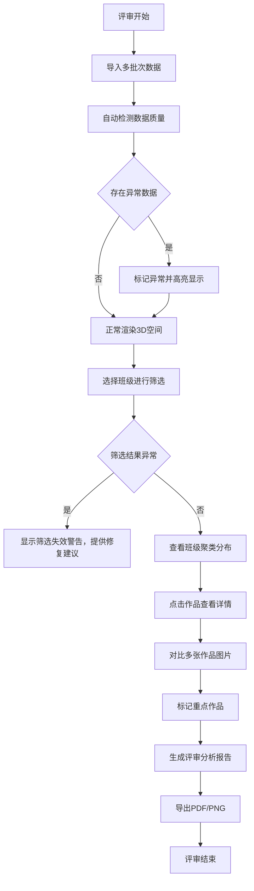

## 1. 产品概述

美术色彩空间星图是一款面向美术教育评审场景的3D数据可视化工具，将学生作品的色彩属性（色相、明度、饱和度）映射到三维空间中，帮助评审委员直观比较不同班级的艺术风格差异。系统重点解决美术数据采集过程中常见的数据质量问题，确保评审过程的专业性和准确性。

- 核心价值：将抽象的色彩理论转化为可交互的3D空间，让美术评审工作数据化、可视化
- 目标用户：美术教师、评审委员、教学研究员
- 解决问题：色彩风格难以量化比较、数据采集质量参差不齐、评审结论缺乏数据支撑

## 2. 核心功能

### 2.1 用户角色

| 角色 | 登录方式 | 核心权限 |
|------|----------|----------|
| 评审委员 | 无需登录（单机应用） | 完整的3D浏览、数据查看、筛选、报告导出权限 |
| 数据管理员 | 无需登录（单机应用） | 数据导入、版本管理、异常标记权限 |

### 2.2 功能模块

1. **主空间页面**：3D HSL色彩球体、作品星点分布、实时信息面板
2. **数据管理模块**：多版本数据融合、缺失字段补全、采集质量评估
3. **交互控制模块**：3D旋转漫游、点击查看详情、聚类高亮、异常定位
4. **筛选保存模块**：班级筛选、色彩范围筛选、筛选配置保存与加载
5. **报告导出模块**：异常对象分析报告、班级风格对比报告、PDF/PNG导出

### 2.3 页面详情

| 页面名称 | 模块名称 | 功能描述 |
|-----------|-------------|---------------------|
| 主空间页面 | 3D色彩球体 | HSL色彩空间可视化，X轴=色相(0-360°)，Y轴=明度(0-100%)，Z轴=饱和度(0-100%)，球体内分布作品星点 |
| 主空间页面 | 作品星点 | 每个作品对应一个发光球体，颜色为作品主色调，大小代表作品评分，点击显示详情 |
| 主空间页面 | 信息面板 | 实时显示选中作品的完整数据：图片预览、班级信息、HSL数值、采集版本、质量标记 |
| 主空间页面 | 控制工具栏 | 视角重置、自动旋转开关、网格显示开关、坐标轴显示、聚类模式切换 |
| 主空间页面 | 班级筛选栏 | 多班级复选框、全选/反选、按色彩统计分布、筛选配置保存按钮 |
| 主空间页面 | 异常定位器 | 透明背景误采标记、极端颜色警告、筛选失效提示、一键跳转异常对象 |
| 数据导入弹窗 | 版本管理 | 支持分批导入数据，自动检测版本差异，处理字段缺失和冲突 |
| 报告导出弹窗 | 报告生成 | 选择报告类型、自定义包含内容、预览后导出PDF或PNG格式 |

## 3. 核心流程

### 重点场景流程

1. **透明背景误采处理流程**：
   - 系统检测到饱和度<5%且明度>90%的像素占比>30%
   - 自动标记为"透明背景误采"风险
   - 星点显示为半透明虚线边框
   - 点击时显示"疑似透明背景误采"警告，提供重新采样选项

2. **极端颜色遮挡处理流程**：
   - 检测到HSL数值处于空间边缘（色相<10°或>350°，明度<5%或>95%）
   - 启用"极端颜色保护"渲染模式，使用发光轮廓避免被空间边界遮挡
   - 提供"边缘区域放大"视图按钮

3. **班级筛选失效处理流程**：
   - 筛选后结果为空或少于2个样本
   - 显示警告："当前筛选条件下样本不足，建议：1) 扩大筛选范围 2) 检查班级标签数据质量"
   - 自动推荐相似班级组合

## 4. 用户界面设计

### 4.1 设计风格

**艺术展览风格**：深邃神秘的宇宙星图主题，契合美术评审的专业气质

- **主色调**：深空蓝 `#0a0e1a` 作为背景，营造宇宙空间感
- **辅助色**：星尘紫 `#6366f1`、艺术金 `#f59e0b`、警示红 `#ef4444`
- **点缀色**：使用真实光谱渐变色系表现色相环
- **字体**：标题使用 `Noto Serif SC`（文艺衬线体），正文使用 `Inter`（现代无衬线）
- **按钮风格**：半透明玻璃拟态，边框微光，hover时有扩散光效
- **布局风格**：沉浸式3D空间为主，浮动信息面板，非对称布局
- **图标风格**：线性简约图标，带发光效果

### 4.2 页面设计概述

| 页面名称 | 模块名称 | UI元素 |
|-----------|-------------|-------------|
| 主空间页面 | 3D色彩球体 | 半透明彩色球体，内部网格线，三轴线发光标注 |
| 主空间页面 | 作品星点 | 发光球体，拖尾效果，选中时脉冲动画，异常时虚线边框 |
| 主空间页面 | 左侧信息面板 | 毛玻璃效果，圆角20px，作品大图，数据卡片网格 |
| 主空间页面 | 顶部筛选栏 | 横向排列班级标签，选中时发光效果，保存按钮居右 |
| 主空间页面 | 右侧工具栏 | 垂直排列控制按钮，图标+tooltip，hover时放大 |
| 主空间页面 | 底部异常栏 | 半透明警示条，异常计数，点击展开异常列表 |
| 主空间页面 | 中央提示层 | 加载动画、操作指引、版本冲突提示 |

### 4.3 3D场景指引

- **环境**：深空背景，星点点缀，轻微噪波纹理，无HDRI避免色彩干扰
- **光照**：半球光+点光源组合，三轴线方向各有彩色光源对应HSL维度
- **相机**：PerspectiveCamera，初始距离2.5倍球半径，控制器启用阻尼效果
- **运动**：默认自动缓慢旋转，用户交互时暂停，重置动画平滑过渡
- **后期处理**：Bloom泛光效果（星点发光），FXAA抗锯齿，轻微色调映射
- **性能预算**：最多200个星点，每个星点使用instancedMesh，目标帧率60fps

### 4.4 响应式

- 桌面端优先设计，支持1920×1080及以上分辨率
- 面板可拖拽、可折叠、可调整大小
- 触摸设备支持双指缩放旋转
- 小屏幕下工具栏自动转为底部横排

## 5. 边界案例样例（内置演示数据）

### 5.1 透明背景误采案例
- 作品：《星空》，高一(3)班，PNG格式带透明通道
- 采样结果：HSL(0°, 2%, 95%)，实际上是透明背景被误识别为白色
- 系统标记：⚠️ 透明背景误采高风险
- 处理：提供"排除透明区域重采样"按钮

### 5.2 极端颜色遮挡案例
- 作品：《夜》，高二(1)班，几乎全黑的抽象作品
- 采样结果：HSL(240°, 5%, 3%)，位于3D空间角落
- 系统处理：自动添加发光轮廓，提供"边缘放大"视图
- 对比：正常作品《阳光》HSL(45°, 95%, 98%)，同样需要特殊渲染

### 5.3 班级筛选失效案例
- 场景：同时筛选"高三(5)班"和"水彩方向"
- 结果：仅1个样本（正常需要≥3个才有统计意义）
- 系统提示：样本不足，建议增加"高三(4)班"或移除"水彩方向"限制
- 样例数据包含3组不同的筛选失效场景

### 5.4 数据版本差异案例
- 作品《静物》有三个版本数据：
  - v1（2026-05-20）：只有图片，无HSL数据
  - v2（2026-05-25）：补充HSL数据，但班级标签错误
  - v3（2026-05-28）：修正班级标签，增加评分数据
- 系统显示完整版本链，允许切换查看历史数据
