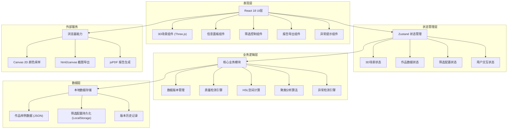

## 1. 架构设计



## 2. 技术描述

- **前端框架**：React@18 + TypeScript + Vite
- **3D渲染**：Three.js + @react-three/fiber + @react-three/drei + @react-three/postprocessing
- **状态管理**：Zustand
- **样式方案**：TailwindCSS 3.x + CSS Variables
- **图标库**：Lucide React
- **数据导出**：html2canvas + jspdf
- **后端**：无（纯前端单机应用）
- **数据存储**：LocalStorage + 内置JSON样例数据
- **初始化工具**：vite-init (react-ts模板)

## 3. 技术选型说明

| 技术 | 选型理由 |
|------|----------|
| Three.js + R3F | 成熟的WebGL 3D渲染方案，React封装提供更好的组件化能力 |
| @react-three/postprocessing | 提供Bloom泛光、FXAA等后期处理效果，实现星点发光效果 |
| Zustand | 轻量级状态管理，适合中型应用，避免Redux的过度复杂度 |
| TailwindCSS | 快速构建UI，配合CSS变量实现主题切换 |
| html2canvas + jspdf | 纯前端导出PNG/PDF报告，无需后端服务 |
| LocalStorage | 持久化筛选配置和用户偏好，适合单机应用 |

## 4. 目录结构

```
src/
├── components/           # React组件
│   ├── ColorSpace3D/    # 3D色彩空间组件
│   │   ├── ColorSpaceScene.tsx
│   │   ├── HSLSphere.tsx
│   │   ├── StarPoints.tsx
│   │   └── AxesHelper.tsx
│   ├── InfoPanel/       # 信息面板组件
│   │   ├── ArtworkDetail.tsx
│   │   ├── ImagePreview.tsx
│   │   └── VersionHistory.tsx
│   ├── FilterBar/       # 筛选栏组件
│   │   ├── ClassFilter.tsx
│   │   ├── ColorRangeFilter.tsx
│   │   └── FilterPresets.tsx
│   ├── Toolbar/         # 工具栏组件
│   │   ├── ViewControls.tsx
│   │   ├── ClusterModeToggle.tsx
│   │   └── ExportButton.tsx
│   ├── AlertSystem/     # 异常提示组件
│   │   ├── TransparentBgAlert.tsx
│   │   ├── ExtremeColorAlert.tsx
│   │   └── FilterFailAlert.tsx
│   └── common/          # 通用组件
│       ├── GlassCard.tsx
│       ├── GlowButton.tsx
│       └── Tooltip.tsx
├── hooks/               # 自定义Hooks
│   ├── useColorSpace.ts
│   ├── useDataQuality.ts
│   ├── useFilter.ts
│   └── useReportExport.ts
├── store/               # Zustand状态
│   ├── useSceneStore.ts
│   ├── useArtworkStore.ts
│   └── useFilterStore.ts
├── utils/               # 工具函数
│   ├── hslCalculator.ts
│   ├── qualityChecker.ts
│   ├── clusterAnalysis.ts
│   └── versionManager.ts
├── data/                # 样例数据
│   ├── artworks.json
│   └── boundaryCases.json
├── types/               # TypeScript类型
│   ├── artwork.ts
│   ├── colorSpace.ts
│   └── filter.ts
├── pages/               # 页面组件
│   └── MainPage.tsx
├── App.tsx
├── main.tsx
└── index.css
```

## 5. 核心数据模型

### 5.1 数据模型定义

```mermaid
erDiagram
    ARTWORK {
        string id PK "作品唯一标识"
        string title "作品名称"
        string classId FK "所属班级"
        string className "班级名称"
        string imageUrl "作品图片URL"
        float hue "色相 0-360"
        float lightness "明度 0-100"
        float saturation "饱和度 0-100"
        float score "作品评分 0-100"
        string dataVersion "数据版本号"
        date sampledAt "采样时间"
        json qualityFlags "质量标记"
        json versionHistory "版本历史"
    }
    
    CLASS {
        string id PK "班级标识"
        string name "班级名称"
        string grade "年级"
        string artDirection "艺术方向"
    }
    
    FILTER_CONFIG {
        string id PK "配置ID"
        string name "配置名称"
        json classFilters "班级筛选"
        json hslRanges "HSL范围"
        date savedAt "保存时间"
    }
    
    QUALITY_REPORT {
        string id PK "报告ID"
        string artworkId FK "作品ID"
        string alertType "警报类型"
        string severity "严重程度"
        string description "描述"
        json suggestion "修复建议"
    }
    
    ARTWORK ||--o{ QUALITY_REPORT : has
    CLASS ||--o{ ARTWORK : contains
```

### 5.2 TypeScript类型定义

```typescript
// types/artwork.ts
export interface Artwork {
  id: string;
  title: string;
  classId: string;
  className: string;
  imageUrl: string;
  hue: number | null;
  lightness: number | null;
  saturation: number | null;
  score: number;
  dataVersion: string;
  sampledAt: string;
  qualityFlags: QualityFlags;
  versionHistory: VersionEntry[];
}

export interface QualityFlags {
  transparentBgRisk: boolean;
  extremeColorRisk: boolean;
  missingData: boolean;
  versionConflict: boolean;
}

export interface VersionEntry {
  version: string;
  timestamp: string;
  fields: Record<string, unknown>;
  note?: string;
}

export interface ClassInfo {
  id: string;
  name: string;
  grade: string;
  artDirection: string;
}

// types/colorSpace.ts
export interface HSLPosition {
  x: number;
  y: number;
  z: number;
  hue: number;
  lightness: number;
  saturation: number;
}

export interface ClusterResult {
  clusterId: string;
  center: HSLPosition;
  members: string[];
  className: string;
}

// types/filter.ts
export interface FilterConfig {
  id: string;
  name: string;
  classIds: string[];
  hueRange: [number, number];
  lightnessRange: [number, number];
  saturationRange: [number, number];
  savedAt: string;
}
```

## 6. 核心算法设计

### 6.1 HSL到3D坐标转换算法

```typescript
// utils/hslCalculator.ts
/**
 * 将HSL色彩值转换为3D球体坐标
 * 色相(H) → 水平角度 (X-Z平面)
 * 饱和度(S) → 半径方向（0=中心, 1=球面）
 * 明度(L) → 垂直高度（Y轴，0=底部, 1=顶部）
 */
export function hslTo3DPosition(hue: number, saturation: number, lightness: number, sphereRadius: number = 1): THREE.Vector3 {
  const theta = (hue / 360) * Math.PI * 2;
  const phi = (1 - lightness / 100) * Math.PI;
  const r = (saturation / 100) * sphereRadius;
  
  const x = r * Math.sin(phi) * Math.cos(theta);
  const y = r * Math.cos(phi);
  const z = r * Math.sin(phi) * Math.sin(theta);
  
  return new THREE.Vector3(x, y, z);
}
```

### 6.2 质量检测引擎

```typescript
// utils/qualityChecker.ts
/**
 * 检测透明背景误采风险
 * 规则：饱和度<5% 且 明度>90% 的像素占比超过30%
 */
export function checkTransparentBgRisk(artwork: Artwork): boolean {
  if (!artwork.saturation || !artwork.lightness) return false;
  return artwork.saturation < 5 && artwork.lightness > 90;
}

/**
 * 检测极端颜色遮挡风险
 * 规则：HSL数值处于空间边缘区域
 */
export function checkExtremeColorRisk(artwork: Artwork): boolean {
  if (!artwork.hue || !artwork.lightness) return false;
  const hueEdge = artwork.hue < 10 || artwork.hue > 350;
  const lightnessEdge = artwork.lightness < 5 || artwork.lightness > 95;
  return hueEdge || lightnessEdge;
}

/**
 * 检测筛选失效
 * 规则：筛选结果少于2个样本
 */
export function checkFilterFailure(filteredCount: number): boolean {
  return filteredCount < 2;
}
```

### 6.3 聚类分析算法

```typescript
// utils/clusterAnalysis.ts
/**
 * K-Means聚类分析，按班级分组计算色彩中心
 */
export function calculateClassClusters(artworks: Artwork[]): ClusterResult[] {
  const classGroups = groupBy(artworks, 'classId');
  
  return Object.entries(classGroups).map(([classId, classArtworks]) => {
    const positions = classArtworks.map(a => hslTo3DPosition(a.hue!, a.saturation!, a.lightness!));
    const center = calculateMeanPosition(positions);
    
    return {
      clusterId: `cluster-${classId}`,
      center,
      members: classArtworks.map(a => a.id),
      className: classArtworks[0].className
    };
  });
}
```

## 7. 状态管理设计

```typescript
// store/useArtworkStore.ts
import { create } from 'zustand';

interface ArtworkState {
  artworks: Artwork[];
  selectedArtworkId: string | null;
  highlightedClusterId: string | null;
  qualityAlerts: QualityReport[];
  
  setArtworks: (artworks: Artwork[]) => void;
  selectArtwork: (id: string | null) => void;
  highlightCluster: (id: string | null) => void;
  addVersion: (artworkId: string, version: VersionEntry) => void;
  recalculateQuality: () => void;
}

export const useArtworkStore = create<ArtworkState>((set, get) => ({
  artworks: [],
  selectedArtworkId: null,
  highlightedClusterId: null,
  qualityAlerts: [],
  
  setArtworks: (artworks) => set({ artworks }),
  selectArtwork: (id) => set({ selectedArtworkId: id }),
  highlightCluster: (id) => set({ highlightedClusterId: id }),
  
  addVersion: (artworkId, version) => {
    const { artworks } = get();
    const updated = artworks.map(a => 
      a.id === artworkId 
        ? { ...a, versionHistory: [...a.versionHistory, version] }
        : a
    );
    set({ artworks: updated });
  },
  
  recalculateQuality: () => {
    const { artworks } = get();
    const alerts: QualityReport[] = [];
    
    artworks.forEach(artwork => {
      if (checkTransparentBgRisk(artwork)) {
        alerts.push({
          id: `alert-${artwork.id}-transparent`,
          artworkId: artwork.id,
          alertType: 'transparent_bg',
          severity: 'warning',
          description: '疑似透明背景误采',
          suggestion: { action: 'resample', excludeTransparent: true }
        });
      }
      if (checkExtremeColorRisk(artwork)) {
        alerts.push({
          id: `alert-${artwork.id}-extreme`,
          artworkId: artwork.id,
          alertType: 'extreme_color',
          severity: 'info',
          description: '颜色处于空间边缘区域',
          suggestion: { action: 'zoom_edge' }
        });
      }
    });
    
    set({ qualityAlerts: alerts });
  }
}));
```

## 8. 性能优化策略

1. **3D渲染优化**：
   - 使用InstancedMesh批量渲染星点，减少Draw Call
   - 视锥体剔除（Frustum Culling）
   - LOD（层次细节）技术，远处星点使用简化几何体
   
2. **状态更新优化**：
   - Zustand selectors 避免不必要的重渲染
   - 3D场景与UI状态分离更新
   
3. **内存管理**：
   - 图片懒加载，使用Web Worker处理颜色采样
   - 组件卸载时清理Three.js资源

4. **数据处理优化**：
   - 大数据集使用Web Worker进行聚类计算
   - 防抖处理筛选条件变化
