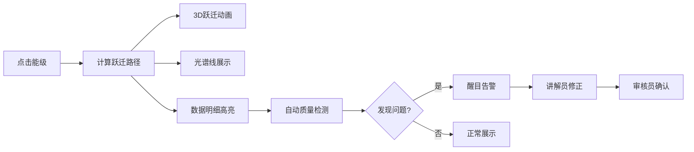

## 1. 产品概述

量子能级跃迁塔是一款面向科普展馆的3D交互式教育应用，通过可视化的能级塔模型，让访客直观理解电子能级跃迁原理及光谱产生机制。
- **核心价值**：将抽象的量子物理概念转化为可交互的3D体验，降低科学认知门槛
- **目标用户**：科普讲解员、展馆访客、物理教师和学生
- **解决问题**：传统表格展示难以发现能级顺序错误、跃迁概率异常、光谱颜色误配等问题

## 2. 核心功能

### 2.1 用户角色
| 角色 | 使用方式 | 核心权限 |
|------|----------|----------|
| 科普讲解员 | 展馆演示、数据编辑 | 编辑能级数据、导出截图、标记问题状态 |
| 访客 | 互动体验 | 点击能级查看跃迁、观察光谱变化 |
| 内容审核员 | 数据校验 | 审核修正结果、确认数据正确性 |

### 2.2 功能模块
1. **主界面**：3D能级塔场景、数据明细面板、光谱展示区
2. **数据管理**：能级/跃迁/光谱/外场参数编辑、原始值保留
3. **质量检测**：自动校验能级顺序、跃迁概率、光谱颜色匹配
4. **问题追踪**：发现问题→修正处理→审核确认的完整流程
5. **导出功能**：场景截图导出、数据报告生成

### 2.3 页面详情
| 页面名称 | 模块名称 | 功能描述 |
|---------|---------|----------|
| 主界面 | 3D能级塔 | Three.js渲染能级塔，支持点击选择能级，跃迁动画效果 |
| 主界面 | 数据明细面板 | 左侧展示能级列表、跃迁概率、光谱数据、外场参数、讲解备注 |
| 主界面 | 光谱展示区 | 实时显示对应跃迁的光谱线，波长与颜色联动 |
| 主界面 | 质量检测面板 | 醒目标注检测结果：能级顺序错误、概率>1、颜色误配 |
| 主界面 | 问题追踪区 | 显示问题发现记录、修正过程、确认人员信息 |
| 主界面 | 截图导出 | 导出当前3D场景截图，包含数据快照 |

## 3. 核心流程

访客点击能级塔上的某一能级→系统计算可能的跃迁路径→3D场景播放跃迁动画→光谱区显示对应光谱线→明细面板同步高亮数据→后台自动进行质量校验→如发现问题则醒目提示→讲解员修正数据→审核员确认修改。

## 4. 用户界面设计

### 4.1 设计风格
- **主色调**：深空蓝(#0a1628)为底色，量子紫(#7c3aed)、能量青(#06b6d4)、光谱红(#ef4444)为强调色
- **视觉效果**：科技感发光效果、粒子背景、霓虹边框
- **字体**：展示字体使用Orbitron，正文字体使用JetBrains Mono
- **布局**：左侧数据面板(30%) + 中央3D场景(50%) + 右侧光谱与检测区(20%)
- **交互风格**：点击能级时有脉冲发光效果，跃迁时有粒子轨迹

### 4.2 页面设计概述
| 页面名称 | 模块名称 | UI元素 |
|---------|---------|--------|
| 主界面 | 3D能级塔 | 圆柱塔状能级结构、发光能级平台、电子粒子模型、跃迁轨迹线 |
| 主界面 | 数据明细 | 表格展示、原始值灰显、编辑按钮、版本历史 |
| 主界面 | 质量检测 | 红色告警卡片、错误详情列表、一键修正建议 |
| 主界面 | 问题追踪 | 时间线样式、发现人/修正人/确认人标签、状态徽章 |
| 主界面 | 光谱展示 | 光栅样式展示、波长刻度、颜色渐变条 |

### 4.3 响应式
- 桌面端优先设计，支持1920×1080展馆标准分辨率
- 平板端自适应布局，面板可折叠
- 触控优化：能级点击区域放大，支持手势旋转3D场景

### 4.4 3D场景指导
- **环境**：深空背景+星点粒子，HDR环境光营造科技感
- **光照**：主光源+能级自发光+跃迁特效光
- **相机**：默认45°俯视角，支持轨道控制，聚焦能级塔中心
- **动画**：能级悬浮微动、电子绕轨运动、跃迁时的粒子喷射
- **后期**：Bloom发光效果、轻微色差增强科技感
- **性能**：控制粒子数量≤500，保持60fps刷新率
