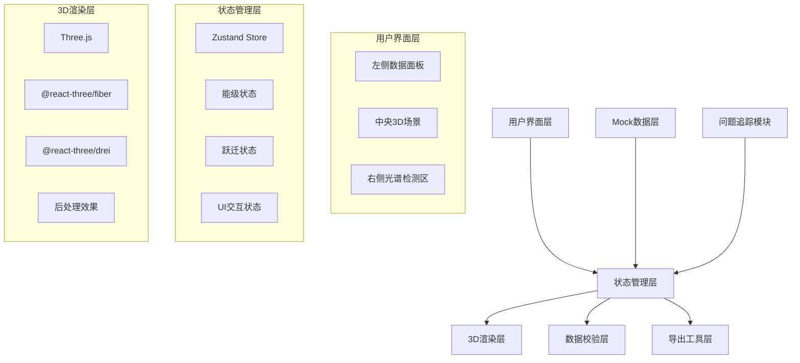
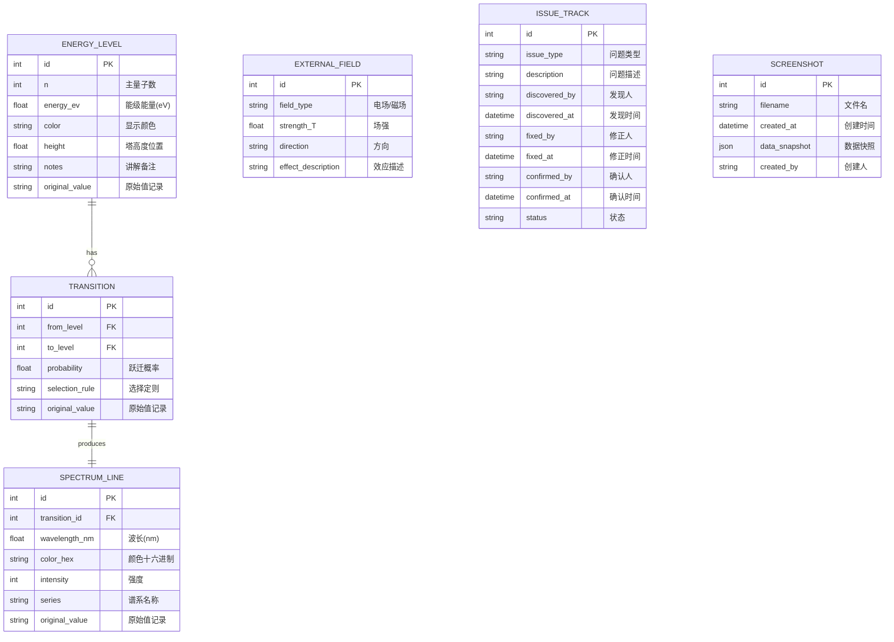

## 1. 架构设计



## 2. 技术描述

- **前端框架**: React@18 + TypeScript + Vite
- **样式方案**: TailwindCSS@3 + CSS变量主题系统
- **3D渲染**: Three.js + @react-three/fiber + @react-three/drei
- **状态管理**: Zustand (轻量级状态管理)
- **后处理效果**: @react-three/postprocessing
- **数据存储**: LocalStorage (保留原始值和历史记录)
- **截图导出**: html2canvas + dom-to-image
- **图标库**: Lucide React

## 3. 路由定义

| 路由 | 用途 |
|------|------|
| / | 主应用界面 - 3D能级塔 + 数据面板 + 光谱展示 |

## 4. 数据模型

### 4.1 数据模型定义



### 4.2 TypeScript 类型定义

```typescript
// 能级数据
interface EnergyLevel {
  id: number;
  n: number;
  energy_eV: number;
  color: string;
  height: number;
  notes: string;
  original_value?: string;
}

// 跃迁数据
interface Transition {
  id: number;
  from_level: number;
  to_level: number;
  probability: number;
  selection_rule: string;
  original_value?: string;
}

// 光谱线
interface SpectrumLine {
  id: number;
  transition_id: number;
  wavelength_nm: number;
  color_hex: string;
  intensity: number;
  series: string;
  original_value?: string;
}

// 外场参数
interface ExternalField {
  field_type: 'electric' | 'magnetic';
  strength: number;
  direction: [number, number, number];
  effect_description: string;
}

// 质量检测结果
interface ValidationResult {
  type: 'energy_order' | 'probability' | 'spectrum_color';
  level: 'error' | 'warning' | 'info';
  message: string;
  suggestion: string;
  affected_ids: number[];
}

// 问题追踪
interface IssueTrack {
  id: string;
  issue_type: string;
  description: string;
  discovered_by: string;
  discovered_at: Date;
  fixed_by?: string;
  fixed_at?: Date;
  confirmed_by?: string;
  confirmed_at?: Date;
  status: 'discovered' | 'fixed' | 'confirmed';
}

// 应用状态
interface AppState {
  energyLevels: EnergyLevel[];
  transitions: Transition[];
  spectrumLines: SpectrumLine[];
  externalField: ExternalField;
  selectedLevel: number | null;
  activeTransition: number | null;
  validationResults: ValidationResult[];
  issueTracks: IssueTrack[];
}
```

## 5. 核心模块划分

| 模块 | 文件路径 | 职责 |
|------|---------|------|
| 3D场景 | src/components/Scene/ | 能级塔渲染、电子动画、跃迁特效 |
| 数据面板 | src/components/DataPanel/ | 能级列表、跃迁数据、参数编辑 |
| 光谱展示 | src/components/Spectrum/ | 光谱线渲染、波长-颜色映射 |
| 质量检测 | src/components/Validation/ | 自动校验、错误提示、修正建议 |
| 问题追踪 | src/components/IssueTracker/ | 问题记录、状态流转、人员信息 |
| 截图导出 | src/components/Export/ | 场景截图、数据快照、报告生成 |
| 状态管理 | src/store/ | Zustand全局状态管理 |
| 工具函数 | src/utils/ | 物理计算、颜色转换、校验逻辑 |
| Mock数据 | src/data/ | 氢原子能级示例数据 |

## 6. 关键实现要点

### 6.1 3D能级塔实现
- 使用@react-three/fiber的Canvas组件作为渲染容器
- 每个能级使用Cylinder圆柱体作为平台，添加emissive自发光材质
- 电子使用Sphere + Points粒子系统实现绕轨运动
- 跃迁动画使用gasp或@react-three/drei的Animations
- 使用Line2实现跃迁轨迹的发光效果

### 6.2 数据校验逻辑
- 能级顺序校验：按n值排序，检查energy_eV是否递增
- 跃迁概率校验：检查probability是否在[0, 1]范围内
- 光谱颜色校验：根据波长计算理论颜色，与实际color_hex对比

### 6.3 状态联动机制
- 点击3D能级 → 更新selectedLevel → 触发明细面板高亮
- 选择跃迁 → 播放3D动画 → 更新光谱线显示
- 编辑数据 → 自动触发校验 → 更新validationResults

### 6.4 原始值保留策略
- 所有数据字段包含original_value属性
- 编辑时创建历史记录存入LocalStorage
- 支持一键恢复原始值
