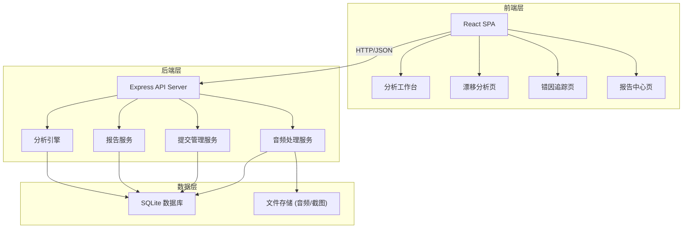
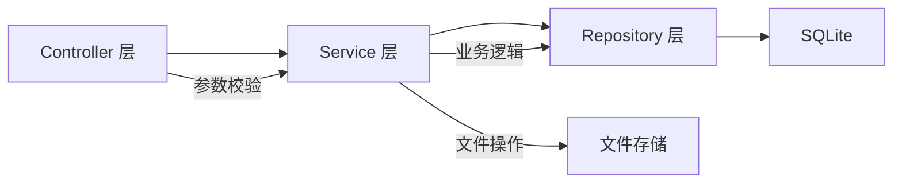
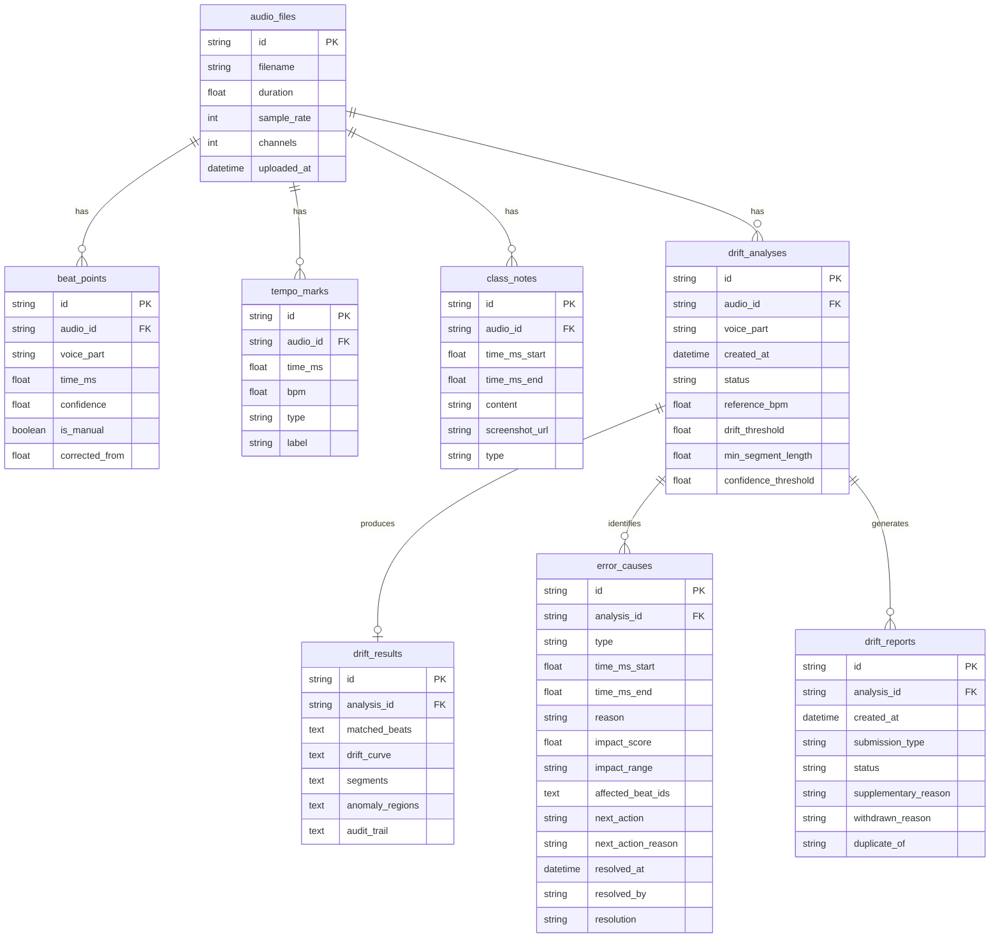

## 1. 架构设计



## 2. 技术说明

- **前端**：React@18 + TailwindCSS@3 + Vite + Zustand
- **初始化工具**：vite-init (react-express-ts 模板)
- **后端**：Express@4 + TypeScript (ESM)
- **数据库**：SQLite (better-sqlite3)，文件存储在服务端 uploads 目录
- **音频处理**：Web Audio API (前端波形渲染) + 服务端模拟节拍检测算法
- **可视化**：Canvas 波形绘制 + SVG 漂移曲线

## 3. 路由定义

| 路由 | 用途 |
|------|------|
| / | 分析工作台，音频上传、波形预览、节拍标注 |
| /analysis/:id | 漂移分析页，节拍匹配、漂移估计、分段统计 |
| /errors/:id | 错因追踪页，弱拍误检/速度变化/声部遮蔽原因与动作 |
| /reports | 报告中心页，报告列表、预览、导出、补录/撤回管理 |

## 4. API 定义

### 4.1 音频上传与分析

```typescript
interface AudioFile {
  id: string;
  filename: string;
  duration: number;
  sampleRate: number;
  channels: number;
  uploadedAt: string;
}

interface BeatPoint {
  id: string;
  audioId: string;
  voicePart: string;
  timeMs: number;
  confidence: number;
  isManual: boolean;
  correctedFrom?: number;
}

interface TempoMark {
  id: string;
  audioId: string;
  timeMs: number;
  bpm: number;
  type: "ritardando" | "accelerando" | "stable" | "custom";
  label: string;
}

interface ClassNote {
  id: string;
  audioId: string;
  timeMsStart: number;
  timeMsEnd: number;
  content: string;
  screenshotUrl?: string;
  type: "text" | "correction" | "screenshot";
}

// POST /api/audio/upload
// Content-Type: multipart/form-data
// Request: FormData { file: File }
// Response: { audio: AudioFile, beatPoints: BeatPoint[], tempoMarks: TempoMark[] }

// GET /api/audio/:id/waveform
// Response: { samples: number[], sampleRate: number }

// PUT /api/beat-points/:id
// Request: { timeMs?: number, confidence?: number, isManual?: boolean }
// Response: BeatPoint

// POST /api/beat-points
// Request: { audioId: string, voicePart: string, timeMs: number, confidence: number }
// Response: BeatPoint

// DELETE /api/beat-points/:id
// Response: { success: boolean }

// POST /api/tempo-marks
// Request: { audioId: string, timeMs: number, bpm: number, type: string, label: string }
// Response: TempoMark

// POST /api/class-notes
// Request: { audioId: string, timeMsStart: number, timeMsEnd: number, content: string, type: string }
// Response: ClassNote
```

### 4.2 漂移分析

```typescript
interface DriftAnalysis {
  id: string;
  audioId: string;
  voicePart: string;
  createdAt: string;
  status: "pending" | "running" | "completed" | "failed";
  config: AnalysisConfig;
  result?: DriftResult;
}

interface AnalysisConfig {
  referenceBpm: number;
  driftThreshold: number;
  minSegmentLength: number;
  confidenceThreshold: number;
}

interface DriftResult {
  matchedBeats: MatchedBeat[];
  driftCurve: DriftPoint[];
  segments: SegmentStat[];
  anomalyRegions: AnomalyRegion[];
  auditTrail: AuditEntry[];
}

interface MatchedBeat {
  detectedTime: number;
  referenceTime: number;
  offset: number;
  confidence: number;
  matched: boolean;
}

interface DriftPoint {
  timeMs: number;
  driftMs: number;
  cumulativeDriftMs: number;
}

interface SegmentStat {
  segmentId: string;
  label: string;
  startMs: number;
  endMs: number;
  meanDrift: number;
  variance: number;
  maxDrift: number;
  beatCount: number;
  calculationDetail: {
    sumDrift: number;
    sumDriftSquared: number;
    formulaMean: string;
    formulaVariance: string;
  };
}

interface AnomalyRegion {
  id: string;
  startMs: number;
  endMs: number;
  severity: "low" | "medium" | "high";
  driftAtStart: number;
  driftAtEnd: number;
  tag: string;
}

interface AuditEntry {
  step: string;
  formula: string;
  inputs: Record<string, number>;
  output: number;
  timestamp: string;
}

// POST /api/analysis
// Request: { audioId: string, voicePart: string, config: AnalysisConfig }
// Response: DriftAnalysis

// GET /api/analysis/:id
// Response: DriftAnalysis

// GET /api/analysis/:id/result
// Response: DriftResult
```

### 4.3 错因追踪

```typescript
interface ErrorCause {
  id: string;
  analysisId: string;
  type: "weak_beat" | "tempo_change" | "voice_masking";
  timeMsStart: number;
  timeMsEnd: number;
  reason: string;
  impactScore: number;
  impactRange: string;
  affectedBeatIds: string[];
  nextAction: "manual_correct" | "ignore" | "redetect";
  nextActionReason: string;
  resolvedAt?: string;
  resolvedBy?: string;
  resolution?: string;
}

// GET /api/analysis/:id/errors
// Response: ErrorCause[]

// PUT /api/errors/:id/resolve
// Request: { action: "manual_correct" | "ignore" | "redetect", resolution: string }
// Response: ErrorCause
```

### 4.4 报告与提交管理

```typescript
type SubmissionType = "normal" | "supplementary" | "withdrawn" | "duplicate";

interface DriftReport {
  id: string;
  analysisId: string;
  createdAt: string;
  submissionType: SubmissionType;
  status: "draft" | "submitted" | "withdrawn" | "supplementary" | "duplicate";
  supplementaryReason?: string;
  withdrawnReason?: string;
  duplicateOf?: string;
  driftCurveSvg?: string;
  segments: SegmentStat[];
  anomalies: AnomalyRegion[];
  errors: ErrorCause[];
  notes: ClassNote[];
  auditSummary: AuditEntry[];
}

// POST /api/reports
// Request: { analysisId: string, submissionType: SubmissionType }
// Response: DriftReport

// GET /api/reports
// Response: DriftReport[]

// GET /api/reports/:id
// Response: DriftReport

// PUT /api/reports/:id/submit
// Response: DriftReport

// PUT /api/reports/:id/withdraw
// Request: { reason: string }
// Response: DriftReport

// PUT /api/reports/:id/supplement
// Request: { reason: string }
// Response: DriftReport

// POST /api/reports/:id/duplicate-check
// Response: { isDuplicate: boolean, duplicateOf?: string, comparison?: object }

// GET /api/reports/:id/export?format=pdf|csv
// Response: Blob (file download)
```

## 5. 服务端架构图



## 6. 数据模型

### 6.1 数据模型定义



### 6.2 数据定义语言

```sql
CREATE TABLE audio_files (
  id TEXT PRIMARY KEY,
  filename TEXT NOT NULL,
  duration REAL NOT NULL,
  sample_rate INTEGER NOT NULL,
  channels INTEGER NOT NULL DEFAULT 1,
  uploaded_at TEXT NOT NULL DEFAULT (datetime('now'))
);

CREATE TABLE beat_points (
  id TEXT PRIMARY KEY,
  audio_id TEXT NOT NULL REFERENCES audio_files(id),
  voice_part TEXT NOT NULL DEFAULT 'default',
  time_ms REAL NOT NULL,
  confidence REAL NOT NULL DEFAULT 1.0,
  is_manual INTEGER NOT NULL DEFAULT 0,
  corrected_from REAL,
  INDEX idx_beat_audio (audio_id, voice_part)
);

CREATE TABLE tempo_marks (
  id TEXT PRIMARY KEY,
  audio_id TEXT NOT NULL REFERENCES audio_files(id),
  time_ms REAL NOT NULL,
  bpm REAL NOT NULL,
  type TEXT NOT NULL DEFAULT 'stable',
  label TEXT NOT NULL DEFAULT ''
);

CREATE TABLE class_notes (
  id TEXT PRIMARY KEY,
  audio_id TEXT NOT NULL REFERENCES audio_files(id),
  time_ms_start REAL NOT NULL,
  time_ms_end REAL NOT NULL,
  content TEXT NOT NULL,
  screenshot_url TEXT,
  type TEXT NOT NULL DEFAULT 'text'
);

CREATE TABLE drift_analyses (
  id TEXT PRIMARY KEY,
  audio_id TEXT NOT NULL REFERENCES audio_files(id),
  voice_part TEXT NOT NULL DEFAULT 'default',
  created_at TEXT NOT NULL DEFAULT (datetime('now')),
  status TEXT NOT NULL DEFAULT 'pending',
  reference_bpm REAL NOT NULL,
  drift_threshold REAL NOT NULL DEFAULT 50.0,
  min_segment_length REAL NOT NULL DEFAULT 4.0,
  confidence_threshold REAL NOT NULL DEFAULT 0.6
);

CREATE TABLE drift_results (
  id TEXT PRIMARY KEY,
  analysis_id TEXT NOT NULL UNIQUE REFERENCES drift_analyses(id),
  matched_beats TEXT NOT NULL DEFAULT '[]',
  drift_curve TEXT NOT NULL DEFAULT '[]',
  segments TEXT NOT NULL DEFAULT '[]',
  anomaly_regions TEXT NOT NULL DEFAULT '[]',
  audit_trail TEXT NOT NULL DEFAULT '[]'
);

CREATE TABLE error_causes (
  id TEXT PRIMARY KEY,
  analysis_id TEXT NOT NULL REFERENCES drift_analyses(id),
  type TEXT NOT NULL,
  time_ms_start REAL NOT NULL,
  time_ms_end REAL NOT NULL,
  reason TEXT NOT NULL,
  impact_score REAL NOT NULL,
  impact_range TEXT NOT NULL,
  affected_beat_ids TEXT NOT NULL DEFAULT '[]',
  next_action TEXT NOT NULL,
  next_action_reason TEXT NOT NULL,
  resolved_at TEXT,
  resolved_by TEXT,
  resolution TEXT,
  INDEX idx_error_analysis (analysis_id, type)
);

CREATE TABLE drift_reports (
  id TEXT PRIMARY KEY,
  analysis_id TEXT NOT NULL REFERENCES drift_analyses(id),
  created_at TEXT NOT NULL DEFAULT (datetime('now')),
  submission_type TEXT NOT NULL DEFAULT 'normal',
  status TEXT NOT NULL DEFAULT 'draft',
  supplementary_reason TEXT,
  withdrawn_reason TEXT,
  duplicate_of TEXT,
  INDEX idx_report_status (status)
);
```
