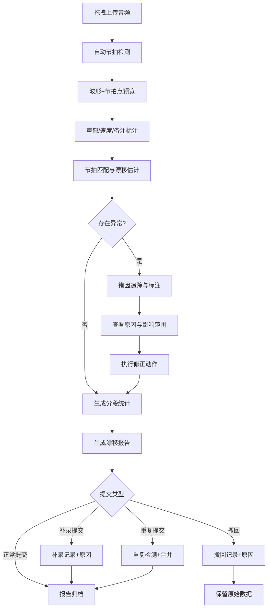

## 1. 产品概述

节拍漂移估计器面向音乐技术教师与教务业务人员，从学生合奏录音中自动估计节拍漂移趋势，精准定位"越拉越散"的片段。系统允许业务同事自助拖拽样例查看结果，无需依赖分析师手工跑数据；同时为弱拍误检、速度变化、声部遮蔽等异常提供原因、影响范围和下一步动作的完整追踪链路。

- 核心价值：将节拍分析从"分析师手工跑脚本"转变为"业务自助拖拽即得"，缩短反馈周期、保留完整审计痕迹
- 目标用户：音乐技术教师、教务运营、课程质量分析师

## 2. 核心功能

### 2.1 用户角色

| 角色 | 注册方式 | 核心权限 |
|------|----------|----------|
| 教师用户 | 邮箱注册 | 上传录音、查看分析结果、标注错因、导出报告 |
| 运营用户 | 邀请注册 | 查看分析结果、导出报告、补录/撤回提交 |
| 分析师用户 | 邀请注册 | 全部权限，含阈值调整、手工更正、审核提交 |

### 2.2 功能模块

1. **分析工作台**：音频拖拽上传、波形预览、节拍点标注、速度标记、时间轴
2. **漂移分析页**：节拍匹配、漂移估计、分段统计、异常标注
3. **错因追踪页**：弱拍误检/速度变化/声部遮蔽原因、影响范围、下一步动作
4. **报告中心页**：漂移报告生成、导出、补录/撤回/重复提交管理

### 2.3 页面详情

| 页面名称 | 模块名称 | 功能描述 |
|----------|----------|----------|
| 分析工作台 | 音频拖拽区 | 拖拽上传音频文件，支持 WAV/MP3/FLAC，显示上传进度与文件信息 |
| 分析工作台 | 波形预览 | 渲染音频波形，支持缩放、平移、播放定位，叠显节拍点标记 |
| 分析工作台 | 节拍点面板 | 显示自动检测的节拍点列表，支持手工添加/删除/微调，每点记录置信度 |
| 分析工作台 | 速度标记 | 标注速度变化点（如渐快/渐慢），记录 BPM 与时间位置 |
| 分析工作台 | 时间轴 | 可视化时间线，标注节拍点、速度变化、课堂备注、人工更正 |
| 分析工作台 | 声部选择 | 选择/切换声部，每个声部独立节拍追踪 |
| 分析工作台 | 课堂备注 | 在时间轴上添加文本/截图备注，关联特定时间区间 |
| 漂移分析页 | 节拍匹配 | 将检测节拍与参考节拍对齐，显示匹配矩阵与未匹配点 |
| 漂移分析页 | 漂移估计 | 计算局部漂移量与全局漂移趋势，展示漂移曲线与关键阈值线 |
| 漂移分析页 | 分段统计 | 按段落/小节/自定义区间统计漂移均值、方差、极值，保留中间计算值 |
| 漂移分析页 | 异常高亮 | 在波形与漂移曲线上高亮越界区段，标注"开始越拉越散"的起止点 |
| 漂移分析页 | 计算审计 | 展示阈值、评分、漂移量的计算公式与关键中间值 |
| 错因追踪页 | 弱拍误检 | 列出置信度低于阈值的节拍点，展示原因（能量低/节奏模糊等）与影响范围 |
| 错因追踪页 | 速度变化 | 标注速度突变点，展示前后 BPM 差异、漂移贡献度 |
| 错因追踪页 | 声部遮蔽 | 标注被其他声部掩盖的区域，展示遮蔽强度与替代检测策略 |
| 错因追踪页 | 下一步动作 | 为每个异常自动推荐修正动作（手工更正/忽略/重新检测） |
| 报告中心页 | 报告列表 | 展示已生成报告，显示状态（正常/补录/已撤回/重复提交） |
| 报告中心页 | 报告预览 | 预览报告内容，含漂移曲线、分段统计表、异常清单、课堂备注 |
| 报告中心页 | 导出操作 | 支持 PDF/CSV 导出，导出文件包含计算过程与中间值 |
| 报告中心页 | 补录提交 | 对已撤回或遗漏的分析提交补录，记录补录原因 |
| 报告中心页 | 撤回操作 | 撤回已提交报告，记录撤回原因，保留原始数据 |
| 报告中心页 | 重复检测 | 检测重复提交，展示重复项对比，允许保留或合并 |

## 3. 核心流程

用户从上传音频到获取漂移报告的完整流程：

1. 教师拖拽音频文件至分析工作台
2. 系统自动检测节拍点，渲染波形与节拍标记
3. 教师可选择声部、调整速度标记、添加课堂备注
4. 点击"开始分析"，系统执行节拍匹配与漂移估计
5. 漂移分析页展示漂移曲线与分段统计，高亮异常区段
6. 对异常区段，系统自动标注错因（弱拍误检/速度变化/声部遮蔽）
7. 教师查看错因追踪，执行手工更正或确认忽略
8. 分析完成后生成漂移报告，教师可预览、导出或提交
9. 运营/分析师可补录、撤回或处理重复提交

## 4. 用户界面设计

### 4.1 设计风格

- **主色调**：深炭灰 (#1A1A2E) + 亮青色 (#00F5D4) 作为科技感强调色，暖琥珀色 (#F5A623) 标注异常
- **辅助色**：钢蓝 (#16213E) 用于面板背景，浅灰 (#E8E8E8) 用于波形区
- **按钮风格**：圆角 (8px)、轻微阴影，主按钮填充亮青色，危险操作用暖琥珀色
- **字体**：标题使用 DM Serif Display，正文使用 IBM Plex Sans，数据/代码使用 JetBrains Mono
- **布局风格**：左侧导航 + 主内容区双栏布局，波形区全宽展示
- **图标风格**：线性 Lucide 图标，2px 描边

### 4.2 页面设计概览

| 页面名称 | 模块名称 | UI 元素 |
|----------|----------|----------|
| 分析工作台 | 音频拖拽区 | 虚线边框拖拽区域，拖入后显示文件名+进度条，动画过渡到波形 |
| 分析工作台 | 波形预览 | Canvas 波形渲染，节拍点用竖线+菱形标记，缩放滑块在底部 |
| 分析工作台 | 节拍点面板 | 右侧抽屉式面板，列表每行含时间戳+置信度条+操作按钮 |
| 分析工作台 | 时间轴 | 顶部时间刻度尺，可拖拽标记备注（气泡弹窗），颜色编码区分类型 |
| 分析工作台 | 声部选择 | 顶部标签切换，每个声部独立颜色标识 |
| 漂移分析页 | 漂移曲线 | SVG/Canvas 折线图，X 轴时间、Y 轴漂移量(ms)，阈值线虚线 |
| 漂移分析页 | 分段统计 | 表格+迷你柱状图，单元格悬浮展示中间值 Tooltip |
| 漂移分析页 | 异常高亮 | 曲线上方红色半透明遮罩，起止点标记带脉冲动画 |
| 漂移分析页 | 计算审计 | 可展开折叠面板，显示公式+代入值+结果 |
| 错因追踪页 | 原因卡片 | 三列卡片布局，每类错因一张卡片，含图标+数量+严重度 |
| 错因追踪页 | 影响范围 | 时间轴高亮区间+波形区联动标记 |
| 错因追踪页 | 下一步动作 | 每条异常右侧操作按钮组（更正/忽略/重检测），带确认弹窗 |
| 报告中心页 | 报告列表 | 表格，状态列用彩色标签（正常绿/补录蓝/撤回灰/重复橙） |
| 报告中心页 | 导出操作 | 下拉按钮，PDF/CSV 选项，导出进度条 |
| 报告中心页 | 补录/撤回 | 弹窗表单，必填原因字段，提交后状态变更动画 |

### 4.3 响应式策略

- 桌面优先设计，最小支持 1280px 宽度
- 波形区自适应宽度，面板可折叠
- 表格在小屏幕下转为卡片视图
- 触屏支持：波形区手势缩放、时间轴拖拽

### 4.4 3D 场景指导

不适用
