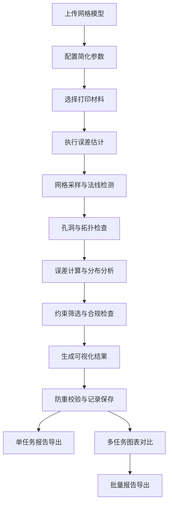

## 1. 产品概述

面向3D打印教学场景的网格简化误差估计工具，帮助学生对比不同简化方案在误差、面数、打印时间之间的权衡。工具支持网格模型导入、误差阈值设定、打印参数配置、材料库管理，自动生成可追溯的估计报告，形成可读、可查、可导出的完整工作闭环。

- 核心价值：将复杂的曲面网格误差估计转化为可视化、易操作的本地工具
- 目标用户：3D打印教师、学生、工艺工程师
- 解决问题：避免表格间重复复制，自动形成可查记录，提供详细的误差分析而非笼统错误

## 2. 核心功能

### 2.1 用户角色

| 角色 | 注册方式 | 核心权限 |
|------|----------|----------|
| 教师用户 | 本地登录（无网络） | 完整功能权限，可管理材料库，导出报告 |
| 学生用户 | 本地登录（无网络） | 可进行估计任务，查看历史记录 |

### 2.2 功能模块

1. **估计工作台**：模型上传、参数配置、实时预览、误差计算
2. **历史记录**：任务列表、高级筛选、详细查看、批量操作
3. **材料库**：材料CRUD、重复编号检测、参数模板
4. **报告中心**：单任务报告、多任务对比图表、批量导出
5. **系统设置**：单位配置、阈值预设、导出格式设置

### 2.3 页面详情

| 页面名称 | 模块名称 | 功能描述 |
|-----------|-------------|---------------------|
| 估计工作台 | 模型上传区 | 支持STL/OBJ上传，显示模型基础信息、面数、体积 |
| 估计工作台 | 参数配置区 | 简化算法选择、误差阈值、打印层厚、填充率、材料选择 |
| 估计工作台 | 误差分析区 | 误差热力图、最大误差点标注、误差分布直方图、法线检测 |
| 估计工作台 | 结果预览区 | 简化前后对比、时间/成本估算、约束合规性检查 |
| 历史记录 | 任务列表 | 分页展示、多条件筛选、排序、状态标签 |
| 历史记录 | 详情面板 | 完整参数回溯、误差分析详情、操作日志 |
| 材料库 | 材料列表 | 材料卡片展示、重复编号高亮、快速选择 |
| 材料库 | 材料表单 | 材料参数配置、编号唯一性校验 |
| 报告中心 | 对比图表 | 面数-误差散点图、时间-误差折线图、多方案雷达图 |
| 报告中心 | 导出面板 | PDF/Excel/JSON导出、批量打包、自定义报告模板 |

## 3. 核心流程

用户上传网格模型 → 配置简化参数与误差阈值 → 选择打印材料 → 执行误差估计 → 系统进行网格采样、法线检测、孔洞检测、误差计算 → 约束筛选（检查是否符合阈值）→ 生成可视化报告 → 自动保存到历史记录 → 可导出或进行多方案对比

## 4. 用户界面设计

### 4.1 设计风格

- 主色调：深蓝科技感 `#0F172A` 配科技青 `#06B6D4`，强调专业精准
- 辅助色：误差警示橙 `#F97316`、合规绿 `#10B981`、危险红 `#EF4444`
- 按钮风格：圆角 6px，微渐变背景，hover 时轻微上浮，点击有按压反馈
- 字体：标题用 `Space Mono` 等宽字体体现工程感，正文用 `Inter` 保证可读性
- 布局：三栏式工作台（左侧参数、中间3D预览、右侧分析结果），卡片式模块划分
- 图标风格：线性轮廓图标，统一 24px 网格，误差相关图标使用色彩区分等级

### 4.2 页面设计概述

| 页面名称 | 模块名称 | UI元素 |
|-----------|-------------|-------------|
| 估计工作台 | 3D预览区 | 轨道控制相机、线框/实体切换、误差热力图叠加、剖切视图 |
| 估计工作台 | 分析结果卡 | 误差分布直方图、关键指标仪表盘、约束检查清单 |
| 历史记录 | 任务卡片 | 缩略图、状态标签、关键指标概览、展开/收起详情 |
| 历史记录 | 筛选面板 | 日期范围、材料类型、误差范围、合规状态多选过滤 |
| 材料库 | 材料卡片 | 编号醒目标识、重复警告徽章、关键参数速览 |
| 报告中心 | 对比图表 | 交互式散点图、可拖拽参考线、悬停显示详情 |
| 报告中心 | 导出预览 | 报告缩略图、格式选择、页码配置、发送邮箱 |

### 4.3 响应性

- Desktop-first 设计，主工作台最优分辨率 1920×1080
- 平板端（≥768px）：三栏变两栏，分析结果移至下方
- 移动端（<768px）：标签页切换各模块，3D预览支持触摸手势
- 所有表单控件支持键盘操作，关键按钮可回车触发

### 4.4 3D场景指导

- 环境：中性灰渐变背景，柔和环境光，避免分散注意力
- 光照：主光 45° 斜上方，补光消除硬阴影，边缘光突出模型轮廓
- 相机：初始透视视角，模型居中占画面 70%，支持自动适配
- 交互：左键旋转、右键平移、滚轮缩放，双击重置视角
- 后处理：FXAA抗锯齿，误差热力图使用自定义着色器实现平滑过渡
- 性能预算：单模型面数≤50万时保持60fps，超出自动降级显示
