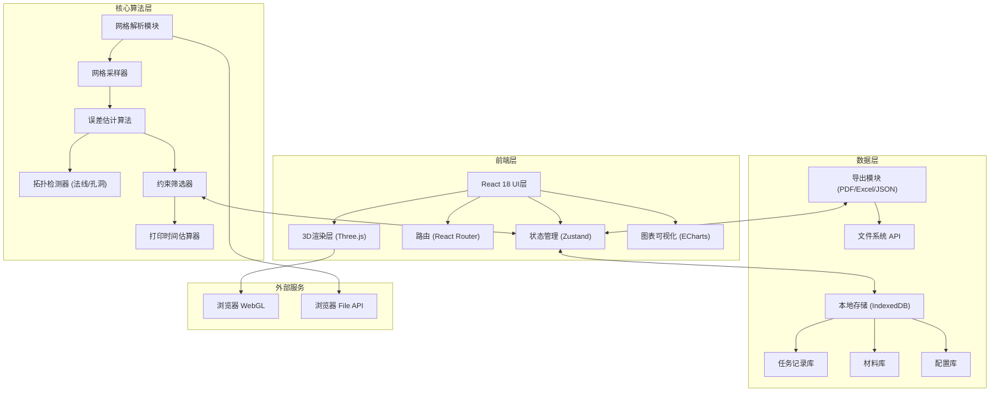
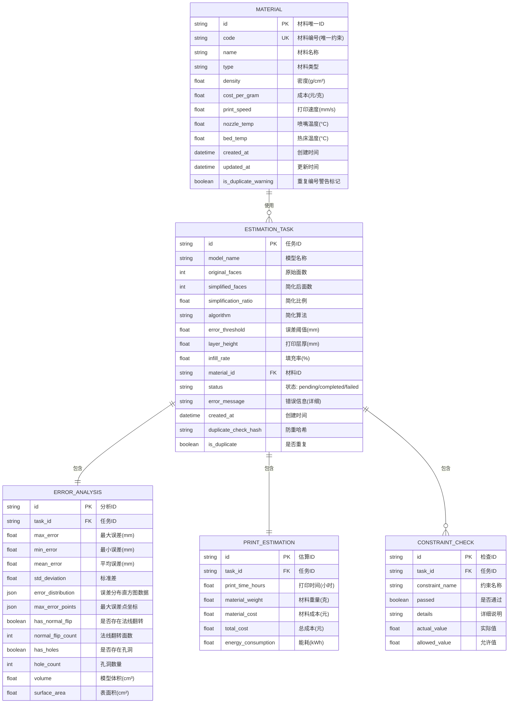

## 1. 架构设计



## 2. 技术描述

- **前端框架**：React@18.2.0 + TypeScript@5.4.0
- **构建工具**：Vite@5.2.0
- **样式方案**：TailwindCSS@3.4.0 + CSS Variables
- **状态管理**：Zustand@4.5.0（轻量高性能，适合本地工具）
- **路由管理**：React Router@6.22.0
- **3D渲染**：Three.js@0.162.0 + @react-three/fiber@8.15.0 + @react-three/drei@9.99.0
- **图表可视化**：ECharts@5.5.0
- **本地数据库**：IndexedDB (Dexie.js@4.0.0)
- **PDF导出**：jspdf@2.5.0 + html2canvas@1.4.0
- **Excel导出**：xlsx@0.18.5
- **3D文件解析**：three.js 内置 STLLoader / OBJLoader

## 3. 路由定义

| 路由 | 页面名称 | 用途 |
|-------|---------|------|
| / | 估计工作台 | 主工作区，模型上传、参数配置、误差计算、结果预览 |
| /history | 历史记录 | 任务列表展示、筛选排序、详情查看 |
| /materials | 材料库 | 材料CRUD、重复编号管理、参数模板 |
| /reports | 报告中心 | 多任务对比图表、批量导出 |
| /settings | 系统设置 | 单位配置、阈值预设、导出格式 |

## 4. 数据模型

### 4.1 数据模型定义



### 4.2 核心类型定义

```typescript
// 网格数据结构
interface MeshData {
  vertices: Float32Array;
  faces: Uint32Array;
  normals: Float32Array;
  faceCount: number;
  vertexCount: number;
  boundingBox: { min: [number, number, number]; max: [number, number, number] };
}

// 误差采样点
interface ErrorSample {
  position: [number, number, number];
  distance: number;
  faceIndex: number;
  normal: [number, number, number];
}

// 简化算法枚举
enum SimplificationAlgorithm {
  QUADRIC_EDGE_COLLAPSE = 'quadric_edge_collapse',
  CLUSTERING = 'clustering',
  VERTEX_CLUSTERING = 'vertex_clustering',
  MESHDECIMATOR = 'meshdecimator'
}

// 算法参数
interface EstimationParams {
  algorithm: SimplificationAlgorithm;
  targetFaceCount: number;
  errorThreshold: number;
  preserveBorders: boolean;
  preserveNormals: boolean;
}

// 打印参数
interface PrintParams {
  layerHeight: number;
  infillRate: number;
  printSpeed: number;
  wallThickness: number;
  nozzleDiameter: number;
}

// 检测结果
interface MeshQualityResult {
  hasNormalFlip: boolean;
  normalFlipFaces: number[];
  hasHoles: boolean;
  holeBoundaries: number[][];
  nonManifoldEdges: number[];
  degenerateFaces: number[];
}
```

## 5. 核心算法模块接口

```typescript
// 网格采样器
class MeshSampler {
  constructor(mesh: MeshData);
  samplePoints(count: number): ErrorSample[];
  sampleByFaceDensity(): ErrorSample[];
  sampleByCurvature(adaptive: boolean): ErrorSample[];
}

// 误差估计器
class ErrorEstimator {
  constructor(originalMesh: MeshData, simplifiedMesh: MeshData);
  computeHausdorffDistance(): { max: number; mean: number; min: number };
  computePointToMeshDistance(points: [number, number, number][]): number[];
  computeErrorDistribution(bins: number): { range: [number, number]; count: number }[];
}

// 拓扑检测器
class TopologyChecker {
  constructor(mesh: MeshData);
  checkNormals(): { flipped: number[]; consistent: boolean };
  checkHoles(): { count: number; boundaries: number[][] };
  checkManifold(): { nonManifoldEdges: number[]; isManifold: boolean };
}

// 约束筛选器
class ConstraintFilter {
  constructor(constraints: Constraint[]);
  validate(analysis: ErrorAnalysis, printEst: PrintEstimation): ConstraintCheck[];
  filterTasks(tasks: EstimationTask[], filters: FilterCriteria): EstimationTask[];
}

// 防重校验器
class DuplicateChecker {
  generateHash(task: EstimationTask, params: EstimationParams, printParams: PrintParams): string;
  checkDuplicate(hash: string): EstimationTask | null;
  markDuplicate(taskId: string, originalTaskId: string): void;
}
```

## 6. 状态管理设计

```typescript
// 全局状态切片
interface AppState {
  // 当前工作台状态
  currentTask: EstimationTask | null;
  currentMesh: MeshData | null;
  currentParams: EstimationParams;
  currentPrintParams: PrintParams;
  selectedMaterial: Material | null;
  
  // 分析结果
  errorAnalysis: ErrorAnalysis | null;
  printEstimation: PrintEstimation | null;
  constraintChecks: ConstraintCheck[];
  
  // UI状态
  isCalculating: boolean;
  viewMode: 'wireframe' | 'solid' | 'heatmap';
  showErrorOverlay: boolean;
  
  // 操作
  setMesh(mesh: MeshData | null): void;
  setParams(params: Partial<EstimationParams>): void;
  setPrintParams(params: Partial<PrintParams>): void;
  setMaterial(material: Material | null): void;
  runEstimation(): Promise<void>;
  clearCurrent(): void;
}
```
