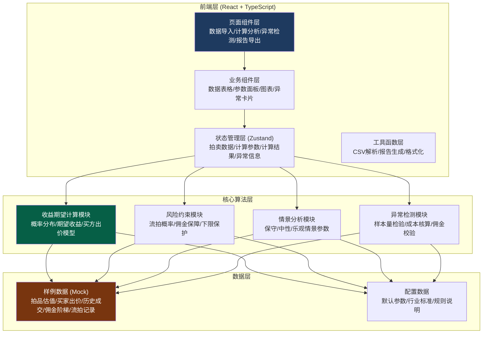

## 1. 架构设计



## 2. 技术描述

- **前端框架**：React@18 + TypeScript@5 + Vite@5
- **状态管理**：Zustand@4
- **路由**：react-router-dom@6
- **样式**：TailwindCSS@3
- **图表**：recharts@2
- **图标**：lucide-react@0.344
- **表格**：@tanstack/react-table@8
- **文件处理**：papaparse@5（CSV解析）
- **报告导出**：jspdf@2 + xlsx@0.18
- **后端**：无（纯前端计算工具，所有计算在浏览器端完成）
- **数据库**：无（本地Mock数据，支持CSV导入）

## 3. 路由定义

| 路由 | 页面 | 功能 |
|------|------|------|
| / | 数据导入页 | 样例数据加载、CSV上传、数据预览校验 |
| /calculate | 计算分析页 | 参数配置、收益期望、风险约束、情景对比 |
| /anomalies | 异常检测页 | 样本量/流拍成本/佣金阶梯检测与解释 |
| /report | 报告导出页 | 报告预览、多格式导出、规则附录 |

## 4. 核心数据类型定义

```typescript
// 拍品信息
interface AuctionItem {
  id: string;
  name: string;
  category: string;
  appraisedValue: number;      // 估值
  appraiser?: string;           // 估值师
  appraisalDate?: string;       // 估值日期
  condition: string;            // 品相
  provenance?: string;          // 来源
  notes?: string;               // 备注
}

// 买家出价记录
interface BidRecord {
  id: string;
  itemId: string;
  buyerId: string;
  buyerName: string;
  bidAmount: number;
  bidDate: string;
  bidType: 'floor' | 'phone' | 'online' | 'absentee';  // 出价方式
  isWinning: boolean;
  buyerActivity: number;        // 买家活跃度评分 1-10
  buyerHistory: number;         // 历史成交次数
}

// 历史成交记录
interface TransactionRecord {
  id: string;
  itemId: string;
  itemName: string;
  salePrice: number;
  reservePrice: number;
  saleDate: string;
  buyerId: string;
  commissionRate: number;       // 实际佣金比例
  commissionAmount: number;     // 佣金金额
  auctionHouse: string;
  notes?: string;
}

// 佣金阶梯
interface CommissionTier {
  tier: number;
  minAmount: number;
  maxAmount: number | null;
  rate: number;                 // 佣金比例 %
  description: string;
}

// 流拍记录
interface UnsoldRecord {
  id: string;
  itemId: string;
  itemName: string;
  appraisedValue: number;
  reservePrice: number;
  highestBid: number;
  unsoldDate: string;
  reason: string;
  reAuctionCount: number;       // 重拍次数
  storageCost?: number;         // 仓储成本
  marketingCost?: number;       // 营销成本
  opportunityCost?: number;     // 机会成本
}

// 计算参数
interface CalculationParams {
  riskTolerance: number;        // 风险容忍度 0-1
  commissionTiers: CommissionTier[];
  unsoldCostCoefficient: number; // 流拍成本系数
  buyerWeight: number;          // 活跃度权重
  minReserveRatio: number;      // 保留价下限/估值
  maxReserveRatio: number;      // 保留价上限/估值
  maxUnsoldProbability: number; // 最大可接受流拍概率
  minCommissionGuarantee: number; // 最低佣金保障
}

// 计算结果点
interface CalculationPoint {
  reservePrice: number;
  reserveRatio: number;         // 保留价/估值
  expectedRevenue: number;      // 期望收益
  expectedCommission: number;   // 期望佣金
  unsoldProbability: number;    // 流拍概率
  confidence: number;           // 置信度
  scenario: 'conservative' | 'neutral' | 'optimistic';
}

// 异常项
interface AnomalyItem {
  id: string;
  type: 'sample_size' | 'unsold_cost' | 'commission_tier' | 'data_quality';
  severity: 'low' | 'medium' | 'high' | 'critical';
  title: string;
  description: string;
  basis: string;                // 判断依据
  impact: string;               // 影响评估
  suggestion: string;           // 修正建议
  relatedData?: string[];       // 关联数据ID
}

// 优化报告
interface OptimizationReport {
  generatedAt: string;
  itemSummary: AuctionItem;
  optimalReservePrice: number;
  reservePriceRange: [number, number];
  scenarios: {
    conservative: CalculationPoint;
    neutral: CalculationPoint;
    optimistic: CalculationPoint;
  };
  anomalies: AnomalyItem[];
  parameterSnapshot: CalculationParams;
  ruleNotes: string;            // 规则说明
}
```

## 5. 核心算法模块

### 5.1 收益期望计算模块

```typescript
// 核心公式：
// 期望收益 = Σ(成交价格 × 成交概率) - Σ(流拍成本 × 流拍概率)
// 成交概率 = f(保留价, 买家活跃度, 历史数据分布)
// 佣金计算 = 按佣金阶梯分段计算

function calculateExpectedRevenue(
  reservePrice: number,
  bids: BidRecord[],
  transactions: TransactionRecord[],
  params: CalculationParams
): CalculationPoint
```

### 5.2 风险约束模块

```typescript
// 约束条件检查：
// 1. 流拍概率 ≤ maxUnsoldProbability
// 2. 期望佣金 ≥ minCommissionGuarantee
// 3. 保留价/估值 ∈ [minReserveRatio, maxReserveRatio]

function applyRiskConstraints(
  points: CalculationPoint[],
  params: CalculationParams
): CalculationPoint[]
```

### 5.3 情景分析模块

```typescript
// 三种情景参数调节：
// 保守：买家活跃度下调20%，流拍概率上调20%
// 中性：使用原始参数
// 乐观：买家活跃度上调20%，流拍概率下调20%

function calculateScenarios(
  item: AuctionItem,
  bids: BidRecord[],
  transactions: TransactionRecord[],
  params: CalculationParams
): {
  conservative: CalculationPoint[];
  neutral: CalculationPoint[];
  optimistic: CalculationPoint[];
}
```

### 5.4 异常检测模块

```typescript
// 检测维度：
// 1. 样本量：n<30 标记，n<10 严重警告
// 2. 流拍成本：检查是否遗漏仓储、营销、机会成本
// 3. 佣金阶梯：检查断点、倒转、偏离行业标准

function detectAnomalies(
  bids: BidRecord[],
  transactions: TransactionRecord[],
  unsolds: UnsoldRecord[],
  commissionTiers: CommissionTier[]
): AnomalyItem[]
```

## 6. 目录结构

```
src/
├── components/           # 通用组件
│   ├── DataTable.tsx     # 数据表格
│   ├── ParameterSlider.tsx # 参数滑块
│   ├── RevenueChart.tsx  # 收益曲线图
│   ├── AnomalyCard.tsx   # 异常卡片
│   ├── MetricCard.tsx    # 指标卡片
│   └── FileUpload.tsx    # 文件上传
├── pages/                # 页面组件
│   ├── DataImport.tsx    # 数据导入页
│   ├── Calculate.tsx     # 计算分析页
│   ├── Anomalies.tsx     # 异常检测页
│   └── Report.tsx        # 报告导出页
├── store/                # 状态管理
│   └── useAuctionStore.ts
├── utils/                # 工具函数
│   ├── calculator.ts     # 核心算法
│   ├── anomalyDetector.ts # 异常检测
│   ├── csvParser.ts      # CSV解析
│   ├── reportGenerator.ts # 报告生成
│   └── formatters.ts     # 格式化工具
├── data/                 # Mock数据
│   ├── sampleItems.ts    # 样例拍品
│   ├── sampleBids.ts     # 样例出价
│   ├── sampleTransactions.ts # 样例成交
│   ├── sampleUnsolds.ts  # 样例流拍
│   └── defaultParams.ts  # 默认参数
├── types/                # 类型定义
│   └── auction.ts
├── App.tsx
├── main.tsx
└── index.css
```

## 7. 规则说明配置

所有核心规则和口径定义在 `src/data/rules.json`，便于后续调整：

```json
{
  "sampleSizeThresholds": {
    "critical": 10,
    "warning": 30,
    "good": 50
  },
  "commissionIndustryStandard": [
    { "tier": 1, "min": 0, "max": 50000, "rate": 25 },
    { "tier": 2, "min": 50000, "max": 200000, "rate": 20 },
    { "tier": 3, "min": 200000, "max": 1000000, "rate": 15 },
    { "tier": 4, "min": 1000000, "max": null, "rate": 12 }
  ],
  "unsoldCostComponents": [
    { "key": "storage", "name": "仓储成本", "default": 0.015, "description": "按估值月1.5%" },
    { "key": "marketing", "name": "营销成本", "default": 0.03, "description": "按估值3%" },
    { "key": "opportunity", "name": "机会成本", "default": 0.05, "description": "按估值5%" }
  ],
  "scenarioAdjustments": {
    "conservative": { "activity": 0.8, "probability": 1.2 },
    "neutral": { "activity": 1.0, "probability": 1.0 },
    "optimistic": { "activity": 1.2, "probability": 0.8 }
  }
}
```
