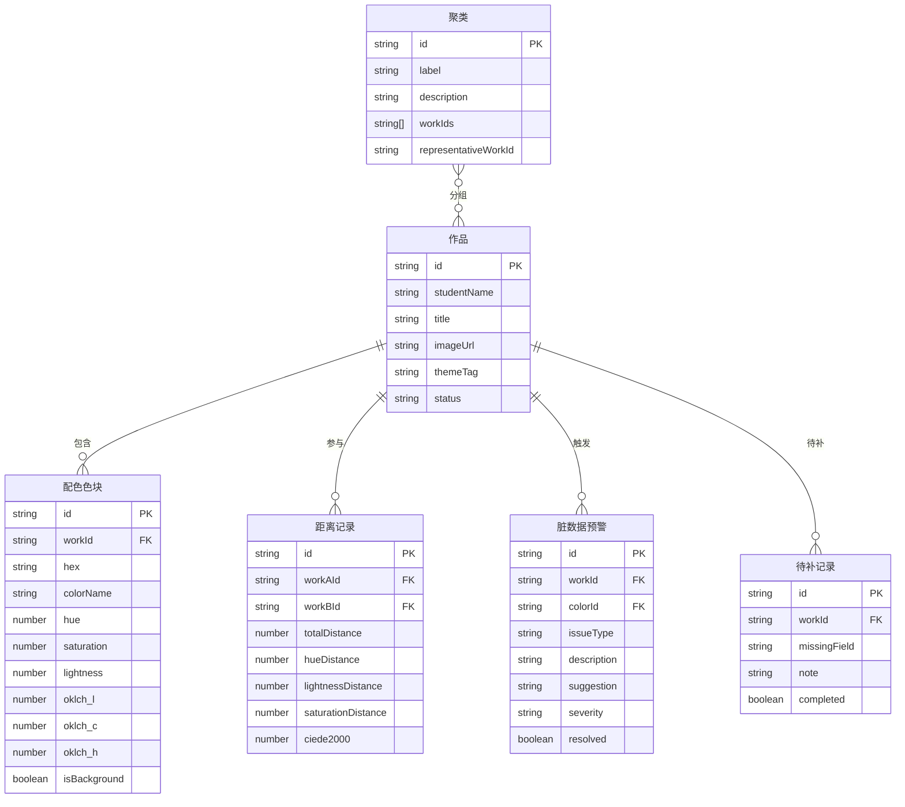

## 1. 架构设计
纯前端应用，所有色彩空间转换、距离计算、聚类分析均在浏览器端完成，无需后端服务。数据以JSON mock形式内嵌。

```mermaid
graph TD
    "Mock数据层 (JSON)" --> "色彩空间引擎"
    "色彩空间引擎" --> "距离计算引擎"
    "距离计算引擎" --> "聚类引擎"
    "距离计算引擎" --> "脏数据检测引擎"
    "聚类引擎" --> "聚类解释生成器"
    "脏数据检测引擎" --> "状态管理 (Zustand)"
    "聚类解释生成器" --> "状态管理 (Zustand)"
    "状态管理 (Zustand)" --> "配色总览页"
    "状态管理 (Zustand)" --> "作品明细页"
    "状态管理 (Zustand)" --> "分析报告页"
    "配色总览页" --> "导出模块"
    "分析报告页" --> "导出模块"
```

## 2. 技术说明
- 前端：React@18 + TypeScript + Tailwind CSS@3 + Vite
- 初始化工具：vite-init (react-ts 模板)
- 后端：无（纯前端）
- 数据库：无（Mock JSON 数据）
- 状态管理：Zustand
- 路由：react-router-dom
- 图表：Canvas 2D 手绘热力图 + SVG 色轮
- 导出：html2canvas (PNG) + 原生CSV生成

## 3. 路由定义
| 路由 | 用途 |
|------|------|
| / | 配色总览页：热力图矩阵+聚类可视化+预警面板 |
| /work/:id | 作品明细页：HSL分解+距离对比+图片联动 |
| /report | 分析报告页：聚类解释+统计+待办+导出 |

## 4. API定义
无后端API，全部前端计算。

## 5. 服务器架构图
不适用（纯前端）

## 6. 数据模型

### 6.1 数据模型定义



### 6.2 数据定义语言
使用 TypeScript 接口定义，数据以 JSON 形式内嵌于 `src/data/` 目录：

```typescript
interface Work {
  id: string;
  studentName: string;
  title: string;
  imageUrl: string;
  themeTag: string;
  status: 'complete' | 'incomplete';
}

interface ColorSwatch {
  id: string;
  workId: string;
  hex: string;
  colorName: string;
  hue: number;
  saturation: number;
  lightness: number;
  oklch_l: number;
  oklch_c: number;
  oklch_h: number;
  isBackground: boolean;
}

interface DistanceRecord {
  id: string;
  workAId: string;
  workBId: string;
  totalDistance: number;
  hueDistance: number;
  lightnessDistance: number;
  saturationDistance: number;
  ciede2000: number;
}

interface DirtyDataAlert {
  id: string;
  workId: string;
  colorId: string;
  issueType: 'same_color_different_name' | 'background_contamination' | 'distance_scale_error';
  description: string;
  suggestion: string;
  severity: 'critical' | 'warning' | 'info';
  resolved: boolean;
}

interface Cluster {
  id: string;
  label: string;
  description: string;
  workIds: string[];
  representativeWorkId: string;
}

interface PendingRecord {
  id: string;
  workId: string;
  missingField: string;
  note: string;
  completed: boolean;
}
```

## 7. 核心算法说明

### 7.1 色彩空间转换
- HEX → RGB → HSL：标准数学转换
- RGB → OKLCH：使用 OKLCH 色彩空间以获得感知均匀性

### 7.2 距离计算
- **CIEDE2000**：主距离度量，基于Lab色彩空间的感知距离，对色相/明度/饱和度差异加权
- **分量距离**：同时计算色相差(ΔH)、明度差(ΔL)、饱和度差(ΔC)供分维度分析
- 两件作品间距离 = 各自色块间最小配对距离的均值

### 7.3 脏数据检测规则
- **同色不同名**：两色块 HEX 相同但 colorName 不同
- **背景色混入**：色块 isBackground=true 或与 #FFFFFF/#F5F5F5 等背景色 CIEDE2000 < 3
- **距离尺度错**：欧氏距离(RGB)与 CIEDE2000 比值 > 2.5 或 < 0.4

### 7.4 聚类算法
- 层次聚类（Agglomerative），基于 CIEDE2000 距离矩阵
- 距离阈值可调，默认 ΔE=15
- 聚类标签自动生成：按组内平均 HSL 特征生成（如"高饱和暖色组"）

### 7.5 待补记录
- 作品 status='incomplete' 时自动生成
- 记录缺失字段（如 imageUrl 为空、themeTag 为空）
- 在报告页与最终结论关联，completed 状态联动
