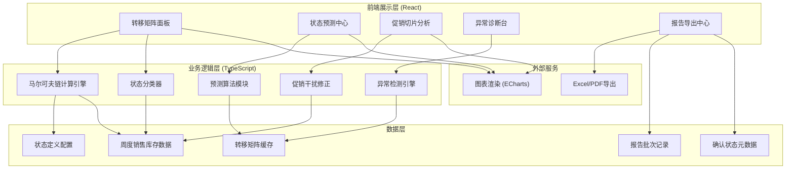
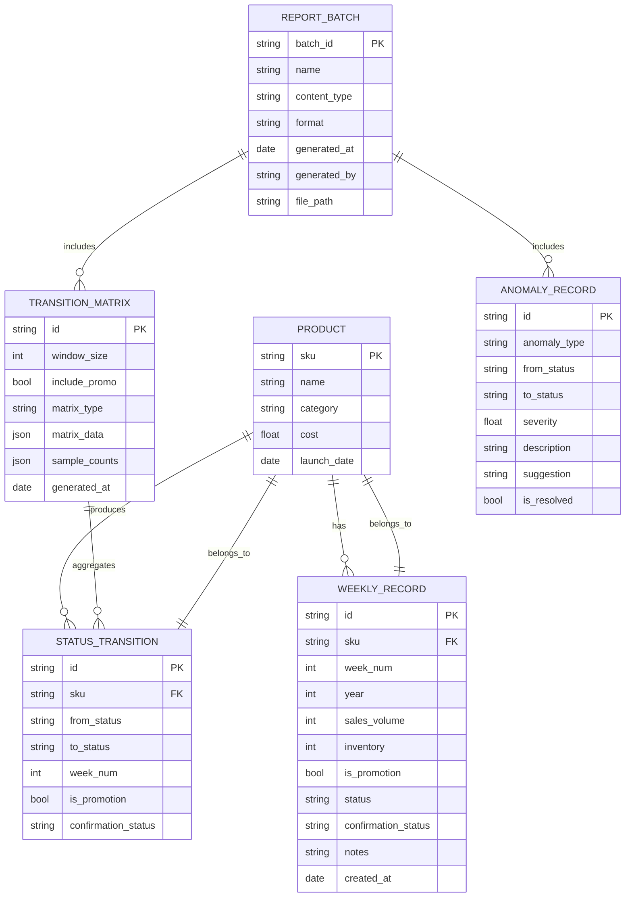

## 1. 架构设计



## 2. 技术描述
- **前端**：React@18 + TypeScript + Vite + TailwindCSS@3
- **图表库**：ECharts@5 (热力图、折线图、饼图)
- **导出库**：xlsx (Excel导出) + jspdf (PDF导出)
- **状态管理**：Zustand (轻量状态管理)
- **路由**：React Router@6
- **数据**：Mock 数据（内置50个SKU×24周的模拟销售库存数据）
- **初始化工具**：npm create vite@latest

## 3. 路由定义
| 路由 | 页面名称 | 核心功能 |
|------|----------|----------|
| / | 转移矩阵面板 | 转移矩阵热力图、原始记录钻取、确认状态管理 |
| /forecast | 状态预测中心 | 多步预测、状态演变曲线、吸收态分析 |
| /promo | 促销切片分析 | 促销/非促销矩阵对比、干扰因子 |
| /anomaly | 异常诊断台 | 异常列表、诊断详情、修正建议 |
| /reports | 报告导出中心 | 批次列表、多格式导出、历史追溯 |

## 4. 数据模型

### 4.1 数据模型定义



### 4.2 TypeScript 类型定义

```typescript
// 商品状态枚举
export type ProductStatus = 'NEW' | 'HOT' | 'NORMAL' | 'SLOW' | 'CLEAR';

// 确认状态枚举
export type ConfirmationStatus = 'CONFIRMED' | 'TEMPORARY';

// 异常类型枚举
export type AnomalyType = 'MISSING_SAMPLE' | 'PROMO_DISTORT' | 'ABSORBING_MISSET';

// 周度记录
export interface WeeklyRecord {
  id: string;
  sku: string;
  productName: string;
  category: string;
  weekNum: number;
  year: number;
  salesVolume: number;
  inventory: number;
  turnoverDays: number;
  isPromotion: boolean;
  status: ProductStatus;
  confirmationStatus: ConfirmationStatus;
  notes?: string;
}

// 状态转移
export interface StatusTransition {
  id: string;
  sku: string;
  fromStatus: ProductStatus;
  toStatus: ProductStatus;
  weekNum: number;
  isPromotion: boolean;
  confirmationStatus: ConfirmationStatus;
}

// 转移矩阵
export interface TransitionMatrix {
  id: string;
  states: ProductStatus[];
  probabilities: number[][];
  sampleCounts: number[][];
  windowSize: number;
  includePromo: boolean;
  matrixType: 'FULL' | 'PROMO' | 'NON_PROMO';
  generatedAt: Date;
}

// 预测结果
export interface ForecastResult {
  week: number;
  probabilities: Record<ProductStatus, number>;
  confidenceInterval: {
    lower: Record<ProductStatus, number>;
    upper: Record<ProductStatus, number>;
  };
}

// 异常记录
export interface AnomalyRecord {
  id: string;
  type: AnomalyType;
  fromStatus?: ProductStatus;
  toStatus?: ProductStatus;
  severity: 'LOW' | 'MEDIUM' | 'HIGH';
  description: string;
  suggestion: string;
  affectedTransitions?: string[];
  sampleCount?: number;
  distortionFactor?: number;
  isResolved: boolean;
}

// 报告批次
export interface ReportBatch {
  batchId: string;
  name: string;
  contentType: 'FULL_REPORT' | 'MATRIX_ONLY' | 'FORECAST_ONLY' | 'ANOMALY_ONLY';
  format: 'EXCEL' | 'PDF' | 'JSON';
  generatedAt: Date;
  generatedBy: string;
  downloadUrl: string;
}

// 应用状态
export interface AppState {
  weeklyRecords: WeeklyRecord[];
  transitionMatrix: TransitionMatrix | null;
  promoMatrix: TransitionMatrix | null;
  nonPromoMatrix: TransitionMatrix | null;
  forecastResults: ForecastResult[];
  anomalies: AnomalyRecord[];
  reportBatches: ReportBatch[];
  selectedCell: { from: ProductStatus; to: ProductStatus } | null;
  drillDownRecords: WeeklyRecord[];
  confirmationFilter: ConfirmationStatus | 'ALL';
  forecastWeeks: number;
}
```

## 5. 核心算法模块

### 5.1 马尔可夫链计算引擎
```typescript
// 转移概率计算
// P(i→j) = Count(i→j) / Count(i)
// 拉普拉斯平滑处理零样本问题

// 多步预测
// π(n) = π(0) × P^n
// 其中π为状态概率行向量，P为转移矩阵

// 吸收态分析
// 分解转移矩阵为 [Q R; 0 I]
// 基本矩阵 N = (I - Q)^(-1)
// 吸收概率 B = N × R
// 期望吸收时间 t = N × 1
```

### 5.2 异常检测算法
1. **缺样检测**：遍历矩阵单元格，样本量 < 阈值（默认5）标记异常
2. **促销干扰**：计算促销与非促销矩阵的Frobenius范数差异，>30%标记
3. **吸收态检验**：对SLOW/CLEAR状态的转出概率进行binomial检验，H0: p=0

### 5.3 批次号生成规则
```
{YYYY}-W{WW}-BATCH-{NNN}
例：2026-W22-BATCH-003
```
其中WW为ISO周数，NNN为当周序号。
