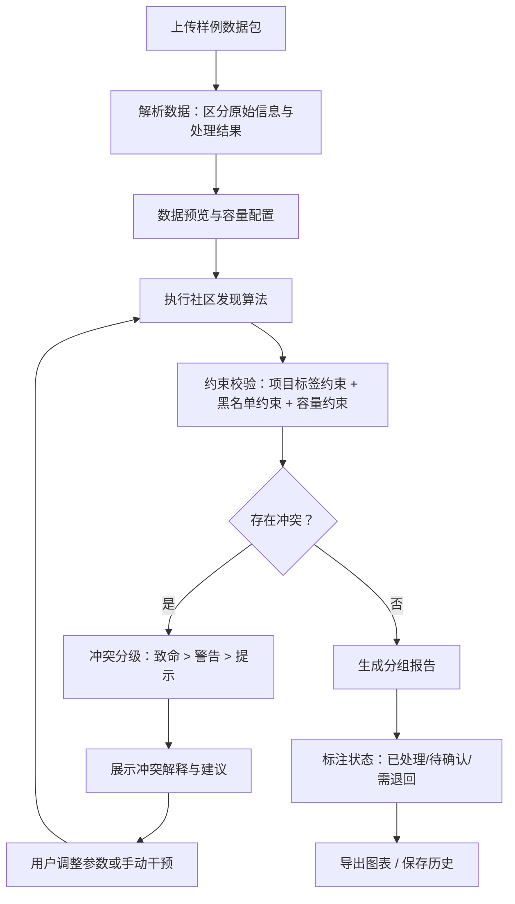

## 1. 产品概述

图论社群拆分器是一款面向社区运营人员的自助式图论分组工具，解决"用户关系网拆分小组但不拆散同项目协作者"的业务需求。运营人员无需依赖数据分析师，即可通过拖拽样例数据包，直观地完成社区发现、约束校验和冲突分析，并获得区分已处理/待确认/需退回的三级分组报告。

- 目标用户：社区运营、业务运营人员（非技术背景）
- 核心价值：降低社群拆分的分析师依赖，提升分组决策透明度与可追溯性

## 2. 核心功能

### 2.1 用户角色

| 角色 | 使用方式 | 核心权限 |
|------|----------|----------|
| 运营人员 | 打开网页直接使用 | 上传数据、调整参数、查看结果、导出报告 |
| 审核人员（可选） | 同一工具切换视角 | 确认/退回待审分组、批注冲突原因 |

### 2.2 功能模块

1. **数据输入页**：拖拽上传样例包（节点、边、项目标签、黑名单、容量配置），自动识别原始信息与处理结果
2. **分组工作台页**：力导向图可视化、社区发现算法执行、约束校验、冲突高亮与严重度标注
3. **分组报告页**：三级状态（已处理/待确认/需退回）的分组结果、冲突解释、图表导出

### 2.3 页面详情

| 页面名称 | 模块名称 | 功能描述 |
|----------|----------|----------|
| 数据输入页 | 样例包上传区 | 拖拽上传JSON/CSV样例包，自动解析节点、边、项目标签、黑名单、容量配置 |
| 数据输入页 | 数据预览区 | 以表格和摘要卡片展示已解析的原始数据，标注数据来源类型（原始/结果） |
| 数据输入页 | 容量配置面板 | 设置每组最小/最大容量，显示当前配置与约束冲突预警 |
| 分组工作台页 | 力导向图画布 | 交互式力导向图，节点按分组着色，可拖拽、缩放、选中 |
| 分组工作台页 | 社区发现控制台 | 选择算法（Louvain/Label Propagation），调参，一键执行 |
| 分组工作台页 | 约束校验面板 | 实时展示孤立节点、强关系拆散、组容量越界，按严重度（致命/警告/提示）分级 |
| 分组工作台页 | 冲突解释浮窗 | 点击冲突项查看详细原因、涉及节点、建议操作 |
| 分组报告页 | 分组结果列表 | 按组展示成员，标注每条记录的状态（已处理/待确认/需退回） |
| 分组报告页 | 冲突摘要卡片 | 汇总所有冲突，分严重度展示，支持筛选 |
| 分组报告页 | 导出与历史 | 导出PNG/SVG/JSON，保存到本地历史记录列表 |

## 3. 核心流程

用户打开工具 → 上传样例数据包 → 系统自动解析并区分原始信息与处理结果 → 用户在分组工作台选择算法并执行 → 系统进行社区发现+约束校验 → 展示冲突（孤立节点/强关系拆散/容量越界）并分级 → 用户确认或调整 → 生成三级状态分组报告 → 导出图表/保存历史

## 4. 用户界面设计

### 4.1 设计风格

- 主色调：深蓝灰（#1a1f36）为底，电光蓝（#3b82f6）为强调，琥珀色（#f59e0b）为警告，玫红（#ef4444）为致命冲突
- 按钮：圆角药丸式（rounded-full），填充式主操作，描边式次要操作
- 字体：标题用 Noto Sans SC Bold，正文用 Noto Sans SC Regular，数据用 JetBrains Mono
- 布局：左侧导航 + 右侧内容区，三栏布局（输入/画布/报告）
- 图标：线性图标风格（lucide-react），简洁不抢视觉

### 4.2 页面设计概览

| 页面名称 | 模块名称 | UI元素 |
|----------|----------|--------|
| 数据输入页 | 样例包上传区 | 虚线拖拽区域，上传成功后显示文件卡片，标注类型标签（原始/结果） |
| 数据输入页 | 数据预览区 | 折叠面板，表格+摘要卡片混排，原始数据用实线边框，处理结果用虚线边框+标签 |
| 数据输入页 | 容量配置面板 | 滑块+数字输入，实时显示约束状态指示灯（绿/黄/红） |
| 分组工作台页 | 力导向图画布 | 全幅SVG画布，节点按分组着色，冲突节点脉冲动画，可拖拽缩放 |
| 分组工作台页 | 社区发现控制台 | 右侧抽屉面板，算法选择下拉框，参数滑块，执行按钮带加载动画 |
| 分组工作台页 | 约束校验面板 | 底部面板，冲突条目按严重度色块排列，展开查看详情 |
| 分组工作台页 | 冲突解释浮窗 | 浮动卡片，显示冲突类型、涉及节点、严重度徽章、建议操作按钮 |
| 分组报告页 | 分组结果列表 | 左右分栏：左列分组卡片（成员头像墙），右列冲突摘要 |
| 分组报告页 | 冲突摘要卡片 | 色块分级的冲突条目，支持按严重度/类型筛选 |
| 分组报告页 | 导出与历史 | 工具栏按钮组，历史列表带时间戳和快照缩略图 |

### 4.3 响应式策略

- 桌面优先设计（1280px+），三栏布局
- 平板（768-1279px）：侧边栏折叠为图标，画布自适应
- 移动端（<768px）：单列堆叠，画布支持双指缩放

### 4.4 数据区分策略

- **原始信息**（用户输入）：实线边框 + "原始"蓝色标签
- **处理结果**（算法输出）：虚线边框 + "结果"绿色标签
- 上传的样例包中若包含历史分组结果，自动识别并标注为"结果"类型
