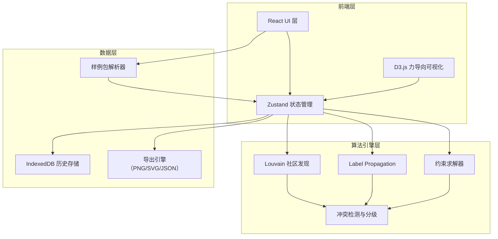
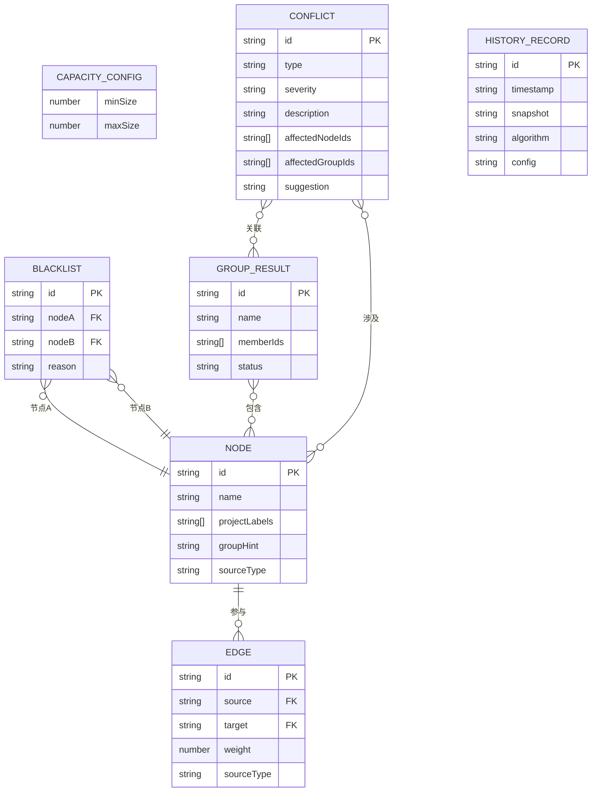

## 1. 架构设计



## 2. 技术说明

- 前端：React@18 + TypeScript + Tailwind CSS@3 + Vite
- 初始化工具：vite-init（react-ts 模板）
- 状态管理：Zustand
- 可视化：D3.js@7（力导向图）
- 后端：无（纯前端，数据存 IndexedDB）
- 数据库：IndexedDB（通过 idb 库操作历史记录）

## 3. 路由定义

| 路由 | 用途 |
|------|------|
| / | 数据输入页：上传样例包、预览数据、容量配置 |
| /workspace | 分组工作台：力导向图可视化、社区发现、约束校验 |
| /report | 分组报告页：分组结果、冲突摘要、导出与历史 |

## 4. 数据模型

### 4.1 数据模型定义



### 4.2 核心类型定义

```typescript
type SourceType = "raw" | "result"

type ConflictType = "isolated_node" | "strong_relation_split" | "capacity_overflow"

type ConflictSeverity = "fatal" | "warning" | "info"

type RecordStatus = "processed" | "pending" | "returned"

interface SamplePackage {
  nodes: Node[]
  edges: Edge[]
  projectLabels: Record<string, string[]>
  blacklist: BlacklistEntry[]
  capacityConfig: CapacityConfig
  previousGroups?: GroupResult[]
}

interface Node {
  id: string
  name: string
  projectLabels: string[]
  groupHint?: string
  sourceType: SourceType
}

interface Edge {
  id: string
  source: string
  target: string
  weight: number
  sourceType: SourceType
}

interface BlacklistEntry {
  nodeA: string
  nodeB: string
  reason: string
}

interface CapacityConfig {
  minSize: number
  maxSize: number
}

interface GroupResult {
  id: string
  name: string
  memberIds: string[]
  status: RecordStatus
}

interface Conflict {
  id: string
  type: ConflictType
  severity: ConflictSeverity
  description: string
  affectedNodeIds: string[]
  affectedGroupIds: string[]
  suggestion: string
}

interface HistoryRecord {
  id: string
  timestamp: string
  snapshot: string
  algorithm: string
  config: CapacityConfig
}
```

## 5. 算法引擎设计

### 5.1 社区发现

- **Louvain 算法**：基于模块度优化的层次聚类，适合大规模网络
- **Label Propagation**：基于标签传播的快速聚类，适合实时预览
- 执行时先将同项目标签的节点标记为"不可拆散"约束，再运行算法

### 5.2 约束求解

1. **项目标签约束**：同项目标签的节点必须在同一组
2. **黑名单约束**：黑名单中的节点对不能在同一组
3. **容量约束**：每组人数在 [minSize, maxSize] 范围内

### 5.3 冲突检测与分级

| 冲突类型 | 严重度 | 说明 |
|----------|--------|------|
| isolated_node | info | 孤立节点（无边连接），自动归入"待确认"组 |
| strong_relation_split | fatal | 强关系（权重 > 阈值）被拆散到不同组 |
| capacity_overflow | warning | 组容量超过最大限制 |

严重度优先级：fatal > warning > info。同一批次材料中若同时出现多种冲突，报告中按优先级排列，并用色块区分。
