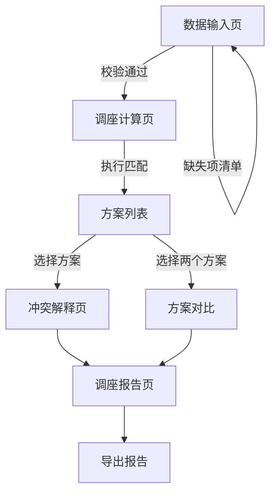

## 1. 产品概述

航班座位交换优化计算工具——面向航司客服，在家庭同坐、付费座位和超售改签场景下，自动算出最少打扰乘客的调座方案，并给出完整冲突解释与调座报告。

- 解决问题：人工调座耗时长、易遗漏约束、难以对比多方案优劣
- 目标用户：航司客服人员、值机调度员

## 2. 核心功能

### 2.1 功能模块

1. **数据输入页**：乘客名单、座位图、付费座位、同行关系、改签记录的录入与校验，缺失项显式列出
2. **调座计算页**：二分匹配算法执行、约束权重配置、方案生成与对比
3. **冲突解释页**：付费座位被换、同行被拆、超售座位重复的详细原因与影响对象
4. **调座报告页**：方案汇总统计、单条调座详情、报告导出（CSV/JSON）

### 2.2 页面详情

| 页面名称 | 模块名称 | 功能描述 |
|----------|----------|----------|
| 数据输入 | 乘客名单 | 录入乘客ID、姓名、当前座位、舱位；校验ID/座位格式 |
| 数据输入 | 座位图 | 录入行列布局、座位状态（可用/已占/ blocked）；校验行号列号连续性 |
| 数据输入 | 付费座位 | 录入座位号、费用、付费乘客；校验座位号在座位图中存在 |
| 数据输入 | 同行关系 | 录入同行组ID、组内乘客列表、同行优先级；校验乘客ID存在、组内≥2人 |
| 数据输入 | 改签记录 | 录入被改签乘客、原座位、目标航班；校验乘客与座位对应 |
| 数据输入 | 缺失检测 | 汇总所有缺失/不一致项，以清单形式展示，阻止计算直到修正 |
| 调座计算 | 权重配置 | 调节付费座位权重、同行权重、舱位差异权重、移动距离权重 |
| 调座计算 | 二分匹配 | 基于Hungarian算法的乘客-座位二分匹配，最大化全局满意度 |
| 调座计算 | 方案列表 | 展示多个可行方案，按总权重得分排序，支持标记推荐方案 |
| 调座计算 | 方案对比 | 并排对比两方案的冲突数、权重得分、受影响乘客数 |
| 冲突解释 | 付费冲突 | 列出被换付费座位的乘客、原座位、新座位、费用影响 |
| 冲突解释 | 同行冲突 | 列出被拆同行组、组内成员原/新座位、同行距离变化 |
| 冲突解释 | 超售冲突 | 列出重复座位号、涉及乘客、冲突原因（改签/重复分配） |
| 调座报告 | 统计概览 | 总调座人数、冲突总数（按类型）、权重得分分布 |
| 调座报告 | 单条详情 | 每位乘客的原座位→新座位、冲突标签、影响说明 |
| 调座报告 | 导出 | 导出CSV/JSON格式报告，内容与页面统计、详情一致 |

## 3. 核心流程

用户进入数据输入页，依次或批量录入五类数据（乘客名单、座位图、付费座位、同行关系、改签记录），系统实时校验并显示缺失项清单。数据完整后进入调座计算页，配置权重参数后执行二分匹配算法，生成多个可行方案。用户可选择方案进行冲突解释查看，也可对比两方案。最终在报告页查看完整统计与详情，并导出报告。

## 4. 用户界面设计

### 4.1 设计风格

- 主色：深靛蓝（#1E3A5F），辅色：琥珀金（#D4A843），警示色：珊瑚红（#E85D4A）
- 按钮风格：圆角6px、微阴影、hover态加深
- 字体：标题使用 DM Serif Display，正文使用 Source Sans 3
- 布局风格：左侧导航栏 + 右侧内容区，卡片式模块
- 图标风格：Lucide 线性图标

### 4.2 页面设计概览

| 页面名称 | 模块名称 | UI元素 |
|----------|----------|--------|
| 数据输入 | 乘客名单 | 表格输入、批量粘贴区、格式错误高亮 |
| 数据输入 | 座位图 | 网格可视化座位图、点击切换状态、颜色编码 |
| 数据输入 | 付费座位 | 标记叠加在座位图上、金额显示、列表编辑 |
| 数据输入 | 同行关系 | 标签选择组内乘客、颜色分组、连线可视化 |
| 数据输入 | 改签记录 | 时间线视图、拖拽排序、状态标签 |
| 数据输入 | 缺失检测 | 红色清单卡片、点击跳转对应输入区 |
| 调座计算 | 权重配置 | 滑块控件、实时预览权重分布雷达图 |
| 调座计算 | 二分匹配 | 动画展示匹配过程、进度指示 |
| 调座计算 | 方案列表 | 卡片列表、推荐标签、得分条形图 |
| 调座计算 | 方案对比 | 左右分栏、差异高亮 |
| 冲突解释 | 付费冲突 | 黄色警告卡片、费用差额标记 |
| 冲突解释 | 同行冲突 | 橙色警告卡片、座位距离标注 |
| 冲突解释 | 超售冲突 | 红色警告卡片、重复座位标红 |
| 调座报告 | 统计概览 | 数字卡片、饼图/柱状图 |
| 调座报告 | 单条详情 | 可展开表格行、冲突标签 |
| 调座报告 | 导出 | 导出按钮、格式选择下拉 |

### 4.3 响应式设计

- 桌面优先设计，最小宽度1024px
- 平板适配：导航栏折叠为汉堡菜单，座位图缩放
- 移动端：表格改为卡片列表，座位图支持手势缩放

### 4.4 3D场景指引

不适用
