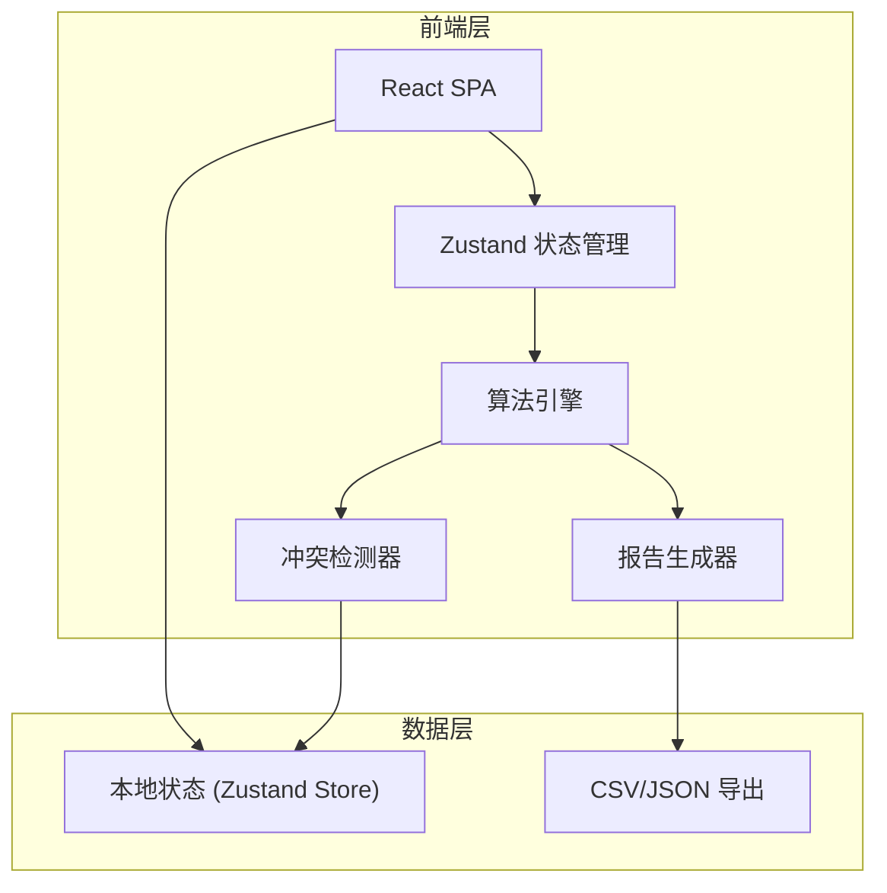
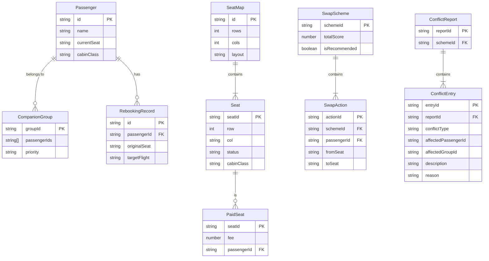

## 1. 架构设计



纯前端应用，所有计算在浏览器端完成，无需后端服务。

## 2. 技术说明

- 前端：React@18 + TypeScript + Tailwind CSS@3 + Vite
- 初始化工具：vite-init（react-ts 模板）
- 状态管理：Zustand
- 后端：无
- 数据库：无，使用本地 Zustand Store 管理状态，支持 JSON 导出持久化

## 3. 路由定义

| 路由 | 用途 |
|------|------|
| / | 重定向到 /input |
| /input | 数据输入页：乘客名单、座位图、付费座位、同行关系、改签记录、缺失检测 |
| /compute | 调座计算页：权重配置、方案生成、方案列表、方案对比 |
| /conflict | 冲突解释页：付费冲突、同行冲突、超售冲突 |
| /report | 调座报告页：统计概览、单条详情、导出 |

## 4. API 定义

无后端 API。前端通过 Zustand Store 共享数据，算法引擎直接操作 Store 中的数据模型。

## 5. 服务器架构图

不适用（纯前端应用）

## 6. 数据模型

### 6.1 数据模型定义



### 6.2 数据定义语言

不适用（无数据库，使用 TypeScript 接口定义）

```typescript
interface Passenger {
  id: string;
  name: string;
  currentSeat: string;
  cabinClass: string;
}

interface Seat {
  seatId: string;
  row: number;
  col: string;
  status: 'available' | 'occupied' | 'blocked';
  cabinClass: string;
}

interface SeatMap {
  id: string;
  rows: number;
  cols: string[];
  seats: Seat[];
}

interface PaidSeat {
  seatId: string;
  fee: number;
  passengerId: string;
}

interface CompanionGroup {
  groupId: string;
  passengerIds: string[];
  priority: 'high' | 'medium' | 'low';
}

interface RebookingRecord {
  id: string;
  passengerId: string;
  originalSeat: string;
  targetFlight: string;
}

interface SwapAction {
  actionId: string;
  passengerId: string;
  fromSeat: string;
  toSeat: string;
}

interface ConflictEntry {
  entryId: string;
  conflictType: 'paid_displaced' | 'companion_split' | 'overbooked_duplicate';
  affectedPassengerId: string;
  affectedGroupId?: string;
  description: string;
  reason: string;
}

interface SwapScheme {
  schemeId: string;
  actions: SwapAction[];
  conflicts: ConflictEntry[];
  totalScore: number;
  isRecommended: boolean;
}

interface WeightConfig {
  paidSeatWeight: number;
  companionWeight: number;
  cabinDiffWeight: number;
  distanceWeight: number;
}
```
