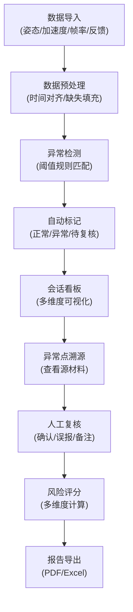

## 1. 产品概述

VR晕动加速度分析系统是一个面向VR团队的数据分析看板，用于识别哪些镜头加速度最容易导致玩家晕动。系统将多源数据（头显姿态、加速度、帧率、镜头段落、玩家反馈）统一归集到同一业务对象，支持异常点溯源、规则可配置、待复核机制。

### 产品核心价值
- 解决VR晕动症的数据分析痛点
- 支持多源异构数据的统一关联
- 提供可解释的分析规则，方便调整口径
- 真实场景数据兼容，处理帧率掉点、姿态突跳、时间错位等问题

## 2. 核心功能

### 2.1 用户角色
| 角色 | 登录方式 | 核心权限 |
|------|----------|----------|
| 数据分析员 | 本地登录 | 数据导入、分析、标注、导出报告 |
| 项目管理员 | 本地登录 | 规则配置、数据管理、用户权限 |

### 2.2 功能模块
1. **数据概览看板**：整体统计、异常分布、风险趋势
2. **会话分析页**：单会话多维度数据联动、时间轴、异常点定位
3. **异常详情页**：异常点溯源、段落回放、材料关联
4. **规则配置页**：阈值管理、评分公式、规则解释
5. **报告导出页**：分析报告生成、批量导出

### 2.3 页面详情
| 页面名称 | 模块名称 | 功能描述 |
|----------|----------|----------|
| 数据概览看板 | 统计卡片 | 总会话数、异常点总数、高风险占比、待复核数量 |
| 数据概览看板 | 异常分布图 | 按加速度区间、方向、时间分布的热力图/柱状图 |
| 数据概览看板 | 风险趋势图 | 按日期/版本的风险评分趋势曲线 |
| 数据概览看板 | 会话列表 | 快速筛选高风险会话、支持搜索排序 |
| 会话分析页 | 多线图表 | 六轴加速度曲线、帧率曲线、姿态角曲线 |
| 会话分析页 | 时间轴控制 | 缩放、拖拽、定位、段落回放 |
| 会话分析页 | 异常点标注 | 阈值触发点、玩家反馈点、待复核标记 |
| 会话分析页 | 镜头段落映射 | 游戏关卡/镜头段落与数据时间轴对齐 |
| 异常详情页 | 源材料关联 | 头显日志、视频片段、玩家问卷、截图 |
| 异常详情页 | 运动学统计 | 峰值加速度、持续时间、 jerk值、频率分析 |
| 异常详情页 | 风险评分卡 | 多维度评分、规则权重、可解释性说明 |
| 异常详情页 | 复核操作 | 标记确认/误报/待复核、添加备注 |
| 规则配置页 | 阈值管理 | 各维度阈值设置、预设模板、规则说明 |
| 规则配置页 | 评分公式 | 风险评分算法、权重调整、公式解释 |
| 规则配置页 | 标签体系 | 异常类型标签、严重程度定义 |
| 报告导出页 | 报告模板 | 自定义模板、摘要统计、异常详情 |
| 报告导出页 | 批量导出 | PDF/Excel格式、按会话/按异常导出 |

## 3. 核心流程

### 3.1 数据分析流程
用户导入多源数据 → 系统自动关联对齐 → 异常检测与初步标记 → 人工复核确认 → 生成分析报告

### 3.2 流程图

## 4. 用户界面设计

### 4.1 设计风格
- **主色调**：深科技蓝 (#165DFF)，代表专业数据分析
- **辅助色**：警示橙 (#FF7D00) 用于高风险，待复核黄 (#FFC53D)，确认绿 (#00B42A)
- **中性色**：深灰背景 (#1D2129)，文字层级分明
- **视觉风格**：科技感数据可视化，暗色主题，减少视觉疲劳
- **按钮样式**：微圆角 (6px)，悬浮时轻微放大+发光效果
- **字体**：展示字体使用 Space Grotesk，正文字体使用 JetBrains Mono
- **布局风格**：卡片式模块化布局，栅格系统，信息层级清晰
- **图标风格**：线性简约图标，统一2px描边

### 4.2 页面设计概览
| 页面名称 | 模块名称 | UI元素 |
|----------|----------|--------|
| 数据概览看板 | 统计卡片 | 渐变背景、数值动画、趋势箭头、图标装饰 |
| 数据概览看板 | 异常分布图 | 交互式热力图、悬浮tooltip、可筛选维度 |
| 会话分析页 | 多线图表 | 可折叠图例、区域缩放、十字准星、异常点标记 |
| 会话分析页 | 时间轴 | 拖拽手柄、缩放滑块、段落颜色分段 |
| 异常详情页 | 材料面板 | 标签页切换、视频播放器、日志查看器、图片画廊 |
| 规则配置页 | 阈值滑块 | 双滑块范围选择、实时预览、规则说明折叠面板 |
| 报告导出页 | 预览区域 | 报告缩略图、实时预览、导出进度条 |

### 4.3 响应式设计
- **桌面优先**：1440px 基准宽度，支持 1920px 大屏扩展
- **平板适配**：1024px 断点，侧边栏收起，图表自适应
- **触控优化**：按钮最小 44x44px，滑动手势支持时间轴操作

### 4.4 动效设计
- **页面加载**：卡片 staggered 入场动画，图表渐进式绘制
- **数据更新**：数值平滑过渡，图表增量更新
- **交互反馈**：按钮 hover 发光，卡片 hover 微抬升，模态框缩放入场
- **时间轴**：播放时进度条脉动效果，异常点脉冲提示
