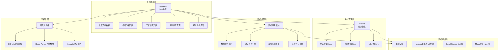
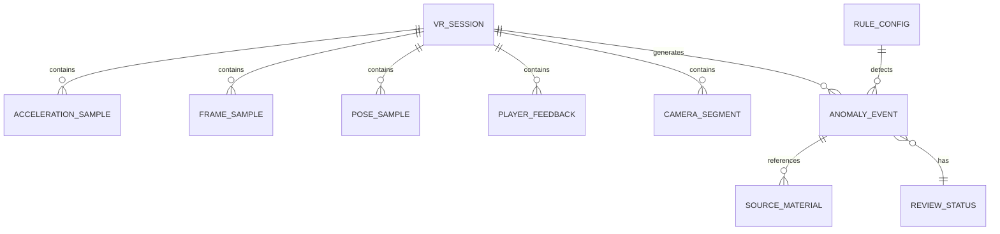

## 1. 架构设计



## 2. 技术栈说明

### 2.1 核心框架
- **前端框架**: React 18.2 + TypeScript 5.0
- **构建工具**: Vite 5.0
- **样式方案**: TailwindCSS 3.4
- **状态管理**: Zustand 4.5
- **路由管理**: React Router 6.22

### 2.2 可视化组件
- **时序图表**: ECharts 5.5 (高性能六轴数据展示)
- **统计图表**: Recharts 2.12
- **视频播放**: React Player 2.16
- **UI组件库**: Headless UI + Heroicons

### 2.3 工具库
- **日期处理**: date-fns 3.3
- **数值计算**: mathjs 12.3
- **文件导出**: jspdf 2.5 + xlsx 0.18
- **数据导入**: papaparse 5.4

### 2.4 数据存储
- **本地数据库**: IndexedDB (Dexie.js 封装)
- **配置存储**: LocalStorage
- **演示数据**: Mock 数据生成器

## 3. 路由定义

| 路由路径 | 页面名称 | 主要功能 |
|----------|----------|----------|
| `/` | 数据概览看板 | 统计卡片、异常分布、风险趋势、会话列表 |
| `/session/:id` | 会话分析页 | 多线图表、时间轴、异常点标注、段落映射 |
| `/anomaly/:id` | 异常详情页 | 源材料关联、运动学统计、风险评分、复核操作 |
| `/rules` | 规则配置页 | 阈值管理、评分公式、标签体系 |
| `/export` | 报告导出页 | 报告模板、批量导出、预览 |

## 4. 数据模型

### 4.1 实体关系图



### 4.2 TypeScript 类型定义

```typescript
// 会话主对象 - 统一归集所有关联数据
interface VRSession {
  id: string;
  sessionName: string;
  playerId: string;
  startTime: number;
  duration: number;
  gameVersion: string;
  importedAt: number;
  status: 'processing' | 'ready' | 'error';
  
  // 关联数据引用
  accelerationDataId: string;
  frameDataId: string;
  poseDataId: string;
  feedbackIds: string[];
  segmentIds: string[];
  anomalyIds: string[];
}

// 加速度采样点
interface AccelerationSample {
  timestamp: number;
  linearAccel: { x: number; y: number; z: number };  // m/s²
  angularVel: { x: number; y: number; z: number };    // rad/s
  jerk: { x: number; y: number; z: number };          // 加加速度
  magnitude: number;                                   // 合加速度
}

// 帧率采样点
interface FrameSample {
  timestamp: number;
  fps: number;
  frameTime: number;
  droppedFrames: number;
}

// 头显姿态采样点
interface PoseSample {
  timestamp: number;
  position: { x: number; y: number; z: number };
  rotation: { pitch: number; yaw: number; roll: number };  // 欧拉角（度）
}

// 玩家反馈
interface PlayerFeedback {
  id: string;
  sessionId: string;
  timestamp: number;
  type: 'nausea' | 'dizziness' | 'discomfort' | 'other';
  severity: 1 | 2 | 3 | 4 | 5;
  description: string;
  syncOffset: number;  // 时间偏移校准值（秒）
}

// 镜头段落
interface CameraSegment {
  id: string;
  sessionId: string;
  startTime: number;
  endTime: number;
  segmentName: string;
  levelName: string;
  cameraMode: string;
  movementType: string;
}

// 异常事件
interface AnomalyEvent {
  id: string;
  sessionId: string;
  startTime: number;
  endTime: number;
  peakTime: number;
  
  // 异常特征
  type: 'high_accel' | 'high_jerk' | 'fps_drop' | 'pose_jump' | 'player_reported';
  severity: 'low' | 'medium' | 'high' | 'critical';
  riskScore: number;
  
  // 统计数据
  peakAcceleration: number;
  avgAcceleration: number;
  duration: number;
  frequency: number;
  dominantAxis: 'x' | 'y' | 'z' | 'combined';
  
  // 复核状态
  reviewStatus: 'pending' | 'confirmed' | 'false_positive' | 'needs_review';
  reviewNotes: string;
  reviewedBy: string;
  reviewedAt: number;
  
  // 规则匹配
  matchedRules: string[];
  
  // 关联材料
  sourceMaterials: SourceMaterial[];
}

// 源材料关联
interface SourceMaterial {
  id: string;
  type: 'log' | 'video' | 'screenshot' | 'questionnaire' | 'telemetry';
  name: string;
  url: string;
  startTime: number;
  endTime: number;
}

// 规则配置
interface RuleConfig {
  id: string;
  name: string;
  description: string;
  category: 'acceleration' | 'jerk' | 'fps' | 'pose' | 'feedback';
  
  // 阈值参数
  thresholds: {
    minValue?: number;
    maxValue?: number;
    duration?: number;
    consecutiveSamples?: number;
  };
  
  // 评分权重
  weight: number;
  severityMapping: Record<string, string>;
  
  // 规则解释
  explanation: string;
  references: string[];
  
  enabled: boolean;
  isPreset: boolean;
}

// 评分公式配置
interface RiskScoreFormula {
  version: string;
  description: string;
  components: {
    ruleId: string;
    weight: number;
    normalization: 'linear' | 'log' | 'sqrt';
  }[];
  explanation: string;
}
```

## 5. 核心算法模块

### 5.1 时间对齐引擎
- 多源数据时间戳归一化
- 采样率不一致处理（重采样/插值）
- 玩家反馈时间偏移校准
- 缺失数据智能填充

### 5.2 异常检测引擎
- 滑动窗口阈值检测
- 突变点检测（Z-score方法）
- 多维度联合判定
- 待复核标记逻辑（置信度<0.7时标记）

### 5.3 风险评分算法
- 规则匹配得分加权
- 持续时间系数
- 玩家反馈相关性
- 历史基准对比

## 6. 目录结构

```
src/
├── assets/              # 静态资源
├── components/          # 通用组件
│   ├── charts/         # 图表组件
│   ├── layout/         # 布局组件
│   ├── timeline/       # 时间轴组件
│   └── ui/             # 基础UI组件
├── pages/              # 页面组件
│   ├── dashboard/
│   ├── session/
│   ├── anomaly/
│   ├── rules/
│   └── export/
├── store/              # Zustand状态管理
├── services/           # 业务逻辑服务
│   ├── dataImport.ts
│   ├── timeAlignment.ts
│   ├── anomalyDetection.ts
│   └── riskScoring.ts
├── types/              # TypeScript类型定义
├── utils/              # 工具函数
├── mock/               # Mock演示数据
├── styles/             # 全局样式
├── App.tsx
├── main.tsx
└── vite-env.d.ts
```
