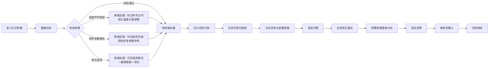

## 1. 产品概述
3D打印翘曲热应力复盘分析工具，帮助创客空间量化分析大件打印翘边问题，通过材料参数、床温、冷却速度等多维度对比，将图表异常点关联到明细数据，形成"发现问题-修正参数-结果确认"的完整闭环。

- **核心目标**：量化热收缩与应力风险，将翘曲问题从经验判断转化为可验证的数据驱动决策
- **目标用户**：创客空间操作员、3D打印工程师、质量管控人员
- **产品价值**：减少大件打印失败率，缩短参数调试周期，建立可追溯的质量分析体系

## 2. 核心特性

### 2.1 用户角色
| 角色 | 注册方式 | 核心权限 |
|------|----------|----------|
| 操作员 | 本地创建 | 录入打印参数、运行分析、查看建议 |
| 审核员 | 本地创建 | 确认修正方案、归档分析报告、查看历史记录 |

### 2.2 功能模块
1. **参数录入页**：材料参数、打印工艺、环境条件、模型尺寸输入
2. **应力分析页**：热收缩估算、应力风险热力图、温度梯度曲线
3. **问题追踪页**：异常点明细、修正方案、确认记录三段式流程
4. **参数对比页**：多批次参数横向对比、材料特性雷达图
5. **报告导出页**：风险报告生成、图表导出、分析建议

### 2.3 页面详情
| 页面名称 | 模块名称 | 功能描述 |
|----------|----------|-------------|
| 参数录入页 | 基础参数模块 | 材料选择(PLA/ABS/PETG/尼龙)、床温、喷嘴温度、环境温度输入 |
| 参数录入页 | 模型尺寸模块 | 长宽高尺寸输入，支持mm/cm/in单位自动识别与转换 |
| 参数录入页 | 冷却参数模块 | 冷却风扇转速、层高、打印速度输入 |
| 参数录入页 | 数据校验模块 | 温差符号检查、材料参数完整性校验、单位混用检测 |
| 应力分析页 | 热收缩估算模块 | 基于材料热膨胀系数和温度差计算收缩率与收缩量 |
| 应力分析页 | 应力风险图 | 可视化展示不同区域的应力风险等级，点击可查看明细 |
| 应力分析页 | 温度梯度曲线 | 展示打印过程中喷嘴-床层-环境的温度变化曲线 |
| 问题追踪页 | 问题发现模块 | 自动识别风险点、关联明细数据行、标注问题类型 |
| 问题追踪页 | 修正方案模块 | 针对不同问题类型给出参数调整建议、预期效果评估 |
| 问题追踪页 | 结果确认模块 | 录入验证结果、确认人签字、归档时间戳 |
| 参数对比页 | 多批次对比 | 选择多个打印批次进行参数横向对比 |
| 参数对比页 | 材料雷达图 | 展示不同材料的收缩率、耐热性、粘附力等特性对比 |
| 报告导出页 | 风险报告 | 自动生成包含问题分析、修正建议、确认记录的完整报告 |
| 报告导出页 | 图表导出 | 支持PNG/SVG格式导出热力图、曲线图、对比图 |

## 3. 核心流程

用户录入打印参数后，系统先进行数据完整性校验（温差符号、材料参数、单位混用三类错误单独处理），校验通过后执行热收缩估算和应力风险分析，生成可视化图表。用户点击图表异常点可查看关联的明细数据，系统自动生成修正建议，调整后再次运行分析验证，最终由审核员确认结果并归档。

## 4. 用户界面设计

### 4.1 设计风格
- **主色调**：工业蓝 `#165DFF`（科技感、专业性），辅以警示橙 `#FF7D00`（风险提示）、成功绿 `#00B42A`（确认通过）
- **配色方案**：深色主题，背景 `#0E1421`，卡片 `#172033`，边框 `#2A3448`，营造严谨的工程分析氛围
- **字体**：标题使用 `JetBrains Mono`（等宽字体增强数据感），正文使用 `Inter`，数值使用 `Roboto Mono`
- **按钮风格**：直角矩形，2px边框，hover时背景色加深并伴随轻微上移动画
- **图标风格**：lucide-react线性图标，数据可视化采用热力图、等高线风格

### 4.2 页面设计概述
| 页面名称 | 模块名称 | UI元素 |
|----------|----------|--------|
| 参数录入页 | 表单区 | 卡片式布局，分组展示材料、温度、尺寸、冷却参数，每组配独立校验状态指示灯 |
| 参数录入页 | 校验区 | 三类错误独立卡片展示，红色边框+具体错误说明+一键修复按钮 |
| 应力分析页 | 图表区 | 左侧应力热力图（可交互），右侧温度梯度曲线图，下方收缩率数据表 |
| 问题追踪页 | 三段式流程 | 时间轴布局，发现/修正/确认三个阶段垂直排列，每阶段含状态标签和时间戳 |
| 参数对比页 | 对比区 | 表格横向对比，关键参数差异高亮显示，雷达图展示材料特性 |
| 报告导出页 | 预览区 | A4纸模拟预览，包含页眉、分析结论、图表、确认栏 |

### 4.3 响应式
- 桌面端优先（1280px+）：多栏布局，图表与数据并列展示
- 平板端（768-1279px）：图表与数据上下堆叠，保持交互功能完整
- 移动端（<768px）：单列布局，核心分析功能可用，复杂图表简化展示

### 4.4 动效设计
- 页面加载：卡片依次淡入，动画延迟递增（100ms/卡片）
- 数据校验：错误项左右轻微抖动，正确项打钩动画
- 图表交互：hover时数据点放大并显示tooltip，点击异常点平滑滚动到对应明细行
- 状态流转：从"发现"到"修正"到"确认"使用渐进式颜色过渡动画
