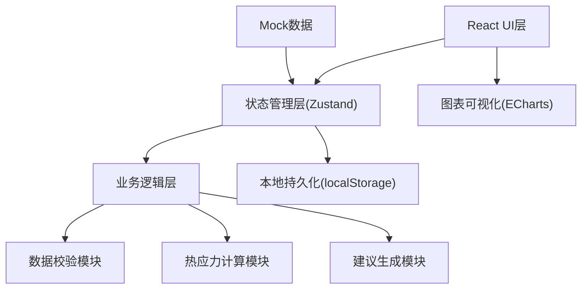
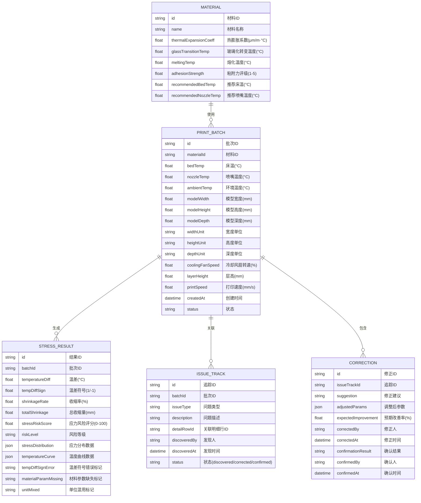

## 1. 架构设计

本项目为纯前端单页应用，所有计算和数据存储均在浏览器端完成，无需后端服务。采用React组件化架构，Zustand进行状态管理，ECharts实现数据可视化。



## 2. 技术描述

- **前端框架**: React@18 + TypeScript
- **构建工具**: Vite@5
- **样式方案**: TailwindCSS@3
- **状态管理**: Zustand@4
- **图表库**: ECharts@5
- **图标库**: lucide-react
- **路由**: react-router-dom@6
- **数据持久化**: localStorage
- **无后端服务**: 所有计算在前端完成，mock数据内置

## 3. 路由定义

| 路由 | 页面名称 | 组件路径 |
|------|----------|----------|
| `/` | 参数录入页 | `src/pages/ParameterInput.tsx` |
| `/analysis` | 应力分析页 | `src/pages/StressAnalysis.tsx` |
| `/tracking` | 问题追踪页 | `src/pages/IssueTracking.tsx` |
| `/compare` | 参数对比页 | `src/pages/ParameterCompare.tsx` |
| `/report` | 报告导出页 | `src/pages/ReportExport.tsx` |

## 4. 数据模型

### 4.1 数据模型定义



### 4.2 核心计算逻辑

#### 热收缩估算公式
```
收缩率 = 热膨胀系数 × (喷嘴温度 - 环境温度) × 10^-4
总收缩量 = 模型尺寸 × 收缩率
```

#### 应力风险评分
```
基础分 = 收缩率权重 × 收缩率 + 温差权重 × 温差 + 尺寸权重 × 模型尺寸
冷却惩罚 = 冷却速度过快惩罚系数
床温补偿 = 床温接近玻璃化转变温度的奖励系数
风险评分 = MAX(0, MIN(100, 基础分 + 冷却惩罚 - 床温补偿))
```

#### 三类错误检测口径

1. **温差符号错误**：
   - 检测条件：喷嘴温度 < 床温 或 床温 < 环境温度
   - 处理口径：单独标注符号方向，展示正确的温度梯度逻辑（喷嘴 > 床温 > 环境），提供一键修正

2. **材料参数缺失**：
   - 检测条件：材料热膨胀系数为空或为0
   - 处理口径：列出具体缺失字段，提供该材料的标准参数参考值，支持一键填充

3. **尺寸单位混用**：
   - 检测条件：长宽高三个维度使用不同单位
   - 处理口径：识别各维度单位，展示单位转换对比表，支持一键转换为统一单位（默认mm）

## 5. 目录结构

```
src/
├── components/          # 可复用组件
│   ├── ParameterForm/   # 参数表单组件
│   ├── StressChart/     # 应力图表组件
│   ├── IssueTimeline/   # 问题时间轴组件
│   ├── CompareTable/    # 参数对比表格
│   ├── ReportPreview/   # 报告预览组件
│   └── DataValidation/  # 数据校验组件
├── pages/               # 页面组件
│   ├── ParameterInput.tsx
│   ├── StressAnalysis.tsx
│   ├── IssueTracking.tsx
│   ├── ParameterCompare.tsx
│   └── ReportExport.tsx
├── store/               # Zustand状态
│   └── usePrintStore.ts
├── utils/               # 工具函数
│   ├── stressCalculator.ts    # 应力计算
│   ├── dataValidator.ts       # 数据校验
│   ├── suggestionEngine.ts    # 建议生成
│   ├── unitConverter.ts       # 单位转换
│   └── exportUtils.ts         # 导出工具
├── types/               # TypeScript类型
│   └── index.ts
├── data/                # Mock数据
│   ├── materials.ts     # 材料数据
│   └── mockBatches.ts   # 历史批次数据
├── App.tsx
├── main.tsx
└── index.css
```

## 6. 核心模块技术要点

### 6.1 可交互应力热力图
- 使用ECharts heatmap系列，自定义tooltip展示明细数据
- 点击热力图单元格触发事件，定位到对应明细数据行
- 实现等高线式的风险等级渐变色彩

### 6.2 图表联动
- 热力图、温度曲线、数据表格三者联动
- 选中某一区域时，其他图表同步高亮对应数据范围

### 6.3 本地数据持久化
- 使用localStorage存储历史分析记录
- 实现自动保存和版本管理
- 支持导入/导出JSON格式的分析数据

### 6.4 三段式问题追踪
- 时间轴组件展示"发现-修正-确认"全流程
- 每个阶段支持添加备注和附件（图片URL）
- 状态变更时自动记录时间戳和操作人
