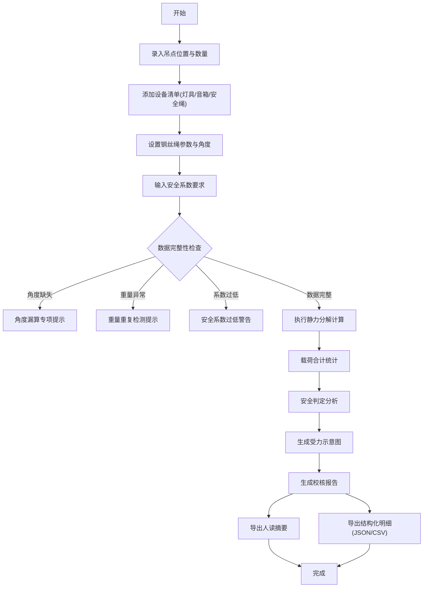

## 1. 产品概述

舞台吊点载荷校核工具，专为剧场技术主管、舞台工程专业师生设计，通过科学的力学计算替代经验判断，确保吊装安全。提供透明的计算过程、明细化的校核记录，支持导入导出，便于教学演示与实验室复核。

## 2. 核心功能

### 2.1 用户角色
| 角色 | 核心权限 |
|------|----------|
| 学生用户 | 数据录入、计算演示、报告查看 |
| 教师用户 | 数据导入导出、教学演示、批量校核 |
| 技术主管 | 专业校核、报告导出、安全存档 |

### 2.2 功能模块
1. **数据录入页**：吊点信息、设备清单、钢丝绳参数、角度设置
2. **计算分析页**：静力分解、载荷合计、安全判定、实时示意图
3. **报告导出页**：人读摘要、结构化明细、完整校核报告

### 2.3 页面详情
| 页面名称 | 模块名称 | 功能描述 |
|----------|----------|----------|
| 数据录入 | 吊点管理 | 支持多吊点添加、位置坐标设置 |
| 数据录入 | 设备清单 | 灯具、音箱、安全绳等设备重量录入 |
| 数据录入 | 参数设置 | 钢丝绳规格、安全系数、吊装角度 |
| 计算分析 | 静力分解 | 垂直/水平分力计算可视化 |
| 计算分析 | 载荷合计 | 单吊点/总载荷统计，防重复计算 |
| 计算分析 | 安全判定 | 分项检查：角度漏算、重量重复、系数过低 |
| 报告导出 | 人读摘要 | 关键指标汇总、安全结论 |
| 报告导出 | 结构化明细 | JSON/CSV格式导出，便于后续处理 |
| 报告导出 | 示意图 | SVG吊点布置图、受力分析图 |

## 3. 核心流程

## 4. 用户界面设计

### 4.1 设计风格
- **主色调**：深蓝(#1a365d) + 工业灰(#4a5568)，体现专业工程感
- **警示色**：红(#e53e3e)、黄(#d69e2e)、绿(#38a169)，分级显示安全状态
- **按钮风格**：方形微圆角，实线边框，hover时轻微上浮
- **字体**：思源黑体(标题) + JetBrains Mono(数值)，专业清晰
- **布局风格**：左侧数据面板 + 右侧可视化区域，卡片式分区
- **图标风格**：线性工业图标，统一2px线宽

### 4.2 页面设计概览
| 页面名称 | 模块名称 | UI元素 |
|----------|----------|--------|
| 数据录入 | 吊点表格 | 行高亮、实时校验、增删按钮 |
| 数据录入 | 设备清单 | 分类折叠面板、重量累加器 |
| 计算分析 | 受力示意图 | SVG动态渲染、悬停显示数值 |
| 计算分析 | 分项检查 | 三色状态卡片、问题定位说明 |
| 报告导出 | 双栏布局 | 左侧人读摘要、右侧结构化数据 |

### 4.3 响应式
- 桌面端(>1200px)：双栏布局，左4右6比例
- 平板(768-1200px)：上下布局，数据在上图表在下
- 移动端(<768px)：单列流式布局，优先显示核心数据

### 4.4 交互动效
- 计算过程：数字滚动动画，显示中间值
- 安全判定：状态切换时卡片边框闪烁
- 示意图：悬停时受力线加粗，显示力值标注
