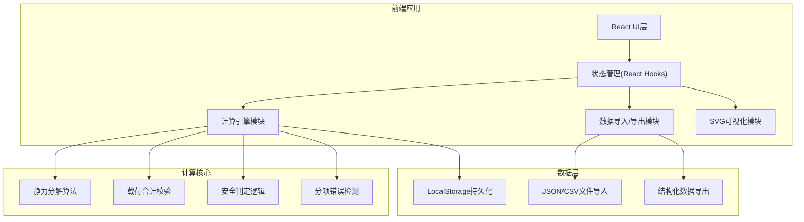

## 1. 架构设计



## 2. 技术选型

- **前端框架**：React@18 + TypeScript
- **构建工具**：Vite
- **样式方案**：TailwindCSS@3
- **状态管理**：React Hooks (useState, useReducer)
- **可视化**：原生SVG + CSS动画
- **数据格式**：JSON (结构化存储), CSV (表格导出)
- **第三方库**：无外部依赖，纯原生实现计算逻辑

## 3. 路由定义

| 路由 | 页面用途 |
|------|----------|
| / | 数据录入与计算主页面 |
| /report | 校核报告查看与导出 |

## 4. 数据模型

### 4.1 类型定义

```typescript
// 吊点信息
interface HoistPoint {
  id: string;
  name: string;
  x: number;           // X坐标(m)
  y: number;           // Y坐标(m)
  z: number;           // 高度(m)
  angle: number | null; // 吊装角度(度)
  assignedEquipment: string[];
}

// 设备信息
interface Equipment {
  id: string;
  name: string;
  type: 'light' | 'speaker' | 'safetyRope' | 'other';
  weight: number;      // 重量(kg)
  quantity: number;
  assignedPointId: string | null;
}

// 钢丝绳参数
interface CableSpec {
  diameter: number;    // 直径(mm)
  breakingLoad: number; // 破断载荷(kN)
  material: string;
}

// 计算参数
interface CalculationParams {
  safetyFactor: number;
  gravity: number;     // 重力加速度(m/s²)
}

// 分项检测结果
interface CheckResultItem {
  type: 'angle' | 'weight' | 'factor' | 'cable';
  status: 'pass' | 'warning' | 'error';
  message: string;
  location?: string;
  suggestion: string;
}

// 吊点受力结果
interface HoistPointResult {
  pointId: string;
  pointName: string;
  totalWeight: number; // 总重量(kg)
  verticalForce: number;  // 垂直分力(kN)
  horizontalForce: number; // 水平分力(kN)
  cableForce: number;      // 钢丝绳受力(kN)
  safetyRatio: number;     // 实际安全系数
  isSafe: boolean;
}

// 完整校核报告
interface VerificationReport {
  summary: {
    totalPoints: number;
    totalEquipment: number;
    totalWeight: number;
    maxCableForce: number;
    minSafetyRatio: number;
    overallStatus: 'safe' | 'warning' | 'danger';
  };
  checkResults: CheckResultItem[];
  pointResults: HoistPointResult[];
  equipmentList: Equipment[];
  cableSpec: CableSpec;
  params: CalculationParams;
  generatedAt: string;
  version: string;
}
```

### 4.2 数据校验规则

```typescript
// 角度检测：必须设置且在合理范围(15°~90°)
const ANGLE_MIN = 15;
const ANGLE_MAX = 90;

// 安全系数：剧场吊装建议≥5，最低≥3
const SAFETY_FACTOR_MIN = 3;
const SAFETY_FACTOR_RECOMMENDED = 5;

// 重量重复检测：相同名称设备需合并或标注
const WEIGHT_TOLERANCE = 0.01; // 1%容差
```

## 5. 核心算法

### 5.1 静力分解计算

```
已知：
- W：设备总重量(kg)
- θ：钢丝绳与水平夹角(度)

计算：
重力 G = W × g (kN, g=9.8m/s²)
垂直分力 Fv = G / n (n为吊点数)
钢丝绳受力 Fc = Fv / sin(θ)
水平分力 Fh = Fc × cos(θ)
安全系数 S = 破断载荷 / Fc
```

### 5.2 分项检测逻辑

1. **角度漏算检测**：遍历所有吊点，检查angle字段是否为null或超出范围
2. **重量重复检测**：按名称分组，标记重复条目，计算重复重量
3. **系数过低检测**：对比设置的安全系数与推荐值/最小值
4. **钢丝绳校核**：计算实际受力与破断载荷比值

## 6. 导入导出格式

### 6.1 JSON导入模板

```json
{
  "version": "1.0",
  "hoistPoints": [
    {"id": "P1", "name": "吊点1", "x": 0, "y": 0, "z": 8, "angle": 60}
  ],
  "equipment": [
    {"id": "E1", "name": "LED聚光灯", "type": "light", "weight": 15, "quantity": 4}
  ],
  "cableSpec": {"diameter": 8, "breakingLoad": 40, "material": "镀锌钢丝绳"},
  "params": {"safetyFactor": 5, "gravity": 9.8}
}
```

### 6.2 CSV导出字段

```
吊点名称,X坐标,Y坐标,高度,吊装角度,设备总重(kg),垂直分力(kN),水平分力(kN),钢丝绳受力(kN),安全系数,安全判定
```
