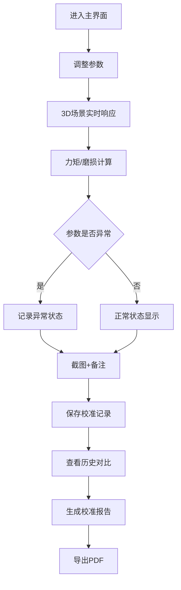

## 1. 产品概述

黑胶唱针压力校准系统是一个交互式演示平台，帮助唱片店向顾客直观展示唱针压力、抗滑力和唱臂长度对唱片磨损的物理机制。通过3D场景与参数面板双向联动，支持完整记录校准过程的全部数据与截图，生成专业校准报告。

- 目标用户：唱片店店员、黑胶爱好者、音响发烧友
- 核心价值：将抽象的唱针调校原理可视化，降低调校过程可追溯，调校结果可导出

## 2. 核心功能

### 2.1 用户角色

| 角色 | 注册方式 | 核心权限 |
|------|----------|----------|
| 演示用户 | 无需注册 | 完整使用全部功能，数据本地存储 |

### 2.2 功能模块

1. **主界面**：3D唱机场景、参数控制面板、实时状态指示
2. **校准记录**：历史记录列表、参数对比、磨损趋势图表
3. **报告导出**：校准报告生成、截图嵌入、PDF导出
4. **错误检测**：参数异常检测、警告记录、导出可见

### 2.3 页面详情

| 页面名称 | 模块名称 | 功能描述 |
|----------|---------|----------|
| 主校准页 | 3D场景模块 | 实时渲染唱机、唱臂、唱针、唱片，支持旋转、磨损可视化 |
| 主校准页 | 参数控制面板 | 唱针压力、抗滑力、唱臂长度、唱片半径、测试曲目选择 |
| 主校准页 | 实时计算模块 | 力矩估算、磨损提示、参数有效性检测 |
| 主校准页 | 截图模块 | 捕获3D场景和面板截图，可添加备注 |
| 校准记录页 | 历史记录模块 | 记录每次校准的参数、截图、备注、人工更正 |
| 校准记录页 | 参数对比模块 | 多组参数横向对比、磨损趋势图表 |
| 报告导出页 | 报告生成模块 | 整合参数、截图、备注、错误记录、说明文字生成完整校准报告 |

## 3. 核心流程

用户进入主界面，调整唱针压力、抗滑力、唱臂长度等参数，3D场景实时响应展示唱针与唱片的接触状态和磨损示意。系统实时计算力矩和磨损程度，检测参数异常。用户可截图记录当前状态，添加备注。多次校准后，系统记录历史数据。用户选择记录生成校准报告，导出PDF。

## 4. 用户界面设计

### 4.1 设计风格

- **主色调**：深胡桃木色(#2C1810) + 黄铜金色(#D4AF37) + 哑光黑(#1A1A1A)
- **辅助色**：唱针红(#C41E3A)、磨损橙(#FF6B35)、安全绿(#2E7D32)、警告黄(#F59E0B)
- **按钮风格**：黄铜质感边框、轻微浮雕效果、圆角8px
- **字体**：Cinzel Decorative（标题）、Cormorant Garamond（正文）、JetBrains Mono（数值）
- **布局风格**：左右分栏，左侧3D场景，右侧参数面板，底部历史记录
- **图标风格**：复古机械风格，唱针、唱片、力矩扳手等黑胶相关元素

### 4.2 页面设计概述

| 页面名称 | 模块名称 | UI元素 |
|----------|---------|--------|
| 主校准页 | 3D场景模块 | 胡桃木纹理桌面、黑胶唱片旋转、唱臂动态跟随、磨损区域高光指示、唱针压力可视化、抗滑力指示线 |
| 主校准页 | 参数控制面板 | 旋钮式调节器、实时数值显示、滑块、下拉选择测试曲目、校准状态指示灯 |
| 主校准页 | 状态指示区 | 力矩仪表、磨损程度条、错误警告卡片 |
| 主校准页 | 操作按钮区 | 截图按钮、保存记录按钮、导出报告按钮 |
| 校准记录页 | 历史列表 | 卡片式记录、缩略图、参数摘要、状态标记 |
| 校准记录页 | 对比区域 | 多组参数对比表格、磨损趋势折线图 |
| 报告导出页 | 报告预览 | 报告内容编辑区、备注输入区、导出格式选择 |

### 4.3 响应式

- 桌面端优先，1280px以上完美适配
- 1024px-1280px保持双栏布局
- 1024px以下改为上下布局

### 4.4 3D场景设计

- **环境**：暗室环境，聚光灯打在唱机上，周围环境微暗，营造专业调校氛围
- **灯光**：三点布光 - 主光45度侧上方，辅光补亮唱针区域，轮廓光勾勒唱臂轮廓
- **相机**：45度俯视角度，可拖拽旋转，滚轮缩放，双击重置视角
- **交互**：唱臂跟随参数调整唱针压力变化，唱针接触点高亮，磨损区域渐变显示
- **动画**：唱片匀速旋转，唱臂微调动画，参数调整过渡动画
- **后期**：轻微泛光效果，磨损区域红光指示
- **性能**：控制面数5万以内，保持60fps

## 5. 数据结构

### 5.1 校准记录

| 字段 | 类型 | 说明 |
|------|------|------|
| id | string | 记录ID |
| timestamp | number | 时间戳 |
| stylusPressure | number | 唱针压力(g) |
| antiSkating | number | 抗滑力 |
| tonearmLength | number | 唱臂长度(mm) |
| recordRadius | number | 唱片半径(cm) |
| recordRadiusUnit | string | 唱片半径单位(cm/inch) |
| testTrack | string | 测试曲目 |
| torque | number | 计算力矩 |
| wearLevel | number | 磨损程度0-100 |
| errors | array | 错误记录数组 |
| screenshot | string | 截图base64 |
| notes | string | 备注 |
| manualCorrection | string | 人工更正 |
| antiSkatingDirection | string | 抗滑方向(normal/reverse) |

### 5.2 错误类型

| 错误类型 | 说明 | 严重程度 |
|----------|------|----------|
| PRESSURE_TOO_HIGH | 唱针压力过大 | high |
| PRESSURE_TOO_LOW | 唱针压力过小 | medium |
| ANTISKATING_DIRECTION_WRONG | 抗滑方向错误 | high |
| RADIUS_UNIT_ERROR | 唱片半径单位错误 | medium |
| TONEARM_LENGTH_MISMATCH | 唱臂长度不匹配 | medium |

### 5.3 测试曲目

| 曲目名称 | 难度等级 | 说明 |
|----------|----------|------|
| 空白带 | 易 | 标准测试音轨 |
| 1kHz测试音 | 中 | 标准频率测试 |
| 沉默段落 | 难 | 复杂段落 |
| 高频扫频 | 难 | 频率响应测试 |
| 低频鼓声 | 中 | 低频响应测试 |
