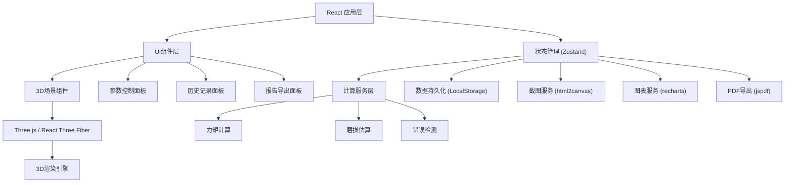
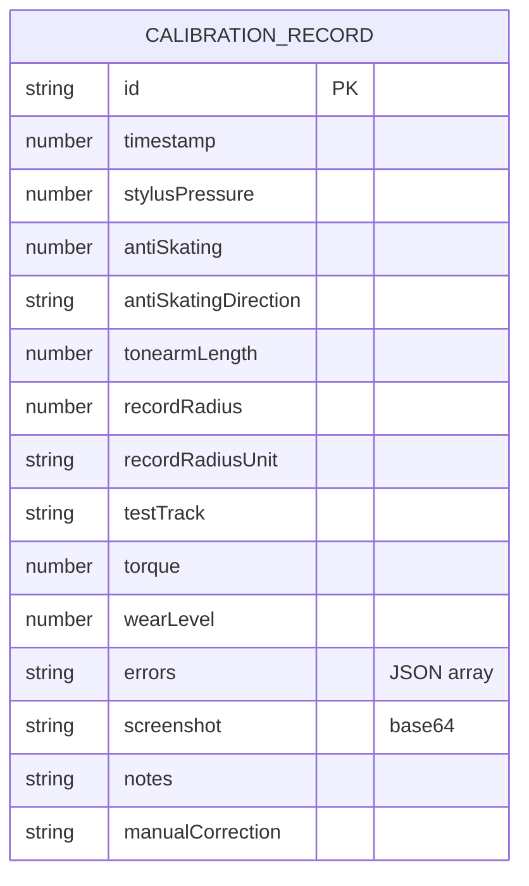

## 1. 架构设计



## 2. 技术描述

- **前端框架**: React@18 + TypeScript
- **构建工具**: Vite@5
- **样式方案**: TailwindCSS@3 + CSS变量
- **状态管理**: Zustand@4
- **3D渲染**: three@0.160 + @react-three/fiber@8 + @react-three/drei@9 + @react-three/postprocessing@2
- **图表库**: recharts@2
- **截图**: html2canvas@1
- **PDF导出**: jspdf@2
- **路由**: react-router-dom@6
- **图标**: lucide-react@0.294

## 3. 目录结构

```
src/
├── components/
│   ├── scene/
│   │   ├── Turntable.tsx       # 唱机主体
│   │   ├── Tonearm.tsx         # 唱臂组件
│   │   ├── VinylRecord.tsx     # 黑胶唱片
│   │   ├── Stylus.tsx          # 唱针组件
│   │   ├── WearIndicator.tsx   # 磨损指示器
│   │   └── Scene3D.tsx         # 3D场景容器
│   ├── controls/
│   │   ├── PressureKnob.tsx    # 唱针压力旋钮
│   │   ├── AntiSkatingKnob.tsx # 抗滑力旋钮
│   │   ├── TonearmSlider.tsx   # 唱臂长度滑块
│   │   ├── RadiusInput.tsx     # 唱片半径输入
│   │   ├── TrackSelector.tsx   # 测试曲目选择
│   │   └── ControlPanel.tsx    # 控制面板容器
│   ├── status/
│   │   ├── TorqueMeter.tsx     # 力矩仪表
│   │   ├── WearBar.tsx         # 磨损程度条
│   │   ├── ErrorCards.tsx      # 错误警告卡片
│   │   └── StatusPanel.tsx     # 状态面板容器
│   ├── history/
│   │   ├── RecordCard.tsx      # 历史记录卡片
│   │   ├── CompareTable.tsx    # 参数对比表格
│   │   ├── WearTrendChart.tsx  # 磨损趋势图表
│   │   └── HistoryPanel.tsx    # 历史面板容器
│   ├── report/
│   │   ├── ReportPreview.tsx   # 报告预览
│   │   ├── NotesEditor.tsx     # 备注编辑器
│   │   └── ExportButtons.tsx   # 导出按钮
│   └── common/
│       ├── Knob.tsx            # 通用旋钮组件
│       ├── Button.tsx          # 通用按钮
│       └── Card.tsx            # 通用卡片
├── store/
│   └── calibrationStore.ts     # 校准状态管理
├── services/
│   ├── torqueService.ts        # 力矩计算服务
│   ├── wearService.ts          # 磨损估算服务
│   ├── errorDetection.ts       # 错误检测服务
│   ├── screenshotService.ts    # 截图服务
│   ├── reportService.ts        # 报告生成服务
│   └── exportService.ts        # 导出服务
├── types/
│   └── calibration.ts          # 类型定义
├── data/
│   └── testTracks.ts           # 测试曲目数据
├── utils/
│   ├── physics.ts              # 物理计算公式
│   ├── storage.ts              # 本地存储工具
│   └── formatters.ts           # 格式化工具
├── App.tsx
├── main.tsx
└── index.css
```

## 4. 路由定义

| 路由 | 页面名称 | 说明 |
|------|---------|------|
| / | 主校准页 | 3D场景+参数控制+实时状态 |
| /history | 历史记录页 | 历史记录列表+参数对比 |
| /report/:id | 报告页 | 校准报告预览+导出 |

## 5. 状态管理 (Zustand Store)

```typescript
interface CalibrationState {
  // 当前参数
  stylusPressure: number;       // 唱针压力 0.5-3.0g
  antiSkating: number;          // 抗滑力 0-3
  antiSkatingDirection: 'normal' | 'reverse';
  tonearmLength: number;        // 唱臂长度 200-300mm
  recordRadius: number;         // 唱片半径
  recordRadiusUnit: 'cm' | 'inch';
  testTrack: string;            // 测试曲目ID
  
  // 计算结果
  torque: number;               // 力矩 mN·m
  wearLevel: number;            // 磨损程度 0-100
  errors: CalibrationError[];   // 错误列表
  
  // 历史记录
  records: CalibrationRecord[];
  selectedRecords: string[];    // 用于对比的记录ID
  
  // 当前操作
  currentNote: string;
  currentCorrection: string;
  currentScreenshot: string | null;
  
  // Actions
  setStylusPressure: (v: number) => void;
  setAntiSkating: (v: number) => void;
  setAntiSkatingDirection: (d: 'normal' | 'reverse') => void;
  setTonearmLength: (v: number) => void;
  setRecordRadius: (v: number) => void;
  setRecordRadiusUnit: (u: 'cm' | 'inch') => void;
  setTestTrack: (t: string) => void;
  calculate: () => void;
  takeScreenshot: () => Promise<void>;
  saveRecord: () => void;
  deleteRecord: (id: string) => void;
  selectRecordForCompare: (id: string) => void;
  setCurrentNote: (n: string) => void;
  setCurrentCorrection: (c: string) => void;
  exportReport: (recordIds: string[]) => Promise<void>;
  clearAll: () => void;
}
```

## 6. 数据模型

### 6.1 数据模型定义



### 6.2 核心计算逻辑

#### 力矩估算公式
```
力矩 (mN·m) = 唱针压力 (g) × 重力加速度 × 唱臂有效长度 (m) × 1000
其中:
- 重力加速度 = 9.8 m/s²
- 唱臂有效长度 = 唱臂长度 × 0.85 (考虑唱头偏移)
```

#### 磨损估算公式
```
基础磨损 = 唱针压力 × 压力因子
抗滑影响 = |抗滑力 - 理想抗滑| × 抗滑因子
长度偏差 = |实际长度 - 标准长度| × 长度因子
曲目难度 = 曲目难度系数 × 曲目因子

总磨损 = (基础磨损 + 抗滑影响 + 长度偏差) × 曲目难度

磨损程度 = min(100, 总磨损 / 最大预期磨损 × 100)
```

#### 理想抗滑力计算
```
理想抗滑 = 唱针压力 × 0.3 × sin(唱臂偏角)
唱臂偏角 = arcsin(唱臂偏移量 / 唱臂长度)
```

### 6.3 错误检测规则

| 错误类型 | 检测条件 | 严重程度 |
|----------|----------|----------|
| PRESSURE_TOO_HIGH | 唱针压力 > 2.5g | high |
| PRESSURE_TOO_LOW | 唱针压力 < 1.2g | medium |
| ANTISKATING_DIRECTION_WRONG | antiSkatingDirection === 'reverse' | high |
| RADIUS_UNIT_ERROR | recordRadiusUnit === 'inch' 且 recordRadius > 12 | medium |
| TONEARM_LENGTH_MISMATCH | tonearmLength < 220 或 tonearmLength > 280 | medium |

## 7. 失败路径设计

### 7.1 真实工作场景错误

1. **唱针压力过大**：用户盲目增大压力追求"低音"，导致磨损急剧上升
   - 力矩异常增大
   - 磨损条变红
   - 错误卡片显示"压力过大可能导致唱片永久性损坏"
   - 报告中永久记录该错误

2. **抗滑方向接反**：用户调错抗滑旋钮方向
   - 抗滑力指示线反向
   - 3D场景中唱臂有向内侧偏移趋势
   - 错误卡片高亮显示
   - 报告包含方向错误记录和建议

3. **半径单位混淆**：用户把英寸当成厘米输入
   - 计算出的力矩和磨损完全偏离正常值
   - 检测到数值异常，提示单位可能错误
   - 用户可添加人工更正说明
   - 报告同时显示原始值和更正后的值

4. **唱臂长度不匹配**：用户唱臂型号特殊
   - 检测到长度超出常见范围
   - 提示确认唱臂型号
   - 允许添加备注说明

5. **截图失败**：3D场景跨域导致截图空白
   - 降级使用Canvas导出
   - 提示用户尝试刷新
   - 报告中保留错误记录占位

6. **PDF导出失败**：内存不足或字体加载失败
   - 先导出HTML版本
   - 提示用户重试
   - 保留导出失败记录

7. **历史记录损坏**：LocalStorage数据格式错误
   - 自动检测并修复可恢复数据
   - 损坏记录标记并保留原始数据
   - 提示用户数据异常
