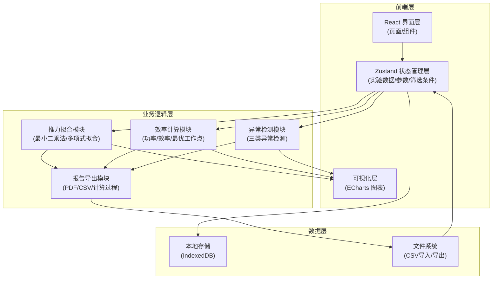
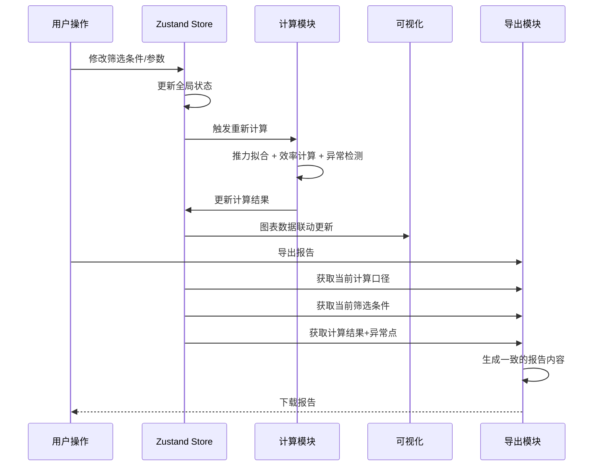

## 1. 架构设计



## 2. 技术描述

- **前端框架**：React 18 + TypeScript
- **构建工具**：Vite 5
- **状态管理**：Zustand（集中管理实验数据、参数配置、筛选条件，确保全链路数据一致性）
- **样式方案**：Tailwind CSS 3
- **图表库**：ECharts 5（专业级图表，支持散点图、折线图、面积图、残差分析）
- **图标库**：Lucide React
- **本地存储**：IndexedDB（通过 dexie.js 封装，持久化实验批次和参数配置）
- **报告导出**：
  - CSV：原生 Blob 导出
  - PDF：html2canvas + jspdf
- **数学计算**：
  - 矩阵运算：math.js
  - 统计分析：自定义实现（最小二乘法、R²计算、残差分析）
- **后端**：无（纯前端应用，所有计算在浏览器端完成）
- **初始化工具**：vite-init

## 3. 路由定义

| 路由 | 页面 | 用途 |
|-------|------|------|
| `/` | Dashboard | 工作台概览 |
| `/experiments` | ExperimentList | 实验批次列表 |
| `/experiments/:id/data` | DataEntry | 数据录入 |
| `/experiments/:id/fitting` | ThrustFitting | 推力拟合分析 |
| `/experiments/:id/efficiency` | EfficiencyAnalysis | 效率曲线分析 |
| `/experiments/:id/anomalies` | AnomalyDetection | 异常检测 |
| `/experiments/:id/report` | ReportExport | 报告导出 |
| `/settings` | Settings | 参数配置 |

## 4. 数据模型

### 4.1 核心数据结构

```typescript
// 实验批次
interface Experiment {
  id: string;
  name: string;
  createdAt: number;
  updatedAt: number;
  description: string;
  environment: EnvironmentParams;
  dataPoints: DataPoint[];
  fittingParams: FittingParams;
  anomalies: AnomalyPoint[];
  fittingResult: FittingResult | null;
  efficiencyResult: EfficiencyResult | null;
}

// 环境参数
interface EnvironmentParams {
  airDensity: number;        // 空气密度 (kg/m³)
  temperature: number;       // 温度 (°C)
  humidity: number;          // 湿度 (%)
  pressure: number;          // 气压 (kPa)
}

// 数据点
interface DataPoint {
  id: string;
  timestamp: number;
  rpm: number;               // 转速 (RPM)
  voltage: number;           // 电压 (V)
  current: number;           // 电流 (A)
  propellerDiameter: number; // 桨径 (inch)
  thrust: number;            // 推力读数 (原始值)
  thrustUnit: 'g' | 'kg' | 'N' | 'lbf';  // 推力单位
  isExcluded: boolean;       // 是否被排除
  notes: string;
}

// 拟合参数
interface FittingParams {
  fitType: 'linear' | 'polynomial' | 'power';
  polynomialDegree: number;  // 多项式次数 (1-5)
  independentVariable: 'rpm' | 'voltage' | 'propellerDiameter';
  controlVariables: {
    rpm?: [number, number];      // 转速控制范围
    voltage?: [number, number];  // 电压控制范围
    propellerDiameter?: number;  // 固定桨径
  };
  thrustUnit: 'g' | 'kg' | 'N' | 'lbf';  // 目标推力单位
  rpmSamplingInterval: number;  // 转速采样间隔 (RPM)
  voltageSagThreshold: number;  // 电压骤降阈值 (%)
  outlierThreshold: number;     // 异常值阈值 (标准差倍数)
}

// 异常点
interface AnomalyPoint {
  id: string;
  dataPointId: string;
  type: 'rpm_missing' | 'voltage_sag' | 'unit_error';
  severity: 'warning' | 'error' | 'critical';
  description: string;
  calculationDetails: {
    expectedValue: number;
    actualValue: number;
    threshold: number;
    deviation: number;
    formula: string;
  };
  isIncludedInReport: boolean;
}

// 拟合结果
interface FittingResult {
  formula: string;           // 拟合公式字符串
  coefficients: number[];    // 系数数组
  rSquared: number;          // 决定系数 R²
  adjustedRSquared: number;  // 调整后的 R²
  residuals: ResidualPoint[];
  confidenceInterval: number; // 置信区间
  impactFactors: {
    rpm: number;             // 转速影响因子
    voltage: number;         // 电压影响因子
    propellerDiameter: number; // 桨径影响因子
  };
  calculationSteps: CalculationStep[];  // 计算过程
}

// 残差点
interface ResidualPoint {
  x: number;
  observed: number;
  predicted: number;
  residual: number;
  standardizedResidual: number;
}

// 效率结果
interface EfficiencyResult {
  efficiencyCurve: EfficiencyPoint[];
  optimalOperatingPoint: {
    rpm: number;
    thrust: number;
    efficiency: number;
    power: number;
  };
  efficientRange: {
    minRpm: number;
    maxRpm: number;
    minEfficiency: number;
  };
  calculationSteps: CalculationStep[];
}

// 效率点
interface EfficiencyPoint {
  rpm: number;
  power: number;             // 输入功率 (W)
  thrust: number;            // 推力 (N)
  efficiency: number;        // 效率 (%)
  thrustPower: number;       // 推力功率 (W)
}

// 计算步骤（用于保留中间过程）
interface CalculationStep {
  step: number;
  description: string;
  formula: string;
  variables: Record<string, number>;
  result: number;
}
```

### 4.2 数据流一致性保障



## 5. 核心算法说明

### 5.1 推力拟合算法（最小二乘法）

```
对于多项式拟合 y = a₀ + a₁x + a₂x² + ... + aₙxⁿ

构造矩阵方程：X * A = Y
其中 X 是范德蒙德矩阵，A 是系数向量，Y 是观测值向量

求解：A = (XᵀX)⁻¹XᵀY

R² = 1 - SS_res / SS_tot
其中 SS_res = Σ(yᵢ - ŷᵢ)², SS_tot = Σ(yᵢ - ȳ)²
```

### 5.2 异常检测算法

| 异常类型 | 检测逻辑 | 中间值保留 |
|---------|---------|-----------|
| 转速缺样 | 相邻数据点转速差 > 采样间隔 × 阈值 | 期望转速、实际转速、差值、阈值 |
| 电压SAG | 电压下降率 > 阈值，且持续超过N个点 | 基准电压、当前电压、下降率、持续点数 |
| 单位错误 | 推力值超出物理合理范围 ± 5σ | 均值、标准差、当前值、Z-score |

### 5.3 效率计算公式

```
输入功率 P_in = V × I  (W)
推力功率 P_thrust = T × v  (理论计算)
推进效率 η = P_thrust / P_in × 100%

其中：
T = 推力 (N)
v = 诱导速度 = √(2T/(ρA))
ρ = 空气密度 (kg/m³)
A = 桨盘面积 = π(D/2)² (m²)
D = 桨径 (m)
```

## 6. 目录结构

```
src/
├── components/          # 通用组件
│   ├── DataTable.tsx    # 可编辑数据表格
│   ├── ChartCard.tsx    # 图表卡片容器
│   ├── AnomalyBadge.tsx # 异常标记徽章
│   ├── ParameterPanel.tsx # 参数面板
│   └── CalculationSteps.tsx # 计算步骤展示
├── pages/               # 页面组件
│   ├── Dashboard.tsx
│   ├── ExperimentList.tsx
│   ├── DataEntry.tsx
│   ├── ThrustFitting.tsx
│   ├── EfficiencyAnalysis.tsx
│   ├── AnomalyDetection.tsx
│   ├── ReportExport.tsx
│   └── Settings.tsx
├── store/               # 状态管理
│   └── useExperimentStore.ts
├── hooks/               # 自定义Hooks
│   ├── useFitting.ts    # 拟合计算Hook
│   ├── useEfficiency.ts # 效率计算Hook
│   ├── useAnomalyDetection.ts # 异常检测Hook
│   └── useExport.ts     # 导出Hook
├── utils/               # 工具函数
│   ├── math.ts          # 数学计算
│   ├── units.ts         # 单位转换
│   ├── storage.ts       # 本地存储
│   └── export.ts        # 导出工具
├── types/               # 类型定义
│   └── index.ts
├── data/                # Mock数据
│   └── sampleData.ts    # 示例实验数据
├── App.tsx
├── main.tsx
└── index.css
```
