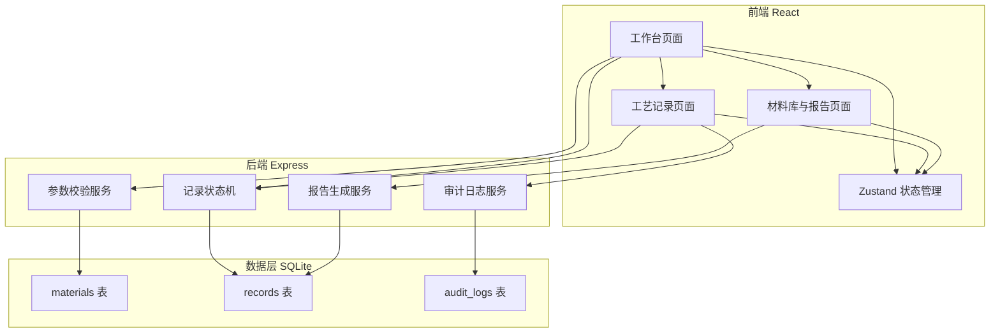
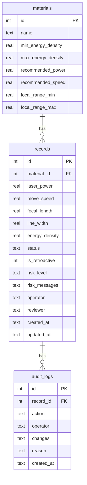

## 1. 架构设计



## 2. 技术说明

- **前端**：React@18 + TypeScript + Tailwind CSS@3 + Vite
- **初始化工具**：vite-init (react-express-ts 模板)
- **后端**：Express@4 + TypeScript (ESM)
- **数据库**：SQLite (better-sqlite3)，零配置嵌入式数据库
- **状态管理**：Zustand
- **路由**：react-router-dom@6

## 3. 路由定义

| 路由 | 用途 |
|------|------|
| `/` | 工作台页面——能量密度计算、参数校验、阈值匹配、参数扫描、风险提示 |
| `/records` | 工艺记录页面——记录列表、状态流转、审计轨迹 |
| `/materials` | 材料库与报告页面——材料阈值管理、报告导出 |

## 4. API 定义

### 4.1 材料相关

```typescript
interface Material {
  id: number;
  name: string;
  min_energy_density: number;   // J/mm² 最低安全能量密度
  max_energy_density: number;   // J/mm² 最高安全能量密度
  recommended_power: number;    // W 推荐功率
  recommended_speed: number;    // mm/s 推荐速度
  focal_range_min: number;      // mm 最小焦距
  focal_range_max: number;      // mm 最大焦距
}

// GET    /api/materials          获取所有材料
// POST   /api/materials          新增材料
// PUT    /api/materials/:id      更新材料
// DELETE /api/materials/:id      删除材料
```

### 4.2 工艺记录相关

```typescript
type RecordStatus = 'draft' | 'validated' | 'approved' | 'archived' | 'withdrawn';

interface ProcessRecord {
  id: number;
  material_id: number;
  material_name: string;
  laser_power: number;           // W
  move_speed: number;            // mm/s
  focal_length: number;          // mm
  line_width: number;            // mm
  energy_density: number;        // J/mm² 计算值
  status: RecordStatus;
  is_retroactive: boolean;       // 是否补录
  risk_level: 'safe' | 'warning' | 'danger';
  risk_messages: string[];       // 风险提示信息
  operator: string;              // 操作人
  reviewer: string | null;       // 审核人
  created_at: string;
  updated_at: string;
}

// GET    /api/records?material=&status=&date_from=&date_to=   查询记录（支持筛选）
// POST   /api/records          新增记录（自动计算能量密度+校验）
// PUT    /api/records/:id      更新记录（仅草稿状态可编辑）
// POST   /api/records/:id/validate   提交校验（草稿→已校验）
// POST   /api/records/:id/approve    审核通过（已校验→已审核）
// POST   /api/records/:id/reject     退回（已校验→草稿）
// POST   /api/records/:id/withdraw   撤回（已审核→草稿/标记撤回）
// POST   /api/records/:id/retroact   补录（直接进入已审核）
// POST   /api/records/:id/archive    归档（已审核→已归档）
// POST   /api/records/:id/reactivate 重新激活（已归档→已审核）
```

### 4.3 审计日志相关

```typescript
interface AuditLog {
  id: number;
  record_id: number;
  action: string;                 // 操作类型：create/update/validate/approve/reject/withdraw/retroact/archive/reactivate
  operator: string;               // 操作人
  changes: { field: string; old_value: any; new_value: any }[];
  reason: string | null;          // 操作原因（撤回/退回必填）
  created_at: string;
}

// GET /api/records/:id/audit-logs   获取某条记录的审计日志
```

### 4.4 参数校验与扫描

```typescript
interface ValidationRequest {
  material_id: number;
  laser_power: number;
  move_speed: number;
  focal_length: number;
  line_width: number;
}

interface ValidationResult {
  energy_density: number;
  risk_level: 'safe' | 'warning' | 'danger';
  errors: string[];    // 阻断性错误
  warnings: string[];  // 警告
  suggestions: string[]; // 建议
}

interface SweepRequest {
  material_id: number;
  sweep_variable: 'power' | 'speed' | 'focal_length';
  range_min: number;
  range_max: number;
  step: number;
  fixed_power?: number;
  fixed_speed?: number;
  fixed_focal_length?: number;
  line_width: number;
}

interface SweepResult {
  variable: string;
  points: { value: number; energy_density: number; risk_level: string }[];
}

// POST /api/validate       参数校验
// POST /api/sweep          参数扫描
```

### 4.5 报告导出

```typescript
interface ReportRequest {
  date_from: string;
  date_to: string;
  material_ids?: number[];
}

// POST /api/reports/generate   生成报告（返回 HTML 字符串）
```

## 5. 数据模型

### 5.1 数据模型定义



### 5.2 数据定义语言

```sql
CREATE TABLE IF NOT EXISTS materials (
  id INTEGER PRIMARY KEY AUTOINCREMENT,
  name TEXT NOT NULL UNIQUE,
  min_energy_density REAL NOT NULL,
  max_energy_density REAL NOT NULL,
  recommended_power REAL NOT NULL,
  recommended_speed REAL NOT NULL,
  focal_range_min REAL NOT NULL,
  focal_range_max REAL NOT NULL
);

CREATE TABLE IF NOT EXISTS records (
  id INTEGER PRIMARY KEY AUTOINCREMENT,
  material_id INTEGER NOT NULL,
  laser_power REAL NOT NULL,
  move_speed REAL NOT NULL,
  focal_length REAL NOT NULL,
  line_width REAL NOT NULL,
  energy_density REAL NOT NULL,
  status TEXT NOT NULL DEFAULT 'draft',
  is_retroactive INTEGER NOT NULL DEFAULT 0,
  risk_level TEXT NOT NULL DEFAULT 'safe',
  risk_messages TEXT NOT NULL DEFAULT '[]',
  operator TEXT NOT NULL DEFAULT '',
  reviewer TEXT,
  created_at TEXT NOT NULL DEFAULT (datetime('now', 'localtime')),
  updated_at TEXT NOT NULL DEFAULT (datetime('now', 'localtime')),
  FOREIGN KEY (material_id) REFERENCES materials(id)
);

CREATE TABLE IF NOT EXISTS audit_logs (
  id INTEGER PRIMARY KEY AUTOINCREMENT,
  record_id INTEGER NOT NULL,
  action TEXT NOT NULL,
  operator TEXT NOT NULL DEFAULT '',
  changes TEXT NOT NULL DEFAULT '[]',
  reason TEXT,
  created_at TEXT NOT NULL DEFAULT (datetime('now', 'localtime')),
  FOREIGN KEY (record_id) REFERENCES records(id)
);

CREATE INDEX IF NOT EXISTS idx_records_material ON records(material_id);
CREATE INDEX IF NOT EXISTS idx_records_status ON records(status);
CREATE INDEX IF NOT EXISTS idx_records_created ON records(created_at);
CREATE INDEX IF NOT EXISTS idx_audit_record ON audit_logs(record_id);

INSERT INTO materials (name, min_energy_density, max_energy_density, recommended_power, recommended_speed, focal_range_min, focal_range_max) VALUES
  ('木材', 0.5, 3.0, 30, 500, 0, 50),
  ('亚克力', 1.0, 5.0, 40, 300, 0, 30),
  ('皮革', 0.3, 2.5, 25, 600, 0, 40),
  ('纸张', 0.1, 1.5, 15, 800, 0, 20),
  ('玻璃', 5.0, 15.0, 80, 100, 0, 10),
  ('金属薄板', 8.0, 25.0, 100, 50, 0, 5);
```

## 6. 参数校验规则

### 6.1 阻断性错误（不可提交）

| 规则 | 条件 | 错误信息 |
|------|------|----------|
| 功率越界 | power < 0 或 power > 100 | 「激光功率 {power}W 超出设备范围 0-100W」 |
| 速度为零 | speed = 0 | 「移动速度不能为0，将导致驻留烧穿」 |
| 速度负值 | speed < 0 | 「移动速度不能为负值」 |
| 速度单位疑似错误 | speed > 10000（疑似输入了 mm/min 而非 mm/s） | 「移动速度 {speed} mm/s 疑似单位错误，是否应输入 {speed/60} mm/s？」 |
| 线宽为零 | line_width = 0 | 「线宽不能为0，将导致能量密度无穷大」 |
| 焦距偏移超限 | focal_length < material.focal_range_min 或 > material.focal_range_max | 「焦距 {focal_length}mm 超出{material}适用范围 {min}-{max}mm」 |

### 6.2 警告（可提交但提示）

| 规则 | 条件 | 警告信息 |
|------|------|----------|
| 能量密度过低 | energy_density < material.min_energy_density | 「能量密度 {E} J/mm² 低于{material}最低阈值 {min}，可能无法刻透」 |
| 能量密度过高 | energy_density > material.max_energy_density | 「能量密度 {E} J/mm² 高于{material}最高阈值 {max}，有过烧风险」 |
| 功率接近上限 | power > 80 | 「功率接近设备上限，建议控制在 80W 以下」 |
| 速度极低 | speed < 10 | 「速度极低，激光驻留时间长，局部热量积聚风险高」 |

### 6.3 建议

| 规则 | 条件 | 建议信息 |
|------|------|----------|
| 偏离推荐参数 | 功率或速度偏离推荐值超过50% | 「当前参数偏离{material}推荐参数较多，可尝试功率 {rec_p}W 速度 {rec_s}mm/s」 |

## 7. 能量密度公式

$$E = \frac{P}{v \times d}$$

- E：能量密度 (J/mm²)
- P：激光功率 (W = J/s)
- v：移动速度 (mm/s)
- d：有效线宽 (mm)

焦距偏移影响：焦距偏离最佳焦点时，光斑增大，有效线宽 d 增大，能量密度降低。近似关系：d_effective ≈ d × (1 + (Δf / f)²)，其中 Δf 为焦距偏移量，f 为最佳焦距。
