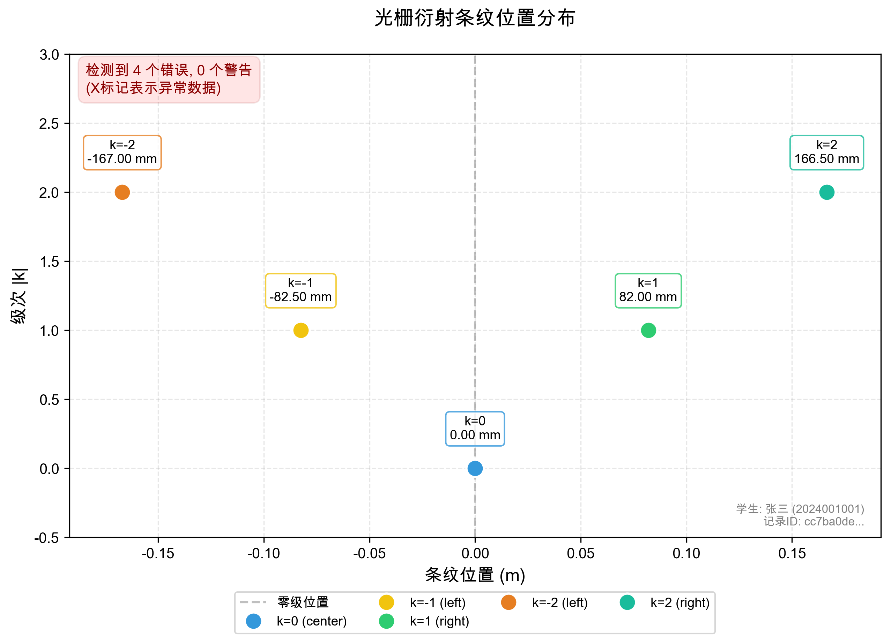
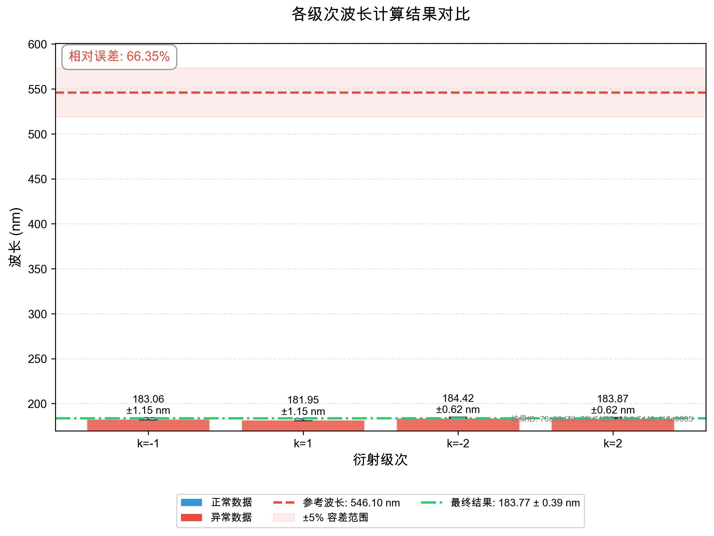
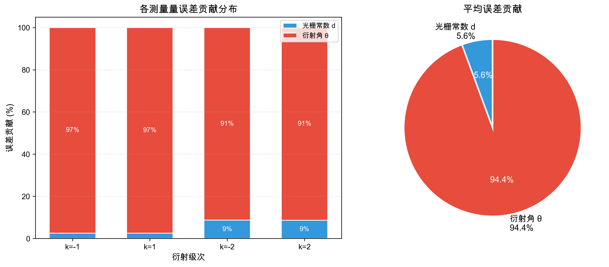
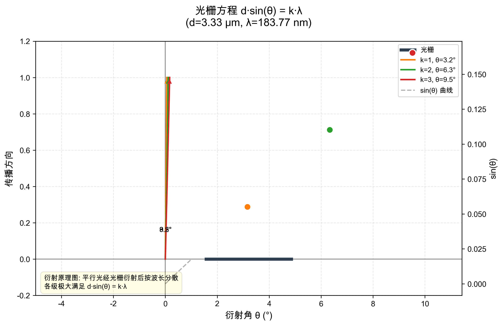

# 光栅衍射测波长 - 实验分析报告

> **学生**: 张三 (2024001001)
> **实验**: 光栅衍射测波长
> **生成时间**: 2026-05-29 07:06:25
> **报告ID**: `edb2f0e0-470d-4010-93ae-e3195f3e15e7`
> **学生记录ID**: `cc7ba0de-1b57-4dbb-85c1-5a7a622531a4`

---

## 1. 实验参数输入

### 1.1 基本参数

| 参数 | 值 | 不确定度 | 来源ID |
|------|----|----------|--------|
| 光栅常数 d | 3.333333e-06 m (3.33 μm) | ±3.333333e-09 m | `2afec8d7...` |
| 屏距 L | 1.5000 m (150.00 cm) | ±2.000000e-03 m | `6a681f1e...` |
| 参考波长 λ₀ | 546.10 nm | - | 标准值 |

### 1.2 条纹位置记录 (共 5 条)

| 级次 k | 侧别 | 位置 (m) | 位置 (mm) | 不确定度 (m) | 来源ID |
|--------|------|----------|-----------|--------------|--------|
| -2 | left | -1.670000e-01 | -167.000 | ±5.000000e-04 | `ca0eb183...` |
| -1 | left | -8.250000e-02 | -82.500 | ±5.000000e-04 | `f24744e6...` |
| 0 | center | 0.000000e+00 | 0.000 | ±5.000000e-04 | `d25db4a2...` |
| 1 | right | 8.200000e-02 | 82.000 | ±5.000000e-04 | `b55e26c4...` |
| 2 | right | 1.665000e-01 | 166.500 | ±5.000000e-04 | `324e2349...` |

---

## 2. 异常检测结果

⚠️  **检测到 4 个严重错误, 0 个警告**

### 1. ❌ 条纹缺失 (ERROR)

**描述**: 第3级条纹缺少左、右侧数据

**建议**: 请检查并补充第3级左、右侧的条纹位置测量

**影响数据**: cc7ba0de-1b57-4dbb-85c1-5a7a622531a4

<details><summary>查看追溯信息</summary>

```json
{
  "source_id": "d36bbe2c-a26b-42be-9dbd-034d18acddec",
  "source_type": "calculated",
  "created_at": "2026-05-29T07:06:25.893954",
  "parent_ids": [
    "cc7ba0de-1b57-4dbb-85c1-5a7a622531a4"
  ],
  "notes": "对称测量可以减小系统误差，建议同时记录左右两侧同级条纹"
}
```

</details>

### 2. ❌ 级次混淆 (ERROR)

**描述**: 第1级和第2级计算的波长不符合比例关系。实测比值 λ(2)/λ(1) = 1.0090，理论比值应为 2.0000，偏差 49.6%

**建议**: 请核对第1级和第2级条纹的级次标记是否正确。常见错误：将k=1记为k=2，或混淆了左右两侧的级次方向。如果数据是角度，检查是否将1级记为了2级。

**影响数据**: 73c56d78-0864-49d5-9319-254f9ebceaa8, 76b71f33-9df4-4a82-b8a3-0c6b6288eeb3, 60db7d48-a5b3-4b22-9026-2e13ed69ca4d, f16c9655-6dda-432e-8a58-be127c11bc33

<details><summary>查看追溯信息</summary>

```json
{
  "source_id": "b4e0bfb2-f9c4-4597-b8d5-b1c0ac6018a0",
  "source_type": "calculated",
  "created_at": "2026-05-29T07:06:25.893976",
  "parent_ids": [
    "73c56d78-0864-49d5-9319-254f9ebceaa8",
    "76b71f33-9df4-4a82-b8a3-0c6b6288eeb3",
    "60db7d48-a5b3-4b22-9026-2e13ed69ca4d",
    "f16c9655-6dda-432e-8a58-be127c11bc33"
  ],
  "notes": "根据光栅方程，λ与级次k成反比（同级条纹）。如果是同一级次的两侧，波长应该接近相等。"
}
```

</details>

### 3. ❌ 级次混淆 (ERROR)

**描述**: 第1级条纹计算波长 183.06 nm 与参考值 546.10 nm 偏差 66.5%。若级次应为 [3]，则波长计算值将在合理范围内。

**建议**: 建议检查该条纹的级次标记。若标记为k=3，则计算波长为 61.02 nm，与参考值更接近。

**影响数据**: 73c56d78-0864-49d5-9319-254f9ebceaa8

<details><summary>查看追溯信息</summary>

```json
{
  "source_id": "d163567a-588c-445a-a6c2-d8e31adcfa0a",
  "source_type": "calculated",
  "created_at": "2026-05-29T07:06:25.893985",
  "parent_ids": [
    "73c56d78-0864-49d5-9319-254f9ebceaa8"
  ],
  "notes": "级次混淆是最常见的错误之一，特别是当条纹较密时容易数错。"
}
```

</details>

### 4. ❌ 级次混淆 (ERROR)

**描述**: 第1级条纹计算波长 181.95 nm 与参考值 546.10 nm 偏差 66.7%。若级次应为 [3]，则波长计算值将在合理范围内。

**建议**: 建议检查该条纹的级次标记。若标记为k=3，则计算波长为 60.65 nm，与参考值更接近。

**影响数据**: 76b71f33-9df4-4a82-b8a3-0c6b6288eeb3

<details><summary>查看追溯信息</summary>

```json
{
  "source_id": "225f08d0-f3ca-45ee-aefe-ff2e1268d60c",
  "source_type": "calculated",
  "created_at": "2026-05-29T07:06:25.893994",
  "parent_ids": [
    "76b71f33-9df4-4a82-b8a3-0c6b6288eeb3"
  ],
  "notes": "级次混淆是最常见的错误之一，特别是当条纹较密时容易数错。"
}
```

</details>

---

## 3. 波长计算结果

| 级次 k | 波长 (nm) | 不确定度 (nm) | 相对不确定度 |
|--------|-----------|---------------|--------------|
| -2 | 184.416 | ±0.625 | 0.34% |
| -1 | 183.057 | ±1.147 | 0.63% |
| 1 | 181.951 | ±1.147 | 0.63% |
| 2 | 183.871 | ±0.624 | 0.34% |

### 3.1 最终结果（加权平均）

**λ = (183.77 ± 0.39) nm**

= (1.837682e-07 ± 3.879101e-10) m

与参考值相对误差: **-66.35%**

---

## 4. 分析过程追溯

### ✅ 衍射计算 (COMPLETED)

**输入**: `{"student_record_id": "cc7ba0de-1b57-4dbb-85c1-5a7a622531a4", "grating_constant": 3.3333333333333337e-06, "screen_distance": 1.5, "fringe_count": 5}`

**输出**: `{"wavelength_results": ["WavelengthResult(source_id='73c56d78-0864-49d5-9319-254f9ebceaa8', source_type=<SourceType.CALCULATED: 'calculated'>, created_at=datetime.datetime(2026, 5, 29, 7, 6, 25, 893778), parent_ids=['2afec8d7-aaa4-4d76-915b-60347b82b2b1', 'f24744e6-e7fd-4e83-b093-fa691cb79bc4', '6a681f1e-8eac-456c-ba6f-3d1b437f05b3', '852e47da-4056-4e4a-9adf-3cb230c49f7f', 'b6df50a9-0b88-45a0-8d7f-25b439e92d07'], notes='由第-1级条纹计算得到的波长', value=1.830566691904516e-07, unit='m', uncertainty=1.1472381946417524e-09, order=-1, fringe_id='f24744e6-e7fd-4e83-b093-fa691cb79bc4')", "WavelengthResult(source_id='76b71f33-9df4-4a82-b8a3-0c6b6288eeb3', source_type=<SourceType.CALCULATED: 'calculated'>, created_at=datetime.datetime(2026, 5, 29, 7, 6, 25, 893789), parent_ids=['2afec8d7-aaa4-4d76-915b-60347b82b2b1', 'b55e26c4-7e48-45ce-90c1-59856d02fe20', '6a681f1e-8eac-456c-ba6f-3d1b437f05b3', '852e47da-4056-4e4a-9adf-3cb230c49f7f', 'b6df50a9-0b88-45a0-8d7f-25b439e92d07'], notes='由第1级条纹计算得到的波长', value=1.819505504839037e-07, unit='m', uncertainty=1.1468113766423017e-09, order=1, fringe_id='b55e26c4-7e48-45ce-90c1-59856d02fe20')", "WavelengthResult(source_id='60db7d48-a5b3-4b22-9026-2e13ed69ca4d', source_type=<SourceType.CALCULATED: 'calculated'>, created_at=datetime.datetime(2026, 5, 29, 7, 6, 25, 893829), parent_ids=['2afec8d7-aaa4-4d76-915b-60347b82b2b1', 'ca0eb183-8202-4001-9950-f132d3effc21', '6a681f1e-8eac-456c-ba6f-3d1b437f05b3', '852e47da-4056-4e4a-9adf-3cb230c49f7f', 'b6df50a9-0b88-45a0-8d7f-25b439e92d07'], notes='由第-2级条纹计算得到的波长', value=1.8441614614721645e-07, unit='m', uncertainty=6.248541094530966e-10, order=-2, fringe_id='ca0eb183-8202-4001-9950-f132d3effc21')", "WavelengthResult(source_id='f16c9655-6dda-432e-8a58-be127c11bc33', source_type=<SourceType.CALCULATED: 'calculated'>, created_at=datetime.datetime(2026, 5, 29, 7, 6, 25, 893845), parent_ids=['2afec8d7-aaa4-4d76-915b-60347b82b2b1', '324e2349-3ac3-4efa-a809-3421bef70dcf', '6a681f1e-8eac-456c-ba6f-3d1b437f05b3', '852e47da-4056-4e4a-9adf-3cb230c49f7f', 'b6df50a9-0b88-45a0-8d7f-25b439e92d07'], notes='由第2级条纹计算得到的波长', value=1.8387073213311737e-07, unit='m', uncertainty=6.244736165959019e-10, order=2, fringe_id='324e2349-3ac3-4efa-a809-3421bef70dcf')"], "traces": [{"angle_calculation": {"fringe_id": "f24744e6-e7fd-4e83-b093-fa691cb79bc4", "screen_distance_id": "6a681f1e-8eac-456c-ba6f-3d1b437f05b3", "calculation_method": "position_to_angle", "raw_inputs": {"fringe_position": -0.0825, "fringe_position_unit": "m", "screen_distance": 1.5, "screen_distance_unit": "m"}}, "grating_equation": {"grating_constant": 3.3333333333333337e-06, "angle_rad": -0.054944642106561366, "angle_deg": -3.148096099562759, "sin_theta": -0.05491700075713548, "order": -1, "equation": "λ = d * sin(θ) / |k|", "calculation": "λ = 3.333333e-06 * -0.054917 / 1 = 1.830567e-07 m"}, "wavelength_nm": 183.0566691904516, "result_id": "73c56d78-0864-49d5-9319-254f9ebceaa8"}, {"angle_calculation": {"fringe_id": "b55e26c4-7e48-45ce-90c1-59856d02fe20", "screen_distance_id": "6a681f1e-8eac-456c-ba6f-3d1b437f05b3", "calculation_method": "position_to_angle", "raw_inputs": {"fringe_position": 0.082, "fringe_position_unit": "m", "screen_distance": 1.5, "screen_distance_unit": "m"}}, "grating_equation": {"grating_constant": 3.3333333333333337e-06, "angle_rad": 0.054612308003370066, "angle_deg": 3.1290547580616326, "sin_theta": 0.0545851651451711, "order": 1, "equation": "λ = d * sin(θ) / |k|", "calculation": "λ = 3.333333e-06 * 0.054585 / 1 = 1.819506e-07 m"}, "wavelength_nm": 181.9505504839037, "result_id": "76b71f33-9df4-4a82-b8a3-0c6b6288eeb3"}, {"angle_calculation": {"fringe_id": "ca0eb183-8202-4001-9950-f132d3effc21", "screen_distance_id": "6a681f1e-8eac-456c-ba6f-3d1b437f05b3", "calculation_method": "position_to_angle", "raw_inputs": {"fringe_position": -0.167, "fringe_position_unit": "m", "screen_distance": 1.5, "screen_distance_unit": "m"}}, "grating_equation": {"grating_constant": 3.3333333333333337e-06, "angle_rad": -0.11087672801166669, "angle_deg": -6.352768561288453, "sin_theta": -0.11064968768832985, "order": -2, "equation": "λ = d * sin(θ) / |k|", "calculation": "λ = 3.333333e-06 * -0.110650 / 2 = 1.844161e-07 m"}, "wavelength_nm": 184.41614614721644, "result_id": "60db7d48-a5b3-4b22-9026-2e13ed69ca4d"}, {"angle_calculation": {"fringe_id": "324e2349-3ac3-4efa-a809-3421bef70dcf", "screen_distance_id": "6a681f1e-8eac-456c-ba6f-3d1b437f05b3", "calculation_method": "position_to_angle", "raw_inputs": {"fringe_position": 0.1665, "fringe_position_unit": "m", "screen_distance": 1.5, "screen_distance_unit": "m"}}, "grating_equation": {"grating_constant": 3.3333333333333337e-06, "angle_rad": 0.1105474637382701, "angle_deg": 6.3339031080783865, "sin_theta": 0.11032243927987041, "order": 2, "equation": "λ = d * sin(θ) / |k|", "calculation": "λ = 3.333333e-06 * 0.110322 / 2 = 1.838707e-07 m"}, "wavelength_nm": 183.87073213311737, "result_id": "f16c9655-6dda-432e-8a58-be127c11bc33"}]}`

<details><summary>查看完整追溯信息</summary>

```json
{
  "source_id": "852e47da-4056-4e4a-9adf-3cb230c49f7f",
  "source_type": "calculated",
  "created_at": "2026-05-29T07:06:25.893660",
  "parent_ids": [
    "cc7ba0de-1b57-4dbb-85c1-5a7a622531a4"
  ],
  "notes": "使用光栅方程 d·sin(θ) = k·λ 从条纹位置反推波长"
}
```

</details>

### ✅ 误差传播分析 (COMPLETED)

**输入**: `{"student_record_id": "cc7ba0de-1b57-4dbb-85c1-5a7a622531a4", "grating_constant_uncertainty": 3.333333333333334e-09, "screen_distance_uncertainty": 0.002, "result_count": 4}`

**输出**: `{"updated_results": ["WavelengthResult(source_id='73c56d78-0864-49d5-9319-254f9ebceaa8', source_type=<SourceType.CALCULATED: 'calculated'>, created_at=datetime.datetime(2026, 5, 29, 7, 6, 25, 893778), parent_ids=['2afec8d7-aaa4-4d76-915b-60347b82b2b1', 'f24744e6-e7fd-4e83-b093-fa691cb79bc4', '6a681f1e-8eac-456c-ba6f-3d1b437f05b3', '852e47da-4056-4e4a-9adf-3cb230c49f7f', 'b6df50a9-0b88-45a0-8d7f-25b439e92d07'], notes='由第-1级条纹计算得到的波长', value=1.830566691904516e-07, unit='m', uncertainty=1.1472381946417524e-09, order=-1, fringe_id='f24744e6-e7fd-4e83-b093-fa691cb79bc4')", "WavelengthResult(source_id='76b71f33-9df4-4a82-b8a3-0c6b6288eeb3', source_type=<SourceType.CALCULATED: 'calculated'>, created_at=datetime.datetime(2026, 5, 29, 7, 6, 25, 893789), parent_ids=['2afec8d7-aaa4-4d76-915b-60347b82b2b1', 'b55e26c4-7e48-45ce-90c1-59856d02fe20', '6a681f1e-8eac-456c-ba6f-3d1b437f05b3', '852e47da-4056-4e4a-9adf-3cb230c49f7f', 'b6df50a9-0b88-45a0-8d7f-25b439e92d07'], notes='由第1级条纹计算得到的波长', value=1.819505504839037e-07, unit='m', uncertainty=1.1468113766423017e-09, order=1, fringe_id='b55e26c4-7e48-45ce-90c1-59856d02fe20')", "WavelengthResult(source_id='60db7d48-a5b3-4b22-9026-2e13ed69ca4d', source_type=<SourceType.CALCULATED: 'calculated'>, created_at=datetime.datetime(2026, 5, 29, 7, 6, 25, 893829), parent_ids=['2afec8d7-aaa4-4d76-915b-60347b82b2b1', 'ca0eb183-8202-4001-9950-f132d3effc21', '6a681f1e-8eac-456c-ba6f-3d1b437f05b3', '852e47da-4056-4e4a-9adf-3cb230c49f7f', 'b6df50a9-0b88-45a0-8d7f-25b439e92d07'], notes='由第-2级条纹计算得到的波长', value=1.8441614614721645e-07, unit='m', uncertainty=6.248541094530966e-10, order=-2, fringe_id='ca0eb183-8202-4001-9950-f132d3effc21')", "WavelengthResult(source_id='f16c9655-6dda-432e-8a58-be127c11bc33', source_type=<SourceType.CALCULATED: 'calculated'>, created_at=datetime.datetime(2026, 5, 29, 7, 6, 25, 893845), parent_ids=['2afec8d7-aaa4-4d76-915b-60347b82b2b1', '324e2349-3ac3-4efa-a809-3421bef70dcf', '6a681f1e-8eac-456c-ba6f-3d1b437f05b3', '852e47da-4056-4e4a-9adf-3cb230c49f7f', 'b6df50a9-0b88-45a0-8d7f-25b439e92d07'], notes='由第2级条纹计算得到的波长', value=1.8387073213311737e-07, unit='m', uncertainty=6.244736165959019e-10, order=2, fringe_id='324e2349-3ac3-4efa-a809-3421bef70dcf')"], "traces": [{"angle_uncertainty": {"method": "position_propagation", "components": {"dtheta/dx": 0.6646560820185605, "dtheta/dL": 0.03655608451102083, "delta_theta_x": 0.0003323280410092803, "delta_theta_L": 7.311216902204167e-05, "delta_theta_rad": 0.00034027535335397636, "formula": "Δθ = √[(∂θ/∂x·Δx)² + (∂θ/∂L·ΔL)²]", "calculation": "Δθ = √[(6.646561e-01×5.000000e-04)² + (3.655608e-02×2.000000e-03)²] = √[3.323280e-04² + 7.311217e-05²] = 3.402754e-04 rad"}, "raw_inputs": {"fringe_position": -0.0825, "fringe_position_uncertainty": 0.0005, "screen_distance": 1.5, "screen_distance_uncertainty": 0.002}}, "components": {"grating_constant": 3.3333333333333337e-06, "grating_constant_uncertainty": 3.333333333333334e-09, "angle_rad": -0.054944642106561366, "angle_deg": -3.148096099562759, "angle_uncertainty_rad": 0.00034027535335397636, "sin_theta": -0.05491700075713548, "cos_theta": 0.9984909228570087, "order": 1, "wavelength_m": 1.830566691904516e-07, "relative_uncertainty_d": 0.001, "relative_uncertainty_theta": 0.006186824606435933, "total_relative_uncertainty": 0.0062671204480846815, "absolute_uncertainty": 1.1472381946417524e-09, "formula": "(Δλ/λ)² = (Δd/d)² + (cot(θ)·Δθ)²", "calculation": "(Δλ/λ)² = (3.333333e-09/3.333333e-06)² + (0.998491/-0.054917×3.402754e-04)²\n       = 1.000000e-06 + 3.827680e-05 = 3.927680e-05\nΔλ/λ = 0.0063 (0.63%)\nΔλ = 1.830567e-07 × 0.0063 = 1.147238e-09 m"}, "result_id": "73c56d78-0864-49d5-9319-254f9ebceaa8", "success": true, "wavelength_nm": 183.0566691904516, "uncertainty_nm": 1.1472381946417525, "relative_uncertainty_percent": 0.6267120448084682}, {"angle_uncertainty": {"method": "position_propagation", "components": {"dtheta/dx": 0.6646803064973829, "dtheta/dL": -0.036335856755190264, "delta_theta_x": 0.00033234015324869144, "delta_theta_L": 7.267171351038054e-05, "delta_theta_rad": 0.0003401928209205752, "formula": "Δθ = √[(∂θ/∂x·Δx)² + (∂θ/∂L·ΔL)²]", "calculation": "Δθ = √[(6.646803e-01×5.000000e-04)² + (3.633586e-02×2.000000e-03)²] = √[3.323402e-04² + 7.267171e-05²] = 3.401928e-04 rad"}, "raw_inputs": {"fringe_position": 0.082, "fringe_position_uncertainty": 0.0005, "screen_distance": 1.5, "screen_distance_uncertainty": 0.002}}, "components": {"grating_constant": 3.3333333333333337e-06, "grating_constant_uncertainty": 3.333333333333334e-09, "angle_rad": 0.054612308003370066, "angle_deg": 3.1290547580616326, "angle_uncertainty_rad": 0.0003401928209205752, "sin_theta": 0.0545851651451711, "cos_theta": 0.9985091185092274, "order": 1, "wavelength_m": 1.819505504839037e-07, "relative_uncertainty_d": 0.001, "relative_uncertainty_theta": 0.006223039407083693, "total_relative_uncertainty": 0.006302873904983072, "absolute_uncertainty": 1.1468113766423017e-09, "formula": "(Δλ/λ)² = (Δd/d)² + (cot(θ)·Δθ)²", "calculation": "(Δλ/λ)² = (3.333333e-09/3.333333e-06)² + (0.998509/0.054585×3.401928e-04)²\n       = 1.000000e-06 + 3.872622e-05 = 3.972622e-05\nΔλ/λ = 0.0063 (0.63%)\nΔλ = 1.819506e-07 × 0.0063 = 1.146811e-09 m"}, "result_id": "76b71f33-9df4-4a82-b8a3-0c6b6288eeb3", "success": true, "wavelength_nm": 181.9505504839037, "uncertainty_nm": 1.1468113766423016, "relative_uncertainty_percent": 0.6302873904983072}, {"angle_uncertainty": {"method": "position_propagation", "components": {"dtheta/dx": 0.6585044310763167, "dtheta/dL": 0.0733134933264966, "delta_theta_x": 0.0003292522155381584, "delta_theta_L": 0.0001466269866529932, "delta_theta_rad": 0.00036042543563367295, "formula": "Δθ = √[(∂θ/∂x·Δx)² + (∂θ/∂L·ΔL)²]", "calculation": "Δθ = √[(6.585044e-01×5.000000e-04)² + (7.331349e-02×2.000000e-03)²] = √[3.292522e-04² + 1.466270e-04²] = 3.604254e-04 rad"}, "raw_inputs": {"fringe_position": -0.167, "fringe_position_uncertainty": 0.0005, "screen_distance": 1.5, "screen_distance_uncertainty": 0.002}}, "components": {"grating_constant": 3.3333333333333337e-06, "grating_constant_uncertainty": 3.333333333333334e-09, "angle_rad": -0.11087672801166669, "angle_deg": -6.352768561288453, "angle_uncertainty_rad": 0.00036042543563367295, "sin_theta": -0.11064968768832985, "cos_theta": 0.9938594702544596, "order": 2, "wavelength_m": 1.8441614614721645e-07, "relative_uncertainty_d": 0.001, "relative_uncertainty_theta": 0.0032373542122784995, "total_relative_uncertainty": 0.003388283089672016, "absolute_uncertainty": 6.248541094530966e-10, "formula": "(Δλ/λ)² = (Δd/d)² + (cot(θ)·Δθ)²", "calculation": "(Δλ/λ)² = (3.333333e-09/3.333333e-06)² + (0.993859/-0.110650×3.604254e-04)²\n       = 1.000000e-06 + 1.048046e-05 = 1.148046e-05\nΔλ/λ = 0.0034 (0.34%)\nΔλ = 1.844161e-07 × 0.0034 = 6.248541e-10 m"}, "result_id": "60db7d48-a5b3-4b22-9026-2e13ed69ca4d", "success": true, "wavelength_nm": 184.41614614721644, "uncertainty_nm": 0.6248541094530966, "relative_uncertainty_percent": 0.3388283089672016}, {"angle_uncertainty": {"method": "position_propagation", "components": {"dtheta/dx": 0.6585526395942262, "dtheta/dL": -0.07309934299495911, "delta_theta_x": 0.0003292763197971131, "delta_theta_L": 0.00014619868598991822, "delta_theta_rad": 0.0003602734386050537, "formula": "Δθ = √[(∂θ/∂x·Δx)² + (∂θ/∂L·ΔL)²]", "calculation": "Δθ = √[(6.585526e-01×5.000000e-04)² + (7.309934e-02×2.000000e-03)²] = √[3.292763e-04² + 1.461987e-04²] = 3.602734e-04 rad"}, "raw_inputs": {"fringe_position": 0.1665, "fringe_position_uncertainty": 0.0005, "screen_distance": 1.5, "screen_distance_uncertainty": 0.002}}, "components": {"grating_constant": 3.3333333333333337e-06, "grating_constant_uncertainty": 3.333333333333334e-09, "angle_rad": 0.1105474637382701, "angle_deg": 6.3339031080783865, "angle_uncertainty_rad": 0.0003602734386050537, "sin_theta": 0.11032243927987041, "cos_theta": 0.9938958493682019, "order": 2, "wavelength_m": 1.8387073213311737e-07, "relative_uncertainty_d": 0.001, "relative_uncertainty_theta": 0.0032457066540995823, "total_relative_uncertainty": 0.0033962643719926025, "absolute_uncertainty": 6.244736165959019e-10, "formula": "(Δλ/λ)² = (Δd/d)² + (cot(θ)·Δθ)²", "calculation": "(Δλ/λ)² = (3.333333e-09/3.333333e-06)² + (0.993896/0.110322×3.602734e-04)²\n       = 1.000000e-06 + 1.053461e-05 = 1.153461e-05\nΔλ/λ = 0.0034 (0.34%)\nΔλ = 1.838707e-07 × 0.0034 = 6.244736e-10 m"}, "result_id": "f16c9655-6dda-432e-8a58-be127c11bc33", "success": true, "wavelength_nm": 183.87073213311737, "uncertainty_nm": 0.6244736165959018, "relative_uncertainty_percent": 0.3396264371992602}], "final_uncertainty": 3.8791008245480897e-10, "final_trace": {"individual_results": [{"order": -1, "wavelength_m": 1.830566691904516e-07, "wavelength_nm": 183.0566691904516, "uncertainty_m": 1.1472381946417524e-09, "uncertainty_nm": 1.1472381946417525, "weight": 0.11432861459023398}, {"order": 1, "wavelength_m": 1.819505504839037e-07, "wavelength_nm": 181.9505504839037, "uncertainty_m": 1.1468113766423017e-09, "uncertainty_nm": 1.1468113766423016, "weight": 0.11441373162383538}, {"order": -2, "wavelength_m": 1.8441614614721645e-07, "wavelength_nm": 184.41614614721644, "uncertainty_m": 6.248541094530966e-10, "uncertainty_nm": 0.6248541094530966, "weight": 0.3853939341622721}, {"order": 2, "wavelength_m": 1.8387073213311737e-07, "wavelength_nm": 183.87073213311737, "uncertainty_m": 6.244736165959019e-10, "uncertainty_nm": 0.6244736165959018, "weight": 0.3858637196236585}], "weighted_average_m": 1.8376816554945187e-07, "weighted_average_nm": 183.76816554945188, "final_uncertainty_m": 3.8791008245480897e-10, "final_uncertainty_nm": 0.38791008245480896, "relative_uncertainty_percent": 0.21108665981128416, "formula": "加权平均: λ_avg = Σ(w_i·λ_i), 其中 w_i = 1/σ_i²\n不确定度: σ_avg = 1/√(Σ1/σ_i²)"}}`

<details><summary>查看完整追溯信息</summary>

```json
{
  "source_id": "b6df50a9-0b88-45a0-8d7f-25b439e92d07",
  "source_type": "calculated",
  "created_at": "2026-05-29T07:06:25.893872",
  "parent_ids": [
    "cc7ba0de-1b57-4dbb-85c1-5a7a622531a4",
    "73c56d78-0864-49d5-9319-254f9ebceaa8",
    "76b71f33-9df4-4a82-b8a3-0c6b6288eeb3",
    "60db7d48-a5b3-4b22-9026-2e13ed69ca4d",
    "f16c9655-6dda-432e-8a58-be127c11bc33"
  ],
  "notes": "基于误差传播公式计算各测量量不确定度对波长的影响"
}
```

</details>

### ✅ 异常检测 (COMPLETED)

**输入**: `{"student_record_id": "cc7ba0de-1b57-4dbb-85c1-5a7a622531a4", "fringe_count": 5, "result_count": 4, "detection_types": ["条纹缺失", "级次混淆", "角度单位错误", "对称性异常", "数据不一致"]}`

**输出**: `{"anomalies": ["Anomaly(source_id='d36bbe2c-a26b-42be-9dbd-034d18acddec', source_type=<SourceType.CALCULATED: 'calculated'>, created_at=datetime.datetime(2026, 5, 29, 7, 6, 25, 893954), parent_ids=['cc7ba0de-1b57-4dbb-85c1-5a7a622531a4'], notes='对称测量可以减小系统误差，建议同时记录左右两侧同级条纹', anomaly_type='条纹缺失', severity='error', description='第3级条纹缺少左、右侧数据', affected_ids=['cc7ba0de-1b57-4dbb-85c1-5a7a622531a4'], suggestion='请检查并补充第3级左、右侧的条纹位置测量')", "Anomaly(source_id='b4e0bfb2-f9c4-4597-b8d5-b1c0ac6018a0', source_type=<SourceType.CALCULATED: 'calculated'>, created_at=datetime.datetime(2026, 5, 29, 7, 6, 25, 893976), parent_ids=['73c56d78-0864-49d5-9319-254f9ebceaa8', '76b71f33-9df4-4a82-b8a3-0c6b6288eeb3', '60db7d48-a5b3-4b22-9026-2e13ed69ca4d', 'f16c9655-6dda-432e-8a58-be127c11bc33'], notes='根据光栅方程，λ与级次k成反比（同级条纹）。如果是同一级次的两侧，波长应该接近相等。', anomaly_type='级次混淆', severity='error', description='第1级和第2级计算的波长不符合比例关系。实测比值 λ(2)/λ(1) = 1.0090，理论比值应为 2.0000，偏差 49.6%', affected_ids=['73c56d78-0864-49d5-9319-254f9ebceaa8', '76b71f33-9df4-4a82-b8a3-0c6b6288eeb3', '60db7d48-a5b3-4b22-9026-2e13ed69ca4d', 'f16c9655-6dda-432e-8a58-be127c11bc33'], suggestion='请核对第1级和第2级条纹的级次标记是否正确。常见错误：将k=1记为k=2，或混淆了左右两侧的级次方向。如果数据是角度，检查是否将1级记为了2级。')", "Anomaly(source_id='d163567a-588c-445a-a6c2-d8e31adcfa0a', source_type=<SourceType.CALCULATED: 'calculated'>, created_at=datetime.datetime(2026, 5, 29, 7, 6, 25, 893985), parent_ids=['73c56d78-0864-49d5-9319-254f9ebceaa8'], notes='级次混淆是最常见的错误之一，特别是当条纹较密时容易数错。', anomaly_type='级次混淆', severity='error', description='第1级条纹计算波长 183.06 nm 与参考值 546.10 nm 偏差 66.5%。若级次应为 [3]，则波长计算值将在合理范围内。', affected_ids=['73c56d78-0864-49d5-9319-254f9ebceaa8'], suggestion='建议检查该条纹的级次标记。若标记为k=3，则计算波长为 61.02 nm，与参考值更接近。')", "Anomaly(source_id='225f08d0-f3ca-45ee-aefe-ff2e1268d60c', source_type=<SourceType.CALCULATED: 'calculated'>, created_at=datetime.datetime(2026, 5, 29, 7, 6, 25, 893994), parent_ids=['76b71f33-9df4-4a82-b8a3-0c6b6288eeb3'], notes='级次混淆是最常见的错误之一，特别是当条纹较密时容易数错。', anomaly_type='级次混淆', severity='error', description='第1级条纹计算波长 181.95 nm 与参考值 546.10 nm 偏差 66.7%。若级次应为 [3]，则波长计算值将在合理范围内。', affected_ids=['76b71f33-9df4-4a82-b8a3-0c6b6288eeb3'], suggestion='建议检查该条纹的级次标记。若标记为k=3，则计算波长为 60.65 nm，与参考值更接近。')"], "trace": {"条纹缺失": 1, "角度单位错误": 0, "对称性异常": 0, "级次混淆": 3, "数据不一致": 0, "总异常数": 4, "严重错误": 4, "警告": 0}}`

<details><summary>查看完整追溯信息</summary>

```json
{
  "source_id": "9fd4a065-192b-4b1c-98aa-e6ef05772622",
  "source_type": "calculated",
  "created_at": "2026-05-29T07:06:25.893940",
  "parent_ids": [
    "cc7ba0de-1b57-4dbb-85c1-5a7a622531a4",
    "73c56d78-0864-49d5-9319-254f9ebceaa8",
    "76b71f33-9df4-4a82-b8a3-0c6b6288eeb3",
    "60db7d48-a5b3-4b22-9026-2e13ed69ca4d",
    "f16c9655-6dda-432e-8a58-be127c11bc33"
  ],
  "notes": "检测条纹缺失、级次混淆、角度单位错误等常见实验问题"
}
```

</details>

---

## 5. 可视化图表

### 5.1 条纹位置分布



### 5.2 波长计算结果对比



### 5.3 误差来源分析



### 5.4 光栅衍射原理图



---

## 6. 结论

暂无结论

---

*本报告由光栅衍射分析系统自动生成 | 所有数据均可追溯*
