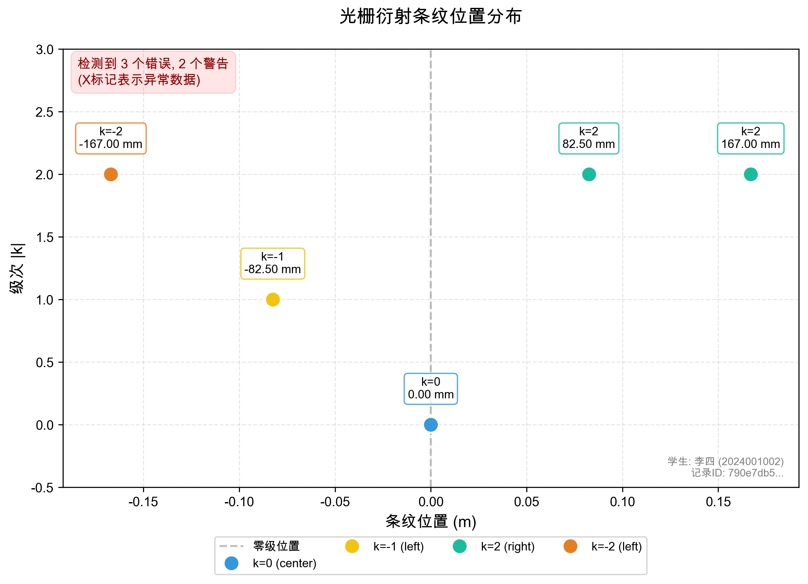
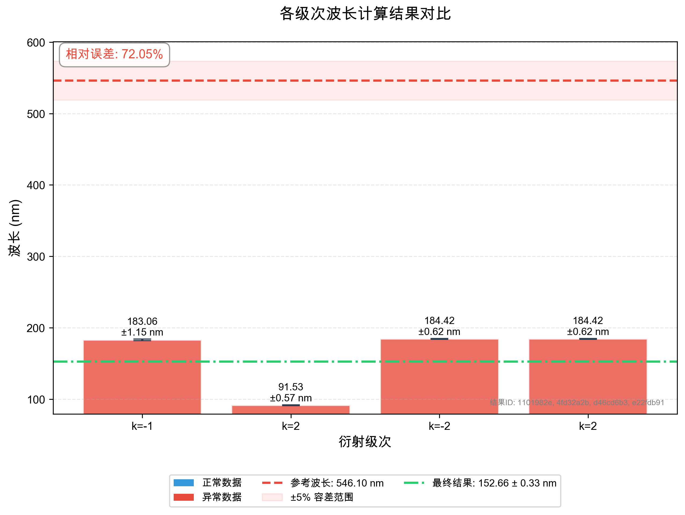
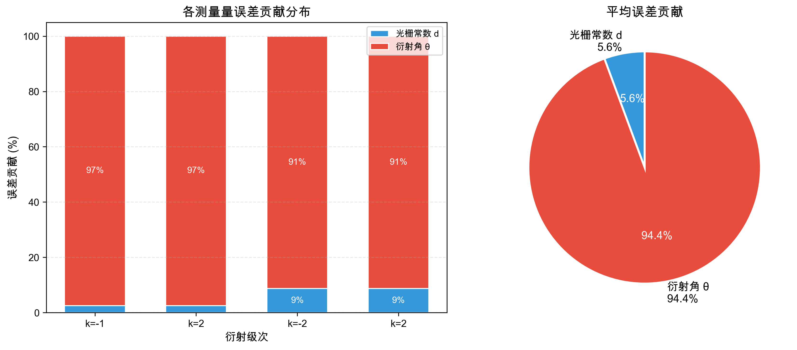
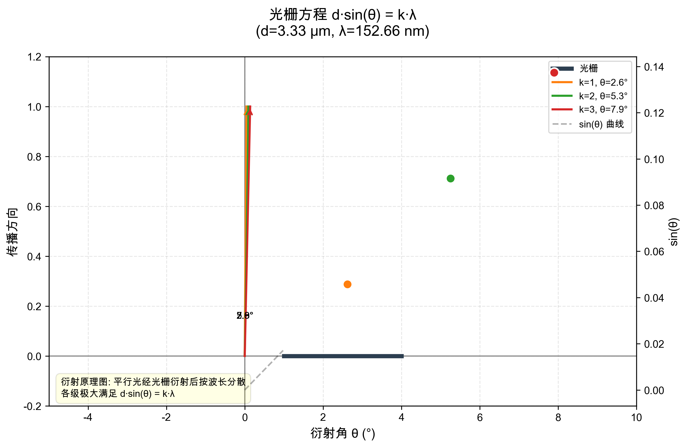

# 光栅衍射测波长 - 实验分析报告

> **学生**: 李四 (2024001002)
> **实验**: 光栅衍射测波长
> **生成时间**: 2026-05-29 07:06:57
> **报告ID**: `06122dbb-8695-4dfa-9e76-f548f15dc3e8`
> **学生记录ID**: `790e7db5-6f80-4190-a72a-41f7c71d69a6`

---

## 1. 实验参数输入

### 1.1 基本参数

| 参数 | 值 | 不确定度 | 来源ID |
|------|----|----------|--------|
| 光栅常数 d | 3.333333e-06 m (3.33 μm) | ±3.333333e-09 m | `91216808...` |
| 屏距 L | 1.5000 m (150.00 cm) | ±2.000000e-03 m | `c015d753...` |
| 参考波长 λ₀ | 546.10 nm | - | 标准值 |

### 1.2 条纹位置记录 (共 5 条)

| 级次 k | 侧别 | 位置 (m) | 位置 (mm) | 不确定度 (m) | 来源ID |
|--------|------|----------|-----------|--------------|--------|
| -2 | left | -1.670000e-01 | -167.000 | ±5.000000e-04 | `9cf8c5ba...` |
| -1 | left | -8.250000e-02 | -82.500 | ±5.000000e-04 | `26a0a0d2...` |
| 0 | center | 0.000000e+00 | 0.000 | ±5.000000e-04 | `36b33753...` |
| 2 | right | 8.250000e-02 | 82.500 | ±5.000000e-04 | `9f99f121...` |
| 2 | right | 1.670000e-01 | 167.000 | ±5.000000e-04 | `26845b57...` |

---

## 2. 异常检测结果

⚠️  **检测到 3 个严重错误, 2 个警告**

### 1. ⚠️ 条纹缺失 (WARNING)

**描述**: 第1级条纹缺少右侧数据

**建议**: 请检查并补充第1级右侧的条纹位置测量

**影响数据**: 790e7db5-6f80-4190-a72a-41f7c71d69a6

<details><summary>查看追溯信息</summary>

```json
{
  "source_id": "927dbd5c-be23-4d71-88b5-056c5e00303a",
  "source_type": "calculated",
  "created_at": "2026-05-29T07:06:57.100625",
  "parent_ids": [
    "790e7db5-6f80-4190-a72a-41f7c71d69a6"
  ],
  "notes": "对称测量可以减小系统误差，建议同时记录左右两侧同级条纹"
}
```

</details>

### 2. ❌ 条纹缺失 (ERROR)

**描述**: 第3级条纹缺少左、右侧数据

**建议**: 请检查并补充第3级左、右侧的条纹位置测量

**影响数据**: 790e7db5-6f80-4190-a72a-41f7c71d69a6

<details><summary>查看追溯信息</summary>

```json
{
  "source_id": "8b1afab1-3a92-42f2-9ff0-c3c2f7ef04b9",
  "source_type": "calculated",
  "created_at": "2026-05-29T07:06:57.100631",
  "parent_ids": [
    "790e7db5-6f80-4190-a72a-41f7c71d69a6"
  ],
  "notes": "对称测量可以减小系统误差，建议同时记录左右两侧同级条纹"
}
```

</details>

### 3. ❌ 级次混淆 (ERROR)

**描述**: 第1级和第2级计算的波长不符合比例关系。实测比值 λ(2)/λ(1) = 0.8383，理论比值应为 2.0000，偏差 58.1%

**建议**: 请核对第1级和第2级条纹的级次标记是否正确。常见错误：将k=1记为k=2，或混淆了左右两侧的级次方向。如果数据是角度，检查是否将1级记为了2级。

**影响数据**: 1101982e-4ec0-4187-b0cd-5fe3f4d0b824, 4fd32a2b-9e41-4e55-b5ad-1415ca90a557, d46cd6b3-01f6-4575-aaa2-182d2bfc54b3, e22fdb91-2362-4f6d-b4b1-e42d30d47419

<details><summary>查看追溯信息</summary>

```json
{
  "source_id": "29e22bbb-b633-44d7-93ef-9ff9030661d4",
  "source_type": "calculated",
  "created_at": "2026-05-29T07:06:57.100649",
  "parent_ids": [
    "1101982e-4ec0-4187-b0cd-5fe3f4d0b824",
    "4fd32a2b-9e41-4e55-b5ad-1415ca90a557",
    "d46cd6b3-01f6-4575-aaa2-182d2bfc54b3",
    "e22fdb91-2362-4f6d-b4b1-e42d30d47419"
  ],
  "notes": "根据光栅方程，λ与级次k成反比（同级条纹）。如果是同一级次的两侧，波长应该接近相等。"
}
```

</details>

### 4. ❌ 级次混淆 (ERROR)

**描述**: 第1级条纹计算波长 183.06 nm 与参考值 546.10 nm 偏差 66.5%。若级次应为 [3]，则波长计算值将在合理范围内。

**建议**: 建议检查该条纹的级次标记。若标记为k=3，则计算波长为 61.02 nm，与参考值更接近。

**影响数据**: 1101982e-4ec0-4187-b0cd-5fe3f4d0b824

<details><summary>查看追溯信息</summary>

```json
{
  "source_id": "64738fd2-4da4-4678-8245-a27baa8ce500",
  "source_type": "calculated",
  "created_at": "2026-05-29T07:06:57.100657",
  "parent_ids": [
    "1101982e-4ec0-4187-b0cd-5fe3f4d0b824"
  ],
  "notes": "级次混淆是最常见的错误之一，特别是当条纹较密时容易数错。"
}
```

</details>

### 5. ⚠️ 数据不一致 (WARNING)

**描述**: 各组波长计算值离散度较大，变异系数 CV = 24.9% (阈值: 10%)。平均值 = 160.85 nm，标准差 = 40.03 nm。

**建议**: 请检查各条数据的测量和记录是否正确。离群点可能对应测量错误或级次混淆。可以考虑使用格拉布斯检验法剔除异常值。

**影响数据**: 1101982e-4ec0-4187-b0cd-5fe3f4d0b824, 4fd32a2b-9e41-4e55-b5ad-1415ca90a557, d46cd6b3-01f6-4575-aaa2-182d2bfc54b3, e22fdb91-2362-4f6d-b4b1-e42d30d47419

<details><summary>查看追溯信息</summary>

```json
{
  "source_id": "7e1a7438-8cba-49ad-a6fc-c657788db29a",
  "source_type": "calculated",
  "created_at": "2026-05-29T07:06:57.100668",
  "parent_ids": [
    "1101982e-4ec0-4187-b0cd-5fe3f4d0b824",
    "4fd32a2b-9e41-4e55-b5ad-1415ca90a557",
    "d46cd6b3-01f6-4575-aaa2-182d2bfc54b3",
    "e22fdb91-2362-4f6d-b4b1-e42d30d47419"
  ],
  "notes": "变异系数(CV) = 标准差/平均值。CV > 10% 通常表示数据质量需要关注。"
}
```

</details>

---

## 3. 波长计算结果

| 级次 k | 波长 (nm) | 不确定度 (nm) | 相对不确定度 |
|--------|-----------|---------------|--------------|
| -2 | 184.416 | ±0.625 | 0.34% |
| -1 | 183.057 | ±1.147 | 0.63% |
| 2 | 91.528 | ±0.574 | 0.63% |
| 2 | 184.416 | ±0.625 | 0.34% |

### 3.1 最终结果（加权平均）

**λ = (152.66 ± 0.33) nm**

= (1.526571e-07 ± 3.347997e-10) m

与参考值相对误差: **-72.05%**

---

## 4. 分析过程追溯

### ✅ 衍射计算 (COMPLETED)

**输入**: `{"student_record_id": "790e7db5-6f80-4190-a72a-41f7c71d69a6", "grating_constant": 3.3333333333333337e-06, "screen_distance": 1.5, "fringe_count": 5}`

**输出**: `{"wavelength_results": ["WavelengthResult(source_id='1101982e-4ec0-4187-b0cd-5fe3f4d0b824', source_type=<SourceType.CALCULATED: 'calculated'>, created_at=datetime.datetime(2026, 5, 29, 7, 6, 57, 100509), parent_ids=['91216808-2636-45bc-97d8-a7b51782a115', '26a0a0d2-fba0-4d64-9ebd-599fc8d9d5f7', 'c015d753-5db9-428b-b3fd-4aa2db50692e', '78729240-b36e-49a8-ba1d-c818ddd29115', '2e483318-df16-445c-a393-b383b143feef'], notes='由第-1级条纹计算得到的波长', value=1.830566691904516e-07, unit='m', uncertainty=1.1472381946417524e-09, order=-1, fringe_id='26a0a0d2-fba0-4d64-9ebd-599fc8d9d5f7')", "WavelengthResult(source_id='4fd32a2b-9e41-4e55-b5ad-1415ca90a557', source_type=<SourceType.CALCULATED: 'calculated'>, created_at=datetime.datetime(2026, 5, 29, 7, 6, 57, 100519), parent_ids=['91216808-2636-45bc-97d8-a7b51782a115', '9f99f121-1a9c-48eb-a87a-3ba9aeebc0b7', 'c015d753-5db9-428b-b3fd-4aa2db50692e', '78729240-b36e-49a8-ba1d-c818ddd29115', '2e483318-df16-445c-a393-b383b143feef'], notes='由第2级条纹计算得到的波长', value=9.15283345952258e-08, unit='m', uncertainty=5.736190973208762e-10, order=2, fringe_id='9f99f121-1a9c-48eb-a87a-3ba9aeebc0b7')", "WavelengthResult(source_id='d46cd6b3-01f6-4575-aaa2-182d2bfc54b3', source_type=<SourceType.CALCULATED: 'calculated'>, created_at=datetime.datetime(2026, 5, 29, 7, 6, 57, 100526), parent_ids=['91216808-2636-45bc-97d8-a7b51782a115', '9cf8c5ba-5240-4b2b-8280-674602318fe4', 'c015d753-5db9-428b-b3fd-4aa2db50692e', '78729240-b36e-49a8-ba1d-c818ddd29115', '2e483318-df16-445c-a393-b383b143feef'], notes='由第-2级条纹计算得到的波长', value=1.8441614614721645e-07, unit='m', uncertainty=6.248541094530966e-10, order=-2, fringe_id='9cf8c5ba-5240-4b2b-8280-674602318fe4')", "WavelengthResult(source_id='e22fdb91-2362-4f6d-b4b1-e42d30d47419', source_type=<SourceType.CALCULATED: 'calculated'>, created_at=datetime.datetime(2026, 5, 29, 7, 6, 57, 100532), parent_ids=['91216808-2636-45bc-97d8-a7b51782a115', '26845b57-ddbe-4657-b52e-1fb0347cc848', 'c015d753-5db9-428b-b3fd-4aa2db50692e', '78729240-b36e-49a8-ba1d-c818ddd29115', '2e483318-df16-445c-a393-b383b143feef'], notes='由第2级条纹计算得到的波长', value=1.8441614614721645e-07, unit='m', uncertainty=6.248541094530966e-10, order=2, fringe_id='26845b57-ddbe-4657-b52e-1fb0347cc848')"], "traces": [{"angle_calculation": {"fringe_id": "26a0a0d2-fba0-4d64-9ebd-599fc8d9d5f7", "screen_distance_id": "c015d753-5db9-428b-b3fd-4aa2db50692e", "calculation_method": "position_to_angle", "raw_inputs": {"fringe_position": -0.0825, "fringe_position_unit": "m", "screen_distance": 1.5, "screen_distance_unit": "m"}}, "grating_equation": {"grating_constant": 3.3333333333333337e-06, "angle_rad": -0.054944642106561366, "angle_deg": -3.148096099562759, "sin_theta": -0.05491700075713548, "order": -1, "equation": "λ = d * sin(θ) / |k|", "calculation": "λ = 3.333333e-06 * -0.054917 / 1 = 1.830567e-07 m"}, "wavelength_nm": 183.0566691904516, "result_id": "1101982e-4ec0-4187-b0cd-5fe3f4d0b824"}, {"angle_calculation": {"fringe_id": "9f99f121-1a9c-48eb-a87a-3ba9aeebc0b7", "screen_distance_id": "c015d753-5db9-428b-b3fd-4aa2db50692e", "calculation_method": "position_to_angle", "raw_inputs": {"fringe_position": 0.0825, "fringe_position_unit": "m", "screen_distance": 1.5, "screen_distance_unit": "m"}}, "grating_equation": {"grating_constant": 3.3333333333333337e-06, "angle_rad": 0.054944642106561366, "angle_deg": 3.148096099562759, "sin_theta": 0.05491700075713548, "order": 2, "equation": "λ = d * sin(θ) / |k|", "calculation": "λ = 3.333333e-06 * 0.054917 / 2 = 9.152833e-08 m"}, "wavelength_nm": 91.5283345952258, "result_id": "4fd32a2b-9e41-4e55-b5ad-1415ca90a557"}, {"angle_calculation": {"fringe_id": "9cf8c5ba-5240-4b2b-8280-674602318fe4", "screen_distance_id": "c015d753-5db9-428b-b3fd-4aa2db50692e", "calculation_method": "position_to_angle", "raw_inputs": {"fringe_position": -0.167, "fringe_position_unit": "m", "screen_distance": 1.5, "screen_distance_unit": "m"}}, "grating_equation": {"grating_constant": 3.3333333333333337e-06, "angle_rad": -0.11087672801166669, "angle_deg": -6.352768561288453, "sin_theta": -0.11064968768832985, "order": -2, "equation": "λ = d * sin(θ) / |k|", "calculation": "λ = 3.333333e-06 * -0.110650 / 2 = 1.844161e-07 m"}, "wavelength_nm": 184.41614614721644, "result_id": "d46cd6b3-01f6-4575-aaa2-182d2bfc54b3"}, {"angle_calculation": {"fringe_id": "26845b57-ddbe-4657-b52e-1fb0347cc848", "screen_distance_id": "c015d753-5db9-428b-b3fd-4aa2db50692e", "calculation_method": "position_to_angle", "raw_inputs": {"fringe_position": 0.167, "fringe_position_unit": "m", "screen_distance": 1.5, "screen_distance_unit": "m"}}, "grating_equation": {"grating_constant": 3.3333333333333337e-06, "angle_rad": 0.11087672801166669, "angle_deg": 6.352768561288453, "sin_theta": 0.11064968768832985, "order": 2, "equation": "λ = d * sin(θ) / |k|", "calculation": "λ = 3.333333e-06 * 0.110650 / 2 = 1.844161e-07 m"}, "wavelength_nm": 184.41614614721644, "result_id": "e22fdb91-2362-4f6d-b4b1-e42d30d47419"}]}`

<details><summary>查看完整追溯信息</summary>

```json
{
  "source_id": "78729240-b36e-49a8-ba1d-c818ddd29115",
  "source_type": "calculated",
  "created_at": "2026-05-29T07:06:57.100487",
  "parent_ids": [
    "790e7db5-6f80-4190-a72a-41f7c71d69a6"
  ],
  "notes": "使用光栅方程 d·sin(θ) = k·λ 从条纹位置反推波长"
}
```

</details>

### ✅ 误差传播分析 (COMPLETED)

**输入**: `{"student_record_id": "790e7db5-6f80-4190-a72a-41f7c71d69a6", "grating_constant_uncertainty": 3.333333333333334e-09, "screen_distance_uncertainty": 0.002, "result_count": 4}`

**输出**: `{"updated_results": ["WavelengthResult(source_id='1101982e-4ec0-4187-b0cd-5fe3f4d0b824', source_type=<SourceType.CALCULATED: 'calculated'>, created_at=datetime.datetime(2026, 5, 29, 7, 6, 57, 100509), parent_ids=['91216808-2636-45bc-97d8-a7b51782a115', '26a0a0d2-fba0-4d64-9ebd-599fc8d9d5f7', 'c015d753-5db9-428b-b3fd-4aa2db50692e', '78729240-b36e-49a8-ba1d-c818ddd29115', '2e483318-df16-445c-a393-b383b143feef'], notes='由第-1级条纹计算得到的波长', value=1.830566691904516e-07, unit='m', uncertainty=1.1472381946417524e-09, order=-1, fringe_id='26a0a0d2-fba0-4d64-9ebd-599fc8d9d5f7')", "WavelengthResult(source_id='4fd32a2b-9e41-4e55-b5ad-1415ca90a557', source_type=<SourceType.CALCULATED: 'calculated'>, created_at=datetime.datetime(2026, 5, 29, 7, 6, 57, 100519), parent_ids=['91216808-2636-45bc-97d8-a7b51782a115', '9f99f121-1a9c-48eb-a87a-3ba9aeebc0b7', 'c015d753-5db9-428b-b3fd-4aa2db50692e', '78729240-b36e-49a8-ba1d-c818ddd29115', '2e483318-df16-445c-a393-b383b143feef'], notes='由第2级条纹计算得到的波长', value=9.15283345952258e-08, unit='m', uncertainty=5.736190973208762e-10, order=2, fringe_id='9f99f121-1a9c-48eb-a87a-3ba9aeebc0b7')", "WavelengthResult(source_id='d46cd6b3-01f6-4575-aaa2-182d2bfc54b3', source_type=<SourceType.CALCULATED: 'calculated'>, created_at=datetime.datetime(2026, 5, 29, 7, 6, 57, 100526), parent_ids=['91216808-2636-45bc-97d8-a7b51782a115', '9cf8c5ba-5240-4b2b-8280-674602318fe4', 'c015d753-5db9-428b-b3fd-4aa2db50692e', '78729240-b36e-49a8-ba1d-c818ddd29115', '2e483318-df16-445c-a393-b383b143feef'], notes='由第-2级条纹计算得到的波长', value=1.8441614614721645e-07, unit='m', uncertainty=6.248541094530966e-10, order=-2, fringe_id='9cf8c5ba-5240-4b2b-8280-674602318fe4')", "WavelengthResult(source_id='e22fdb91-2362-4f6d-b4b1-e42d30d47419', source_type=<SourceType.CALCULATED: 'calculated'>, created_at=datetime.datetime(2026, 5, 29, 7, 6, 57, 100532), parent_ids=['91216808-2636-45bc-97d8-a7b51782a115', '26845b57-ddbe-4657-b52e-1fb0347cc848', 'c015d753-5db9-428b-b3fd-4aa2db50692e', '78729240-b36e-49a8-ba1d-c818ddd29115', '2e483318-df16-445c-a393-b383b143feef'], notes='由第2级条纹计算得到的波长', value=1.8441614614721645e-07, unit='m', uncertainty=6.248541094530966e-10, order=2, fringe_id='26845b57-ddbe-4657-b52e-1fb0347cc848')"], "traces": [{"angle_uncertainty": {"method": "position_propagation", "components": {"dtheta/dx": 0.6646560820185605, "dtheta/dL": 0.03655608451102083, "delta_theta_x": 0.0003323280410092803, "delta_theta_L": 7.311216902204167e-05, "delta_theta_rad": 0.00034027535335397636, "formula": "Δθ = √[(∂θ/∂x·Δx)² + (∂θ/∂L·ΔL)²]", "calculation": "Δθ = √[(6.646561e-01×5.000000e-04)² + (3.655608e-02×2.000000e-03)²] = √[3.323280e-04² + 7.311217e-05²] = 3.402754e-04 rad"}, "raw_inputs": {"fringe_position": -0.0825, "fringe_position_uncertainty": 0.0005, "screen_distance": 1.5, "screen_distance_uncertainty": 0.002}}, "components": {"grating_constant": 3.3333333333333337e-06, "grating_constant_uncertainty": 3.333333333333334e-09, "angle_rad": -0.054944642106561366, "angle_deg": -3.148096099562759, "angle_uncertainty_rad": 0.00034027535335397636, "sin_theta": -0.05491700075713548, "cos_theta": 0.9984909228570087, "order": 1, "wavelength_m": 1.830566691904516e-07, "relative_uncertainty_d": 0.001, "relative_uncertainty_theta": 0.006186824606435933, "total_relative_uncertainty": 0.0062671204480846815, "absolute_uncertainty": 1.1472381946417524e-09, "formula": "(Δλ/λ)² = (Δd/d)² + (cot(θ)·Δθ)²", "calculation": "(Δλ/λ)² = (3.333333e-09/3.333333e-06)² + (0.998491/-0.054917×3.402754e-04)²\n       = 1.000000e-06 + 3.827680e-05 = 3.927680e-05\nΔλ/λ = 0.0063 (0.63%)\nΔλ = 1.830567e-07 × 0.0063 = 1.147238e-09 m"}, "result_id": "1101982e-4ec0-4187-b0cd-5fe3f4d0b824", "success": true, "wavelength_nm": 183.0566691904516, "uncertainty_nm": 1.1472381946417525, "relative_uncertainty_percent": 0.6267120448084682}, {"angle_uncertainty": {"method": "position_propagation", "components": {"dtheta/dx": 0.6646560820185605, "dtheta/dL": -0.03655608451102083, "delta_theta_x": 0.0003323280410092803, "delta_theta_L": 7.311216902204167e-05, "delta_theta_rad": 0.00034027535335397636, "formula": "Δθ = √[(∂θ/∂x·Δx)² + (∂θ/∂L·ΔL)²]", "calculation": "Δθ = √[(6.646561e-01×5.000000e-04)² + (3.655608e-02×2.000000e-03)²] = √[3.323280e-04² + 7.311217e-05²] = 3.402754e-04 rad"}, "raw_inputs": {"fringe_position": 0.0825, "fringe_position_uncertainty": 0.0005, "screen_distance": 1.5, "screen_distance_uncertainty": 0.002}}, "components": {"grating_constant": 3.3333333333333337e-06, "grating_constant_uncertainty": 3.333333333333334e-09, "angle_rad": 0.054944642106561366, "angle_deg": 3.148096099562759, "angle_uncertainty_rad": 0.00034027535335397636, "sin_theta": 0.05491700075713548, "cos_theta": 0.9984909228570087, "order": 2, "wavelength_m": 9.15283345952258e-08, "relative_uncertainty_d": 0.001, "relative_uncertainty_theta": 0.006186824606435933, "total_relative_uncertainty": 0.0062671204480846815, "absolute_uncertainty": 5.736190973208762e-10, "formula": "(Δλ/λ)² = (Δd/d)² + (cot(θ)·Δθ)²", "calculation": "(Δλ/λ)² = (3.333333e-09/3.333333e-06)² + (0.998491/0.054917×3.402754e-04)²\n       = 1.000000e-06 + 3.827680e-05 = 3.927680e-05\nΔλ/λ = 0.0063 (0.63%)\nΔλ = 9.152833e-08 × 0.0063 = 5.736191e-10 m"}, "result_id": "4fd32a2b-9e41-4e55-b5ad-1415ca90a557", "success": true, "wavelength_nm": 91.5283345952258, "uncertainty_nm": 0.5736190973208762, "relative_uncertainty_percent": 0.6267120448084682}, {"angle_uncertainty": {"method": "position_propagation", "components": {"dtheta/dx": 0.6585044310763167, "dtheta/dL": 0.0733134933264966, "delta_theta_x": 0.0003292522155381584, "delta_theta_L": 0.0001466269866529932, "delta_theta_rad": 0.00036042543563367295, "formula": "Δθ = √[(∂θ/∂x·Δx)² + (∂θ/∂L·ΔL)²]", "calculation": "Δθ = √[(6.585044e-01×5.000000e-04)² + (7.331349e-02×2.000000e-03)²] = √[3.292522e-04² + 1.466270e-04²] = 3.604254e-04 rad"}, "raw_inputs": {"fringe_position": -0.167, "fringe_position_uncertainty": 0.0005, "screen_distance": 1.5, "screen_distance_uncertainty": 0.002}}, "components": {"grating_constant": 3.3333333333333337e-06, "grating_constant_uncertainty": 3.333333333333334e-09, "angle_rad": -0.11087672801166669, "angle_deg": -6.352768561288453, "angle_uncertainty_rad": 0.00036042543563367295, "sin_theta": -0.11064968768832985, "cos_theta": 0.9938594702544596, "order": 2, "wavelength_m": 1.8441614614721645e-07, "relative_uncertainty_d": 0.001, "relative_uncertainty_theta": 0.0032373542122784995, "total_relative_uncertainty": 0.003388283089672016, "absolute_uncertainty": 6.248541094530966e-10, "formula": "(Δλ/λ)² = (Δd/d)² + (cot(θ)·Δθ)²", "calculation": "(Δλ/λ)² = (3.333333e-09/3.333333e-06)² + (0.993859/-0.110650×3.604254e-04)²\n       = 1.000000e-06 + 1.048046e-05 = 1.148046e-05\nΔλ/λ = 0.0034 (0.34%)\nΔλ = 1.844161e-07 × 0.0034 = 6.248541e-10 m"}, "result_id": "d46cd6b3-01f6-4575-aaa2-182d2bfc54b3", "success": true, "wavelength_nm": 184.41614614721644, "uncertainty_nm": 0.6248541094530966, "relative_uncertainty_percent": 0.3388283089672016}, {"angle_uncertainty": {"method": "position_propagation", "components": {"dtheta/dx": 0.6585044310763167, "dtheta/dL": -0.0733134933264966, "delta_theta_x": 0.0003292522155381584, "delta_theta_L": 0.0001466269866529932, "delta_theta_rad": 0.00036042543563367295, "formula": "Δθ = √[(∂θ/∂x·Δx)² + (∂θ/∂L·ΔL)²]", "calculation": "Δθ = √[(6.585044e-01×5.000000e-04)² + (7.331349e-02×2.000000e-03)²] = √[3.292522e-04² + 1.466270e-04²] = 3.604254e-04 rad"}, "raw_inputs": {"fringe_position": 0.167, "fringe_position_uncertainty": 0.0005, "screen_distance": 1.5, "screen_distance_uncertainty": 0.002}}, "components": {"grating_constant": 3.3333333333333337e-06, "grating_constant_uncertainty": 3.333333333333334e-09, "angle_rad": 0.11087672801166669, "angle_deg": 6.352768561288453, "angle_uncertainty_rad": 0.00036042543563367295, "sin_theta": 0.11064968768832985, "cos_theta": 0.9938594702544596, "order": 2, "wavelength_m": 1.8441614614721645e-07, "relative_uncertainty_d": 0.001, "relative_uncertainty_theta": 0.0032373542122784995, "total_relative_uncertainty": 0.003388283089672016, "absolute_uncertainty": 6.248541094530966e-10, "formula": "(Δλ/λ)² = (Δd/d)² + (cot(θ)·Δθ)²", "calculation": "(Δλ/λ)² = (3.333333e-09/3.333333e-06)² + (0.993859/0.110650×3.604254e-04)²\n       = 1.000000e-06 + 1.048046e-05 = 1.148046e-05\nΔλ/λ = 0.0034 (0.34%)\nΔλ = 1.844161e-07 × 0.0034 = 6.248541e-10 m"}, "result_id": "e22fdb91-2362-4f6d-b4b1-e42d30d47419", "success": true, "wavelength_nm": 184.41614614721644, "uncertainty_nm": 0.6248541094530966, "relative_uncertainty_percent": 0.3388283089672016}], "final_uncertainty": 3.34799723809038e-10, "final_trace": {"individual_results": [{"order": -1, "wavelength_m": 1.830566691904516e-07, "wavelength_nm": 183.0566691904516, "uncertainty_m": 1.1472381946417524e-09, "uncertainty_nm": 1.1472381946417525, "weight": 0.0851653601499883}, {"order": 2, "wavelength_m": 9.15283345952258e-08, "wavelength_nm": 91.5283345952258, "uncertainty_m": 5.736190973208762e-10, "uncertainty_nm": 0.5736190973208762, "weight": 0.3406614405999532}, {"order": -2, "wavelength_m": 1.8441614614721645e-07, "wavelength_nm": 184.41614614721644, "uncertainty_m": 6.248541094530966e-10, "uncertainty_nm": 0.6248541094530966, "weight": 0.28708659962502925}, {"order": 2, "wavelength_m": 1.8441614614721645e-07, "wavelength_nm": 184.41614614721644, "uncertainty_m": 6.248541094530966e-10, "uncertainty_nm": 0.6248541094530966, "weight": 0.28708659962502925}], "weighted_average_m": 1.5265707010509985e-07, "weighted_average_nm": 152.65707010509985, "final_uncertainty_m": 3.34799723809038e-10, "final_uncertainty_nm": 0.334799723809038, "relative_uncertainty_percent": 0.21931491517460563, "formula": "加权平均: λ_avg = Σ(w_i·λ_i), 其中 w_i = 1/σ_i²\n不确定度: σ_avg = 1/√(Σ1/σ_i²)"}}`

<details><summary>查看完整追溯信息</summary>

```json
{
  "source_id": "2e483318-df16-445c-a393-b383b143feef",
  "source_type": "calculated",
  "created_at": "2026-05-29T07:06:57.100550",
  "parent_ids": [
    "790e7db5-6f80-4190-a72a-41f7c71d69a6",
    "1101982e-4ec0-4187-b0cd-5fe3f4d0b824",
    "4fd32a2b-9e41-4e55-b5ad-1415ca90a557",
    "d46cd6b3-01f6-4575-aaa2-182d2bfc54b3",
    "e22fdb91-2362-4f6d-b4b1-e42d30d47419"
  ],
  "notes": "基于误差传播公式计算各测量量不确定度对波长的影响"
}
```

</details>

### ✅ 异常检测 (COMPLETED)

**输入**: `{"student_record_id": "790e7db5-6f80-4190-a72a-41f7c71d69a6", "fringe_count": 5, "result_count": 4, "detection_types": ["条纹缺失", "级次混淆", "角度单位错误", "对称性异常", "数据不一致"]}`

**输出**: `{"anomalies": ["Anomaly(source_id='927dbd5c-be23-4d71-88b5-056c5e00303a', source_type=<SourceType.CALCULATED: 'calculated'>, created_at=datetime.datetime(2026, 5, 29, 7, 6, 57, 100625), parent_ids=['790e7db5-6f80-4190-a72a-41f7c71d69a6'], notes='对称测量可以减小系统误差，建议同时记录左右两侧同级条纹', anomaly_type='条纹缺失', severity='warning', description='第1级条纹缺少右侧数据', affected_ids=['790e7db5-6f80-4190-a72a-41f7c71d69a6'], suggestion='请检查并补充第1级右侧的条纹位置测量')", "Anomaly(source_id='8b1afab1-3a92-42f2-9ff0-c3c2f7ef04b9', source_type=<SourceType.CALCULATED: 'calculated'>, created_at=datetime.datetime(2026, 5, 29, 7, 6, 57, 100631), parent_ids=['790e7db5-6f80-4190-a72a-41f7c71d69a6'], notes='对称测量可以减小系统误差，建议同时记录左右两侧同级条纹', anomaly_type='条纹缺失', severity='error', description='第3级条纹缺少左、右侧数据', affected_ids=['790e7db5-6f80-4190-a72a-41f7c71d69a6'], suggestion='请检查并补充第3级左、右侧的条纹位置测量')", "Anomaly(source_id='29e22bbb-b633-44d7-93ef-9ff9030661d4', source_type=<SourceType.CALCULATED: 'calculated'>, created_at=datetime.datetime(2026, 5, 29, 7, 6, 57, 100649), parent_ids=['1101982e-4ec0-4187-b0cd-5fe3f4d0b824', '4fd32a2b-9e41-4e55-b5ad-1415ca90a557', 'd46cd6b3-01f6-4575-aaa2-182d2bfc54b3', 'e22fdb91-2362-4f6d-b4b1-e42d30d47419'], notes='根据光栅方程，λ与级次k成反比（同级条纹）。如果是同一级次的两侧，波长应该接近相等。', anomaly_type='级次混淆', severity='error', description='第1级和第2级计算的波长不符合比例关系。实测比值 λ(2)/λ(1) = 0.8383，理论比值应为 2.0000，偏差 58.1%', affected_ids=['1101982e-4ec0-4187-b0cd-5fe3f4d0b824', '4fd32a2b-9e41-4e55-b5ad-1415ca90a557', 'd46cd6b3-01f6-4575-aaa2-182d2bfc54b3', 'e22fdb91-2362-4f6d-b4b1-e42d30d47419'], suggestion='请核对第1级和第2级条纹的级次标记是否正确。常见错误：将k=1记为k=2，或混淆了左右两侧的级次方向。如果数据是角度，检查是否将1级记为了2级。')", "Anomaly(source_id='64738fd2-4da4-4678-8245-a27baa8ce500', source_type=<SourceType.CALCULATED: 'calculated'>, created_at=datetime.datetime(2026, 5, 29, 7, 6, 57, 100657), parent_ids=['1101982e-4ec0-4187-b0cd-5fe3f4d0b824'], notes='级次混淆是最常见的错误之一，特别是当条纹较密时容易数错。', anomaly_type='级次混淆', severity='error', description='第1级条纹计算波长 183.06 nm 与参考值 546.10 nm 偏差 66.5%。若级次应为 [3]，则波长计算值将在合理范围内。', affected_ids=['1101982e-4ec0-4187-b0cd-5fe3f4d0b824'], suggestion='建议检查该条纹的级次标记。若标记为k=3，则计算波长为 61.02 nm，与参考值更接近。')", "Anomaly(source_id='7e1a7438-8cba-49ad-a6fc-c657788db29a', source_type=<SourceType.CALCULATED: 'calculated'>, created_at=datetime.datetime(2026, 5, 29, 7, 6, 57, 100668), parent_ids=['1101982e-4ec0-4187-b0cd-5fe3f4d0b824', '4fd32a2b-9e41-4e55-b5ad-1415ca90a557', 'd46cd6b3-01f6-4575-aaa2-182d2bfc54b3', 'e22fdb91-2362-4f6d-b4b1-e42d30d47419'], notes='变异系数(CV) = 标准差/平均值。CV > 10% 通常表示数据质量需要关注。', anomaly_type='数据不一致', severity='warning', description='各组波长计算值离散度较大，变异系数 CV = 24.9% (阈值: 10%)。平均值 = 160.85 nm，标准差 = 40.03 nm。', affected_ids=['1101982e-4ec0-4187-b0cd-5fe3f4d0b824', '4fd32a2b-9e41-4e55-b5ad-1415ca90a557', 'd46cd6b3-01f6-4575-aaa2-182d2bfc54b3', 'e22fdb91-2362-4f6d-b4b1-e42d30d47419'], suggestion='请检查各条数据的测量和记录是否正确。离群点可能对应测量错误或级次混淆。可以考虑使用格拉布斯检验法剔除异常值。')"], "trace": {"条纹缺失": 2, "角度单位错误": 0, "对称性异常": 0, "级次混淆": 2, "数据不一致": 1, "总异常数": 5, "严重错误": 3, "警告": 2}}`

<details><summary>查看完整追溯信息</summary>

```json
{
  "source_id": "aa878995-7f45-48b3-9ae4-74564d1a5c81",
  "source_type": "calculated",
  "created_at": "2026-05-29T07:06:57.100611",
  "parent_ids": [
    "790e7db5-6f80-4190-a72a-41f7c71d69a6",
    "1101982e-4ec0-4187-b0cd-5fe3f4d0b824",
    "4fd32a2b-9e41-4e55-b5ad-1415ca90a557",
    "d46cd6b3-01f6-4575-aaa2-182d2bfc54b3",
    "e22fdb91-2362-4f6d-b4b1-e42d30d47419"
  ],
  "notes": "检测条纹缺失、级次混淆、角度单位错误等常见实验问题"
}
```

</details>

---

## 5. 可视化图表

### 5.1 条纹位置分布



### 5.2 波长计算结果对比



### 5.3 误差来源分析



### 5.4 光栅衍射原理图



---

## 6. 结论

暂无结论

---

*本报告由光栅衍射分析系统自动生成 | 所有数据均可追溯*
