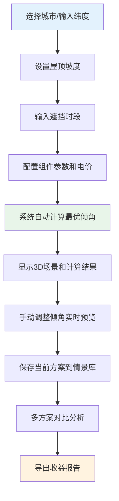

## 1. 产品概述
太阳能板倾角试算工具，帮助光伏销售快速估算不同城市、季节和遮挡条件下的倾角收益，为客户提供直观易懂的光伏安装方案。

- **目标用户**：光伏销售工程师、屋顶业主、光伏系统设计师
- **核心价值**：通过3D可视化和数据对比，让倾角优化和收益估算变得透明可信
- **设计理念**：保留真实协作痕迹，允许参数"不完美"，但能被定位、解释和修正

## 2. 核心功能

### 2.1 用户角色

| 角色 | 权限描述 | 典型使用场景 |
|------|----------|--------------|
| 销售用户 | 全部功能使用、参数保存、报告导出 | 给客户演示方案、对比不同情景、生成报价依据 |
| 协作用户 | 参数查看、标注问题 | 多人协作审核方案、指出数据异常 |

### 2.2 功能模块

1. **3D可视化场景**：屋顶模型、太阳能板、太阳轨迹、遮挡物
2. **参数输入面板**：城市纬度、屋顶坡度、遮挡时间、电价、组件参数
3. **计算引擎**：太阳高度角、倾角优化、遮挡扣减、收益计算
4. **情景对比**：多方案并排对比、季节权重分析
5. **报告导出**：PDF报告、参数快照、自动判断理由

### 2.3 页面详情

| 页面名称 | 模块名称 | 功能描述 |
|---------|----------|----------|
| 主工作台 | 3D场景区 | 可旋转缩放的屋顶光伏模型，实时显示太阳轨迹和遮挡区域 |
| 主工作台 | 参数面板 | 城市选择/纬度输入、屋顶坡度、遮挡时段、电价、组件参数 |
| 主工作台 | 计算结果区 | 倾角推荐、年发电量估算、收益明细、自动判断理由 |
| 情景对比页 | 方案列表 | 保存多个参数组合，并排对比发电量和收益 |
| 报告导出页 | 报告生成器 | 选择导出内容、预览PDF、下载参数快照 |

## 3. 核心流程

用户从选择城市开始，输入屋顶参数和遮挡条件，系统自动计算最优倾角，用户可手动调整倾角查看变化，对比不同季节的表现，最终导出收益报告。

## 4. 用户界面设计

### 4.1 设计风格
- **主色调**：深蓝渐变 (#1a237e → #3949ab)，代表科技感和专业性
- **辅助色**：琥珀色 (#ffb300) 代表太阳，绿色 (#43a047) 代表收益
- **按钮风格**：圆角矩形，悬浮时有微妙光晕效果
- **字体**：标题用思源黑体 Bold，正文用思源宋体 Normal
- **布局**：左右分栏布局，左侧3D场景占65%，右侧参数面板占35%
- **设计理念**：工业科技风，带点"工程图纸"的感觉，体现专业性

### 4.2 页面设计概述

| 页面名称 | 模块名称 | UI元素 |
|---------|----------|--------|
| 主工作台 | 3D场景区 | 透视屋顶模型、可拖拽调整的太阳能板、动态太阳轨迹、网格线、测量标注 |
| 主工作台 | 参数面板 | 卡片式分组、滑块+输入框双模式、下拉选择、警告标注（显示"脏数据"位置） |
| 主工作台 | 结果区 | 大号数据卡片、趋势图表、"自动判断理由"气泡框 |
| 情景对比页 | 方案对比 | 可拖动排序的方案卡片、对比柱状图、差异高亮 |
| 报告导出页 | 报告预览 | 打印风格预览、章节导航、导出格式选择 |

### 4.3 响应式设计
- 桌面端：左右分栏，3D场景主导
- 平板：上下布局，场景在上参数在下
- 移动端：折叠式面板，简化3D展示为关键数据卡片

### 4.4 3D场景设计
- **环境**：简洁的天空盒，带轻微雾霾效果，模拟真实光照
- **光照**：使用HDRI环境贴图，配合方向光模拟真实太阳光
- **相机**：默认45度俯视角，可轨道旋转、缩放、平移
- **交互**：点击太阳能板显示倾角数值，拖动滑块实时调整，鼠标悬停显示遮挡区域
- **动画**：太阳按时间平滑移动，阴影实时更新
- **性能**：模型保持低面数，确保60fps流畅运行

## 5. 特殊功能设计

### 5.1 "协作痕迹"显示
- 纬度符号错误：红色波浪线标注，鼠标悬停显示"注意：北半球纬度应为正值"
- 遮挡跨午：黄色警告图标，提示"遮挡跨越正午，可能影响计算精度"
- 季节权重：灰色"未配置"标签，点击可快速设置

### 5.2 自动判断理由
每个自动计算结果旁都有"为什么这么算？"按钮，点击展开人能读懂的解释：
> "推荐倾角35°：基于你所在城市纬度31.2°，冬季优化策略，倾角=纬度+4°"
> "遮挡扣减18%：上午9-11点遮挡，对应时段发电量占全日18%"
