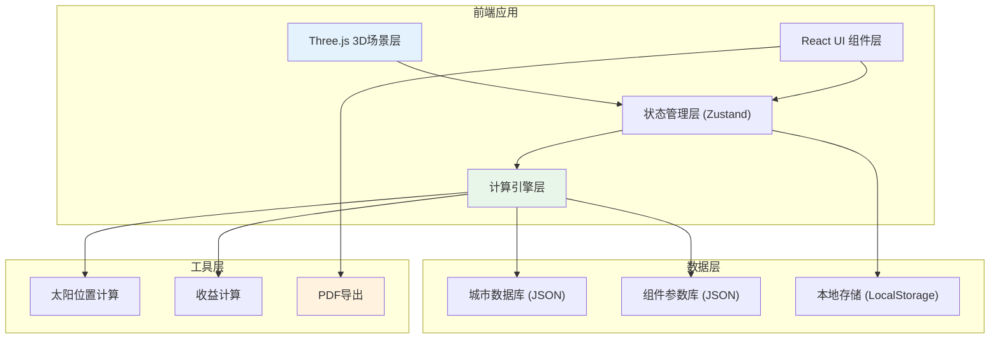

## 1. 架构设计



## 2. 技术描述

- **前端框架**: React@18 + TypeScript
- **构建工具**: Vite@5
- **样式方案**: TailwindCSS@3 + CSS变量
- **3D引擎**: Three@0.160 + @react-three/fiber@8 + @react-three/drei@9
- **状态管理**: Zustand@4 (轻量，适合快速开发)
- **图表库**: Recharts@2 (展示发电量趋势)
- **PDF导出**: jsPDF@2 + html2canvas
- **无后端设计**: 所有数据本地存储，纯前端运行

## 3. 目录结构

```
src/
├── components/
│   ├── Scene3D/          # 3D场景组件
│   │   ├── Roof.tsx
│   │   ├── SolarPanel.tsx
│   │   ├── Sun.tsx
│   │   └── Shadow.tsx
│   ├── Panel/            # 参数面板
│   │   ├── LocationPanel.tsx
│   │   ├── RoofPanel.tsx
│   │   ├── ShadingPanel.tsx
│   │   └── ComponentPanel.tsx
│   ├── Result/           # 结果展示
│   │   ├── AngleResult.tsx
│   │   ├── EnergyChart.tsx
│   │   └── ProfitCard.tsx
│   ├── Compare/          # 情景对比
│   └── Report/           # 报告导出
├── store/
│   └── useSolarStore.ts  # 状态管理
├── engine/
│   ├── solarMath.ts      # 太阳位置计算
│   ├── angleOptimize.ts  # 倾角优化
│   ├── shadingCalc.ts    # 遮挡计算
│   └── profitCalc.ts     # 收益计算
├── data/
│   ├── cities.json       # 城市纬度数据
│   └── components.json   # 光伏组件参数
├── types/
│   └── index.ts          # TypeScript类型定义
├── hooks/
│   └── useSolarCalc.ts   # 计算逻辑hooks
└── utils/
    └── exportReport.ts   # PDF导出工具
```

## 4. 状态管理设计

```typescript
// 核心状态接口
interface SolarState {
  // 位置参数
  city: string;
  latitude: number;
  latitudeWarning?: string;
  
  // 屋顶参数
  roofAngle: number;
  roofAzimuth: number;
  
  // 遮挡参数
  shadingPeriods: ShadingPeriod[];
  shadingWarning?: string;
  
  // 组件参数
  panelPower: number;
  panelCount: number;
  panelEfficiency: number;
  panelPrice: number;
  
  // 经济参数
  electricityPrice: number;
  
  // 季节权重
  seasonWeights: SeasonWeights;
  seasonWeightsWarning?: string;
  
  // 计算结果
  optimalAngle: number;
  optimalAngleReason: string;
  annualEnergy: number;
  shadingLoss: number;
  shadingLossReason: string;
  annualProfit: number;
  
  // 情景库
  scenarios: Scenario[];
  activeScenarioId: string | null;
}
```

## 5. 计算引擎核心算法

### 5.1 太阳高度角计算
```typescript
// 基于赤纬角和时角计算太阳高度
function calculateSolarAltitude(lat: number, declination: number, hourAngle: number): number {
  const latRad = toRadians(lat);
  const decRad = toRadians(declination);
  const haRad = toRadians(hourAngle);
  
  const sinAlt = Math.sin(latRad) * Math.sin(decRad) + 
                 Math.cos(latRad) * Math.cos(decRad) * Math.cos(haRad);
  return toDegrees(Math.asin(sinAlt));
}
```

### 5.2 倾角优化逻辑
```typescript
function optimizeAngle(latitude: number, strategy: 'yearly' | 'winter' | 'summer'): {
  angle: number;
  reason: string;
} {
  // 经验公式 + 季节调整
  let angle: number;
  let reason: string;
  
  switch(strategy) {
    case 'winter':
      angle = latitude + 4;
      reason = `冬季优化策略：倾角=纬度+4°，最大化冬季低角度阳光接收`;
      break;
    case 'summer':
      angle = latitude - 10;
      reason = `夏季优化策略：倾角=纬度-10°，适应夏季高角度阳光`;
      break;
    default:
      angle = latitude * 0.87 + 3.1;
      reason = `全年优化策略：倾角=纬度×0.87+3.1°，平衡各季节发电效率`;
  }
  
  return { angle: Math.round(angle * 10) / 10, reason };
}
```

### 5.3 遮挡扣减计算
```typescript
function calculateShadingLoss(periods: ShadingPeriod[], latitude: number): {
  lossPercent: number;
  reason: string;
} {
  // 基于时段发电量权重估算遮挡损失
  const hourWeights = getHourlyGenerationWeights(latitude);
  let lossPercent = 0;
  
  periods.forEach(period => {
    for (let h = period.startHour; h < period.endHour; h++) {
      lossPercent += hourWeights[h];
    }
  });
  
  return {
    lossPercent: Math.round(lossPercent * 100) / 100,
    reason: `基于各时段发电量权重，${periods.length}段遮挡累计损失${lossPercent}%`
  };
}
```

## 6. 数据模型

### 6.1 城市数据 (cities.json)
```json
[
  { "name": "北京", "latitude": 39.9, "longitude": 116.4 },
  { "name": "上海", "latitude": 31.2, "longitude": 121.5 },
  { "name": "广州", "latitude": 23.1, "longitude": 113.3 },
  { "name": "深圳", "latitude": 22.5, "longitude": 114.1 },
  { "name": "成都", "latitude": 30.7, "longitude": 104.1 }
]
```

### 6.2 组件数据 (components.json)
```json
[
  { "brand": "晶科能源", "model": "Tiger Pro", "power": 550, "efficiency": 21.6, "price": 1.8 },
  { "brand": "隆基绿能", "model": "Hi-MO 6", "power": 580, "efficiency": 22.3, "price": 1.95 },
  { "brand": "天合光能", "model": "Vertex", "power": 600, "efficiency": 21.9, "price": 1.85 }
]
```

## 7. 关键技术决策

1. **纯前端架构**：无需后端，降低部署成本，数据全部本地存储
2. **Zustand替代Redux**：轻量、简单、足够应对本项目复杂度
3. **@react-three/fiber**：声明式Three.js，React生态集成更好
4. **LocalStorage持久化**：保存用户参数和情景，刷新不丢失
5. **Canvas截图+jsPDF**：客户端生成PDF，无需服务端
