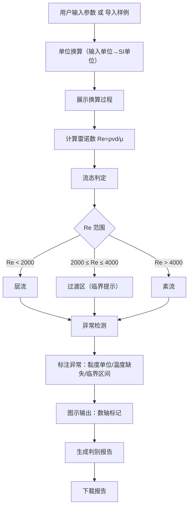

## 1. 产品概述

面向化工实验教学的"流体雷诺数判别"工具，学生输入管径、流速、密度、黏度、温度后，自动完成雷诺数计算、单位换算展示、流态判定与临界提示，并支持样例导入（含待补资料记录）、异常标注与可下载判别报告。目标是让每月底或课前整理时，数据可追溯、异常可定位、结论可交接。

## 2. 核心功能

### 2.1 用户角色

| 角色 | 使用方式 | 核心权限 |
|------|----------|----------|
| 学生 | 直接访问 | 输入参数、导入样例、查看计算与换算、导出报告 |
| 教师 | 直接访问 | 同上，额外可验证学生报告数据一致性 |

### 2.2 功能模块

1. **参数输入页**：管径、流速、密度、黏度、温度输入，单位选择与自动换算
2. **结果展示页**：雷诺数值、流态判定、临界区间提示、单位换算过程、图示输出
3. **样例管理页**：导入样例数据、标注待补资料记录、异常定位与修正
4. **报告导出页**：生成可下载判别报告，含全部输入/输出/异常/待办信息

### 2.3 页面详情

| 页面名称 | 模块名称 | 功能描述 |
|----------|----------|----------|
| 参数输入页 | 参数表单 | 管径(mm/m)、流速(m/s)、密度(kg/m³)、黏度(Pa·s/mPa·s)、温度(℃)输入，单位下拉切换，实时换算预览 |
| 参数输入页 | 单位换算面板 | 展示每个参数从输入单位到SI单位的换算公式与中间结果 |
| 参数输入页 | 样例导入 | 一键导入预设样例数据（含一条待补资料记录），填充表单 |
| 结果展示页 | 雷诺数计算结果 | 显示 Re = ρvd/μ 的代入过程与最终数值 |
| 结果展示页 | 流态判定 | Re<2000 层流、2000≤Re≤4000 过渡区、Re>4000 紊流，临界区间高亮提示 |
| 结果展示页 | 图示输出 | 雷诺数在数轴上的位置标记，流态区域色块标注 |
| 结果展示页 | 异常标注 | 黏度单位疑似错误、温度缺失、临界区间等异常以标签/颜色标出，可点击查看解释与修正建议 |
| 样例管理页 | 样例列表 | 展示所有样例记录，含状态标签（完整/待补/异常） |
| 样例管理页 | 待补资料记录 | 至少一条记录缺少温度或黏度，标注"待补"，关联待办与最终结论 |
| 报告导出页 | 判别报告 | 汇总输入参数、单位换算过程、雷诺数结果、流态判定、异常说明、待办事项，生成可下载HTML/PDF报告 |

## 3. 核心流程

用户打开应用 → 输入参数或导入样例 → 系统自动进行单位换算并展示换算过程 → 计算雷诺数 Re = ρvd/μ → 判定流态（层流/过渡/紊流）→ 标注异常（黏度单位错误、临界区间、温度缺失）→ 图示雷诺数位置 → 生成并下载判别报告。整条链路数据同源，任何步骤回溯均指向同一套输入数据。

## 4. 用户界面设计

### 4.1 设计风格

- **主色调**：深青色 (#0D7377) 为主，搭配暖橙色 (#FF6B35) 为警示/异常强调色，白色底 (#FAFAFA) 提供清晰阅读
- **辅助色**：层流绿 (#2ECC71)、过渡黄 (#F39C12)、紊流红 (#E74C3C) 用于流态区域
- **按钮风格**：圆角 8px，主按钮实心深青，次按钮描边，异常按钮暖橙
- **字体**：标题用 LXGW WenKai（霞鹜文楷）营造学术气息，正文用 Noto Sans SC
- **布局**：左侧输入面板 + 右侧结果面板的双栏布局，卡片式模块分组
- **图标**：线性图标风格，搭配数学符号装饰元素

### 4.2 页面设计概览

| 页面名称 | 模块名称 | UI 元素 |
|----------|----------|---------|
| 参数输入页 | 参数表单 | 白色卡片，字段标签+输入框+单位下拉，换算结果内联显示，实时校验提示 |
| 参数输入页 | 单位换算面板 | 浅灰底折叠面板，展示换算公式箭头与数值，动画展开 |
| 参数输入页 | 样例导入 | 顶部工具栏按钮，点击弹出样例选择弹窗，列表含状态标签 |
| 结果展示页 | 雷诺数计算结果 | 大字号 Re 值，公式展示区代入具体数字，计算步骤折叠/展开 |
| 结果展示页 | 流态判定 | 色块标签（绿/黄/红），临界区间闪烁提示 |
| 结果展示页 | 图示输出 | 水平数轴 SVG，三色区域 + 指针标记当前 Re 位置 |
| 结果展示页 | 异常标注 | 暖橙标签附着于对应参数，点击弹出解释浮层与修正建议 |
| 样例管理页 | 样例列表 | 卡片网格布局，状态标签色条，待补记录虚线边框 |
| 报告导出页 | 判别报告 | A4 预览样式，分区块展示，底部下载按钮 |

### 4.3 响应式

- 桌面优先，1280px 以上双栏布局
- 768px 以下单栏堆叠，输入在上、结果在下
- 触屏优化：输入框最小 44px 高度，按钮间距充足

### 4.4 3D 场景

不适用
