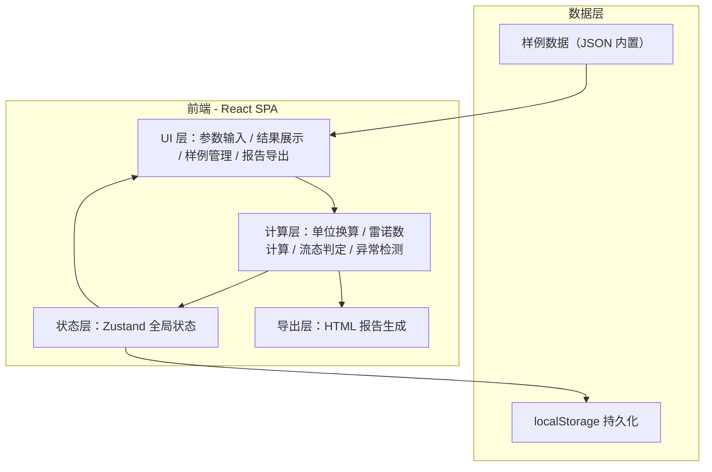
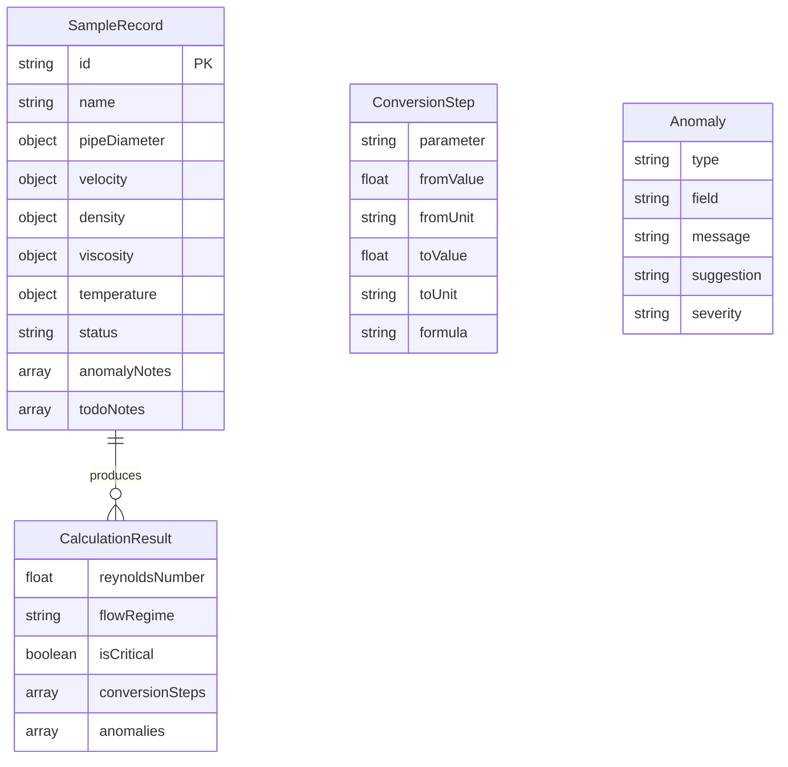

## 1. 架构设计



纯前端 SPA 架构，无后端服务。所有计算在浏览器端完成，样例数据内置，用户数据通过 localStorage 持久化。

## 2. 技术说明

- **前端框架**：React 18 + TypeScript
- **样式方案**：Tailwind CSS 3
- **构建工具**：Vite
- **状态管理**：Zustand（轻量全局状态）
- **后端**：无
- **数据库**：无，使用 localStorage + 内置 JSON 样例数据
- **图表/可视化**：SVG 内联绘制（数轴图），无需额外图表库
- **报告导出**：html2canvas 或纯 HTML 文档生成

## 3. 路由定义

| 路由 | 用途 |
|------|------|
| / | 主页面，含参数输入、结果展示、样例导入、报告导出全部功能 |

单页应用，通过 Tab/折叠面板组织四大功能区，无需多路由。

## 4. API 定义

无后端 API。所有数据通过前端状态管理和 localStorage 处理。

### 4.1 内置样例数据结构

```typescript
interface SampleRecord {
  id: string;
  name: string;
  pipeDiameter: { value: number; unit: 'mm' | 'm' };
  velocity: { value: number; unit: 'm/s' };
  density: { value: number; unit: 'kg/m³' };
  viscosity: { value: number | null; unit: 'Pa·s' | 'mPa·s'; originalUnit?: string };
  temperature: { value: number | null; unit: '℃' };
  status: 'complete' | 'incomplete' | 'anomaly';
  anomalyNotes?: string[];
  todoNotes?: string[];
}

interface CalculationResult {
  reynoldsNumber: number;
  flowRegime: 'laminar' | 'transitional' | 'turbulent';
  isCritical: boolean;
  conversionSteps: ConversionStep[];
  anomalies: Anomaly[];
}

interface ConversionStep {
  parameter: string;
  fromValue: number;
  fromUnit: string;
  toValue: number;
  toUnit: string;
  formula: string;
}

interface Anomaly {
  type: 'viscosity_unit_mismatch' | 'temperature_missing' | 'critical_zone';
  field: string;
  message: string;
  suggestion: string;
  severity: 'warning' | 'error';
}
```

## 5. 服务器架构

不适用（纯前端）

## 6. 数据模型

### 6.1 数据模型定义



### 6.2 内置样例初始数据

样例数据包含 4 条记录：
1. **水-常温管流**：完整数据，Re ≈ 50000，紊流
2. **油-低流速管流**：完整数据，Re ≈ 800，层流
3. **水-临界区管流**：完整数据，Re ≈ 3200，过渡区（临界提示）
4. **待补资料记录**：黏度单位可疑（输入值 1，单位 mPa·s 但数值与水不符），温度缺失，状态为 incomplete
