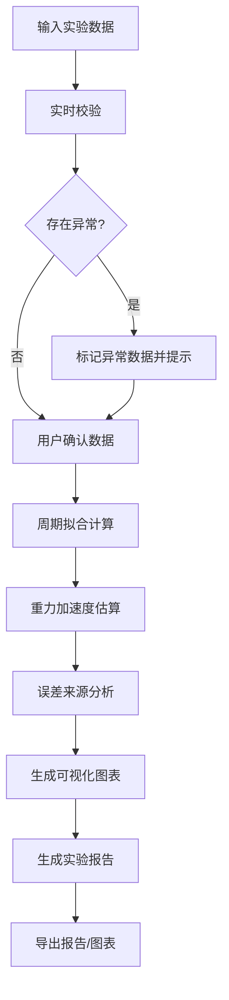

# 单摆重力加速度计算工具 - 产品需求文档

## 1. 产品概述

本工具是专为高中物理兴趣课设计的单摆实验数据处理平台，通过多组单摆周期数据估算当地重力加速度，同时讲解误差来源与分析方法。

- **核心用途**: 物理实验数据处理、重力加速度估算、误差分析教学
- **目标用户**: 高中物理教师、学生、物理兴趣课参与者
- **产品价值**: 将抽象的物理公式转化为可视化的数据分析工具，帮助学生理解实验误差、离群点检测、周期拟合等概念

## 2. 核心功能

### 2.1 用户角色

| 角色 | 注册方式 | 核心权限 |
|------|----------|----------|
| 教师/学生 | 无需注册 | 数据输入、计算分析、报告导出、样例演示 |

### 2.2 功能模块

1. **数据输入模块**: 摆长、周期、测量次数、角度、学生姓名、实验备注
2. **计算分析模块**: 重力加速度计算、周期拟合、误差分析
3. **离群检测模块**: 异常数据识别、标记与提示
4. **可视化模块**: 数据图表展示、导出
5. **报告生成模块**: 实验报告生成、步骤说明
6. **样例演示模块**: 大角度近似失效、周期漏记、离群点回归样例

### 2.3 页面详情

| 页面名称 | 模块名称 | 功能描述 |
|-----------|-------------|---------------------|
| 主页面 | 数据输入区 | 支持多组数据批量输入，包含摆长、周期、角度、测量次数字段 |
| 主页面 | 校验提示区 | 实时输入校验，边界情况警告，冲突数据标记 |
| 主页面 | 计算结果区 | 重力加速度估算值、拟合曲线、误差范围 |
| 主页面 | 误差分析区 | 误差来源分析、系统误差、随机误差分解 |
| 主页面 | 离群点展示区 | 异常数据高亮标记，可选择保留/排除 |
| 主页面 | 图表展示区 | T²-L关系图、残差分析图、数据分布图 |
| 主页面 | 报告生成区 | 实验报告导出，步骤说明，结果解释 |
| 主页面 | 样例演示区 | 预设典型错误样例，用于教学演示 |

## 3. 核心流程

用户输入实验数据 → 系统实时校验 → 标记异常/冲突数据 → 用户确认数据 → 执行周期拟合 → 计算重力加速度 → 误差分析 → 生成可视化图表 → 导出实验报告

## 4. 用户界面设计

### 4.1 设计风格

- **主色调**: 深蓝色 (#1e3a5f) - 代表科学与严谨
- **辅助色**: 科技蓝 (#3b82f6)、警示橙 (#f59e0b)、错误红 (#ef4444)、成功绿 (#10b981)
- **背景**: 深色渐变背景，营造专业科研氛围
- **按钮风格**: 圆角胶囊形，微立体效果，hover时有轻微上浮动画
- **字体**: 标题使用 Playfair Display（优雅衬线），正文使用 Source Sans Pro（清晰无衬线）
- **布局风格**: 卡片式布局，模块分明，信息层级清晰
- **图标风格**: 线性图标，简洁专业，物理相关符号

### 4.2 页面设计概览

| 页面名称 | 模块名称 | UI元素 |
|-----------|-------------|-------------|
| 主页面 | 顶部导航 | 标题、主题切换、帮助按钮 |
| 主页面 | 数据输入卡片 | 表单、动态添加/删除行、批量导入 |
| 主页面 | 校验提示卡片 | 错误/警告列表、冲突标记、建议操作 |
| 主页面 | 计算结果卡片 | 主结果大字展示、置信区间、拟合优度 |
| 主页面 | 误差分析卡片 | 误差来源列表、饼图/柱状图、改进建议 |
| 主页面 | 离群点卡片 | 数据表格、高亮行、保留/排除按钮 |
| 主页面 | 图表展示卡片 | Tab切换不同图表、导出按钮、交互缩放 |
| 主页面 | 报告卡片 | 预览区、自定义选项、导出格式选择 |
| 主页面 | 样例演示卡片 | 预设样例按钮、一键加载、对比展示 |

### 4.3 响应式

- **桌面优先设计**: 1200px+ 完整功能展示
- **平板适配**: 768-1199px 双列布局，图表自适应
- **手机适配**: <768px 单列布局，重点功能保留，次要功能折叠
- **触摸优化**: 按钮最小44px，输入框足够间距，滑动手势支持

### 4.4 动效设计

- **页面加载**: 模块淡入动画，错落有致的延迟效果
- **数据输入**: 校验结果实时反馈，颜色渐变提示
- **计算过程**: 进度条动画，结果出现时的缩放效果
- **图表交互**: 悬停数据点放大，平滑过渡
- **错误提示**: 轻微抖动动画，吸引注意力但不干扰
