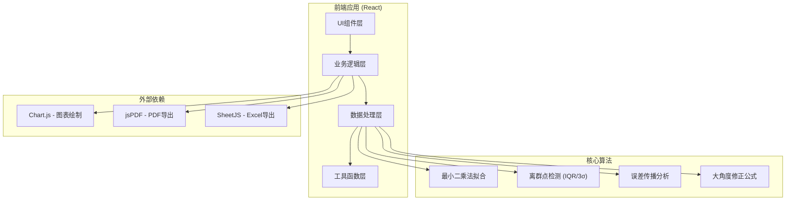

# 单摆重力加速度计算工具 - 技术架构文档

## 1. 架构设计



## 2. 技术描述

- **前端框架**: React@18 + TypeScript
- **构建工具**: Vite@5
- **样式方案**: TailwindCSS@3 + CSS Variables
- **图表库**: Chart.js@4 + react-chartjs-2
- **PDF导出**: jsPDF + html2canvas
- **Excel导出**: SheetJS (xlsx)
- **后端**: 无（纯前端应用，所有计算在客户端完成）
- **数据库**: 无（数据保存在内存和localStorage）

## 3. 路由定义

| 路由 | 用途 |
|-------|---------|
| / | 主应用页面，包含所有功能模块 |

## 4. 数据模型

### 4.1 核心数据类型

```typescript
// 单条实验数据
interface PendulumData {
  id: string;
  length: number;           // 摆长 (m)
  period: number;           // 周期 (s)
  measurements: number;     // 测量次数
  angle: number;            // 摆角 (度)
  studentName: string;      // 学生姓名
  notes: string;            // 备注
  timestamp: number;
  flags: DataFlag[];        // 数据标记
}

// 数据标记（冲突/异常）
interface DataFlag {
  type: 'error' | 'warning' | 'info' | 'conflict';
  message: string;
  field?: string;
  suggestion?: string;
}

// 计算结果
interface CalculationResult {
  gravity: number;          // 重力加速度 (m/s²)
  gravityUncertainty: number;
  fitSlope: number;         // T²-L 拟合斜率
  fitIntercept: number;
  rSquared: number;         // 决定系数
  residuals: number[];      // 残差
  outliers: string[];       // 离群点ID
  errorSources: ErrorSource[];
}

// 误差来源
interface ErrorSource {
  name: string;
  contribution: number;     // 贡献率 (%)
  description: string;
  improvement: string;
}

// 预设样例
interface DemoSample {
  id: string;
  name: string;
  description: string;
  category: 'large-angle' | 'missing-period' | 'outlier';
  data: Partial<PendulumData>[];
  explanation: string;
}
```

## 5. 核心模块设计

### 5.1 输入校验模块

**校验规则**:
- 摆长: 0.1m ~ 2.0m（边界警告）
- 周期: 0.5s ~ 5.0s
- 测量次数: 1 ~ 100（建议≥5）
- 角度: 0° ~ 90°（>15°警告：小角度近似失效）

**冲突处理**:
- 相同摆长但周期差异>10%：标记为冲突
- 不自动合并，由用户决定保留/排除

### 5.2 计算算法模块

**重力加速度公式**:
- 小角度近似: T = 2π√(L/g) → g = 4π²L/T²
- 大角度修正（一阶）: T = 2π√(L/g) · (1 + θ²/16)

**最小二乘拟合**:
- 拟合 T² = aL + b
- g = 4π² / a

**离群点检测**:
- IQR方法: 超出 [Q1-1.5IQR, Q3+1.5IQR]
- 3σ准则: 超出 [μ-3σ, μ+3σ]

**误差分析**:
- 系统误差：摆角修正、空气阻力、摆长测量
- 随机误差：周期测量、反应时间

### 5.3 图表模块

**图表类型**:
1. T²-L 散点图 + 拟合直线
2. 残差分析图
3. 误差来源饼图
4. 数据分布直方图

### 5.4 报告生成模块

**报告内容**:
- 实验基本信息（姓名、日期）
- 数据表格（含标记）
- 计算过程与结果
- 图表展示
- 误差分析与讨论
- 结论与建议

**导出格式**:
- PDF（含图表）
- Excel（原始数据+计算结果）
- PNG（图表单独导出）

## 6. 文件结构

```
src/
├── components/
│   ├── DataInput.tsx          # 数据输入组件
│   ├── ValidationPanel.tsx    # 校验提示面板
│   ├── ResultDisplay.tsx      # 结果展示
│   ├── ErrorAnalysis.tsx      # 误差分析
│   ├── OutlierPanel.tsx       # 离群点面板
│   ├── ChartPanel.tsx         # 图表面板
│   ├── ReportGenerator.tsx    # 报告生成
│   └── DemoSamples.tsx        # 样例演示
├── hooks/
│   ├── usePendulumCalc.ts     # 计算逻辑hook
│   ├── useValidation.ts       # 校验逻辑hook
│   └── useOutlierDetection.ts # 离群检测hook
├── utils/
│   ├── physics.ts             # 物理公式
│   ├── statistics.ts          # 统计方法
│   ├── export.ts              # 导出工具
│   └── constants.ts           # 常量定义
├── types/
│   └── index.ts               # 类型定义
├── data/
│   └── samples.ts             # 预设样例数据
├── App.tsx
└── main.tsx
```
