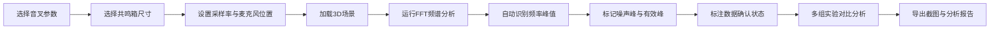

## 1. 产品概述
音叉共鸣频率分析Web3D教学平台，为音乐物理课学生提供交互式频率响应分析工具。
- 核心目的：让学生直观理解音叉与共鸣箱的频率响应特性，观察峰值变化规律
- 目标用户：音乐物理课教师与学生，声学研究爱好者

## 2. 核心 Features

### 2.1 用户角色
| 角色 | 注册方式 | 核心权限 |
|------|----------|----------|
| 学生用户 | 无需注册 | 浏览3D模型、进行频谱分析、导出截图和报告 |
| 教师用户 | 无需注册 | 配置实验参数、管理数据状态、对比实验结果 |

### 2.2 Feature Module
1. **主工作区页面**：3D场景展示、实时频谱图、参数控制面板
2. **数据管理面板**：实验记录、状态标记（已确认/临时备注）、版本对比
3. **报告生成模块**：分析报告、峰值识别、共鸣对比、导出功能

### 2.3 Page Details
| 页面名称 | 模块名称 | Feature Description |
|-----------|-------------|---------------------|
| 主工作区 | 3D场景模块 | 音叉和共鸣箱3D模型交互展示，可旋转缩放，麦克风位置可视化 |
| 主工作区 | 频谱分析模块 | 实时FFT频谱图绘制，峰值自动识别与标记，噪声峰误判标注 |
| 主工作区 | 参数控制面板 | 音叉频率选择、共鸣箱尺寸调节、采样率设置、麦克风位置调整 |
| 数据管理 | 状态标记系统 | 区分音频采样/音叉频率/共鸣箱尺寸/麦克风位置/噪声标记/分析报告的确认状态 |
| 数据管理 | 版本对比模块 | 原始材料修改前后结果差异可视化对比 |
| 报告生成 | 导出模块 | 截图导出、PDF分析报告生成、峰值数据CSV导出 |

## 3. Core Process
用户选择实验参数 → 加载3D模型 → 运行频谱分析 → 识别频率峰值 → 标记数据状态 → 对比不同配置 → 导出截图和报告

## 4. User Interface Design

### 4.1 Design Style
- **主色调**：深邃藏蓝 (#0A1628) 作为背景，营造专业科研氛围
- **强调色**：霓虹青 (#00F5D4) 用于频谱曲线和峰值标记，琥珀橙 (#FF9F1C) 用于警告和噪声标记
- **辅助色**：淡紫 (#9D4EDD) 用于选中状态和交互元素
- **按钮风格**：微玻璃拟态，圆角8px， subtle 阴影，悬停时有轻微发光效果
- **字体**：展示字体使用 Space Grotesk，正文字体使用 JetBrains Mono，营造科研技术感
- **布局风格**：三栏式布局，左侧参数面板、中间3D+频谱、右侧数据与报告
- **图标风格**：线性细线图标，统一2px描边，科技感简约风格

### 4.2 Page Design Overview
| Page Name | Module Name | UI Elements |
|-----------|-------------|-------------|
| 主工作区 | 3D场景模块 | 深色背景环境光，金属质感音叉模型，木质共鸣箱材质，动态波纹可视化 |
| 主工作区 | 频谱图模块 | 网格背景Canvas，渐变频谱曲线，交互式峰值悬浮信息，噪声峰虚线标记 |
| 主工作区 | 参数面板 | 分组折叠式卡片，滑块控件带数值显示，下拉选择带图标预览 |
| 数据管理 | 状态面板 | 彩色状态徽章（绿色=已确认，黄色=临时），时间戳记录，版本切换器 |
| 数据管理 | 对比视图 | 分屏或叠加频谱曲线，差异高亮显示，Δ数值标注 |
| 报告生成 | 导出面板 | 预览缩略图，格式选择器，一键导出按钮组 |

### 4.3 Responsiveness
- Desktop-first 设计，断点 1200px / 768px
- 平板端自动调整为上下布局：3D场景在上，控制面板在下
- 移动端简化界面，保留核心频谱查看和截图功能
- 触控设备优化：增大可点击区域，支持双指缩放3D场景

### 4.4 3D Scene Guidance
- **环境/HDRI**：使用 Studio 环境光，柔和反射，突出金属和木质材质差异
- **光照设置**：主光源45°角打光，补光填充暗部，边缘光勾勒轮廓，产生真实阴影
- **相机设置**：初始视角45°俯角，支持OrbitControls旋转缩放，自动阻尼效果
- **构图与焦点**：音叉位于画面黄金分割点，共鸣箱底部支撑，麦克风悬浮示意
- **交互与动画**：音叉振动时产生声波可视化波纹，频率变化时振动频率同步变化
- **后处理效果**：Bloom发光效果突出频谱峰值，轻微Vignette增加沉浸感
- **性能预算**：模型总面数控制在5万面以内，保持60fps流畅运行
