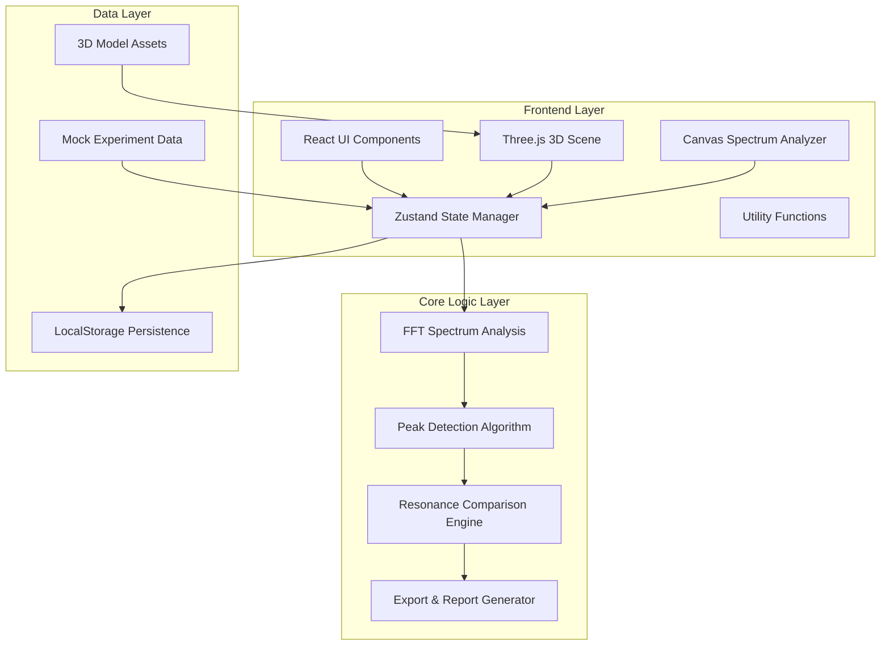
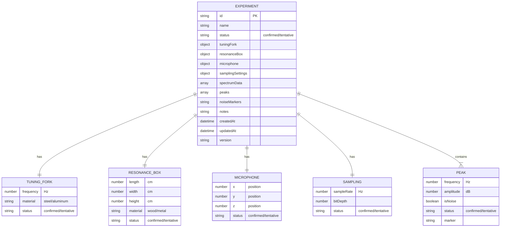

## 1. Architecture Design



## 2. Technology Description
- **Frontend Framework**: React@18 + TypeScript
- **Build Tool**: Vite@5
- **Styling**: tailwindcss@3 + CSS Variables
- **3D Engine**: three@0.160 + @react-three/fiber@8 + @react-three/drei@9
- **3D Post-processing**: @react-three/postprocessing@2
- **State Management**: zustand@4
- **Chart Library**: d3@7 (用于频谱图辅助计算)
- **Export Libraries**: html2canvas (截图), jspdf (PDF报告), papaparse (CSV导出)
- **Icons**: lucide-react@0.300
- **Backend**: None (纯前端应用，数据本地存储)
- **Database**: LocalStorage (实验记录持久化)

## 3. Route Definitions
| Route | Purpose |
|-------|---------|
| / | 主工作区 - 3D场景 + 频谱分析 + 参数控制 |
| /compare | 对比视图 - 多组实验数据对比分析 |
| /reports | 报告中心 - 历史报告管理与查看 |

## 4. Data Model

### 4.1 Data Model Definition



### 4.2 TypeScript Interface Definitions

```typescript
type DataStatus = 'confirmed' | 'tentative';

interface TuningFork {
  frequency: number;
  material: 'steel' | 'aluminum';
  status: DataStatus;
}

interface ResonanceBox {
  length: number;
  width: number;
  height: number;
  material: 'wood' | 'metal';
  status: DataStatus;
}

interface MicrophonePosition {
  x: number;
  y: number;
  z: number;
  status: DataStatus;
}

interface SamplingSettings {
  sampleRate: number;
  bitDepth: number;
  status: DataStatus;
}

interface Peak {
  id: string;
  frequency: number;
  amplitude: number;
  isNoise: boolean;
  status: DataStatus;
  marker?: string;
}

interface SpectrumPoint {
  frequency: number;
  amplitude: number;
}

interface Experiment {
  id: string;
  name: string;
  status: DataStatus;
  tuningFork: TuningFork;
  resonanceBox: ResonanceBox;
  microphone: MicrophonePosition;
  sampling: SamplingSettings;
  spectrumData: SpectrumPoint[];
  peaks: Peak[];
  noiseMarkers: string[];
  notes: string;
  createdAt: string;
  updatedAt: string;
  version: string;
  parentId?: string;
}

interface AppState {
  experiments: Experiment[];
  currentExperimentId: string | null;
  comparisonIds: string[];
  isPlaying: boolean;
}
```

## 5. Core Algorithms

### 5.1 FFT Spectrum Analysis
- 使用 Web Audio API 的 `AnalyserNode` 进行实时 FFT 分析
- FFT 窗口大小: 2048 / 4096 可选
- 频率分辨率: sampleRate / fftSize
- 窗函数: Hann窗 减少频谱泄漏

### 5.2 Peak Detection Algorithm
```
1. 计算频谱的局部最大值（斜率由正变负）
2. 应用阈值过滤（高于噪声基底 + 6dB）
3. 峰值宽度检测（半高宽 FWHM）
4. 谐波关系验证（判断是否为基频或泛音）
5. 噪声峰排除算法（基于频率位置和幅度特征）
```

### 5.3 Resonance Comparison
- 计算两个频谱之间的互相关系数
- 峰值频率偏移量 Δf 计算
- Q值（品质因数）对比分析
- 共鸣增强倍数计算

## 6. Project Structure

```
src/
├── components/
│   ├── Scene3D/          # 3D场景组件
│   ├── Spectrum/         # 频谱分析组件
│   ├── Controls/         # 参数控制面板
│   ├── DataStatus/       # 状态标记组件
│   ├── Comparison/       # 对比视图组件
│   ├── Export/           # 导出功能组件
│   └── UI/               # 通用UI组件
├── store/
│   └── useStore.ts       # Zustand状态管理
├── hooks/
│   ├── useFFT.ts         # FFT分析Hook
│   ├── usePeakDetection.ts # 峰值检测Hook
│   └── useComparison.ts  # 对比分析Hook
├── utils/
│   ├── fft.ts            # FFT算法工具
│   ├── peakDetection.ts  # 峰值检测算法
│   ├── export.ts         # 导出工具
│   └── mockData.ts       # 模拟实验数据
├── types/
│   └── index.ts          # TypeScript类型定义
├── App.tsx
└── main.tsx
```
