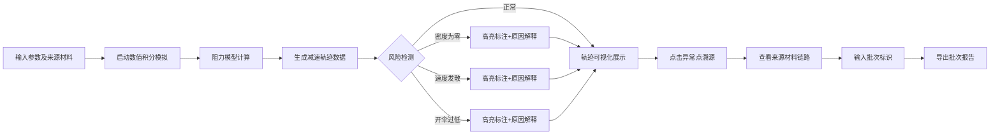

## 1. 产品概述
火星降落伞试算分析看板是一款面向航天科普和工程分析的专业工具，通过数值积分和物理建模模拟火星探测器在不同大气条件下的减速过程，支持异常点溯源、风险预警和批次报告导出。
- 核心目标：帮助航天科普营直观演示大气密度、伞面积等参数对减速效果的影响，同时满足工程追责的可追溯性要求
- 目标用户：航天科普工作者、航天器设计工程师、质量管控人员

## 2. 核心 Features

### 2.1 用户角色
| 角色 | 注册方式 | 核心权限 |
|------|----------|----------|
| 科普演示员 | 无需注册 | 输入参数、运行模拟、查看轨迹图、导出报告 |
| 工程分析员 | 无需注册 | 完整参数配置、来源材料追踪、风险点审查、批次管理 |

### 2.2 Feature Module
1. **分析看板主页**：参数输入面板、实时模拟结果、轨迹可视化、风险提示区
2. **来源材料追踪**：每个参数的来源记录、异常点溯源链路、材料批次信息
3. **风险预警系统**：密度为零检测、速度发散检测、开伞高度过低检测
4. **批次报告导出**：批次标识、完整计算日志、风险点汇总、溯源信息

### 2.3 Page Details
| 页面名称 | 模块名称 | Feature 描述 |
|----------|----------|--------------|
| 分析看板 | 参数输入面板 | 探测器质量、伞面积、大气密度、初速度、高度、降落报告输入，每项附带来源字段 |
| 分析看板 | 数值积分引擎 | 基于Runge-Kutta方法的高精度数值积分，实时计算速度-高度曲线 |
| 分析看板 | 阻力模型 | 火星大气阻力系数计算、降落伞开伞触发逻辑、终端速度分析 |
| 分析看板 | 轨迹图表 | 速度-时间、高度-时间、加速度-时间三维曲线图，支持异常点标注 |
| 分析看板 | 风险提示区 | 独立展示三类高危异常：密度为零、速度发散、开伞高度过低，每项附带解释说明 |
| 分析看板 | 来源追踪面板 | 每个计算点可追溯到原始输入材料、批次信息、操作人员 |
| 分析看板 | 报告导出 | 按批次生成PDF/Excel报告，文件名包含批次号和时间戳 |

## 3. 核心流程

用户进入分析看板 → 输入探测器参数并填写每项来源信息 → 启动数值积分模拟 → 实时查看减速轨迹 → 系统自动检测风险点并高亮 → 点击异常点查看来源材料溯源 → 输入批次标识导出完整分析报告

## 4. User Interface Design

### 4.1 Design Style
- **主色调**：深空蓝 (#0a1628) 作为主背景，火星橙 (#e27b58) 作为强调色，科技青 (#4ecdc4) 作为数据高亮
- **辅助色**：风险红 (#ff6b6b)、警告黄 (#ffd93d)、成功绿 (#6bcb77)
- **按钮风格**：棱角分明的矩形按钮，带有细微边框和悬停发光效果
- **字体**：标题使用 Orbitron（科技感字体），正文使用 JetBrains Mono（等宽专业字体）
- **布局风格**：模块化卡片布局，左侧参数面板、中部轨迹图、右侧风险预警区
- **视觉元素**：火星纹理背景、网格数据叠加、科技感边框、动态数据流线条

### 4.2 Page Design Overview
| 页面名称 | 模块名称 | UI Elements |
|----------|----------|-------------|
| 分析看板 | 参数输入面板 | 深色卡片、带标签的输入框、来源材料折叠区、图标化参数分类 |
| 分析看板 | 轨迹图表区 | 大尺寸Canvas/SVG图表、网格背景、多色曲线、异常点闪烁标记 |
| 分析看板 | 风险预警区 | 独立红色边框卡片、闪烁警示图标、展开式详细说明、溯源按钮 |
| 分析看板 | 报告导出区 | 批次号输入框、导出格式选择、带进度条的导出按钮 |

### 4.3 Responsiveness
- **桌面端优先**：1920px以上分辨率优化，三栏布局充分利用横向空间
- **平板适配**：1024-1920px，双栏布局，风险区移至底部
- **移动端**：1024px以下，单栏流式布局，图表支持触摸缩放

### 4.4 视觉动效
- 页面加载：元素按优先级淡入，数据流线条动画
- 参数变更：实时触发微小计算动画
- 异常点检测：脉冲闪烁效果吸引注意力
- 图表交互：悬停显示详细数据点，平滑曲线过渡
