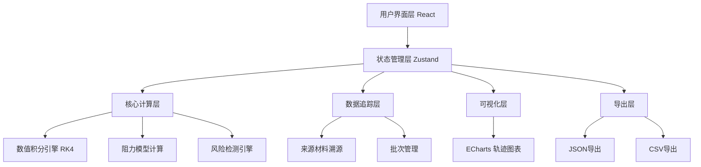

## 1. 架构设计



## 2. 技术栈说明
- **前端框架**：React@18 + TypeScript@5
- **构建工具**：Vite@5
- **状态管理**：Zustand@4
- **图表可视化**：ECharts@5
- **样式方案**：TailwindCSS@3
- **导出功能**：jsPDF (可选)、原生CSV/JSON导出
- **数值计算**：自定义RK4数值积分算法

## 3. 目录结构
```
src/
├── components/
│   ├── ParameterPanel/      # 参数输入面板
│   ├── TrajectoryChart/     # 轨迹图表
│   ├── RiskAlertPanel/      # 风险预警区
│   ├── SourceTracePanel/    # 来源追踪面板
│   └── ReportExport/        # 报告导出组件
├── engine/
│   ├── numericIntegration.ts  # RK4数值积分
│   ├── dragModel.ts           # 阻力模型
│   └── riskDetector.ts        # 风险检测引擎
├── store/
│   └── simulationStore.ts     # Zustand状态管理
├── types/
│   └── index.ts               # TypeScript类型定义
├── utils/
│   ├── export.ts              # 导出工具
│   └── traceability.ts        # 溯源工具
└── App.tsx
```

## 4. 核心数据模型

### 4.1 模拟参数类型
```typescript
interface SimulationParams {
  // 探测器参数
  probeMass: number;           // 探测器质量 (kg)
  probeMassSource: SourceInfo; // 来源信息
  
  // 降落伞参数
  parachuteArea: number;       // 伞面积 (m²)
  parachuteAreaSource: SourceInfo;
  deploymentAltitude: number;  // 开伞高度 (m)
  deploymentAltitudeSource: SourceInfo;
  
  // 大气参数
  atmosphericDensity: number;  // 大气密度 (kg/m³)
  atmosphericDensitySource: SourceInfo;
  
  // 初始条件
  initialVelocity: number;     // 初速度 (m/s)
  initialVelocitySource: SourceInfo;
  initialAltitude: number;     // 初始高度 (m)
  initialAltitudeSource: SourceInfo;
  
  // 批次信息
  batchId: string;
  operator: string;
  timestamp: Date;
}

interface SourceInfo {
  documentName: string;        // 文档名称
  documentVersion: string;     // 版本号
  provider: string;            // 提供方
  remarks: string;             // 备注
}
```

### 4.2 轨迹数据点
```typescript
interface TrajectoryPoint {
  time: number;                // 时间 (s)
  altitude: number;            // 高度 (m)
  velocity: number;            // 速度 (m/s)
  acceleration: number;        // 加速度 (m/s²)
  dragForce: number;           // 阻力 (N)
  parachuteDeployed: boolean;  // 降落伞是否已展开
  risks: RiskType[];           // 当前点风险标记
}

type RiskType = 
  | 'ZERO_DENSITY' 
  | 'VELOCITY_DIVERGENCE' 
  | 'LOW_DEPLOYMENT_ALTITUDE';
```

### 4.3 溯源记录
```typescript
interface TraceRecord {
  pointIndex: number;
  riskType: RiskType;
  paramSources: {
    [key: string]: SourceInfo;
  };
  calculationChain: string[];  // 计算链路
}
```

## 5. 核心算法接口

### 5.1 数值积分引擎
```typescript
class RK4Integrator {
  constructor(stepSize: number);
  integrate(
    initialState: StateVector,
    duration: number,
    derivatives: (state: StateVector, time: number) => StateVector
  ): TrajectoryPoint[];
}
```

### 5.2 阻力模型
```typescript
class MarsDragModel {
  calculateDrag(
    velocity: number,
    altitude: number,
    parachuteDeployed: boolean,
    params: SimulationParams
  ): number;
  
  checkParachuteDeployment(
    currentAltitude: number,
    params: SimulationParams
  ): boolean;
}
```

### 5.3 风险检测引擎
```typescript
class RiskDetector {
  detect(
    point: TrajectoryPoint,
    params: SimulationParams,
    history: TrajectoryPoint[]
  ): RiskType[];
  
  getRiskExplanation(riskType: RiskType): RiskExplanation;
}

interface RiskExplanation {
  title: string;
  description: string;
  impact: string;
  mitigation: string;
  relatedParams: string[];
}
```

## 6. 路由定义
| Route | 页面用途 |
|-------|---------|
| / | 分析看板主页面 |

## 7. 导出格式规范

### 7.1 批次报告命名规则
```
火星降落伞试算报告_{批次号}_{YYYYMMDD}_{HHmmss}.{csv|json}
```

### 7.2 CSV导出字段
- 批次号
- 时间戳
- 操作人员
- 探测器质量及来源
- 伞面积及来源
- 大气密度及来源
- 初始速度及来源
- 初始高度及来源
- 开伞高度及来源
- 轨迹数据点（时间、高度、速度、加速度）
- 风险点列表及解释
- 溯源信息
