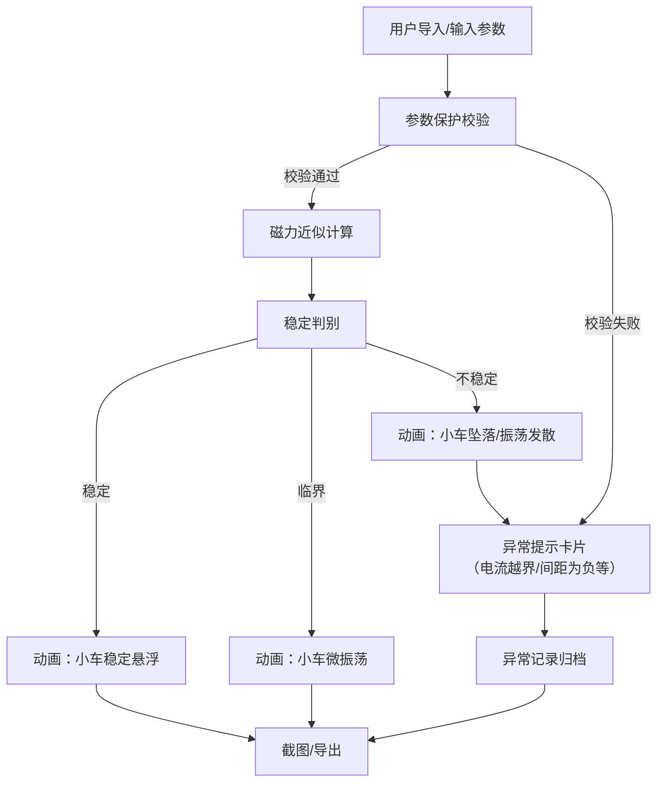
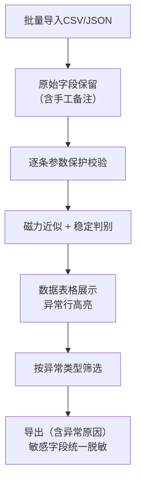

## 1. 产品概述

磁悬浮轨道稳定实验平台——面向科技馆场景，让青少年通过调节磁铁间距、车体质量等参数，直观观察磁悬浮小车是否稳定悬浮。支持批量导入实验数据、自动判别稳定/异常、动画反馈、截图与数据导出，形成"导入→计算→判别→展示→导出"完整链路。

- 解决科技馆实验数据批量处理与可视化需求，降低物理实验门槛
- 目标用户：科技馆展教员、中小学生，核心价值是让磁悬浮原理可触可感

## 2. 核心功能

### 2.1 用户角色

| 角色 | 进入方式 | 核心权限 |
|------|----------|----------|
| 展教员 | 直接访问 | 导入/导出数据、调参、截图、查看异常报告 |
| 学生 | 直接访问 | 调参观察动画、查看稳定判别结果 |

### 2.2 功能模块

1. **实验控制台页面**：参数调节面板、实时动画轨道、稳定判别结果、异常提示
2. **数据管理页面**：批量导入、数据表格（保留原始备注）、异常记录筛选、导出

### 2.3 页面详情

| 页面名称 | 模块名称 | 功能描述 |
|----------|----------|----------|
| 实验控制台 | 参数调节面板 | 磁铁间距、车体质量、轨道长度、电流、扰动幅度滑块/输入框，带参数保护（电流越界/间距为负时拦截并提示） |
| 实验控制台 | 实时动画轨道 | Canvas 绘制磁悬浮轨道侧视图，小车随参数变化实时悬浮/振荡/坠落动画，磁力线可视化 |
| 实验控制台 | 稳定判别结果 | 基于磁力近似公式计算，显示稳定/临界/不稳定状态，附判别依据与数值 |
| 实验控制台 | 异常提示卡片 | 电流越界、间距为负、振荡发散等异常单独标红，附中文解释 |
| 实验控制台 | 截图导出按钮 | 一键截取当前轨道动画+参数+判别结果为 PNG |
| 数据管理 | 批量导入 | 支持 CSV/JSON 导入，保留原始字段口径与手工备注 |
| 数据管理 | 数据表格 | 展示全部实验记录，异常行高亮，支持按状态筛选（正常/异常/全部） |
| 数据管理 | 异常记录筛选 | 按异常类型（电流越界/间距为负/振荡发散）分类查看，每条附原因解释 |
| 数据管理 | 数据导出 | 导出 CSV/JSON，正常结果和异常原因均包含，敏感字段按统一口径脱敏 |

## 3. 核心流程

用户进入实验控制台→调节磁铁间距/车体质量等参数→系统实时计算磁力近似值与稳定判据→动画反馈小车状态（稳定悬浮/振荡/坠落）→异常时弹出提示卡片解释原因→截图或导出数据。数据管理页面支持批量导入历史数据，系统自动判别并标注异常记录，用户可按类型筛选并导出。

## 4. 用户界面设计

### 4.1 设计风格

- 主色调：深空蓝 (#0A1628) 配科技青 (#00E5CC)，辅以警示橙 (#FF6B35)
- 按钮：圆角微3D，悬浮态发光
- 字体：标题用 Orbitron（科技感），正文用 Noto Sans SC
- 布局：左侧参数面板 + 中央动画轨道 + 右侧判别结果
- 图标：线性科技风格，来自 Lucide

### 4.2 页面设计概览

| 页面名称 | 模块名称 | UI元素 |
|----------|----------|--------|
| 实验控制台 | 参数调节面板 | 深色卡片，滑块+数值输入，越界时输入框变红+抖动动画 |
| 实验控制台 | 实时动画轨道 | Canvas 全宽，深色背景+网格线，磁力线用渐变青色，小车用亮橙色 |
| 实验控制台 | 稳定判别结果 | 状态徽章（绿/黄/红），数值用等宽字体，判据公式用小字展示 |
| 实验控制台 | 异常提示卡片 | 红色左边框卡片，⚠图标，中文原因解释 |
| 数据管理 | 批量导入 | 拖拽上传区域，支持 CSV/JSON 切换 |
| 数据管理 | 数据表格 | 深色表头，斑马纹行，异常行红色底色，备注列完整展示 |
| 数据管理 | 异常筛选 | Tab 切换（全部/电流越界/间距为负/振荡发散），数量角标 |
| 数据管理 | 数据导出 | 下拉按钮（CSV/JSON），敏感字段列显示🔒图标 |

### 4.3 响应式

桌面优先设计，中央动画区域占据主要视口。平板端参数面板折叠为抽屉，手机端仅保留参数+结果，动画缩放适配。

### 4.4 3D 场景指引

不适用——使用 2D Canvas 动画即可满足磁悬浮轨道侧视图需求。
