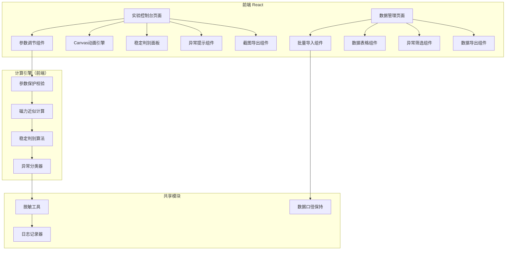
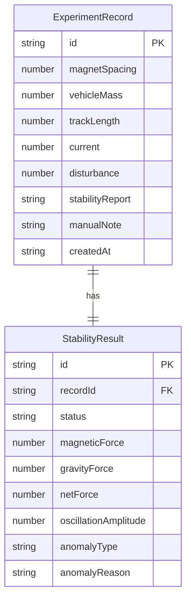

## 1. 架构设计



## 2. 技术说明

- 前端：React@18 + TailwindCSS@3 + Vite + TypeScript
- 初始化工具：vite-init
- 后端：无（纯前端，数据通过浏览器本地处理）
- 数据库：无（使用 localStorage 持久化 + 文件导入/导出）
- 动画：Canvas 2D API
- 截图：html2canvas
- 状态管理：Zustand

## 3. 路由定义

| 路由 | 用途 |
|------|------|
| / | 实验控制台：参数调节+动画+判别+截图 |
| /data | 数据管理：导入+表格+筛选+导出 |

## 4. API 定义

无后端 API，所有计算在前端完成。

### 4.1 核心数据类型

```typescript
interface ExperimentRecord {
  id: string
  magnetSpacing: number       // 磁铁间距 (mm)
  vehicleMass: number          // 车体质量 (g)
  trackLength: number          // 轨道长度 (mm)
  current: number              // 电流 (A)
  disturbance: number          // 扰动幅度 (mm)
  stabilityReport?: string     // 稳定报告
  manualNote?: string          // 手工备注（原始保留）
  rawFields?: Record<string, unknown>  // 原始导入字段（口径保持）
  result: StabilityResult
  createdAt: string
}

interface StabilityResult {
  status: "stable" | "critical" | "unstable"
  magneticForce: number        // 磁力近似值 (N)
  gravityForce: number         // 重力 (N)
  netForce: number             // 净力 (N)
  oscillationAmplitude: number // 振荡幅度 (mm)
  anomalyType?: AnomalyType    // 异常类型
  anomalyReason?: string       // 异常原因中文解释
}

type AnomalyType =
  | "current_exceed"           // 电流越界
  | "negative_spacing"         // 间距为负
  | "oscillation_diverge"      // 振荡发散

interface ValidationRule {
  field: keyof ExperimentRecord
  min?: number
  max?: number
  message: string
}
```

### 4.2 参数保护规则

| 参数 | 有效范围 | 异常类型 | 提示信息 |
|------|----------|----------|----------|
| magnetSpacing | > 0 mm | negative_spacing | "磁铁间距不能为负或零，请调整间距" |
| current | 0.1 ~ 50 A | current_exceed | "电流超出安全范围(0.1~50A)，请调整" |
| vehicleMass | > 0 g | - | "车体质量须为正数" |
| trackLength | > 0 mm | - | "轨道长度须为正数" |
| oscillationAmplitude | 发散判定 | oscillation_diverge | "振荡幅度持续增大，系统不稳定" |

## 5. 服务端架构图

无后端。

## 6. 数据模型

### 6.1 数据模型定义



### 6.2 存储方案

使用浏览器 localStorage 存储实验记录，键名 `maglev_records`，值为 JSON 数组。导入数据时合并去重（按 id），导出时完整输出含 result 的记录。敏感字段在展示、导出、日志中统一使用脱敏工具处理。

### 6.3 磁力近似公式

采用简化磁偶极子模型：

- 磁力 F_mag = μ₀ · m₁ · m₂ / (4π · d³)
  - μ₀ = 4π × 10⁻⁷ T·m/A（真空磁导率）
  - m₁, m₂：磁铁磁矩（由电流和间距推算）
  - d：磁铁间距（m）
- 重力 F_g = m · g
  - g = 9.8 m/s²
- 稳定判据：F_mag / F_g > 1.2 → 稳定；0.8~1.2 → 临界；< 0.8 → 不稳定
- 振荡判据：连续3步振幅递增 → 发散
