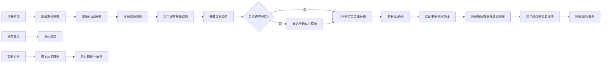

## 1. 产品概述

电磁感应发电演示是一款面向物理教学的交互式Web应用，通过可视化方式展示法拉第电磁感应定律。学生可调节线圈匝数、磁场强度、运动速度等参数，实时观察感应电压曲线变化，为评审会提供专业、可追溯的演示工具。

## 2. 核心功能

### 2.1 用户角色

| 角色 | 注册方式 | 核心权限 |
|------|----------|----------|
| 教师/学生 | 无需注册 | 使用全部演示功能、导出报告、保存历史 |
| 评审专家 | 无需注册 | 查看演示、验证数据可追溯性 |

### 2.2 功能模块

1. **主演示界面**：3D可视化场景、实时曲线图、参数控制面板
2. **数据追溯系统**：原始参数记录、计算过程展示、结果验证
3. **边界检测模块**：异常参数识别、待确认标记、警告提示
4. **导出与历史**：截图导出、演示报告、历史记录恢复

### 2.3 页面详情

| 页面名称 | 模块名称 | 功能描述 |
|----------|----------|----------|
| 主演示页 | 3D可视化区 | 展示线圈、磁场、运动动画，点击对象显示对应数据 |
| 主演示页 | 参数滑块区 | 调节线圈匝数、磁场强度、运动速度、面积、采样点 |
| 主演示页 | 曲线联动区 | 实时绘制感应电压曲线，支持缩放和数据点查看 |
| 主演示页 | 法拉第定律区 | 显示公式、原始参数、计算过程、最终结果 |
| 主演示页 | 边界提示区 | 检测并标记方向符号反、匝数为零、曲线截断等异常 |
| 主演示页 | 导出工具栏 | 截图导出、生成演示报告、保存/加载历史记录 |

## 3. 核心流程

## 4. 用户界面设计

### 4.1 设计风格

**设计理念**：学术专业风，强调数据可信度与可追溯性

- **主色调**：深蓝 #1a365d（科学严谨）
- **强调色**：翠绿 #059669（数据有效）、橙红 #dc2626（边界警告）、琥珀 #d97706（待确认）
- **中性色**：浅灰 #f8fafc 背景、深灰 #1e293b 文字
- **按钮风格**：直角矩形、细微边框、悬停时轻微上浮
- **字体**：
  - 标题：Noto Serif SC（学术感）
  - 正文/数字：JetBrains Mono（等宽，数据易读）
- **布局**：分栏式卡片布局，信息分区清晰
- **图标风格**：线性简约科学图标

### 4.2 页面设计概览

| 页面名称 | 模块名称 | UI元素 |
|----------|----------|--------|
| 主演示页 | 3D可视化区 | 深色背景、发光磁场线、可点击线圈、悬浮数据标签、平滑动画 |
| 主演示页 | 参数滑块区 | 左侧标签+数值显示、滑块轨道带刻度、实时数值更新 |
| 主演示页 | 曲线联动区 | 网格背景、实时绘制折线、数据点hover显示、坐标轴标注 |
| 主演示页 | 法拉第定律区 | 公式高亮显示、原始数据卡片、计算步骤展开、结果强调 |
| 主演示页 | 边界提示区 | 带图标的警告条、颜色区分严重程度、待确认标记醒目 |
| 主演示页 | 导出工具栏 | 图标按钮、工具提示、操作反馈动画 |

### 4.3 响应式

- **桌面端优先**：支持1920×1080及以上分辨率
- **平板适配**：参数区与曲线区改为上下布局
- **触屏优化**：滑块增大触控区域，按钮最小48×48px

### 4.4 3D场景指引

- **环境**：深色科技感背景，轻微网格参考线
- **光照**：主光源+环境光，突出金属线圈质感
- **相机**：默认45度视角，支持拖拽旋转、滚轮缩放
- **动画**：磁场匀速运动，线圈感应电流可视化
- **交互**：点击线圈显示匝数/面积，点击磁场显示强度/速度
- **性能**：模型面数控制，确保60fps流畅运行
