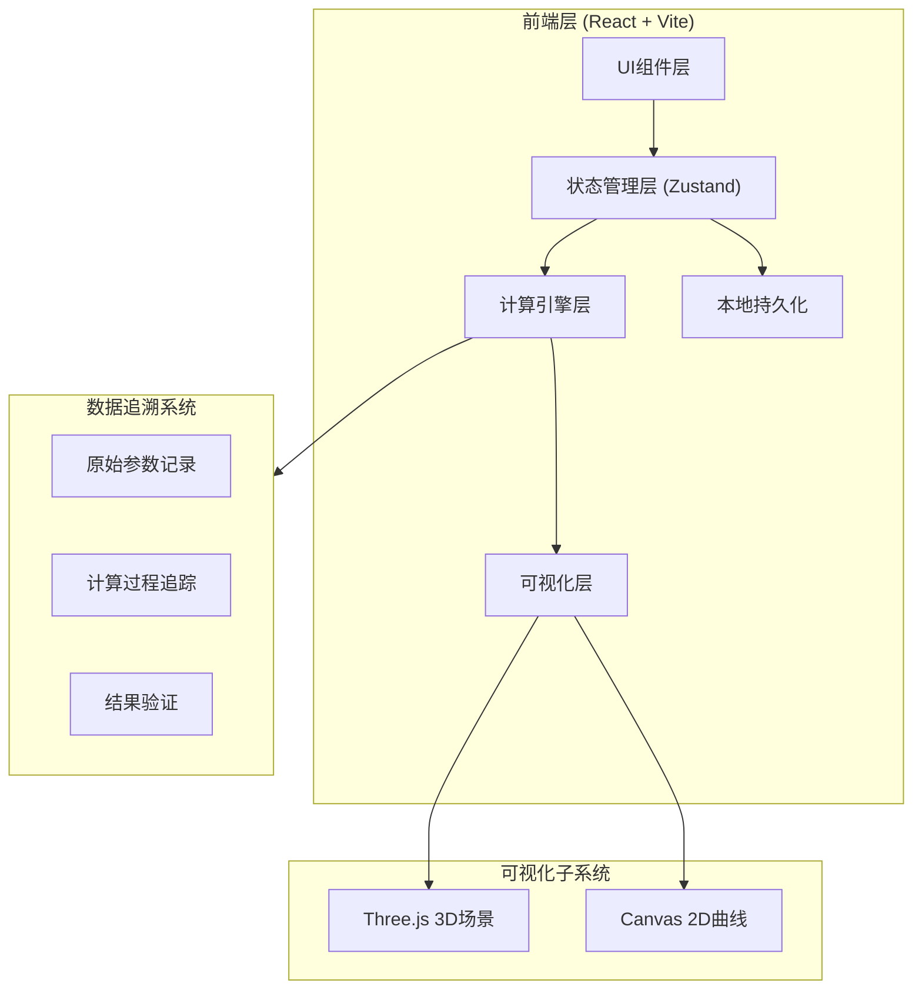
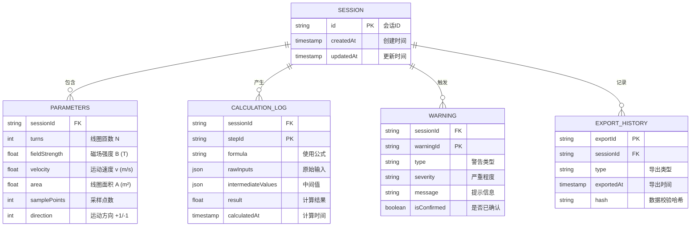

## 1. 架构设计



## 2. 技术说明

- **前端框架**：React@18 + TypeScript
- **构建工具**：Vite@5
- **样式方案**：TailwindCSS@3
- **状态管理**：Zustand（轻量级，支持持久化）
- **3D引擎**：Three.js + @react-three/fiber + @react-three/drei
- **图表绘制**：Canvas 2D原生实现
- **截图导出**：html2canvas
- **本地存储**：localStorage + 索引化数据结构
- **后端**：无（纯前端应用，所有计算在客户端完成）

## 3. 路由定义

| 路由 | 用途 |
|------|------|
| / | 主演示页面（单页应用） |

## 4. 数据模型

### 4.1 数据模型定义



### 4.2 TypeScript 类型定义

```typescript
// 核心参数
interface SimulationParams {
  turns: number;           // 线圈匝数 N
  fieldStrength: number;   // 磁场强度 B (特斯拉)
  velocity: number;        // 运动速度 v (m/s)
  area: number;            // 线圈面积 A (m²)
  samplePoints: number;    // 采样点数
  direction: 1 | -1;       // 运动方向
}

// 计算日志（可追溯）
interface CalculationLog {
  stepId: string;
  timestamp: number;
  formula: string;
  rawInputs: SimulationParams;
  intermediate: {
    flux: number;          // 磁通量 Φ = B·A
    dFlux_dt: number;      // 磁通量变化率
  };
  result: {
    voltage: number[];     // 感应电压序列
    maxVoltage: number;
    minVoltage: number;
  };
}

// 边界警告
interface BoundaryWarning {
  id: string;
  type: 'zero_turns' | 'reverse_direction' | 'curve_truncated' | 'extreme_value';
  severity: 'warning' | 'to_confirm';
  message: string;
  confirmed: boolean;
}

// 会话状态（可持久化）
interface SimulationSession {
  id: string;
  params: SimulationParams;
  calculationHistory: CalculationLog[];
  warnings: BoundaryWarning[];
  exportHistory: ExportRecord[];
  createdAt: number;
  updatedAt: number;
}

// 导出记录
interface ExportRecord {
  id: string;
  type: 'screenshot' | 'report' | 'data';
  timestamp: number;
  dataHash: string;  // 用于数据一致性校验
}
```

## 5. 核心算法

### 5.1 法拉第电磁感应定律

```
ε = -N · dΦ/dt

其中：
- ε: 感应电动势 (V)
- N: 线圈匝数
- Φ: 磁通量 = B·A·cos(θ)
- dΦ/dt: 磁通量变化率
```

### 5.2 边界检测规则

| 检测项 | 触发条件 | 处理方式 |
|--------|----------|----------|
| 匝数为零 | turns === 0 | 标记"待确认"，电压恒为0 |
| 方向反向 | direction === -1 | 电压曲线相位反转，标记提示 |
| 曲线截断 | 采样点不足导致峰值丢失 | 标记数据可能不完整 |
| 极值参数 | 参数超出教学常用范围 | 提示注意验证 |

### 5.3 数据一致性校验

每次导出时计算参数+结果的SHA-256哈希，历史恢复时重新计算比对。
