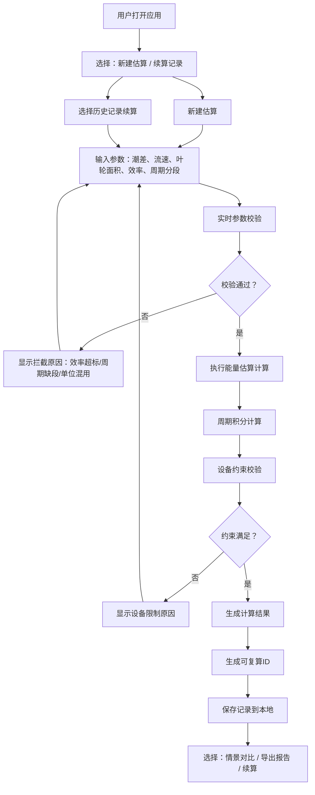

## 1. 产品概述
潮汐能发电估算工具，面向海洋工程课程学生，基于潮差、流速等参数计算潮汐能发电量，同时校验设备约束条件，确保计算结果可复现、可追溯。

- 解决问题：手工计算易出错、单位混用、效率超范围、周期缺段等现场常见问题
- 目标用户：海洋工程专业学生、教师、科研人员
- 核心价值：计算可复现、约束透明化、记录可延续、报告一键导出

## 2. 核心特性

### 2.1 用户角色

| 角色 | 注册方式 | 核心权限 |
|------|----------|----------|
| 学生用户 | 无需注册，本地存储 | 创建估算记录、编辑参数、查看校验结果、导出报告 |

### 2.2 功能模块

1. **估算首页**：参数输入区、实时校验提示、计算结果展示
2. **记录管理**：历史记录列表、记录续算、记录对比
3. **情景对比**：多情景参数对比、差异可视化
4. **报告导出**：PDF/Markdown格式报告生成

### 2.3 页面详情

| 页面名称 | 模块名称 | 功能描述 |
|----------|----------|----------|
| 估算首页 | 参数输入 | 潮差、流速、叶轮面积、效率、潮汐周期分段输入 |
| 估算首页 | 实时校验 | 效率>1拦截、周期缺段检测、单位混用提示 |
| 估算首页 | 能量计算 | 势能计算、动能计算、周期积分计算 |
| 估算首页 | 设备约束 | 额定功率限制、流速阈值、叶轮转速约束 |
| 估算首页 | 结果展示 | 可复算ID、计算过程追溯、失败原因说明 |
| 记录管理 | 记录列表 | 按时间/ID排序、搜索、续算入口 |
| 记录管理 | 记录详情 | 完整参数快照、计算过程、修改历史 |
| 情景对比 | 对比面板 | 最多4个情景并排对比、差异高亮 |
| 报告导出 | 导出配置 | 格式选择、内容模块勾选、水印设置 |

## 3. 核心流程

## 4. 界面设计

### 4.1 设计风格
- 主色调：深海蓝 `#0a2540` 搭配 科技青 `#00d4ff`
- 辅助色：警示橙 `#ff6b35`（校验失败）、成功绿 `#00c896`（校验通过）
- 字体：标题用 `Space Grotesk`，正文用 `Inter`
- 按钮风格：圆角8px，悬停微上浮，渐变边框
- 布局：卡片式分区，左侧参数输入、右侧结果展示，顶部记录导航
- 图标：线性图标配合微妙渐变填充

### 4.2 页面设计概览

| 页面名称 | 模块名称 | UI元素 |
|----------|----------|--------|
| 估算首页 | 参数输入区 | 分组表单、单位切换、实时校验徽章、周期分段时间轴 |
| 估算首页 | 计算结果区 | 能量数值大屏展示、计算公式折叠面板、可复算ID二维码 |
| 估算首页 | 设备约束区 | 仪表盘式阈值展示、超出部分红色高亮 |
| 记录管理 | 记录列表 | 卡片式列表、状态标签、快速操作按钮 |
| 情景对比 | 对比面板 | 可拖拽列、差异热力图、基准线标记 |

### 4.3 响应式设计
- 桌面端（>1024px）：双栏布局，参数区60% / 结果区40%
- 平板端（768-1024px）：单栏堆叠，参数区在上、结果区在下
- 移动端（<768px）：精简表单，折叠非核心模块，支持横向滑动对比

### 4.4 微交互细节
- 输入框聚焦时边框发光、轻微放大
- 校验结果徽章带呼吸动画
- 计算结果数字滚动动画
- 周期分段时间轴可拖拽调整
- 报告导出按钮带进度环
