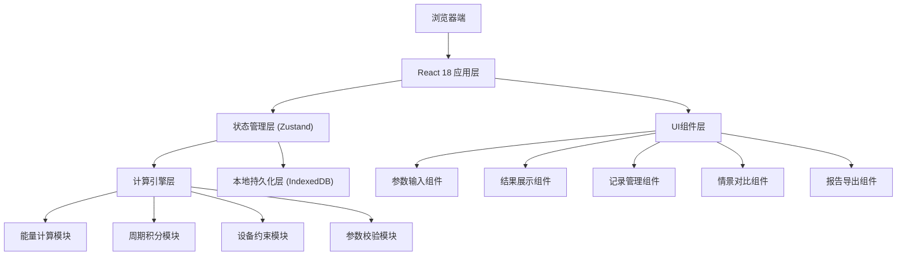
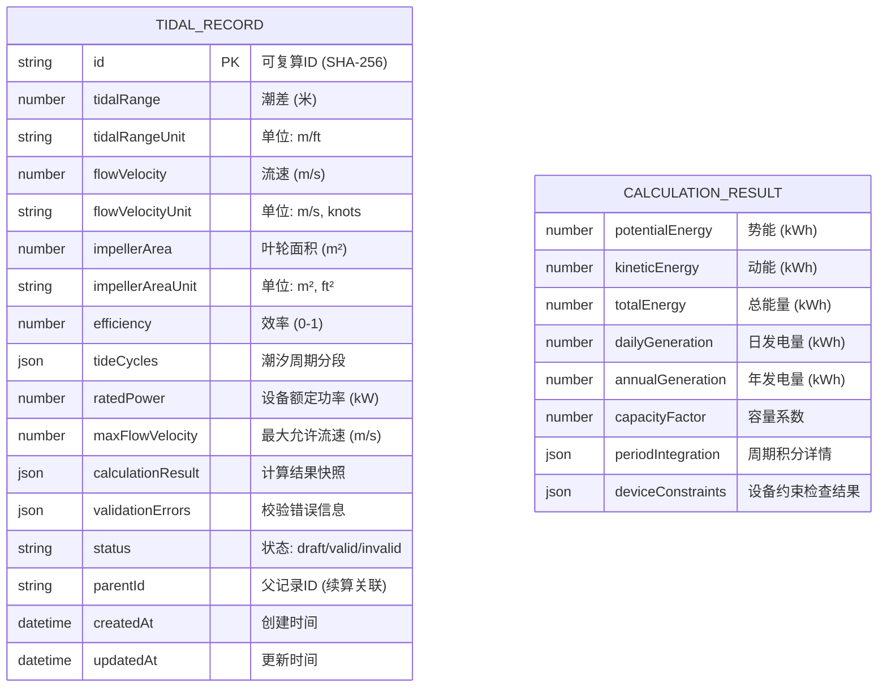

## 1. 架构设计



## 2. 技术描述

- **前端框架**: React@18 + TypeScript@5
- **构建工具**: Vite@5
- **样式方案**: TailwindCSS@3 + CSS变量主题系统
- **状态管理**: Zustand@4（轻量级，支持时间旅行调试）
- **本地存储**: IndexedDB (via Dexie.js) 存储估算记录
- **图表可视化**: Recharts@2
- **报告导出**: html2canvas + jsPDF (PDF) / 原生Markdown生成
- **可复算ID**: SHA-256哈希（基于参数序列化字符串）

## 3. 路由定义

| 路由 | 页面 | 用途 |
|------|------|------|
| `/` | 估算首页 | 参数输入、实时计算、结果展示 |
| `/records` | 记录管理 | 历史记录列表、搜索、续算入口 |
| `/records/:id` | 记录详情 | 单条记录完整信息、修改历史 |
| `/compare` | 情景对比 | 多记录参数对比、差异分析 |

## 4. 核心数据模型

### 4.1 数据模型定义



### 4.2 核心数据结构 (TypeScript)

```typescript
// 参数单位系统
type UnitSystem = 'metric' | 'imperial';

// 潮汐周期分段
interface TideCycleSegment {
  id: string;
  startTime: number;  // 小时 (0-24)
  endTime: number;    // 小时 (0-24)
  tideHeight: number; // 潮位 (m)
  flowVelocity: number; // 流速 (m/s)
  phase: 'flood' | 'ebb' | 'slack';
}

// 设备约束
interface DeviceConstraints {
  ratedPower: number;      // 额定功率 (kW)
  maxFlowVelocity: number; // 最大允许流速 (m/s)
  minFlowVelocity: number; // 启动流速 (m/s)
  maxEfficiency: number;   // 最大允许效率
  impellerDiameter: number; // 叶轮直径 (m)
}

// 估算参数
interface EstimationParams {
  tidalRange: number;
  tidalRangeUnit: 'm' | 'ft';
  flowVelocity: number;
  flowVelocityUnit: 'm/s' | 'knots';
  impellerArea: number;
  impellerAreaUnit: 'm²' | 'ft²';
  efficiency: number;
  tideCycles: TideCycleSegment[];
  deviceConstraints: DeviceConstraints;
}

// 计算结果
interface CalculationResult {
  potentialEnergy: number;      // 势能 (kWh)
  kineticEnergy: number;        // 动能 (kWh)
  totalEnergy: number;          // 总能量 (kWh)
  dailyGeneration: number;      // 日发电量 (kWh/day)
  annualGeneration: number;     // 年发电量 (MWh/year)
  capacityFactor: number;       // 容量系数
  periodIntegration: PeriodIntegrationResult[];
  deviceCheck: DeviceCheckResult;
}

// 周期积分结果
interface PeriodIntegrationResult {
  segmentId: string;
  timeRange: string;
  power: number;
  energy: number;
  valid: boolean;
}

// 设备约束检查结果
interface DeviceCheckResult {
  passed: boolean;
  violations: ConstraintViolation[];
}

// 约束违规
interface ConstraintViolation {
  type: 'efficiency' | 'power' | 'velocity' | 'period_gap';
  field: string;
  message: string;
  actual: number;
  limit: number;
  severity: 'error' | 'warning';
}

// 估算记录
interface EstimationRecord {
  id: string;                  // SHA-256 可复算ID
  params: EstimationParams;
  result: CalculationResult | null;
  validation: ValidationResult;
  status: 'draft' | 'valid' | 'invalid';
  parentId: string | null;     // 续算关联
  version: number;
  createdAt: string;
  updatedAt: string;
}

// 校验结果
interface ValidationResult {
  valid: boolean;
  errors: ValidationError[];
  warnings: ValidationWarning[];
}

interface ValidationError {
  code: string;
  field: string;
  message: string;
  suggestion: string;
}
```

## 5. 核心计算逻辑

### 5.1 潮汐能计算公式

```typescript
// 势能计算: E_p = 0.5 * ρ * g * A * R²
// ρ = 1025 kg/m³ (海水密度), g = 9.81 m/s²
function calculatePotentialEnergy(
  tidalRange: number, 
  area: number, 
  efficiency: number
): number {
  const rho = 1025;  // 海水密度 kg/m³
  const g = 9.81;    // 重力加速度 m/s²
  return 0.5 * rho * g * area * Math.pow(tidalRange, 2) * efficiency / 3.6e6; // 转换为kWh
}

// 动能计算: E_k = 0.5 * ρ * A * v³ * t
function calculateKineticEnergy(
  velocity: number, 
  area: number, 
  efficiency: number,
  durationHours: number
): number {
  const rho = 1025;  // 海水密度 kg/m³
  const seconds = durationHours * 3600;
  return 0.5 * rho * area * Math.pow(velocity, 3) * efficiency * seconds / 3.6e6;
}

// 周期积分（梯形法）
function integratePeriod(
  segments: TideCycleSegment[], 
  params: EstimationParams
): PeriodIntegrationResult[] {
  return segments.map(segment => {
    const duration = segment.endTime - segment.startTime;
    const power = calculateKineticEnergy(
      segment.flowVelocity,
      params.impellerArea,
      params.efficiency,
      1 // 1小时功率
    );
    return {
      segmentId: segment.id,
      timeRange: `${segment.startTime}:00 - ${segment.endTime}:00`,
      power,
      energy: power * duration,
      valid: duration > 0 && segment.flowVelocity > 0
    };
  });
}
```

### 5.2 可复算ID生成

```typescript
// 参数序列化 + SHA-256 哈希
function generateReproducibleId(params: EstimationParams): string {
  // 确定性序列化：按键排序，去除浮点噪声
  const normalized = normalizeParams(params);
  const serialized = JSON.stringify(normalized, Object.keys(normalized).sort());
  return sha256(serialized);
}

// 参数规范化（消除浮点误差，确保相同输入产生相同ID）
function normalizeParams(params: EstimationParams): EstimationParams {
  return {
    ...params,
    tidalRange: roundToPrecision(params.tidalRange, 4),
    flowVelocity: roundToPrecision(params.flowVelocity, 4),
    impellerArea: roundToPrecision(params.impellerArea, 4),
    efficiency: roundToPrecision(params.efficiency, 6),
    tideCycles: params.tideCycles.map(cycle => ({
      ...cycle,
      tideHeight: roundToPrecision(cycle.tideHeight, 4),
      flowVelocity: roundToPrecision(cycle.flowVelocity, 4)
    }))
  };
}
```

### 5.3 参数校验规则

```typescript
// 效率校验: 0 < efficiency <= 1
function validateEfficiency(efficiency: number): ValidationError | null {
  if (efficiency <= 0) {
    return {
      code: 'EFFICIENCY_TOO_LOW',
      field: 'efficiency',
      message: '效率必须大于0',
      suggestion: '请输入0到1之间的数值，例如0.4表示40%效率'
    };
  }
  if (efficiency > 1) {
    return {
      code: 'EFFICIENCY_EXCEEDS_ONE',
      field: 'efficiency',
      message: `效率值 ${efficiency} 超过物理上限1`,
      suggestion: '效率是百分比的小数形式，请将45%写为0.45，而非45'
    };
  }
  return null;
}

// 周期完整性校验
function validateCycleContinuity(cycles: TideCycleSegment[]): ValidationError[] {
  const errors: ValidationError[] = [];
  const sorted = [...cycles].sort((a, b) => a.startTime - b.startTime);
  
  for (let i = 1; i < sorted.length; i++) {
    const prev = sorted[i - 1];
    const curr = sorted[i];
    if (curr.startTime > prev.endTime) {
      errors.push({
        code: 'PERIOD_GAP',
        field: 'tideCycles',
        message: `周期分段存在缺口: ${prev.endTime}:00 - ${curr.startTime}:00`,
        suggestion: '请补充该时间段的潮位和流速数据，或调整分段时间'
      });
    }
    if (curr.startTime < prev.endTime) {
      errors.push({
        code: 'PERIOD_OVERLAP',
        field: 'tideCycles',
        message: `周期分段存在重叠: ${curr.startTime}:00 - ${prev.endTime}:00`,
        suggestion: '请调整分段时间，确保各时间段不重叠'
      });
    }
  }
  
  // 检查24小时覆盖
  if (sorted.length > 0) {
    if (sorted[0].startTime !== 0) {
      errors.push({
        code: 'PERIOD_START_MISSING',
        field: 'tideCycles',
        message: '周期分段未从00:00开始',
        suggestion: '请补充00:00开始的数据'
      });
    }
    if (sorted[sorted.length - 1].endTime !== 24) {
      errors.push({
        code: 'PERIOD_END_MISSING',
        field: 'tideCycles',
        message: '周期分段未覆盖到24:00',
        suggestion: '请补充数据覆盖到24:00'
      });
    }
  }
  
  return errors;
}

// 单位一致性校验
function validateUnitConsistency(params: EstimationParams): ValidationWarning[] {
  const warnings: ValidationWarning[] = [];
  const units = [params.tidalRangeUnit, params.flowVelocityUnit, params.impellerAreaUnit];
  const hasMetric = units.some(u => ['m', 'm/s', 'm²'].includes(u));
  const hasImperial = units.some(u => ['ft', 'knots', 'ft²'].includes(u));
  
  if (hasMetric && hasImperial) {
    warnings.push({
      code: 'UNIT_MIXED',
      field: 'units',
      message: '检测到公制与英制单位混用',
      suggestion: '系统已自动转换，但建议统一单位系统以避免混淆'
    });
  }
  
  return warnings;
}
```

## 6. 目录结构

```
src/
├── components/
│   ├── params/
│   │   ├── TidalParamsForm.tsx      # 潮差/流速参数输入
│   │   ├── DeviceParamsForm.tsx     # 设备参数输入
│   │   ├── CycleSegmentEditor.tsx   # 周期分段编辑器
│   │   └── UnitSelector.tsx         # 单位选择器
│   ├── results/
│   │   ├── EnergyDisplay.tsx        # 能量结果展示
│   │   ├── ValidationPanel.tsx      # 校验结果面板
│   │   ├── PeriodIntegrationChart.tsx # 周期积分图表
│   │   └── DeviceGauge.tsx          # 设备约束仪表盘
│   ├── records/
│   │   ├── RecordList.tsx           # 记录列表
│   │   ├── RecordCard.tsx           # 记录卡片
│   │   └── RecordDetail.tsx         # 记录详情
│   ├── compare/
│   │   ├── ComparePanel.tsx         # 对比面板
│   │   └── DiffHeatmap.tsx          # 差异热力图
│   └── export/
│       ├── ReportGenerator.tsx      # 报告生成器
│       └── ExportOptions.tsx        # 导出选项
├── store/
│   ├── useEstimationStore.ts        # 估算状态管理
│   └── useRecordStore.ts            # 记录状态管理
├── engine/
│   ├── calculator.ts                # 能量计算核心
│   ├── validator.ts                 # 参数校验器
│   ├── unitConverter.ts             # 单位转换器
│   └── reproducibleId.ts            # 可复算ID生成
├── types/
│   └── index.ts                     # 类型定义
├── utils/
│   ├── storage.ts                   # IndexedDB封装
│   └── formatters.ts                # 格式化工具
├── pages/
│   ├── EstimationPage.tsx
│   ├── RecordsPage.tsx
│   ├── RecordDetailPage.tsx
│   └── ComparePage.tsx
└── App.tsx
```

## 7. 启动方式与样例

### 7.1 启动命令

```bash
# 安装依赖
npm install

# 启动开发服务器
npm run dev

# 构建生产版本
npm run build
```

### 7.2 样例数据（正常案例）

```typescript
const sampleValidParams: EstimationParams = {
  tidalRange: 8.5,
  tidalRangeUnit: 'm',
  flowVelocity: 2.5,
  flowVelocityUnit: 'm/s',
  impellerArea: 78.54, // 直径10m叶轮
  impellerAreaUnit: 'm²',
  efficiency: 0.45,
  tideCycles: [
    { id: '1', startTime: 0, endTime: 6, tideHeight: 8.5, flowVelocity: 2.5, phase: 'flood' },
    { id: '2', startTime: 6, endTime: 12, tideHeight: 0, flowVelocity: 0.3, phase: 'slack' },
    { id: '3', startTime: 12, endTime: 18, tideHeight: -8.5, flowVelocity: 2.3, phase: 'ebb' },
    { id: '4', startTime: 18, endTime: 24, tideHeight: 0, flowVelocity: 0.3, phase: 'slack' }
  ],
  deviceConstraints: {
    ratedPower: 1000,
    maxFlowVelocity: 5.0,
    minFlowVelocity: 0.5,
    maxEfficiency: 0.5,
    impellerDiameter: 10
  }
};
```

### 7.3 会失败的操作示例

```typescript
const sampleInvalidParams: EstimationParams = {
  tidalRange: 8.5,
  tidalRangeUnit: 'm',
  flowVelocity: 2.5,
  flowVelocityUnit: 'knots',       // 单位混用
  impellerArea: 78.54,
  impellerAreaUnit: 'm²',
  efficiency: 45,                   // 效率>1（误用百分比而非小数）
  tideCycles: [
    { id: '1', startTime: 0, endTime: 6, tideHeight: 8.5, flowVelocity: 2.5, phase: 'flood' },
    // 缺少6-12点数据（周期缺口）
    { id: '3', startTime: 12, endTime: 18, tideHeight: -8.5, flowVelocity: 2.3, phase: 'ebb' },
    { id: '4', startTime: 18, endTime: 23, tideHeight: 0, flowVelocity: 0.3, phase: 'slack' }
    // 未覆盖到24:00
  ],
  deviceConstraints: {
    ratedPower: 1000,
    maxFlowVelocity: 5.0,
    minFlowVelocity: 0.5,
    maxEfficiency: 0.5,
    impellerDiameter: 10
  }
};

// 预期校验失败原因：
// 1. EFFICIENCY_EXCEEDS_ONE: 效率45 > 1
// 2. PERIOD_GAP: 6:00 - 12:00 存在缺口
// 3. PERIOD_END_MISSING: 未覆盖到24:00
// 4. UNIT_MIXED: 公制(m, m²)与英制(knots)混用
```
