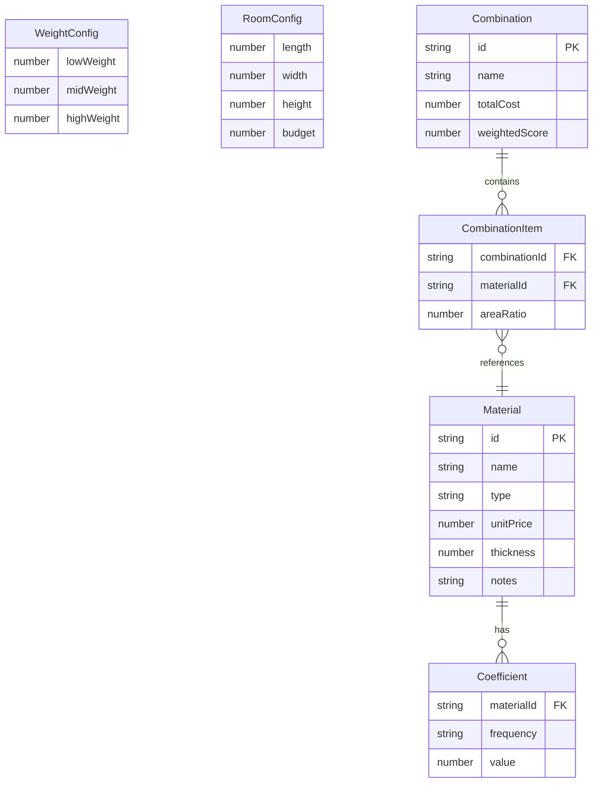

## 1. 架构设计

```mermaid
flowchart TB
    subgraph "前端层"
        "React 18 + Vite" --> "页面路由"
        "页面路由" --> "材料数据库页"
        "页面路由" --> "筛选分析页"
        "页面路由" --> "对比报告页"
    end
    subgraph "状态管理层"
        "Zustand Store" --> "材料数据Store"
        "Zustand Store" --> "筛选配置Store"
        "Zustand Store" --> "组合模拟Store"
    end
    subgraph "计算引擎层"
        "校验引擎" --> "系数越界检测"
        "校验引擎" --> "缺口识别"
        "评分引擎" --> "频段加权计算"
        "评分引擎" --> "组合吸声模拟"
        "预算引擎" --> "面积计算"
        "预算引擎" --> "超限检测"
    end
    subgraph "可视化层"
        "Recharts" --> "雷达图"
        "Recharts" --> "柱状图"
        "评分明细面板" --> "推导树渲染"
    end
    subgraph "导出层"
        "报告生成器" --> "PDF导出"
        "报告生成器" --> "JSON导出"
    end
    "前端层" --> "状态管理层"
    "状态管理层" --> "计算引擎层"
    "计算引擎层" --> "可视化层"
    "可视化层" --> "导出层"
```

## 2. 技术说明

- 前端：React@18 + Tailwind CSS@3 + Vite
- 初始化工具：Vite (React + TypeScript 模板)
- 后端：无（纯前端应用，数据存储于 localStorage）
- 数据库：无（使用内置 Mock 数据 + localStorage 持久化）
- 图表库：Recharts@2（雷达图、柱状图）
- 状态管理：Zustand@4
- PDF导出：jsPDF + html2canvas
- 动画：Framer Motion@11

## 3. 路由定义

| 路由 | 用途 |
|------|------|
| / | 重定向至 /materials |
| /materials | 材料数据库页：录入、编辑、校验、缺口识别 |
| /screening | 筛选分析页：加权配置、预算约束、组合模拟、评分排序 |
| /report | 对比报告页：图表对比、评分明细、导出报告 |

## 4. API定义

无后端API，所有数据与计算在前端完成。

### 4.1 核心数据类型

```typescript
interface Material {
  id: string
  name: string
  type: 'absorption_board' | 'absorption_cotton' | 'diffuser' | 'membrane' | 'perforated_panel'
  unitPrice: number
  coefficients: {
    '125Hz': number | null
    '250Hz': number | null
    '500Hz': number | null
    '1kHz': number | null
    '2kHz': number | null
    '4kHz': number | null
  }
  thickness: number
  notes: string
}

interface ValidationIssue {
  materialId: string
  materialName: string
  type: 'coefficient_out_of_range' | 'frequency_missing' | 'field_empty' | 'budget_overrun'
  frequency?: string
  detail: string
  severity: 'error' | 'warning'
}

interface WeightConfig {
  lowWeight: number
  midWeight: number
  highWeight: number
}

interface RoomConfig {
  length: number
  width: number
  height: number
  budget: number
}

interface MaterialCombination {
  id: string
  name: string
  materials: { materialId: string; areaRatio: number }[]
  totalCost: number
  combinedCoefficients: Record<string, number>
  weightedScore: number
}

interface ScoreBreakdown {
  materialId: string
  materialName: string
  rawCoefficients: Record<string, number | null>
  weightApplied: Record<string, number>
  weightedValues: Record<string, number>
  totalScore: number
  issues: ValidationIssue[]
}
```

## 5. 服务器架构图

不适用（纯前端应用）

## 6. 数据模型

### 6.1 数据模型定义



### 6.2 数据定义语言

使用 Zustand + localStorage 持久化，无 SQL DDL。初始 Mock 数据包含：

- 8~10种预设声学材料（含故意设置的异常数据）：
  - 2种系数越界材料（某频段系数 > 1 或 < 0）
  - 2种低频缺样材料（125Hz/250Hz 系数为 null）
  - 1种预算超限材料（单价极高）
  - 其余为正常材料

频段定义：125Hz, 250Hz (低频), 500Hz, 1kHz (中频), 2kHz, 4kHz (高频)
