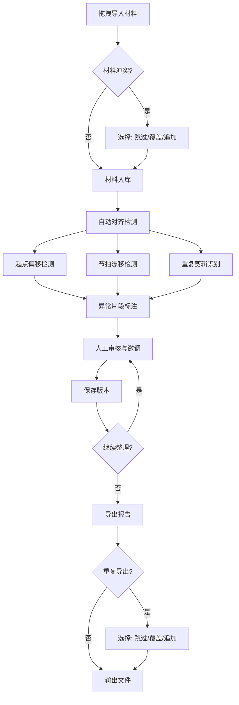

## 1. 产品概述

排练迟到分轨整理工具——面向乐队排练场景的音频分轨自动对齐与标注平台。当乐手迟到加入排练时，鼓、贝斯、人声等分轨的时间轴会出现错位，本工具让业务同事通过拖拽样例即可完成对齐、节拍检测、片段标注与报告导出，无需分析师手工操作。

- 核心问题：排练录音中迟到乐手导致分轨起点错位、节拍漂移、重复剪辑，手工对齐耗时且不可复现
- 目标用户：乐队成员、排练管理员、录音助理等非技术业务人员

## 2. 核心功能

### 2.1 用户角色

| 角色 | 使用方式 | 核心权限 |
|------|----------|----------|
| 业务操作员 | 无需注册，直接使用 | 导入/查询/导出全部材料 |
| 审阅者 | 共享同一界面 | 查看版本历史与报告 |

### 2.2 功能模块

1. **导入工作台**：拖拽上传分轨音频、排练时间、乐手备注、节拍点、迟到标记、整理报告
2. **对齐检测面板**：音频波形可视化、自动检测起点偏移与节拍漂移、人工微调
3. **片段标注台**：标注迟到片段、异常片段（起点错/节拍漂移/重复剪辑）、添加备注
4. **版本管理**：保存每次整理状态，对比不同版本差异
5. **报告导出**：导出整理报告，支持 PDF/JSON 格式，重复导出时明确跳过/覆盖/追加

### 2.3 页面详情

| 页面名称 | 模块名称 | 功能描述 |
|----------|----------|----------|
| 导入工作台 | 拖拽上传区 | 支持拖拽 WAV/MP3 分轨音频，上传排练时间表、乐手备注文本、节拍点 CSV、迟到标记 JSON、历史整理报告 |
| 导入工作台 | 导入冲突检测 | 同名文件二次导入时弹窗提示：跳过/覆盖/追加，并展示差异摘要 |
| 导入工作台 | 材料清单 | 以表格展示已导入的所有材料，显示类型、状态、异常标记 |
| 对齐检测面板 | 波形可视化 | 多轨波形并行展示，可缩放时间轴，显示检测到的起点偏移线 |
| 对齐检测面板 | 起点偏移检测 | 自动计算各轨起点差异，高亮显示偏移值，支持手动微调 |
| 对齐检测面板 | 节拍漂移检测 | 检测 BPM 漂移区间，用色带标注漂移段，显示漂移量数值 |
| 对齐检测面板 | 重复剪辑识别 | 标记同一段落的重复剪辑区域，提供合并/保留选项 |
| 片段标注台 | 标注列表 | 展示所有检测到的异常片段，按类型分类（迟到/起点错/漂移/重复） |
| 片段标注台 | 标注编辑 | 对每个异常片段添加/编辑备注，确认处理方式 |
| 片段标注台 | 时间轴标注 | 在时间轴上用彩色标记展示各类标注，点击可跳转详情 |
| 版本管理 | 版本列表 | 展示所有保存的整理版本，显示时间、操作人、变更摘要 |
| 版本管理 | 版本对比 | 并排对比两个版本的差异，高亮变化部分 |
| 报告导出 | 导出配置 | 选择导出格式（PDF/JSON）、包含内容、时间范围 |
| 报告导出 | 导出状态 | 显示导出进度，重复导出同一版本时提示跳过/覆盖/追加 |

## 3. 核心流程

用户从导入材料开始，系统自动检测异常并生成标注，用户确认后保存版本，最终导出报告。整个流程闭环围绕六大输入材料运转。

## 4. 用户界面设计

### 4.1 设计风格

- **主色调**：深炭灰底 (#1A1A2E) + 琥珀色强调 (#E8A838) + 翡翠绿正常态 (#2ECC71) + 珊瑚红异常态 (#E74C3C)
- **按钮风格**：圆角矩形（6px），带微妙阴影，hover 时亮度提升 + 微上浮
- **字体**：标题用 Noto Sans SC Bold，正文用 Noto Sans SC Regular，代码/数值用 JetBrains Mono
- **布局风格**：左侧导航栏 + 右侧主内容区，顶部面包屑，卡片式内容块
- **图标风格**：线性图标（Lucide），2px 描边，与文字等高对齐

### 4.2 页面设计概览

| 页面名称 | 模块名称 | UI 元素 |
|----------|----------|---------|
| 导入工作台 | 拖拽上传区 | 虚线边框拖拽区，拖入时边框变琥珀色脉动，文件列表用卡片展示类型图标+文件名+状态徽标 |
| 导入工作台 | 冲突弹窗 | 模态对话框，三选一按钮（跳过/覆盖/追加），差异摘要用红绿对比色 |
| 导入工作台 | 材料清单 | 表格，每行显示：类型图标、文件名、大小、导入时间、状态徽标（正常/异常/待审） |
| 对齐检测面板 | 波形可视化 | 深色背景画布，各轨波形用不同颜色，偏移线用琥珀虚线，漂移区用半透明红色覆盖 |
| 对齐检测面板 | 检测结果 | 右侧面板显示数值卡片：偏移量(ms)、BPM、漂移区间、重复段数 |
| 片段标注台 | 标注列表 | 分组折叠列表，每组按类型着色边框，展开显示详情和备注输入框 |
| 片段标注台 | 时间轴标注 | 横向时间轴，彩色标记块可点击，底部图例 |
| 版本管理 | 版本列表 | 时间线样式，每个节点显示版本号+时间+摘要，点击展开详情 |
| 版本管理 | 版本对比 | 左右分栏，差异高亮用红绿底色 |
| 报告导出 | 导出配置 | 表单卡片，格式选择用切换按钮组，内容勾选用复选框 |
| 报告导出 | 导出状态 | 进度条 + 状态文字，冲突时弹出与导入相同的跳过/覆盖/追加选择 |

### 4.3 响应式

- 桌面优先设计，最小宽度 1280px
- 波形可视化区域在小屏幕下可横向滚动
- 导航栏在窄屏下折叠为汉堡菜单

### 4.4 无 3D 场景
