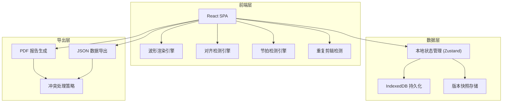
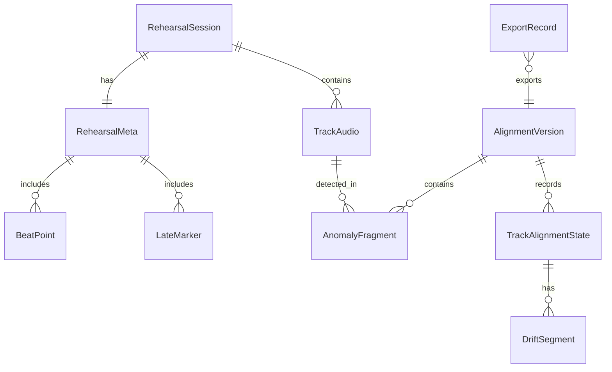

## 1. 架构设计



## 2. 技术说明

- **前端**: React@18 + Tailwind CSS@3 + Vite
- **初始化工具**: Vite (react-ts 模板)
- **后端**: 无（纯前端，所有计算在浏览器内完成）
- **数据库**: IndexedDB (通过 idb 库)，用于持久化音频元数据、标注、版本
- **音频处理**: Web Audio API (AudioContext, OfflineAudioContext) 用于解码和波形提取
- **状态管理**: Zustand@4，轻量级状态管理
- **波形可视化**: Canvas 2D API，自定义渲染引擎
- **PDF 生成**: jsPDF
- **核心依赖**:
  - `idb` — IndexedDB 封装
  - `zustand` — 状态管理
  - `jspdf` — PDF 导出
  - `lucide-react` — 图标
  - `file-saver` — 文件下载

## 3. 路由定义

| 路由 | 用途 |
|------|------|
| `/` | 重定向到导入工作台 |
| `/import` | 导入工作台：拖拽上传材料、冲突检测、材料清单 |
| `/align` | 对齐检测面板：波形可视化、起点偏移检测、节拍漂移检测、重复剪辑识别 |
| `/annotate` | 片段标注台：异常片段列表、标注编辑、时间轴标注 |
| `/versions` | 版本管理：版本列表、版本对比 |
| `/export` | 报告导出：导出配置、导出状态、冲突处理 |

## 4. API 定义（无后端）

纯前端应用，所有数据通过 IndexedDB 持久化。核心数据接口定义如下：

```typescript
interface TrackAudio {
  id: string
  fileName: string
  fileHash: string
  channelType: "drums" | "bass" | "vocals" | "other"
  sampleRate: number
  duration: number
  waveformPeaks: number[]
  startOffset: number
  rawAudioData: ArrayBuffer
}

interface RehearsalMeta {
  id: string
  rehearsalTime: string
  musicianNotes: string
  beatPoints: BeatPoint[]
  lateMarkers: LateMarker[]
}

interface BeatPoint {
  time: number
  bpm: number
  confidence: number
}

interface LateMarker {
  musicianName: string
  joinTime: number
  channelType: string
}

interface AnomalyFragment {
  id: string
  type: "offset_error" | "beat_drift" | "duplicate_clip" | "late_join"
  startTime: number
  endTime: number
  trackId: string
  severity: "warning" | "error"
  note: string
  resolved: boolean
}

interface AlignmentVersion {
  id: string
  createdAt: string
  summary: string
  trackStates: TrackAlignmentState[]
  anomalies: AnomalyFragment[]
  parentVersionId: string | null
}

interface TrackAlignmentState {
  trackId: string
  offsetMs: number
  bpm: number
  driftSegments: DriftSegment[]
}

interface DriftSegment {
  startTime: number
  endTime: number
  bpmDelta: number
}

interface ExportRecord {
  id: string
  versionId: string
  format: "pdf" | "json"
  exportedAt: string
  fileHash: string
  contentSummary: string
}

type ConflictStrategy = "skip" | "overwrite" | "append"
```

## 5. 服务器架构图（无后端）

不适用——纯前端应用。

## 6. 数据模型

### 6.1 数据模型定义



### 6.2 数据定义语言

IndexedDB 对象仓库定义：

- **sessions** — 主键 `id`，索引 `createdAt`
- **tracks** — 主键 `id`，索引 `sessionId`, `fileHash`
- **meta** — 主键 `sessionId`
- **anomalies** — 主键 `id`，索引 `trackId`, `type`, `resolved`
- **versions** — 主键 `id`，索引 `sessionId`, `createdAt`
- **exports** — 主键 `id`，索引 `versionId`, `exportedAt`

### 6.3 核心算法说明

**起点偏移检测**：取各轨能量包络的起始上升沿，以参考轨（鼓）为基准计算其他轨的偏移量。

**节拍漂移检测**：对鼓轨执行能量峰值检测提取节拍点，计算相邻节拍间隔，当间隔偏差超过阈值（±5%）时标记为漂移段。

**重复剪辑识别**：对各轨波形提取短时能量特征指纹，对指纹序列做自相关匹配，相似度超过阈值（0.85）且时间间隔大于最小段长的区间标记为重复剪辑。
