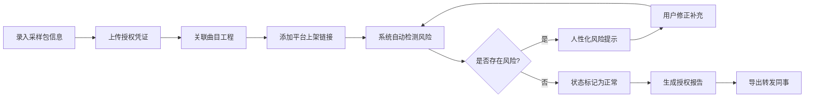

## 1. 产品概述

采样包授权台账是一款面向音乐制作人的本地授权管理工具，解决购买凭证、使用曲目和平台上架记录分散的痛点。工具核心价值在于确保授权状态可追溯、历史线索不丢失、风险点智能提醒，支持一键导出报告供团队协作。

- 目标用户：音乐制作人、版权管理专员、音乐团队运营
- 核心价值：让授权管理从"散落各处"变成"一目了然"，避免版权风险

## 2. 核心功能

### 2.1 用户角色

| 角色 | 注册方式 | 核心权限 |
|------|----------|----------|
| 管理员（制作人） | 本地工具无需注册 | 完整管理权限：新建、编辑、删除、导出报告 |
| 协作者（只读） | 本地工具无需注册 | 查看授权状态、阅读报告 |

### 2.2 功能模块

1. **仪表盘首页**：授权概览、风险提醒、快速统计
2. **采样包管理**：采样包信息、授权凭证、历史变更记录
3. **曲目管理**：曲目工程、关联采样包、平台上架链接
4. **授权报告**：报告生成、导出、转发

### 2.3 页面详情

| 页面名称 | 模块名称 | 功能描述 |
|---------|----------|----------|
| 仪表盘首页 | 状态概览卡片 | 显示总采样包数、有效授权数、即将到期数、凭证缺失数 |
| 仪表盘首页 | 风险提醒区 | 醒目展示过期授权、多曲共用、凭证缺失等问题，配人性化文字说明 |
| 仪表盘首页 | 快速操作区 | 新建采样包、新建曲目、导出报告快捷入口 |
| 采样包列表 | 采样包卡片 | 展示采样包名称、供应商、授权类型、状态标签、关联曲目数 |
| 采样包详情 | 基本信息 | 采样包名称、供应商、购买日期、授权类型、价格 |
| 采样包详情 | 授权凭证 | 凭证列表（支持多凭证）、上传记录、文件链接/备注 |
| 采样包详情 | 关联曲目 | 展示使用该采样包的所有曲目，可跳转 |
| 采样包详情 | 历史记录 | 时间线展示所有变更操作，永不覆盖原始数据 |
| 曲目详情 | 曲目信息 | 曲目名称、BPM、风格、工程文件路径 |
| 曲目详情 | 采样包关联 | 关联/取消关联采样包，显示授权状态 |
| 曲目详情 | 平台链接 | 多平台上架链接（Spotify、网易云、Apple Music等） |
| 授权报告 | 报告生成 | 按条件筛选生成完整授权报告 |
| 授权报告 | 报告导出 | 支持HTML、Markdown格式导出，方便转发同事 |

## 3. 核心流程

### 关键流程说明
1. **建账流程**：从录入采样包开始，依次补充凭证、关联曲目、添加平台链接，每步操作均留痕
2. **风险检测**：每次数据变更后自动检测三类常见问题
   - 授权过期：距离到期日30天内开始提醒
   - 同采样多曲：一个采样包被多首曲目使用时标记
   - 凭证缺失：授权凭证为空或不完整时高亮
3. **历史追溯**：所有修改操作（包括删除、修正）均记录在历史时间线中，原始线索永不覆盖
4. **报告导出**：一键生成含完整状态说明的报告，格式友好便于转发

## 4. 用户界面设计

### 4.1 设计风格

**整体风格**：专业编辑室风格 + 音乐制作人文艺气息
- 主色调：深邃炭黑 `#1A1A2E` 搭配暖金 `#E8B86D`，营造专业录音棚氛围
- 辅助色：墨绿 `#4A7C59`（正常）、琥珀橙 `#D4883A`（警告）、砖红 `#B85450`（错误）、灰蓝 `#6B8E9F`（信息）
- 按钮风格：微立体圆角按钮，悬停有微妙浮起效果
- 字体：标题用 `Playfair Display`（优雅衬线），正文用 `Inter`（清晰易读）
- 布局：卡片式布局，带细腻阴影和微妙边框，层级分明
- 图标：线性简约图标，配合音乐相关的符号元素

### 4.2 页面设计概述

| 页面名称 | 模块名称 | UI元素 |
|---------|----------|--------|
| 仪表盘 | 状态概览 | 四张统计卡片，渐变背景，数字大号加粗，配状态图标 |
| 仪表盘 | 风险提醒 | 时间线式布局，每条风险配人性化文字说明和快速修复按钮 |
| 采样包列表 | 卡片网格 | 每个采样包一张卡片，右上角状态标签，底部显示关联曲目数 |
| 采样包详情 | 信息分区 | 选项卡式分区（基本信息/凭证/曲目/历史），历史区用垂直时间线 |
| 曲目详情 | 关联面板 | 采样包关联用拖拽式选择器，平台链接用标签式展示 |
| 报告页面 | 预览区域 | 报告预览区支持实时刷新，导出按钮组用醒目的暖金色 |

### 4.3 交互细节
- 页面加载：卡片依次淡入，错落有致
- 状态标签：正常/警告/错误状态有不同的呼吸灯效果
- 风险提示：悬停时显示详细说明，点击直接跳转至修正页面
- 历史记录：时间线节点点击可展开查看完整原始数据
- 导出报告：生成过程有进度条动画，完成后有成功提示

### 4.4 响应性
- 桌面端：三栏布局，侧边导航 + 主内容区 + 信息侧边栏
- 平板端：两栏布局，导航收起为图标
- 移动端：单栏瀑布流，底部导航栏

## 5. 演示数据设计

### 5.1 顺利流程示例（Everything is OK）
- **采样包**："Neon Dreams - Synthwave Collection"，购买于2025-01-15，授权类型：永久商用
- **授权凭证**：Invoice_001.pdf + 邮件确认截图，完整齐全
- **关联曲目**：《Midnight Drive》，BPM 118，Synthwave风格
- **平台链接**：Spotify、网易云、Apple Music均已上架
- **状态**：✅ 完全正常，无任何风险

### 5.2 例外场景示例（真实会卡壳的情况）
- **采样包**："Vintage Soul Keys"，购买于2023-06-20，授权类型：年度授权，到期日：2026-06-19（距今天21天）
- **授权凭证**：⚠️ 仅存订单截图，正式发票缺失
- **关联曲目**：《Coffee Shop》《Rainy Afternoon》《Sunday Brunch》三首曲目同时使用
- **平台链接**：《Coffee Shop》已在网易云上架，另外两首未上架
- **风险提示**：
  1. 🔴 "这个采样包还有21天就要过期了，建议尽快联系供应商续费，不然后面三首曲子都有版权风险"
  2. 🟠 "一个采样包被3首曲目使用了，如果是单曲授权的话可能需要额外购买许可，最好跟法务确认一下"
  3. 🟡 "正式发票找不到了，只剩订单截图，审计的时候可能会被问起，要不要补开一下？"
